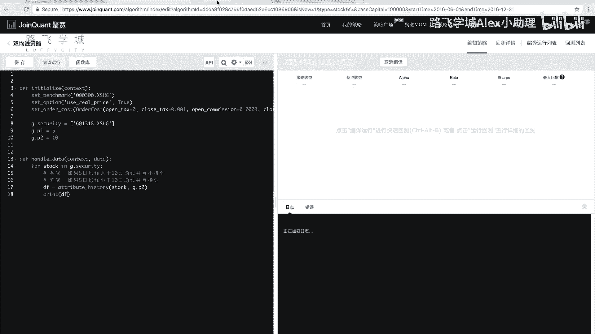
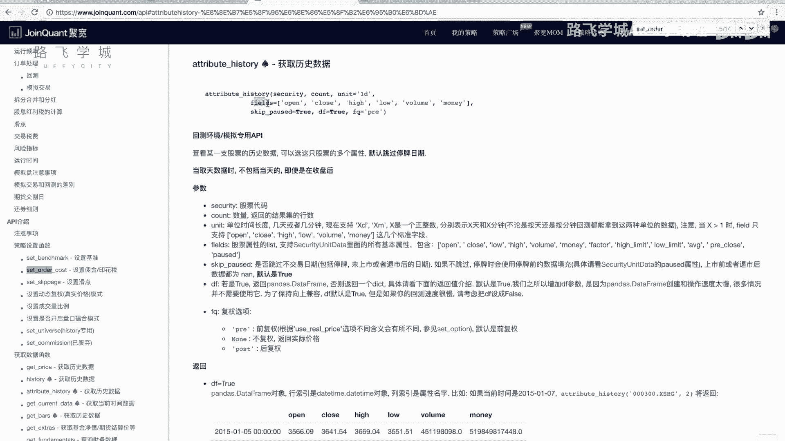
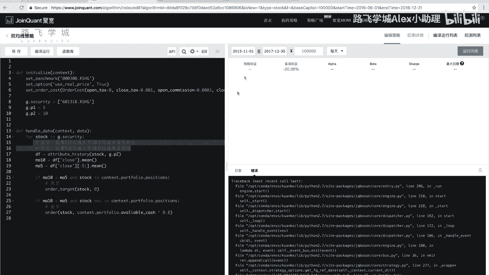
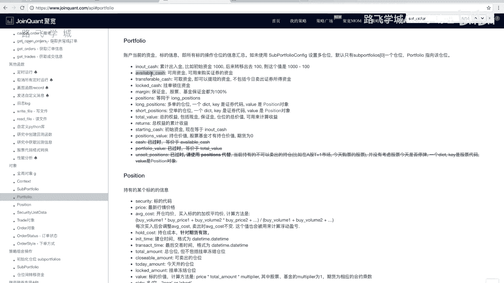
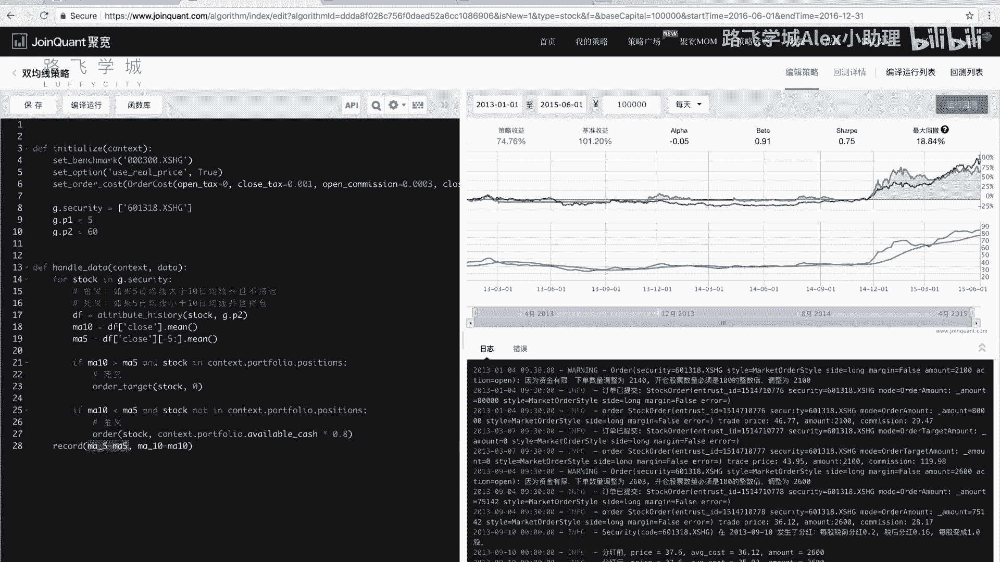

# Python金融量化：P42：双均线策略实现

在本节课中，我们将学习如何在量化交易平台上实现一个经典的双均线交易策略。我们将从策略初始化开始，逐步讲解如何获取历史数据、计算均线、判断买卖信号，并最终完成一个可运行的策略代码。

## 策略初始化与基础设置

上一节我们介绍了双均线策略的基本原理，本节中我们来看看如何在代码中实现它。首先，我们需要在策略的初始化函数中设置一些基础参数。

```python
def initialize(context):
    # 设定基准为沪深300指数
    set_benchmark('000300.XSHG')
    # 设置使用真实价格（复权）
    set_option('use_real_price', True)
    # 设置交易手续费
    set_order_cost(OrderCost(open_tax=0, close_tax=0.001, open_commission=0.0003, close_commission=0.0003, close_today_commission=0, min_commission=5), type='stock')
```

以上三行代码是策略的固定初始化步骤。`set_benchmark`用于设定比较基准，这里使用沪深300指数。`set_option`用于设置使用复权价格进行计算。`set_order_cost`用于设置交易手续费。

## 定义股票池与策略参数

我们的双均线策略暂时不考虑选股，因此只针对单只股票进行操作。我们首先定义要操作的股票，并设置两条均线的周期。

```python
def initialize(context):
    # ... 之前的初始化代码 ...
    # 定义股票池，这里只包含中国平安一只股票
    g.security = ['601318.XSHG']
    # 定义均线周期：短期为5日，长期为10日
    g.p1 = 5
    g.p2 = 10
```

我们使用一个列表`g.security`来存储股票代码，虽然目前只有一只股票，但这样的结构便于未来扩展为多股票策略。`g.p1`和`g.p2`分别代表短期和长期均线的周期。

## 核心逻辑：处理每日数据

策略的核心逻辑写在`handle_data`函数中，该函数在每个交易日都会被调用。以下是该函数需要完成的主要步骤。

首先，我们需要遍历股票池（虽然目前只有一只股票），并为每只股票计算其均线值。

```python
def handle_data(context, data):
    # 遍历股票池中的每一只股票
    for stock in g.security:
        # 获取历史数据，用于计算均线
        # 我们需要计算10日均线，所以至少获取最近10天的数据
        hist_data = attribute_history(stock, count=g.p2)
```



我们使用`attribute_history`函数来获取股票的历史数据。该函数需要两个主要参数：股票代码`stock`和要获取的历史天数`count`。因为我们后续要计算10日均线，所以这里获取`g.p2`（即10）天的数据。

### 关于 `attribute_history` 函数

以下是该函数的一些常用参数说明：
*   `security`: 股票代码。
*   `count`: 获取的历史数据条数。
*   `unit`: 数据周期，默认为`'1d'`（日线），也可设置为`'1m'`（分钟线）等。
*   `fields`: 指定返回的数据列，默认为`['open', 'close', 'high', 'low', 'volume', 'money']`。
*   `skip_paused`: 是否跳过停牌日，默认为`True`。
*   `df`: 是否返回`DataFrame`格式，默认为`True`。

### 计算均线值

获取历史数据后，我们可以计算5日和10日的移动平均值。



```python
        # 计算10日均线值：对最近10天的收盘价求平均
        ma10 = hist_data['close'].mean()
        # 计算5日均线值：对最近5天的收盘价求平均
        ma5 = hist_data['close'][-g.p1:].mean()
```

`ma10`是最近10天收盘价的平均值。`ma5`是最近5天（即`hist_data`这个`DataFrame`的最后5行）收盘价的平均值。

## 判断交易信号：金叉与死叉

计算出均线值后，接下来是关键的一步：根据均线关系判断是出现“金叉”还是“死叉”，并执行相应的买卖操作。

金叉是短期均线上穿长期均线的时刻。在代码中，我们这样判断：**当短期均线（ma5）大于长期均线（ma10），并且当前没有持有该股票时**，视为金叉买入信号。

死叉是短期均线下穿长期均线的时刻。在代码中，我们这样判断：**当短期均线（ma5）小于长期均线（ma10），并且当前持有该股票时**，视为死叉卖出信号。

```python
        # 判断当前是否持有该股票
        # 方法1：检查持仓数量是否大于0
        cur_position = context.portfolio.positions[stock].total_amount
        hold_stock = (cur_position > 0)
        # 方法2：检查股票代码是否在持仓字典的键中
        # hold_stock = (stock in context.portfolio.positions)

        # 死叉判断：ma5 < ma10 且 当前持有股票 -> 卖出
        if ma5 < ma10 and hold_stock:
            # 卖出全部持仓
            order_target(stock, 0)
            log.info(f‘死叉信号，卖出 {stock}’)

        # 金叉判断：ma5 > ma10 且 当前未持有股票 -> 买入
        if ma5 > ma10 and not hold_stock:
            # 计算可用资金，用80%的资金买入
            cash_to_use = context.portfolio.available_cash * 0.8
            # 执行买入订单 (实际交易中需根据股价计算可买数量，此处为简化)
            order_value(stock, cash_to_use)
            log.info(f‘金叉信号，买入 {stock}’)
```

*   `order_target(stock, 0)`：将`stock`的持仓调整到0股，即清仓卖出。
*   `context.portfolio.available_cash`：获取当前账户可用现金。
*   `order_value(stock, cash_to_use)`：用大约`cash_to_use`金额的现金买入`stock`。
*   我们使用`log.info()`来记录交易信号，便于回测时查看。

## 策略回测与优化



代码编写完成后，我们可以选择一段时间进行回测，检验策略效果。



```python
# 回测区间示例：2015年1月1日至2016年1月1日
start_date = ‘2015-01-01’
end_date = ‘2016-01-01’
```

运行回测后，可以观察策略收益曲线、最大回撤、夏普比率等指标。如果效果不理想，我们可以从以下几个方面进行优化：

1.  **调整均线周期**：尝试不同的均线组合，例如（5， 30）、（10， 60）或（20， 120），以适应不同的市场趋势。
2.  **扩展股票池**：将策略应用到多只股票上，但需要注意仓位资金的分配管理。
3.  **增加过滤条件**：例如，只在股价高于年线时使用双均线策略，以规避大的下跌趋势。
4.  **优化资金管理**：调整每次买入的资金比例，或采用金字塔加仓、倒金字塔减仓等方法。

## 附加功能：记录指标

如果我们想在回测结果图中额外查看均线的走势，可以使用`record()`函数。

```python
def handle_data(context, data):
    for stock in g.security:
        # ... 之前的计算和逻辑判断代码 ...
        # 记录每日的均线值，用于绘图
        record(ma5=ma5, ma10=ma10)
```

`record()`函数会在每个交易日记录指定的变量值。回测结束后，这些值会以曲线的形式展示在收益走势图的下方，方便我们直观地看到均线交叉与买卖点之间的关系。

## 总结



本节课中我们一起学习了双均线策略的完整实现过程。我们从策略初始化开始，定义了股票池和均线参数。在核心的`handle_data`函数中，我们使用`attribute_history`获取历史数据，计算短期和长期均线，并通过判断“金叉”和“死叉”来产生交易信号。最后，我们还介绍了策略回测、初步优化方向以及使用`record()`函数可视化策略指标的方法。这是一个基础的动量策略框架，你可以通过修改参数、增加过滤条件来探索更适合市场的交易规则。