# Python金融量化：P5：05 Python基础金融分析应用 💹


在本节课中，我们将学习如何将Python的基础知识应用于金融分析。我们将通过一个完整的例子，从计算现值开始，逐步构建净现值函数，最终实现内部收益率的计算，从而掌握将复杂金融问题分解并用Python解决的方法。

上一讲我们介绍了Python的变量类型、控制流语句（如条件语句和循环语句）。本节中，我们将把这些知识融会贯通，通过具体的金融分析案例来实践。

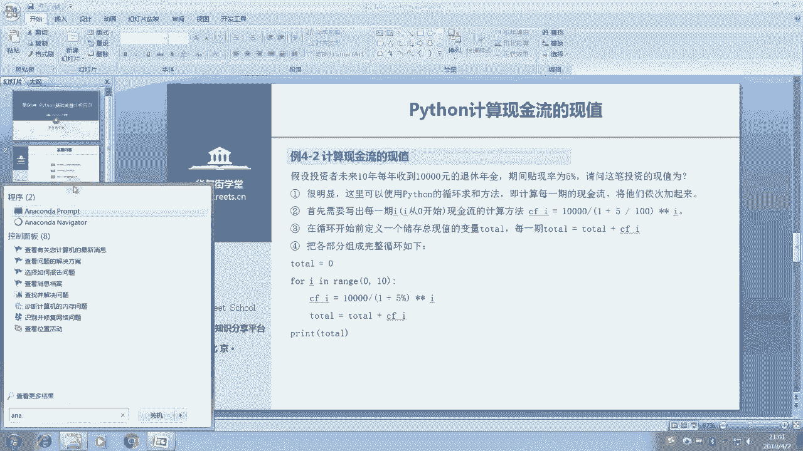

## 概述：分解金融分析任务


在金融分析中，我们经常遇到复杂的工作。解决这类问题的关键在于将其分解为多个小的、可管理的部分，然后逐个解决，最后将结果汇总。这类似于用Excel处理大型项目时的思路。


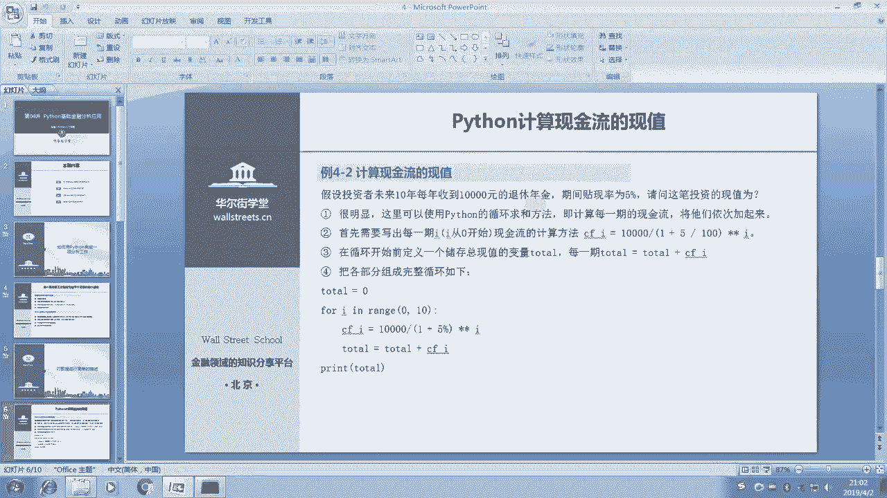

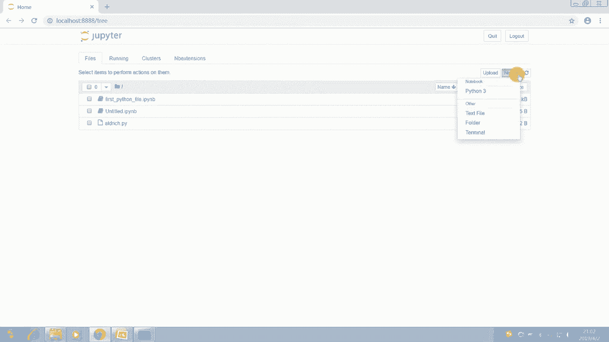

例如，要分析一个项目的内部收益率，我们可以将其分解为以下步骤：
1.  理解如何计算一系列现金流的现值。
2.  将现值计算与净现值概念结合，打包成函数。
3.  设计循环，寻找使净现值接近零的折现率，即内部收益率。


接下来，我们将按照这个思路，一步步实现。


## 第一步：计算现金流的现值 📈

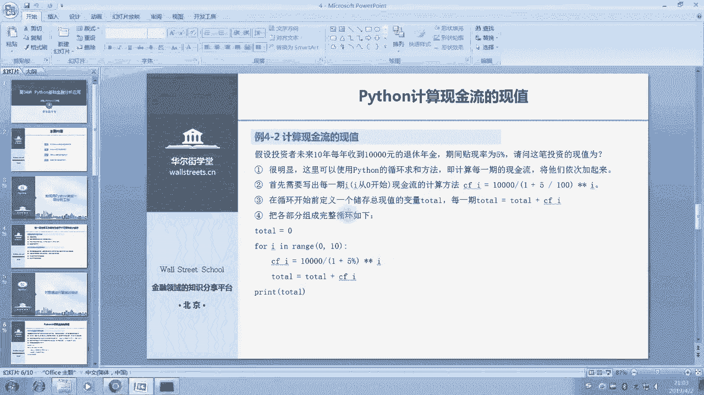

我们从一个简单的例子开始：假设投资者未来10年每年年末能收到1万元退休年金，贴现率为5%，计算这笔投资的现值。

以下是计算现值的关键步骤，我们将使用`for`循环来实现。

```python
# 初始化现值总和
total = 0
# 设置贴现率
rate = 0.05
# 设置年金金额
cash_flow_per_year = 10000

# 使用for循环计算每年现金流的现值并累加
for i in range(10):
    # 注意：i从0开始，但第一期的贴现期数应为 i+1
    pv = cash_flow_per_year / ((1 + rate) ** (i + 1))
    total = total + pv

# 打印总现值
print(total)
```
运行上述代码，可以得到现值约为77217元。

为了使代码更通用，我们可以将其封装成一个函数。

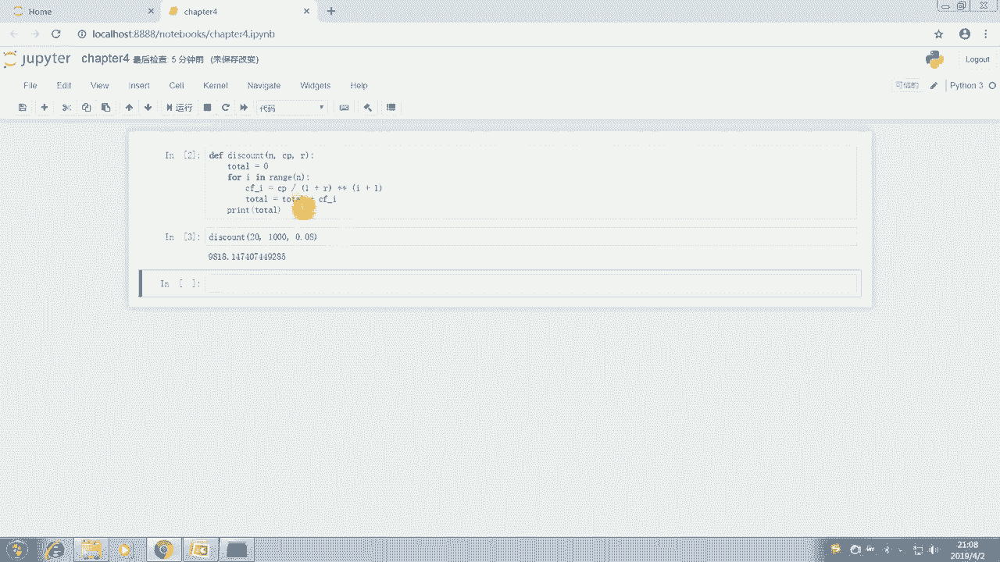

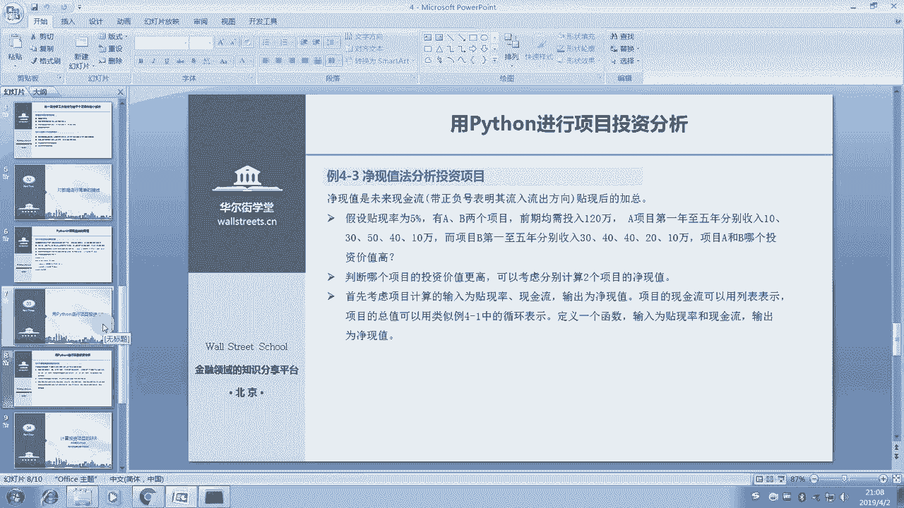

```python
def discount(n, cash_flow_per_year, rate):
    """
    计算年金的现值。
    参数:
    n: 年数
    cash_flow_per_year: 每年现金流
    rate: 贴现率
    """
    total = 0
    for i in range(n):
        pv = cash_flow_per_year / ((1 + rate) ** (i + 1))
        total = total + pv
    return total

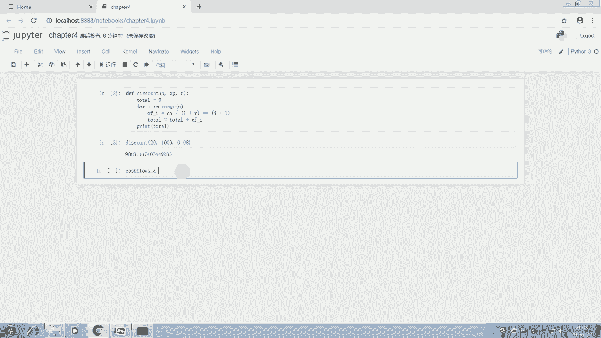

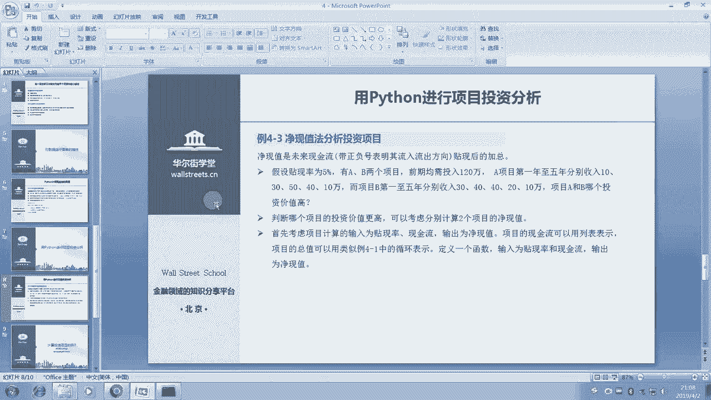

# 调用函数：计算20年，每年1000元，贴现率8%的年金现值
result = discount(20, 1000, 0.08)
print(result)
```
通过封装函数，我们可以方便地计算不同参数下的现值，也为后续批量计算奠定了基础。

## 第二步：计算投资项目的净现值 💰

净现值是评估项目价值的重要指标。接下来，我们计算一个具有不规则现金流项目的净现值。

假设A项目的现金流如下：期初投资-120万，随后几年现金流分别为10、30、50、40、10（单位：万）。我们使用列表来存储这些现金流。

以下是计算净现值的步骤，这里我们引入`enumerate`函数来同时获取元素的索引和值。

```python
# 定义A项目的现金流列表
cash_flows_a = [-120, 10, 30, 50, 40, 10]
# 设置贴现率
rate = 0.05
# 初始化净现值
total = 0

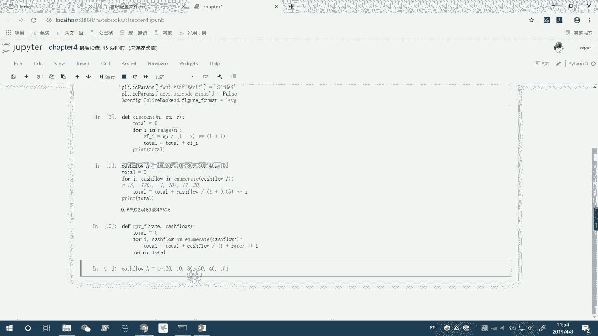

# 使用enumerate遍历现金流列表，i是索引（期数），cf是当期现金流
for i, cf in enumerate(cash_flows_a):
    # 计算当期现金流现值并累加。期初投资（i=0）不需要贴现。
    total = total + cf / ((1 + rate) ** i)

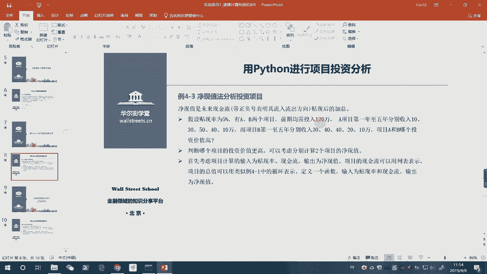

print(total)
```
运行代码，得到A项目的净现值约为0.66993万。

同样，我们将计算净现值的过程封装成函数，以便比较不同项目。

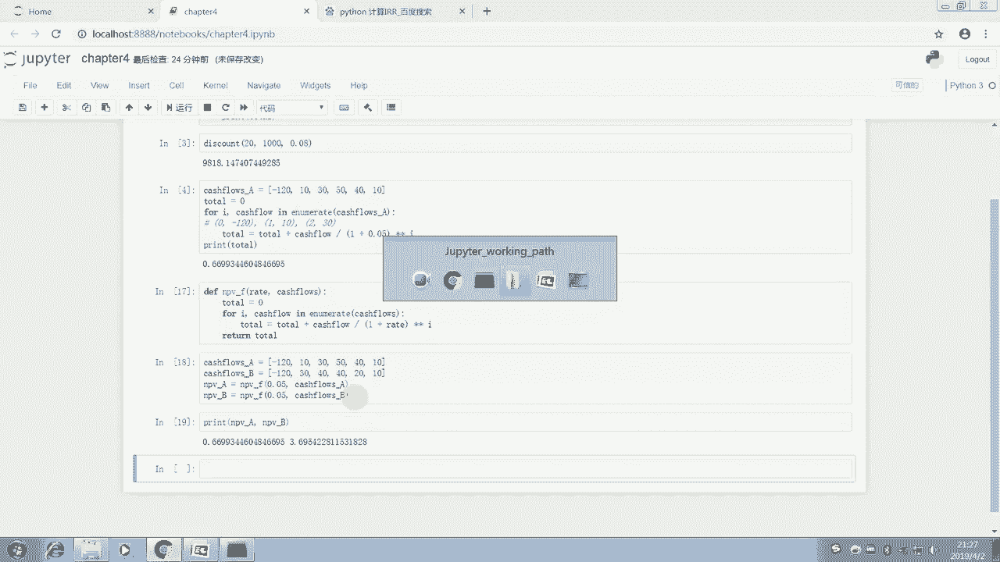

```python
def npv_func(rate, cash_flows):
    """
    计算项目的净现值。
    参数:
    rate: 贴现率
    cash_flows: 现金流列表
    """
    total = 0
    for i, cf in enumerate(cash_flows):
        total = total + cf / ((1 + rate) ** i)
    return total

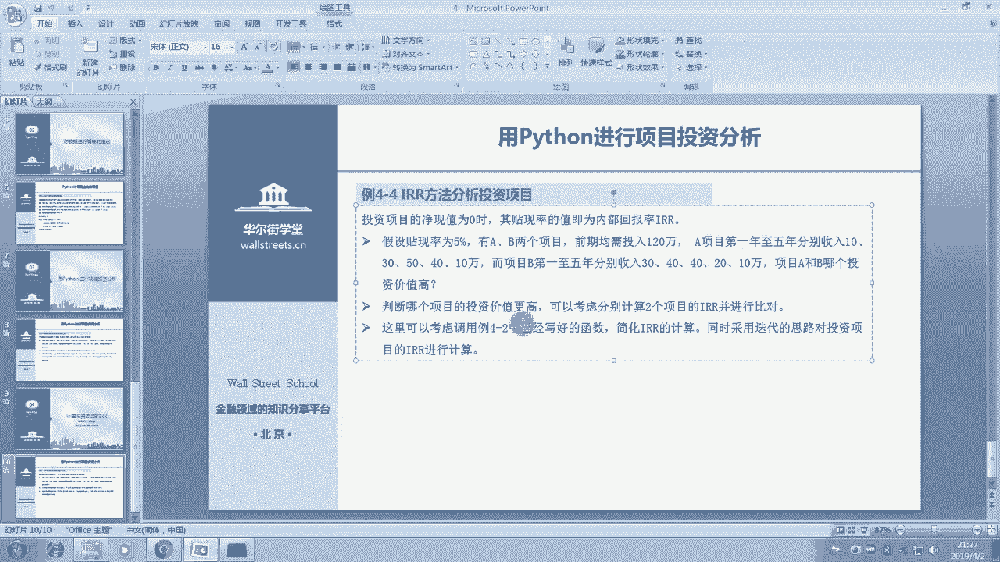

# 定义B项目的现金流
cash_flows_b = [-120, 30, 40, 40, 20, 10]

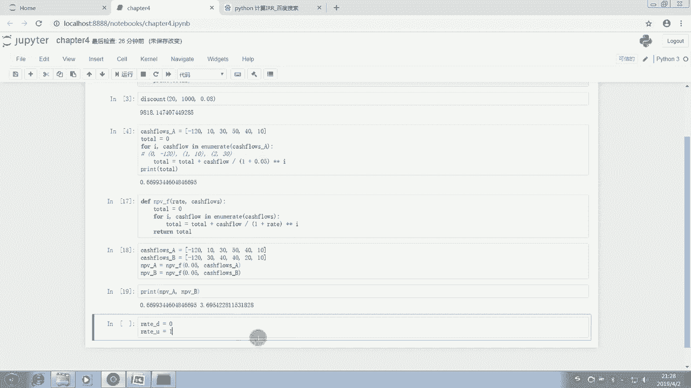

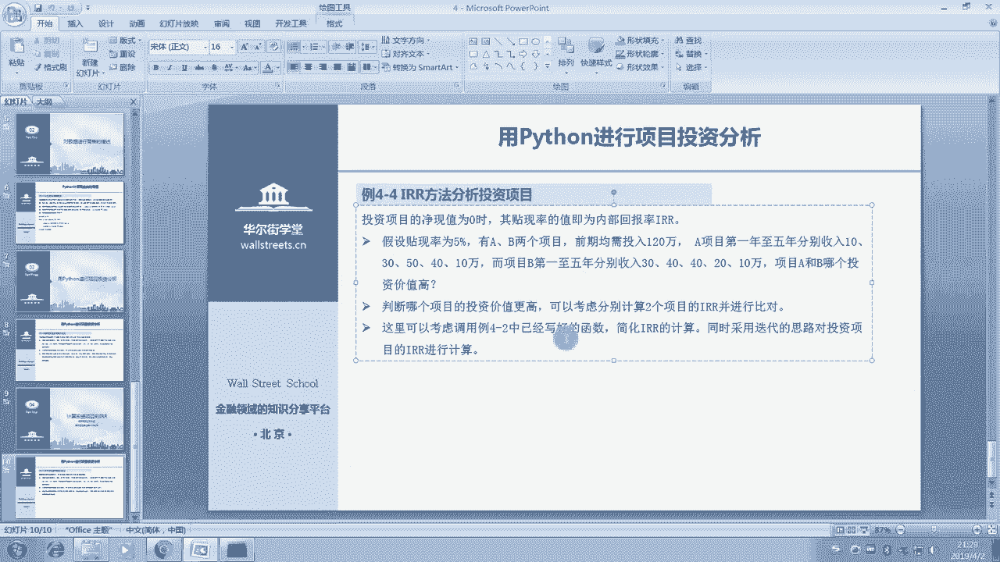

# 计算两个项目的净现值
net_value_a = npv_func(0.05, cash_flows_a)
net_value_b = npv_func(0.05, cash_flows_b)

print("项目A净现值:", net_value_a)
print("项目B净现值:", net_value_b)
```
结果显示，项目B的净现值更高。根据净现值法则，应选择项目B进行投资。

## 第三步：计算投资项目的内部收益率 🎯

内部收益率是使项目净现值为零的折现率。我们将使用二分法来逼近这个值。

二分法的思路是：先给定一个很低的折现率（净现值为正）和一个很高的折现率（净现值为负），然后不断取中点，根据中点处净现值的正负来缩小搜索区间，直到净现值足够接近零。

以下是实现IRR计算的函数。

```python
def irr_func(cash_flows, iterations=10000):
    """
    使用二分法计算项目的内部收益率。
    参数:
    cash_flows: 现金流列表
    iterations: 最大迭代次数（备用）
    """
    # 初始折现率下界和上界
    rate_d = 0.0
    rate_u = 1.0
    # 计算初始中点折现率及其净现值
    rate = (rate_d + rate_u) / 2
    npv = npv_func(rate, cash_flows)

    # 当净现值的绝对值大于精度要求时，继续循环
    while abs(npv) > 0.0001:
        if npv > 0:
            # 净现值为正，说明IRR比当前rate大，用当前rate替换下界
            rate_d = rate
        else:
            # 净现值为负，说明IRR比当前rate小，用当前rate替换上界
            rate_u = rate
        # 计算新的中点折现率及净现值
        rate = (rate_d + rate_u) / 2
        npv = npv_func(rate, cash_flows)
    # 返回满足精度要求的折现率，即IRR
    return rate

# 计算两个项目的内部收益率
irr_a = irr_func(cash_flows_a)
irr_b = irr_func(cash_flows_b)

print("项目A内部收益率:", irr_a)
print("项目B内部收益率:", irr_b)
```
计算得到，项目A的内部收益率约为5.19%，项目B约为6.2%。结合净现值的结论，项目B是更优的投资选择。

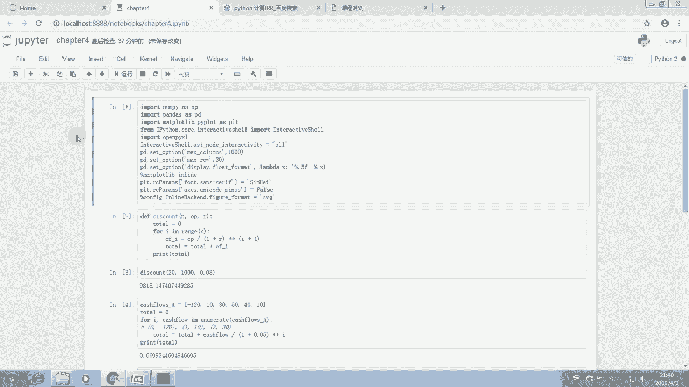

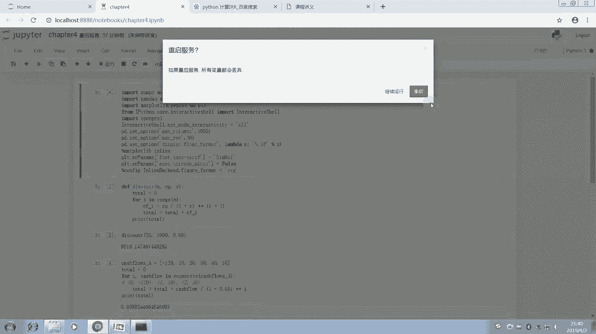

## 总结与回顾

本节课中我们一起学习了如何将Python基础应用于金融分析：

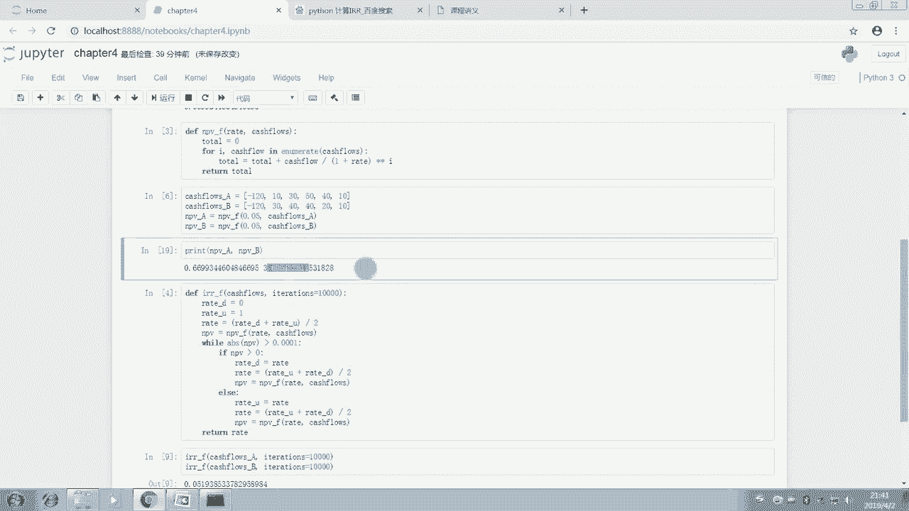

1.  **任务分解**：我们掌握了将复杂的金融分析问题（如求IRR）分解为多个简单步骤（求现值、求NPV）的思维方法。
2.  **现值计算**：我们使用`for`循环和`range`函数，实现了固定年金现值的计算，并将其封装为可复用的`discount`函数。
3.  **净现值计算**：我们利用列表存储不规则现金流，结合`enumerate`函数，计算了项目的净现值，并封装为`npv_func`函数。
4.  **内部收益率计算**：我们运用二分法和`while`循环，实现了寻找使净现值为零的折现率（IRR）的算法，封装为`irr_func`函数。

通过这个从简到繁、逐步构建的案例，我们不仅复习了变量、循环、函数等Python基础知识，更掌握了用编程思维解决实际金融问题的流程。课后，请务必结合课程讲义中的完整代码进行练习，特别是要深入理解`for`循环和`while`循环的条件与控制，这是成为编程能手的关键一步。

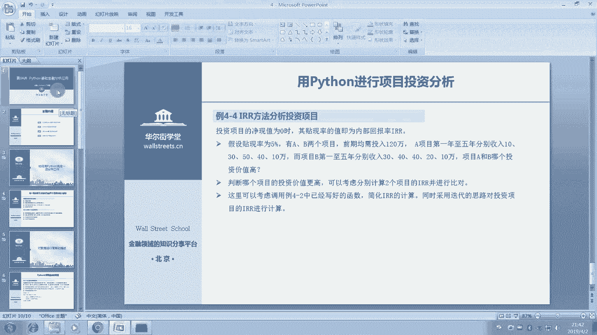

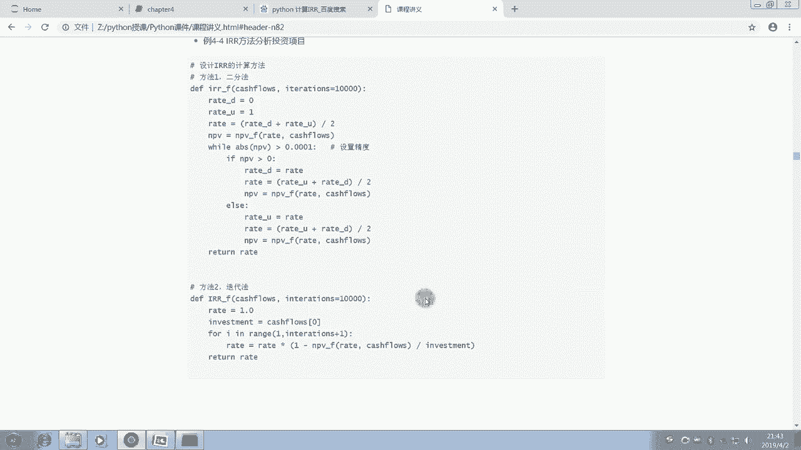

下一次课，我们将学习如何读写文本文件和Excel文件，并在Excel中进行自动化操作。