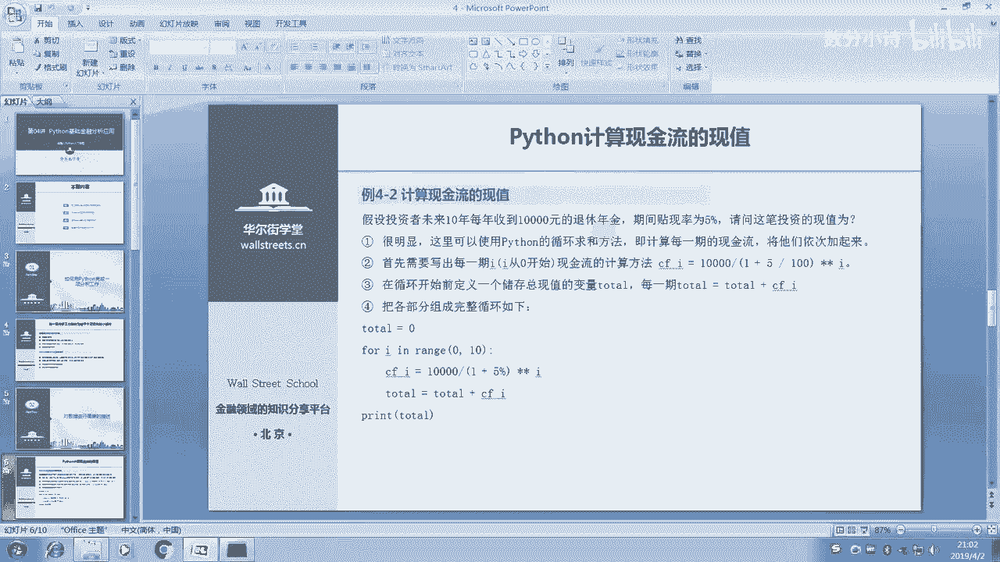
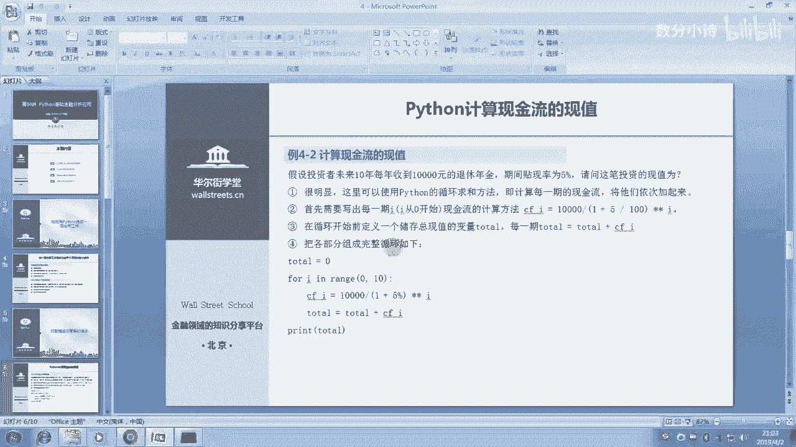
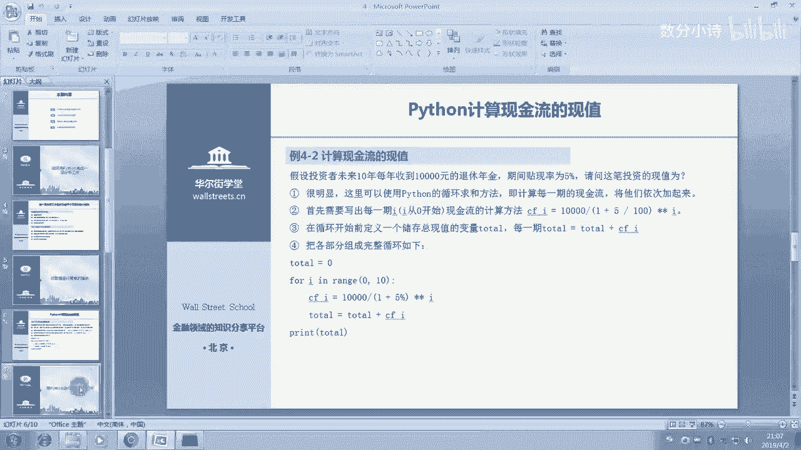
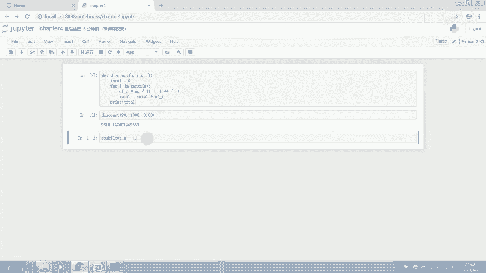
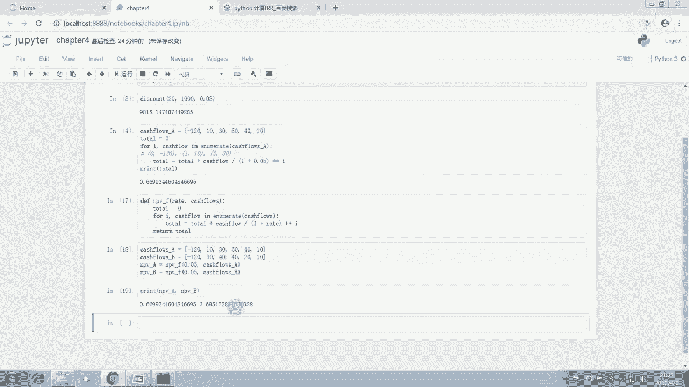
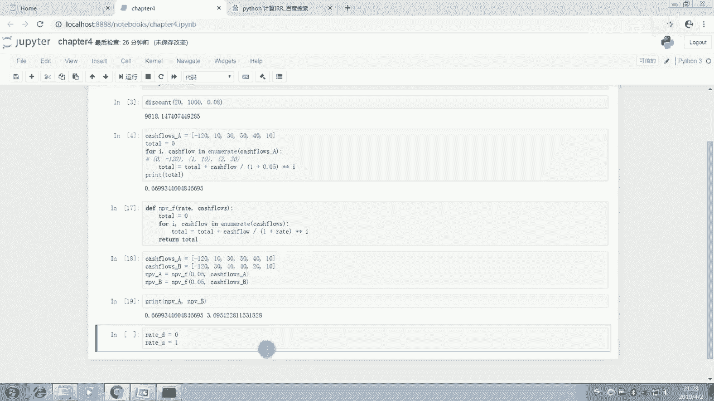
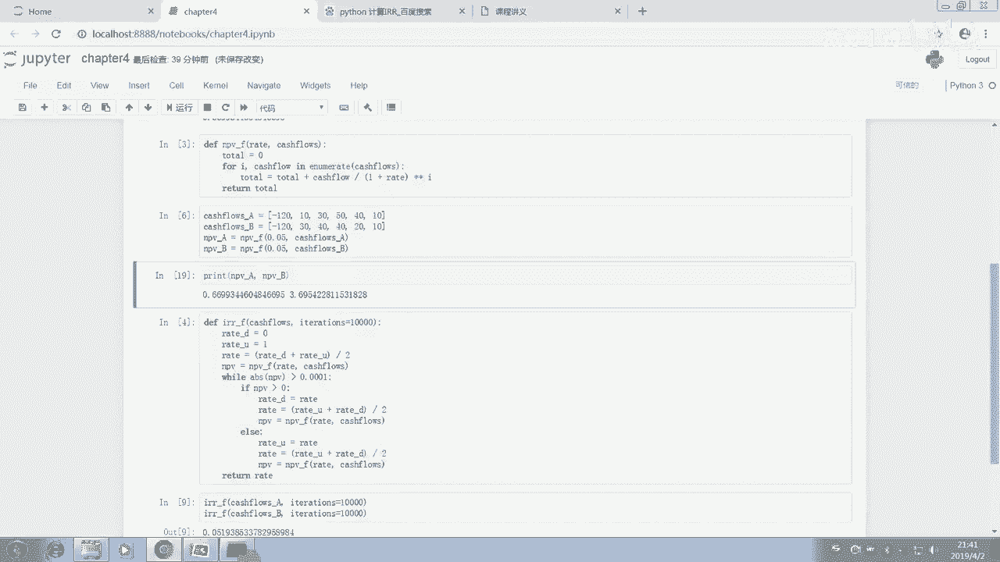
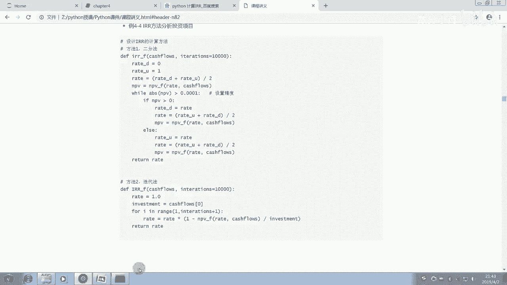

# Python金融量化：P5：05 Python基础金融分析应用 📈


## 概述
在本节课中，我们将学习如何运用Python的基础知识，特别是循环和函数，来解决金融分析中的实际问题。我们将通过一个完整的例子——计算投资项目的内部收益率（IRR），来演示如何将复杂问题分解为简单步骤，并编写出清晰、可复用的代码。


---





## 计算现金流的现值 💰
上一节我们介绍了Python的变量类型和控制流语句。本节中，我们来看看如何应用这些知识计算一系列现金流的现值。




假设投资者未来10年每年年末能收到1万元退休年金，贴现率为5%。这笔投资的现值是多少？

以下是计算步骤：
1.  使用 `for` 循环遍历每一期。
2.  在循环中，将每期现金流按对应期数贴现，并累加到总现值中。

```python
total = 0  # 初始化总现值为0
for i in range(10):
    cf_i = 10000 / ((1 + 0.05) ** (i + 1))  # 计算第i+1期的现值
    total = total + cf_i  # 累加到总现值
print(total)
```
运行代码，得到现值约为77217元。


我们可以将这个计算过程封装成一个函数，使其更通用：
```python
def discount(n, cf_per_year, r):
    total = 0
    for i in range(n):
        pv = cf_per_year / ((1 + r) ** (i + 1))
        total = total + pv
    return total




# 调用函数：20年，每年1000元，贴现率8%
result = discount(20, 1000, 0.08)
print(result)
```




---

## 计算项目的净现值（NPV） 📊
上一节我们计算了等额年金的现值。现在，我们来看现金流不规律时，如何计算一个投资项目的净现值。

假设A项目的现金流如下（单位：万元）：`[-120, 10, 30, 50, 40, 1]`。我们使用 `enumerate` 函数在循环中同时获取索引（期数）和现金流值。


以下是计算NPV的步骤：
1.  将现金流列表存储起来。
2.  使用 `enumerate` 遍历列表，计算每期现金流的现值并累加。

```python
cash_flows_a = [-120, 10, 30, 50, 40, 1]
total = 0
rate = 0.05
for i, cf in enumerate(cash_flows_a):
    pv = cf / ((1 + rate) ** i)  # 注意：第0期（期初）不需要贴现
    total = total + pv
print(total)
```
计算得到A项目的净现值约为0.67万元。




同样，我们将其封装为函数，以便比较不同项目：
```python
def npv_func(rate, cash_flows):
    total = 0
    for i, cf in enumerate(cash_flows):
        total = total + cf / ((1 + rate) ** i)
    return total




# 计算项目A和项目B的NPV
cash_flows_b = [-120, 30, 40, 40, 20, 1]
npv_a = npv_func(0.05, cash_flows_a)
npv_b = npv_func(0.05, cash_flows_b)
print(f"项目A净现值：{npv_a}")
print(f"项目B净现值：{npv_b}")
```
根据结果，项目B的净现值更高，是更优的投资选择。

---

## 计算内部收益率（IRR） 🎯
上一节我们学会了计算给定贴现率下的NPV。本节的核心目标是找到使项目NPV等于零的那个贴现率，即内部收益率（IRR）。

我们采用**二分法**来逼近IRR。基本思路是：先设定一个使NPV为正的很低的贴现率（`rate_low`）和一个使NPV为负的很高的贴现率（`rate_high`），然后不断取中点，根据中点处NPV的正负来缩小范围，直到NPV接近0。

以下是实现IRR计算的函数：
```python
def irr_func(cash_flows, iterations=10000):
    rate_low = 0.0  # 初始低贴现率
    rate_high = 1.0 # 初始高贴现率，例如100%
    precision = 0.0001 # 精度要求

    for _ in range(iterations):
        rate_mid = (rate_low + rate_high) / 2
        npv_mid = npv_func(rate_mid, cash_flows)

        if abs(npv_mid) < precision:
            return rate_mid
        elif npv_mid > 0:
            # NPV>0，说明IRR比当前rate_mid大，提升下限
            rate_low = rate_mid
        else:
            # NPV<0，说明IRR比当前rate_mid小，降低上限
            rate_high = rate_mid
    return (rate_low + rate_high) / 2

# 计算项目A和B的IRR
irr_a = irr_func(cash_flows_a)
irr_b = irr_func(cash_flows_b)
print(f"项目A内部收益率：{irr_a:.4f}")
print(f"项目B内部收益率：{irr_b:.4f}")
```
计算结果显示，项目B的内部收益率更高，与NPV法的结论一致。

---






## 总结
本节课中，我们一起学习了Python在基础金融分析中的应用。我们从最简单的现金流现值计算入手，逐步深入到净现值（NPV）的计算，最后实现了寻找内部收益率（IRR）的算法。整个过程演示了如何将复杂的金融问题（求IRR）分解为多个简单的步骤（求现值、求NPV、二分法逼近），并利用循环、函数等基础编程工具构建出完整的解决方案。掌握这种“分解-解决-组合”的思路，是运用Python处理更复杂金融量化问题的关键。