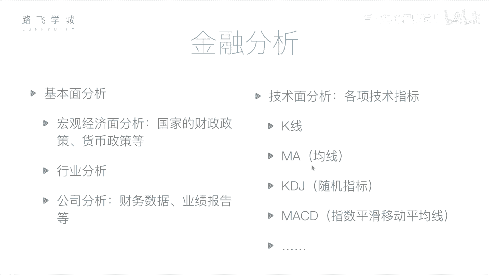
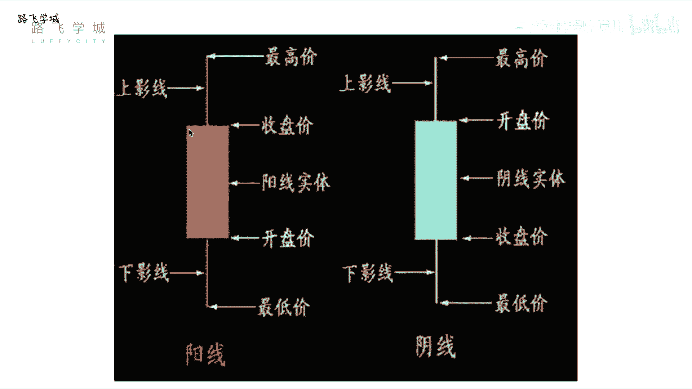
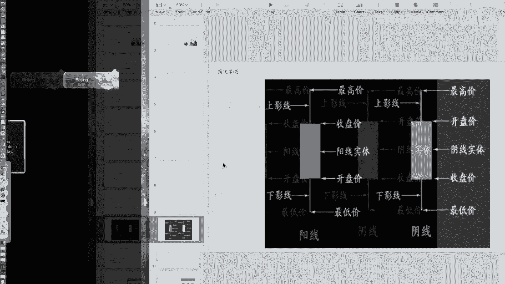
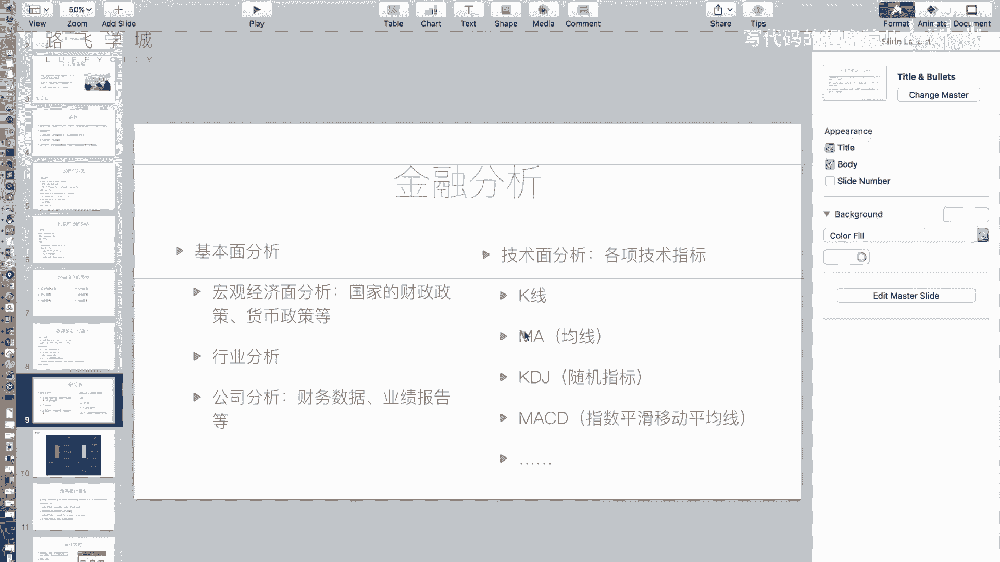
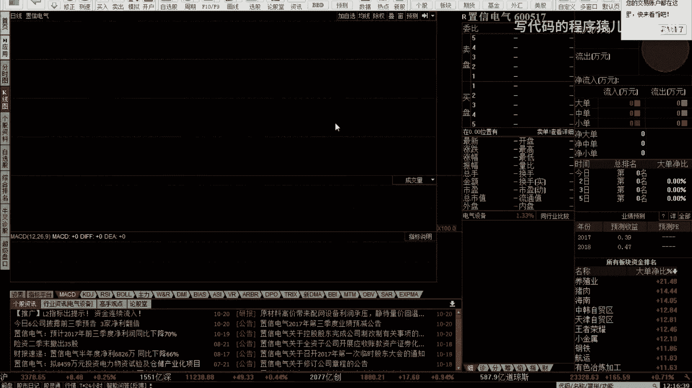
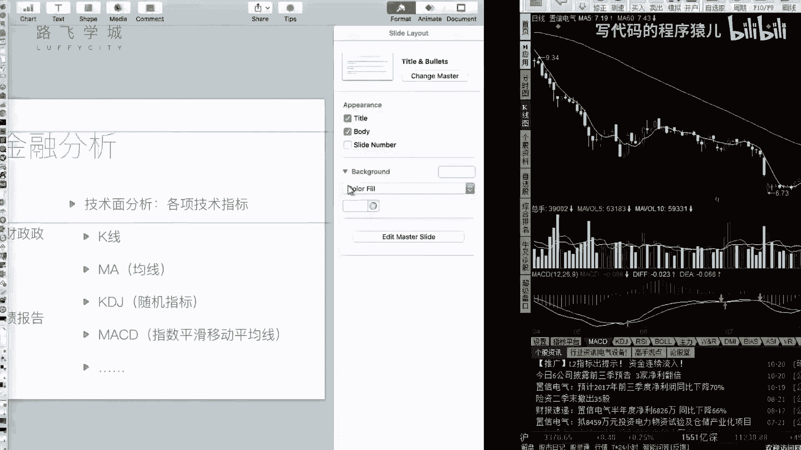

# 14天拿下Python金融量化：P5：05 金融分析 📈

在本节课中，我们将要学习金融分析的基本方法。我们将了解如何通过基本面分析和技术面分析来判断股票的投资价值，并详细介绍两种核心的技术指标：K线和移动平均线（MA）。

## 概述

上一节我们介绍了金融和股票的基础知识。本节中，我们来看看如何进行金融分析。买卖股票不能盲目进行，需要借助分析手段来判断股票是否值得购买，以及预测其未来走势。

## 基本面分析

基本面分析的核心是评估公司的运营状况。这主要基于我们之前提到的、影响股价的公司自身因素。你需要分析当前经济状况、国家政策、行业发展以及公司具体的经营情况，以此来决定是否购买其股票。

基本面分析主要包括以下三个方面：

以下是基本面分析的三个层面：

1.  **宏观经济面分析**：分析国家的财政政策、货币政策等。这有助于判断国家当前是鼓励资金流入股市还是倾向于储蓄。但需注意，宏观经济规律并非总是与股市表现一致。
2.  **行业分析**：判断整个行业的发展前景。例如，可以评估教育、IT、钢铁、煤炭等行业哪个更具发展潜力。你可以通过提取该行业中几只具有代表性的股票，观察其整体走势来进行判断。
3.  **公司分析**：这是最具体的层面。例如，如果你打算购买贵州茅台的股票，就需要深入分析这家公司。上市公司必须定期公开其财务数据。每年公司会发布几次财报，其中全年财报通常在次年3月份发布，每个季度也会发布季报。如果你提前了解到公司经营状况良好，可以在财报发布前买入股票；财报发布后，股价通常会上涨。对于普通投资者，可以通过分析公开的财务报表（如公司盈利、每股收益等）来判断公司价值。这些数据经过会计师事务所审计，通常比较可靠。此外，结合新闻、实地考察等信息，可以综合判断公司运营状况，如果运营良好且盈利能力强，则可以考虑购买其股票。

## 技术面分析

上一节我们介绍了基本面分析，它侧重于公司内在价值。本节中我们来看看技术面分析。技术面分析的核心观点是：所有信息都已蕴含在市场交易数据中。

技术面分析通过研究历史市场数据（如价格和成交量）来预测未来价格走势。它不仅仅看股票过去是涨是跌，更重要的是借助一系列定义好的技术指标进行分析。

以下是两种常见的技术指标：

1.  **K线**：K线图是展示股票每日价格变动的图表。一根K线包含了四个关键价格：开盘价、收盘价、最高价和最低价。
    *   **阳线与阴线**：如果当日收盘价高于开盘价（即股价上涨），则用**阳线**（通常为红色或空心）表示。如果当日收盘价低于开盘价（即股价下跌），则用**阴线**（通常为绿色或实心）表示。
    *   **K线结构**：
        *   **实体**：中间的矩形部分。在阳线中，实体的**下边缘表示开盘价**，**上边缘表示收盘价**。在阴线中则相反，实体的**上边缘表示开盘价**，**下边缘表示收盘价**。
        *   **影线**：实体上下方的细线。**上影线的顶端表示当日最高价**，**下影线的底端表示当日最低价**。
    *   **特殊形态**：存在一些特殊的K线形态，例如“十字星”（开盘价等于收盘价）或“光头光脚阳线/阴线”（没有上下影线），这些形态具有特定的分析意义。

    **公式/概念**：一根K线 = (开盘价， 收盘价， 最高价， 最低价)

2.  **移动平均线（MA）**：均线是通过计算过去一段时间内股价的平均值，并将这些平均值连接起来形成的曲线。它用于平滑价格数据，反映趋势。
    *   **计算方法**：例如，5日均线（MA5）是取包括当天在内向前回溯5个交易日的收盘价（或其他选定价格）计算出的平均值。将每一天计算出的这个平均值连成线，就得到了5日均线。
    *   **种类**：常见的均线有5日（MA5）、10日（MA10）、20日（MA20）、60日（MA60）等。周期越短，均线对价格变化越敏感；周期越长，均线越平滑，更能反映长期趋势。
    *   **应用**：均线可以帮助判断趋势方向（上升、下降或盘整）以及潜在的支撑和阻力位。后面讲到量化策略时，我们会介绍基于两条不同周期均线的“双均线策略”。

    **公式/概念**：`N日均线值 = (过去N日收盘价之和) / N`

## 总结

本节课中我们一起学习了金融分析的两种主要方法。基本面分析侧重于公司的内在价值，通过宏观经济、行业和公司层面进行评估。技术面分析则专注于市场历史数据，利用K线、移动平均线（MA）等技术指标来识别模式和趋势，辅助交易决策。理解这些基础分析工具，是进行更深入量化分析的第一步。