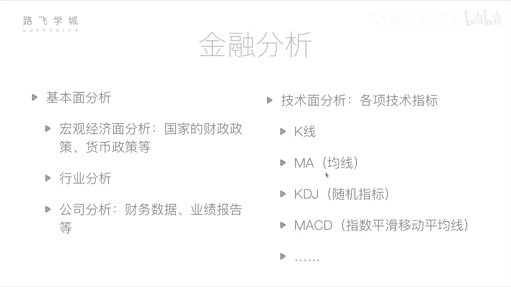
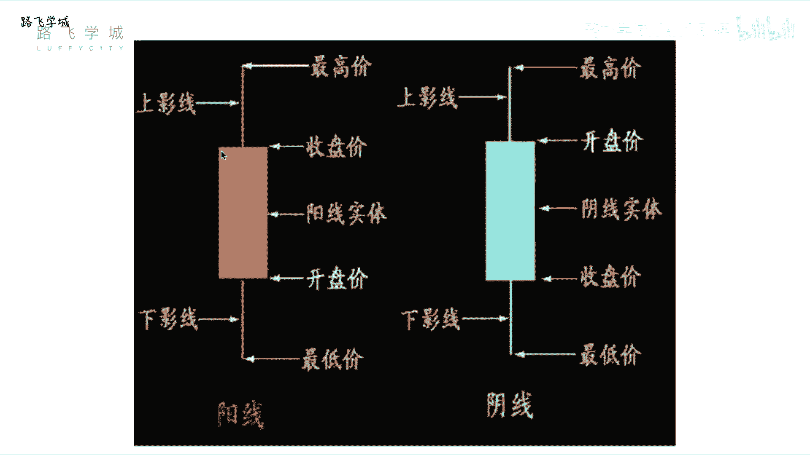
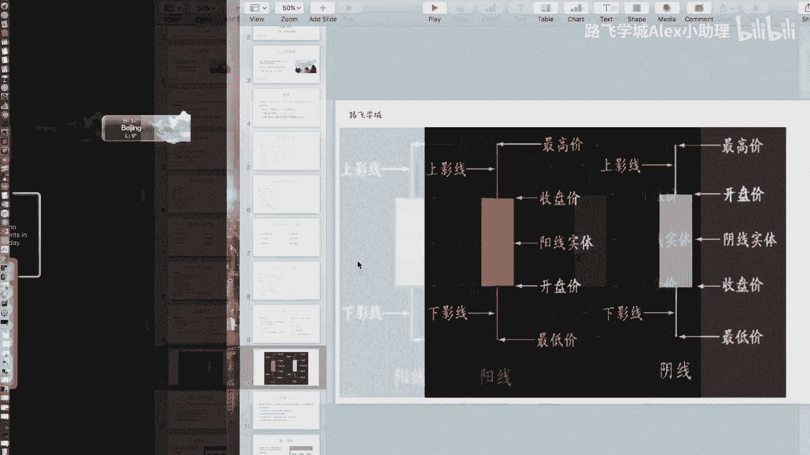
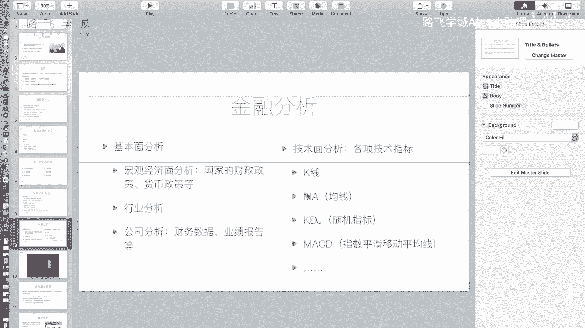
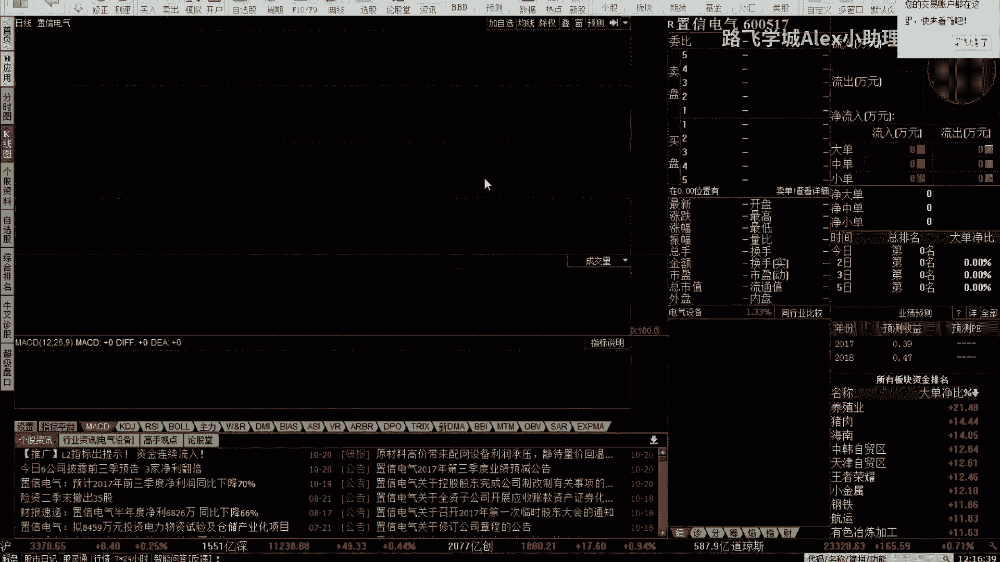
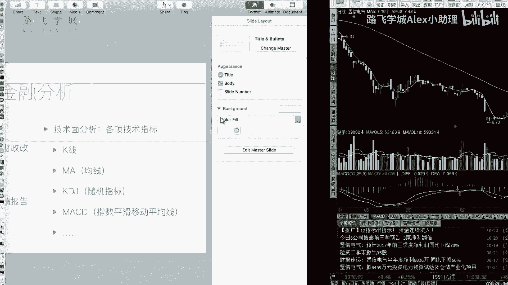

# Python金融量化：P5：05 金融量化分析-金融分析 📈

在本节课中，我们将要学习金融分析的核心方法。上一节我们介绍了金融和股票的基础知识，本节中我们来看看如何通过分析手段来判断股票的买卖时机，避免盲目投资。

金融分析主要分为两种方法：基本面分析和技术面分析。

## 基本面分析

基本面分析的核心是评估公司的运营状况，即我们之前提到的“公司自身因素”。它通过分析宏观经济、行业前景以及公司具体的财务状况，来判断股票的内在价值。

以下是基本面分析的三个层面：

1.  **宏观经济面分析**：分析国家的财政政策、货币政策等宏观环境，判断资金流向。但需注意，宏观经济规律并非总是与股市表现一致。
2.  **行业分析**：判断特定行业（如教育、IT、能源）的整体发展前景。可以通过观察该行业内几只代表性股票的走势来辅助判断。
3.  **公司分析**：这是最具体的层面。投资者通过研究上市公司的公开财务报告（财报）来判断其经营状况。财报数据经过审计，相对客观。例如，若一家公司经营状况良好、盈利能力强，其股票可能具有投资价值。

## 技术面分析

技术面分析的核心观点是：所有信息都已蕴含在市场交易数据中。它通过研究历史价格、成交量等数据形成的图表和指标，来预测未来价格走势。

技术面分析不关注公司内在价值，而是关注市场行为本身。以下是两个基础的技术指标介绍。

### K线图

K线图是展示股票每日价格变动的图表。一根K线包含了四个关键价格：开盘价、收盘价、最高价和最低价。

K线分为阳线和阴线：
*   **阳线**（通常为红色或空心）：表示当日股价上涨，即收盘价高于开盘价。
*   **阴线**（通常为绿色或实心）：表示当日股价下跌，即收盘价低于开盘价。

一根标准K线的构成如下：
*   **实体**：中间的矩形部分。实体的**上、下边缘**分别代表收盘价和开盘价（阳线），或开盘价和收盘价（阴线）。
*   **影线**：实体上方和下方的细线。**上影线顶端**代表当日最高价，**下影线底端**代表当日最低价。

K线有多种特殊形态，如十字星（开盘价等于收盘价）、光头光脚线（无影线）等，不同形态可能预示着不同的市场信号。

### 移动平均线（MA）

移动平均线（Moving Average， MA）是通过计算过去一段时间内股价的平均值，并将这些平均值连接起来形成的曲线。它用于平滑价格波动，反映趋势。

常见的均线包括：
*   **MA5**：5日均线，过去5个交易日收盘价的平均值。
*   **MA60**：60日均线，过去60个交易日收盘价的平均值。

均线的计算方式可以表示为以下公式：
`MA(N) = (P1 + P2 + ... + PN) / N`
其中，`P1` 到 `PN` 代表过去N个交易日的收盘价。

在图表中，短期均线（如MA5）对价格变化更敏感，波动较大；长期均线（如MA60）更平滑，能更好地反映长期趋势。后续课程中会介绍基于均线的交易策略，例如双均线策略。

---

本节课中我们一起学习了金融分析的两大支柱：基本面分析和技术面分析。基本面分析从公司价值出发，而技术面分析则专注于市场交易数据。我们还初步认识了K线和移动平均线这两个基础但至关重要的技术分析工具。理解这些概念是进行量化分析和制定交易策略的第一步。