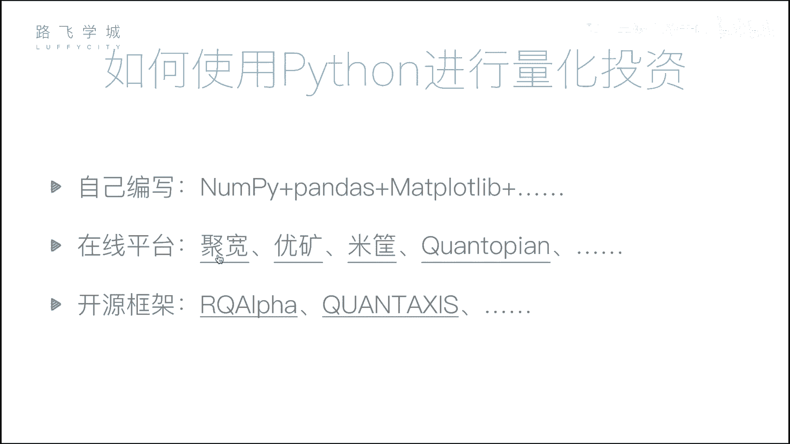
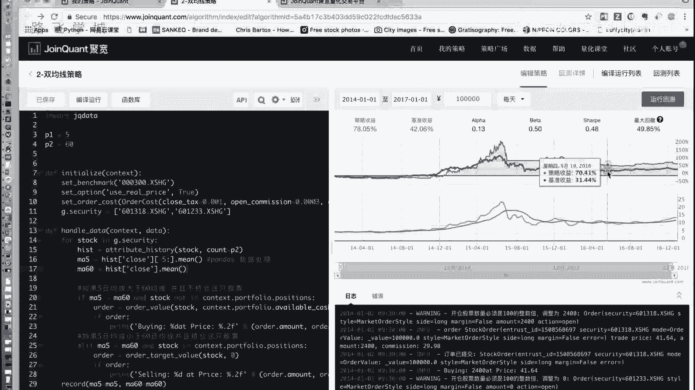
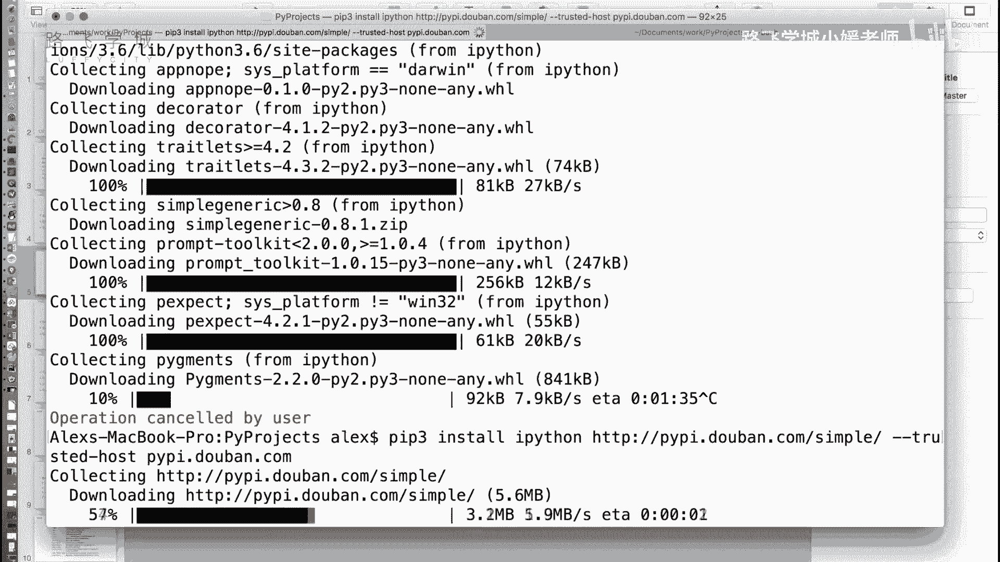
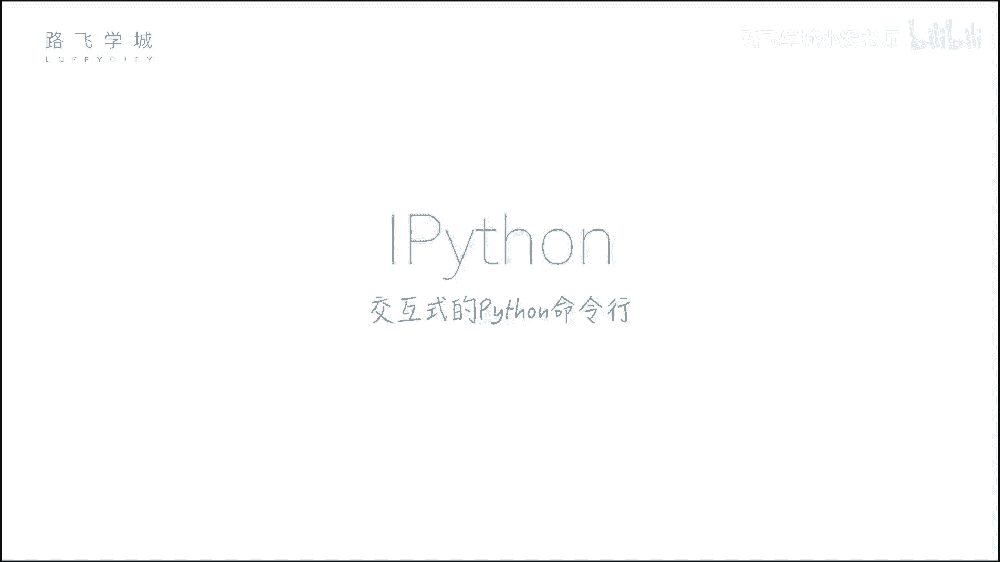
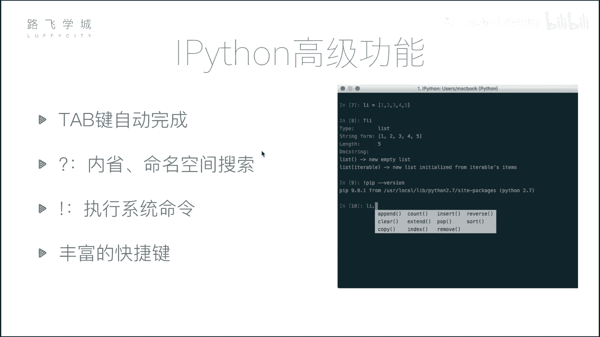
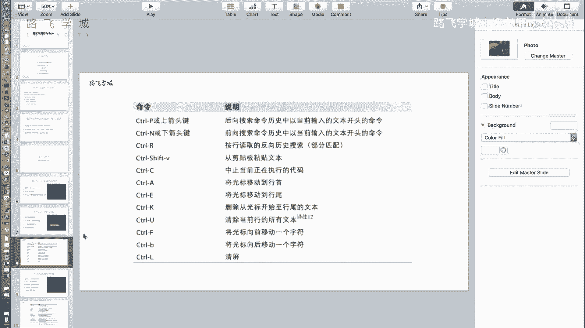

# Python金融量化分析：P5：07 量化投资与Python及IPython初识 📈

在本节课中，我们将要学习量化投资的基本概念，了解为何选择Python作为量化分析的工具，并初步认识一个强大的交互式Python环境——IPython。

## 量化投资与Python

上一节我们介绍了量化分析的基本概念，本节中我们来看看如何用Python实现量化投资。量化投资的核心是分析数据并据此做出决策。Python因其强大的数据处理能力和丰富的生态系统，成为量化投资领域的首选语言。

除了Python，市场上也存在其他可用于数据分析的工具。以下是几种常见工具的简要对比：

*   **Excel**：无需编程，主要用于手工数据处理和基础分析。
*   **SAS/SPSS**：专业的统计分析软件，能进行复杂的统计计算和图表生成，但同样不涉及编程。
*   **R语言**：一门专注于统计分析和数据可视化的编程语言，但在量化投资以外的应用领域较窄。



相比之下，Python是一门通用编程语言，既能高效处理数据，又能应用于Web开发、自动化脚本等多个领域，功能更为全面。

## Python数据分析核心模块



要进行量化投资，我们需要掌握几个核心的数据分析模块。接下来我们将重点学习以下三个库：

1.  **NumPy**：用于进行高效的**数组批量计算**。其核心数据结构是`ndarray`。
    ```python
    import numpy as np
    arr = np.array([1, 2, 3, 4, 5])
    result = arr * 2  # 数组中的每个元素都乘以2
    ```
2.  **Pandas**：这是数据分析的**核心库**，提供了灵活易用的`DataFrame`（数据表）结构，便于进行数据清洗、转换和分析。
    ```python
    import pandas as pd
    df = pd.DataFrame({'价格': [10, 20, 30], '成交量': [100, 200, 300]})
    ```
3.  **Matplotlib**：用于**数据可视化**，可以将分析结果以图表形式直观展示。
    ```python
    import matplotlib.pyplot as plt
    plt.plot([1, 2, 3], [4, 5, 1])
    plt.show()
    ```

## 量化投资的实现方式



学习了上述模块后，我们可以通过以下两种主要方式进行量化投资：

*   **自建框架**：完全从零开始，利用NumPy、Pandas等库，结合下载的股票数据，编写自己的策略并进行回测。
*   **使用在线平台**：市场上存在许多成熟的量化交易平台。用户只需在平台上编写策略的核心代码，平台会自动处理数据获取、回测和结果可视化。例如，一个策略回测后可能生成收益曲线图，直观展示策略在不同时间段的表现。

## IPython交互式环境

在深入学习数据分析模块之前，我们先介绍一个强大的工具：**IPython**。它是一个增强的交互式Python命令行，提供了比标准Python命令行更丰富的功能。





### 安装IPython

如果你已经安装了Python，可以通过`pip`命令安装IPython。建议使用国内镜像源以加速下载。
```bash
pip install ipython -i https://pypi.douban.com/simple/
```
对于尚未安装Python环境的用户，推荐直接安装**Anaconda**发行版，它集成了IPython、NumPy、Pandas、Matplotlib等我们所需的所有库。

### IPython的基本使用

安装完成后，在命令行输入`ipython`即可启动。它的提示符带有行号（如 `In [1]:`），能清晰区分输入和输出。

### IPython的高级功能

IPython提供了多项提升效率的功能，以下是其中几个：

*   **Tab键自动补全**：输入变量名或函数的前几个字母后按`Tab`键，IPython会列出所有可能的补全选项。
*   **执行系统命令**：在命令前加上感叹号`!`，可以直接执行操作系统命令。
    ```python
    !ls  # 列出当前目录文件
    !pip list  # 查看已安装的Python包
    ```
*   **内省与帮助**：在变量或函数名后加上问号`?`，可以查看其类型、文档字符串等信息；加上两个问号`??`可以查看函数源代码（如果可用）。
*   **丰富的快捷键**：IPython支持许多快捷键来提高编码效率，例如：
    *   `Ctrl + A`：移动光标到行首。
    *   `Ctrl + E`：移动光标到行尾。
    *   `Ctrl + U`：删除从光标到行首的所有内容。
    *   `Ctrl + K`：删除从光标到行尾的所有内容。

---



本节课中我们一起学习了量化投资为何选择Python，认识了数据分析的三大核心模块（NumPy, Pandas, Matplotlib），了解了实现量化投资的两种途径，并初步掌握了强大的交互式编程工具IPython的基本使用方法。接下来，我们将开始深入学习这些核心模块的具体应用。