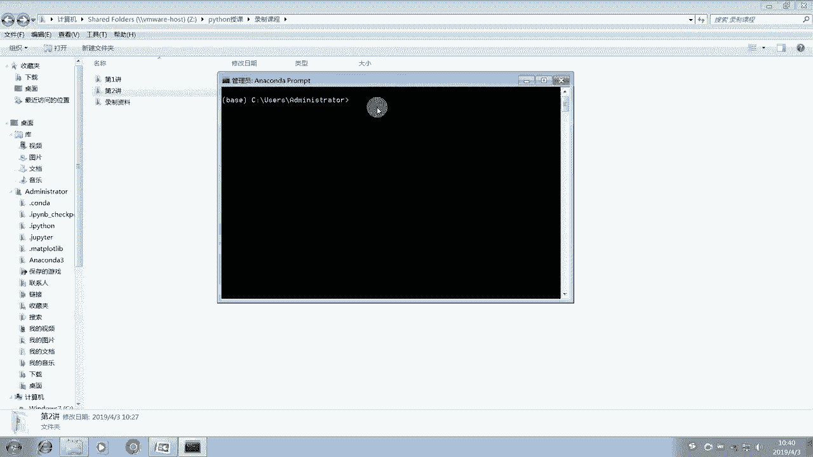
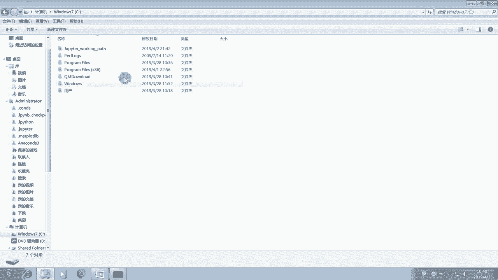
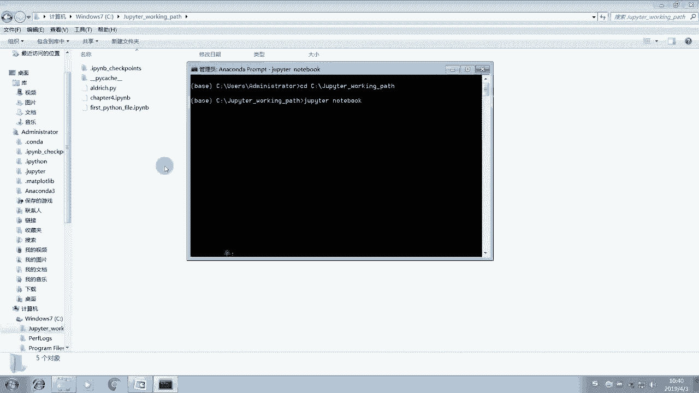
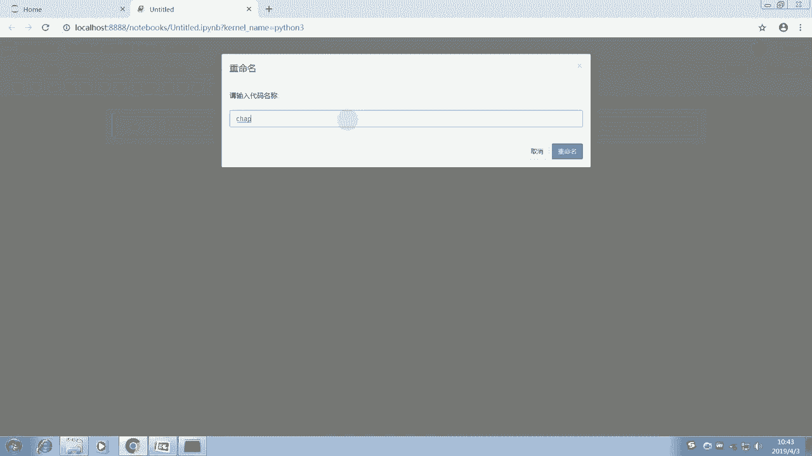
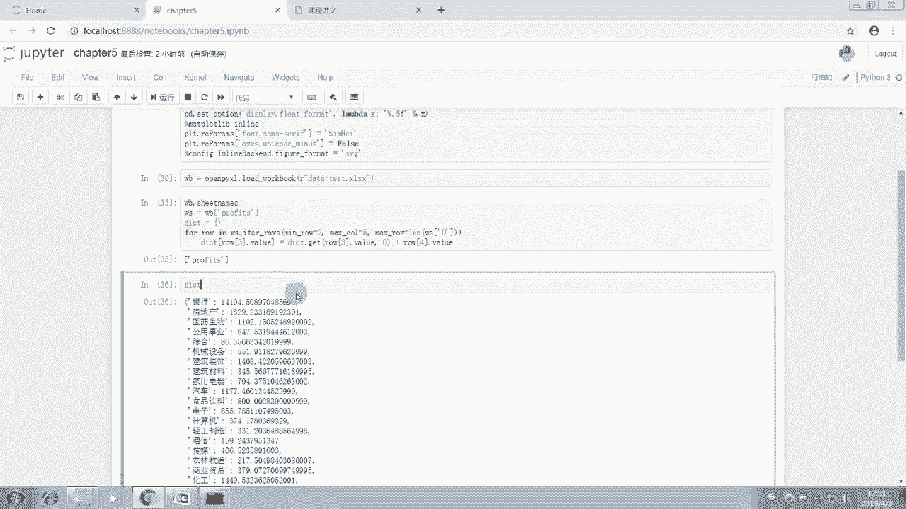
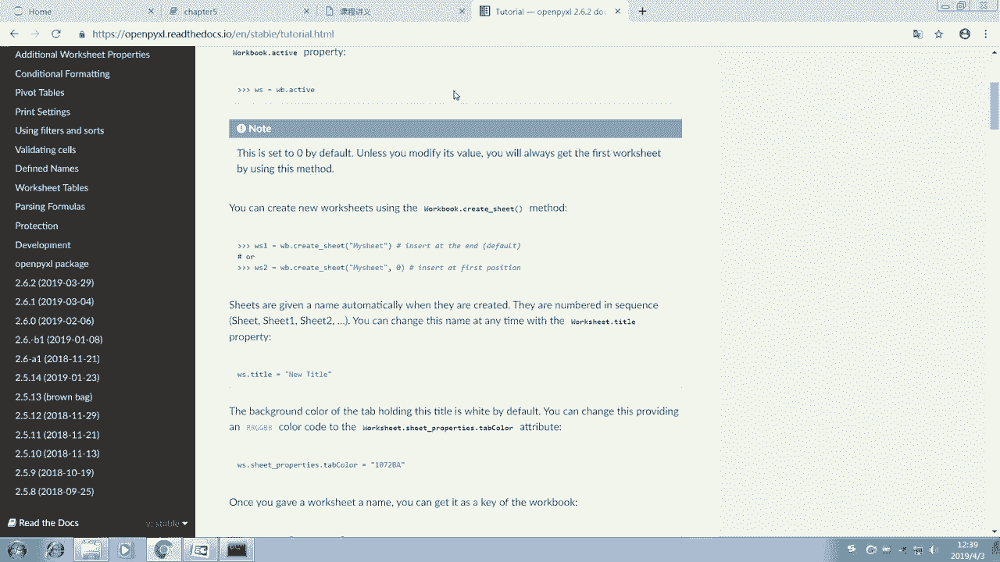
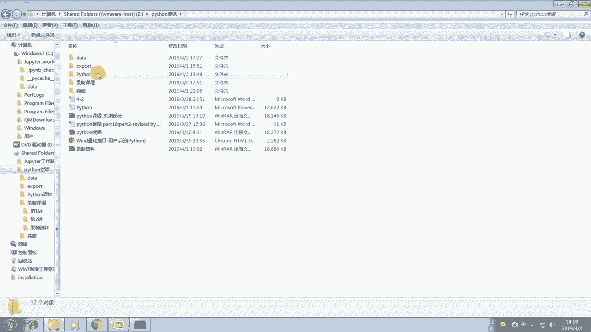
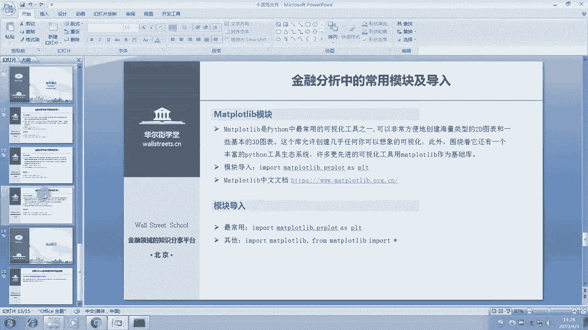

# Python金融量化：P6：06 成为编程能手：Python知识进阶 📈


在本节课中，我们将学习Python的进阶知识，重点是文件的读写操作。我们将掌握如何用Python读取和写入TXT及Excel文件，这是金融数据分析中非常实用的技能。课程最后，我们还会简要介绍类、实例以及Python中几个核心的数据分析模块。






---



## 读写TXT文件 📄




上一节我们介绍了Python的基础语法和数据结构。本节中，我们来看看如何与外部文件进行交互，首先从最简单的TXT文件开始。

### 文件路径

在读取文件之前，必须知道文件在计算机上的位置，即文件路径。路径分为绝对路径和相对路径。

*   **绝对路径**：从根目录开始的完整路径。无论当前工作目录在哪里，都能通过此路径找到文件。
*   **相对路径**：相对于当前工作目录的路径。如果文件就在工作目录或其子文件夹中，使用相对路径会更简洁。

**代码示例：定义文件路径**
```python
# 绝对路径示例
absolute_path = r"C:\Users\YourName\workspace\data\SZZS.txt"

# 相对路径示例 (假设data文件夹在工作目录下)
relative_path = r"data\SZZS.txt"
```
> **提示**：在路径字符串前加 `r` 可以防止转义字符被误解，使路径读取更准确。

### 读取TXT文件

Python提供了多种方式读取文件，推荐使用 `with open()` 语句，它能自动管理文件的打开和关闭。

以下是两种常见的读取方式：

**方法一：逐行读取**
```python
file_path = r"data\SZZS.txt"
with open(file_path) as file_handle:
    for line in file_handle:
        # 处理每一行数据，例如打印
        print(line.strip())  # .strip() 用于移除行首尾的空白字符（如换行符）
```

**方法二：一次性读取所有行到列表**
```python
file_path = r"data\SZZS.txt"
with open(file_path) as file_handle:
    lines = file_handle.readlines()  # 返回一个列表，每个元素是一行内容
    for line in lines:
        print(line.strip())
```

### 实战：处理上证指数数据

让我们将学到的知识应用于实际数据。假设我们有一个记录上证指数周涨跌幅的TXT文件，数据格式为“日期 涨跌幅”。

**代码示例：读取并解析数据**
```python
date_list = []
pct_list = []

file_path = r"data\SZZS.txt"
with open(file_path) as fh:
    for line in fh:
        # 使用 split() 方法按空白字符分割每行数据
        date_str, pct_str = line.strip().split()
        date_list.append(date_str)
        pct_list.append(pct_str)  # 注意：此时 pct_str 是字符串类型

print("日期列表前5项：", date_list[:5])
print("涨跌幅列表前5项：", pct_list[:5])
```
> **注意**：从文本文件读取的数字默认是字符串类型（str）。如果需要进行数学计算，必须将其转换为数值类型（如 `float`）。

---

## 写入TXT文件 ✍️

学会了读取，我们再来看看如何写入数据到TXT文件。写入模式主要有两种：覆盖写入 (`'w'`) 和追加写入 (`'a'`)。

### 覆盖写入模式 (`'w'`)

此模式会创建一个新文件，如果文件已存在，则清空原有内容。

**代码示例：创建并写入新文件**
```python
file_name = "first_file_to_write.txt"
with open(file_name, 'w') as fh:
    fh.write("I love programming.\n")  # \n 表示换行
    fh.write("This is a new line.")
```

### 追加写入模式 (`'a'`)

此模式会在文件末尾添加新内容，不会影响原有数据。

**代码示例：在现有文件末尾追加内容**
```python
file_name = "first_file_to_write.txt"
with open(file_name, 'a') as fh:
    fh.write("\n")  # 先换行
    fh.write("Appending a new line of text.\n")
    fh.write("Appending another line.")
```

---

## 读写Excel文件 📊

在金融工作中，Excel文件的使用极为广泛。接下来，我们学习如何使用 `openpyxl` 库来操作Excel文件。

### 安装与导入模块

首先需要安装 `openpyxl` 库。在Anaconda Prompt或终端中运行：
```
pip install openpyxl
```
然后在Python脚本中导入：
```python
import openpyxl
```

### 创建新的Excel工作簿

我们可以用Python创建一个全新的Excel文件并写入数据。

**代码示例：创建Excel文件并操作单元格**
```python
from openpyxl import Workbook

# 1. 创建一个新的工作簿
wb = Workbook()

# 2. 获取默认的活动工作表
ws = wb.active
ws.title = "MySheet"  # 修改工作表名称

# 3. 向单元格写入数据
ws['A1'] = "Date"
ws['B1'] = "Price"
ws['A2'] = "2023-10-01"
ws['B2'] = 100.5

# 4. 使用循环填充一个区域
cell_range = ws['A1':'B10']  # 选择A1到B10的矩形区域
for row in cell_range:
    for cell in row:
        cell.value = 0  # 将所有选中单元格的值设为0

# 5. 保存工作簿到文件
wb.save("my_first_excel.xlsx")
wb.close()  # 关闭工作簿
```

### 读取现有的Excel文件

更常见的情况是读取已有的Excel数据进行分析。

**代码示例：加载Excel文件并读取数据**
```python
from openpyxl import load_workbook

# 1. 加载一个已存在的Excel工作簿
file_path = r"data\test.xlsx"
wb = load_workbook(file_path, data_only=True)  # data_only=True 只读值，不读公式

# 2. 获取所有工作表名称
sheet_names = wb.sheetnames
print("所有工作表：", sheet_names)

# 3. 选择特定的工作表
ws = wb[sheet_names[0]]  # 选择第一个工作表
# 或 ws = wb["Sheet1"] # 通过名称直接选择

# 4. 遍历读取工作表中的数据
data = []
for row in ws.iter_rows(min_row=1, max_col=ws.max_column, max_row=ws.max_row, values_only=True):
    # values_only=True 直接返回单元格的值，而不是单元格对象
    data.append(row)
    # print(row)  # 打印每一行数据

# 5. 将数据转换为更易处理的结构（例如，按行业汇总利润）
industry_profit_dict = {}
for row in data[1:]:  # 假设第一行是标题行
    industry = row[3]  # 假设行业在第4列（索引从0开始）
    profit = row[4]    # 假设利润在第5列
    if profit is not None:
        # 使用字典的get方法，如果行业不存在则初始化为0，然后累加利润
        industry_profit_dict[industry] = industry_profit_dict.get(industry, 0) + profit

print("行业利润汇总：", industry_profit_dict)

# 6. （可选）将汇总结果写回Excel的指定列
# ... （此处代码较长，原理是遍历目标列，匹配行业并写入汇总值）
# wb.save("result.xlsx")
wb.close()
```



### 批量重命名工作表


`openpyxl` 还能方便地进行批量操作，例如重命名所有工作表。

**代码示例：批量重命名工作表**
```python
from openpyxl import load_workbook

wb = load_workbook(r"data\pe_data_original.xlsx")

# 获取所有原始工作表名
original_names = wb.sheetnames
print(f"共有 {len(original_names)} 个工作表")

# 批量重命名，例如改为 Sheet0, Sheet1, ...
for i, ws in enumerate(wb.worksheets):
    ws.title = f"Sheet{i}"

# 保存为新文件
wb.save("pe_data_renamed.xlsx")
wb.close()
```

---



## 金融分析实战案例：统计连续上涨周数 📈

让我们综合运用文件读写和数据处理技能，解决一个实际的金融分析问题：统计上证指数历史上连续上涨超过N周的次数及结束日期。

**思路分析：**
1.  **读取数据**：从TXT文件读取历史周涨跌幅数据。
2.  **数据清洗**：将字符串格式的涨跌幅转换为浮点数。
3.  **逻辑判断**：遍历数据，使用计数器记录连续上涨的周数。
4.  **结果汇总**：当上涨中断时，将连续的周数及结束日期记录到字典中。
5.  **输出结果**：将统计结果写入新的TXT文件。

**代码实现：**
```python
# 1. 读取数据
date_list = []
pct_str_list = []
with open(r"data\SZZS.txt") as f:
    for line in f:
        d, p = line.strip().split()
        date_list.append(d)
        pct_str_list.append(p)

# 2. 数据清洗：将涨跌幅字符串转为浮点数
pct_float_list = [float(p) for p in pct_str_list]

# 3. 创建日期与涨跌幅对应的字典
data_dict = dict(zip(date_list, pct_float_list))

# 4. 统计连续上涨
results = {}
current_count = 0
current_dates = []

for date, pct in data_dict.items():
    if pct > 0:
        current_count += 1
        current_dates.append(date)
    else:
        if current_count >= 1:  # 只记录有上涨的情况
            # 使用setdefault初始化列表，然后追加结束日期
            results.setdefault(current_count, []).append(current_dates[-1])  # 记录连续上涨结束的日期
        current_count = 0
        current_dates = []

# 处理最后一段可能连续上涨到数据末尾的情况
if current_count >= 1:
    results.setdefault(current_count, []).append(current_dates[-1])

# 5. 输出结果到文件，只保留连续上涨6周及以上的记录
output_file = "上证指数连涨统计.txt"
with open(output_file, 'w', encoding='utf-8') as f_out:
    for weeks, dates in sorted(results.items(), reverse=True):
        if weeks >= 6:  # 筛选条件
            for d in dates:
                f_out.write(f"连涨{weeks}周，结束于 {d}\n")

print(f"统计完成！结果已保存至 {output_file}")
```

---

## Python进阶概念简介 🧩

在掌握了文件操作后，我们简要了解两个更高级的Python概念，为后续学习打下基础。

### 类与实例

面向对象编程（OOP）是Python的核心思想之一。**类（Class）** 是创建对象的蓝图，它定义了对象共有的属性（是什么）和方法（能做什么）。**实例（Instance）** 是根据类创建的具体对象。

**代码示例：定义一个简单的`Dog`类**
```python
class Dog:
    """一个模拟小狗的类"""
    
    def __init__(self, name, age):
        """初始化属性name和age"""
        self.name = name
        self.age = age
        
    def sit(self):
        """模拟小狗坐下"""
        print(f"{self.name} is now sitting.")
        
    def roll_over(self):
        """模拟小狗打滚"""
        print(f"{self.name} rolled over!")

# 根据Dog类创建实例
my_dog = Dog('Willie', 6)
your_dog = Dog('Lucy', 3)

# 调用实例的方法
my_dog.sit()
your_dog.roll_over()

# 访问实例的属性
print(f"My dog's name is {my_dog.name}.")
print(f"My dog is {my_dog.age} years old.")
```

### 常用模块介绍

Python拥有丰富的第三方模块（库），它们提供了强大的功能。在金融数据分析中，以下三个模块至关重要：




1.  **NumPy**：提供高性能的多维数组对象和数学工具。它是许多科学计算库的基础。
    ```python
    import numpy as np
    arr = np.array([1, 2, 3, 4, 5])
    print(arr.mean())  # 计算平均值
    ```

2.  **Pandas**：基于NumPy构建，提供了快速、灵活、易用的数据结构（如`DataFrame`），专门用于数据清洗、分析和处理。
    ```python
    import pandas as pd
    # 可以轻松地从CSV、Excel等文件读取数据到DataFrame
    df = pd.read_excel('data.xlsx')
    ```

3.  **Matplotlib**：Python中最著名的绘图库，可以创建各种静态、动态和交互式的图表。
    ```python
    import matplotlib.pyplot as plt
    plt.plot([1, 2, 3, 4], [1, 4, 9, 16])
    plt.show()
    ```

在接下来的课程中，我们将深入学习和使用这三大模块进行金融数据分析。

---

## 总结 🎯

本节课中我们一起学习了Python的进阶知识：

1.  **文件读写**：掌握了使用 `with open()` 读写TXT文件，了解了绝对路径与相对路径的区别，以及覆盖(`'w'`)和追加(`'a'`)两种写入模式。
2.  **Excel操作**：学习了使用 `openpyxl` 库创建、读取、修改Excel文件，包括单元格操作、工作表重命名等实用技能。
3.  **实战应用**：通过“统计股票连续上涨周数”的案例，将文件读取、数据清洗、逻辑分析和结果输出串联起来，解决了一个实际的金融分析问题。
4.  **进阶概念**：简要了解了面向对象编程中**类**与**实例**的概念，并认识了金融数据分析的三大核心模块：**NumPy、Pandas 和 Matplotlib**。

核心在于理解 **“面向对象”** 的思维：在编程时，始终明确你当前操作的**对象**是什么（如一个文件句柄、一个工作表、一个单元格范围），以及可以对这个对象使用哪些**方法**（如 `.readlines()`, `.append()`, `.save()`）。



课后请务必亲自动手练习代码，尝试用今天学到的技能处理你自己的数据文件。多练习、多思考是掌握编程的最佳途径。下一节课，我们将正式进入强大的数据分析模块世界。