# Python金融量化：P6：06 成为编程能手：Python知识进阶 📈


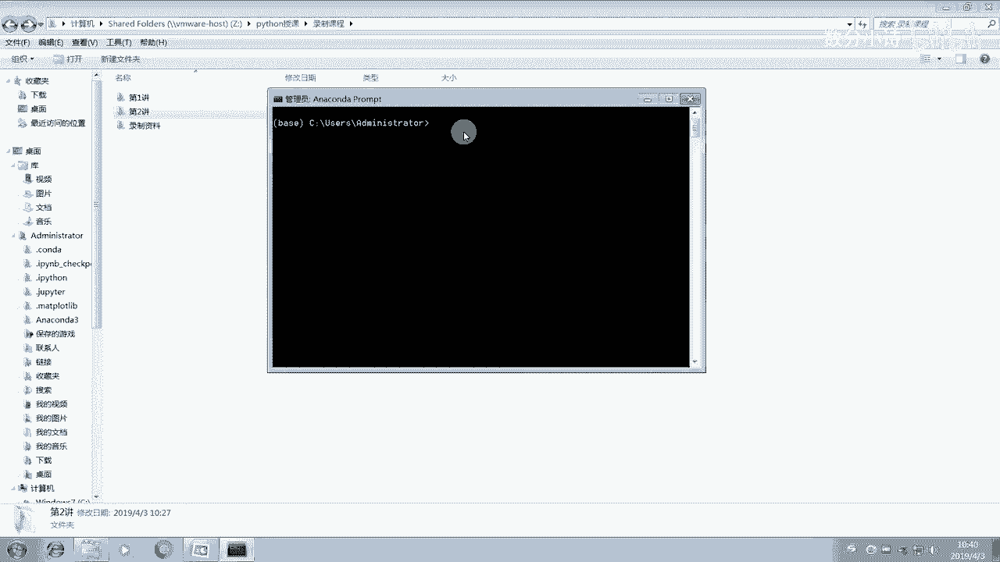

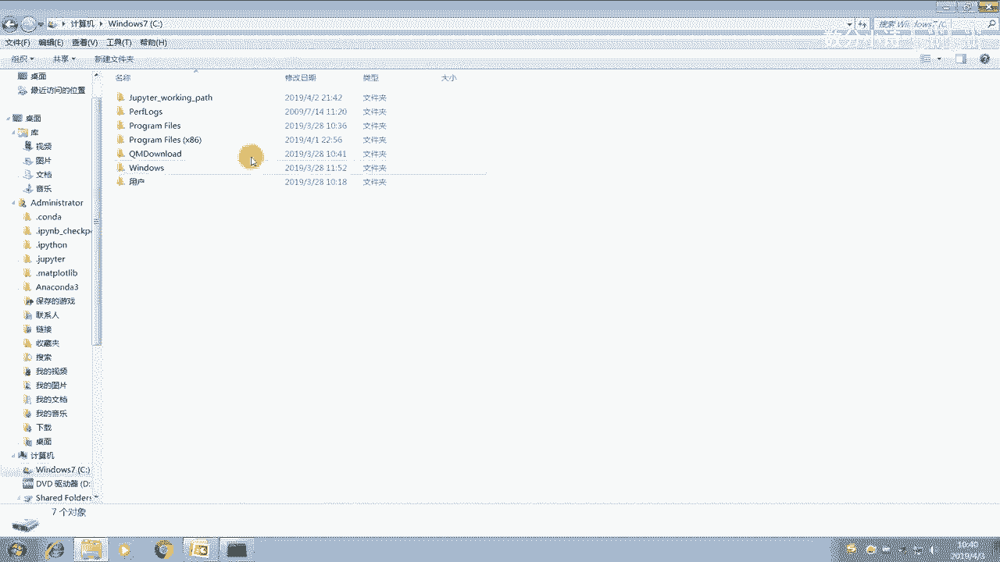

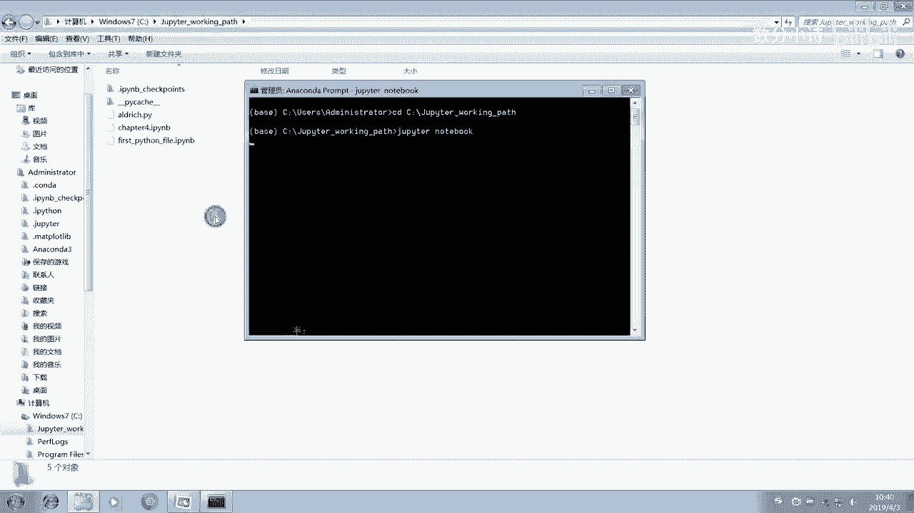

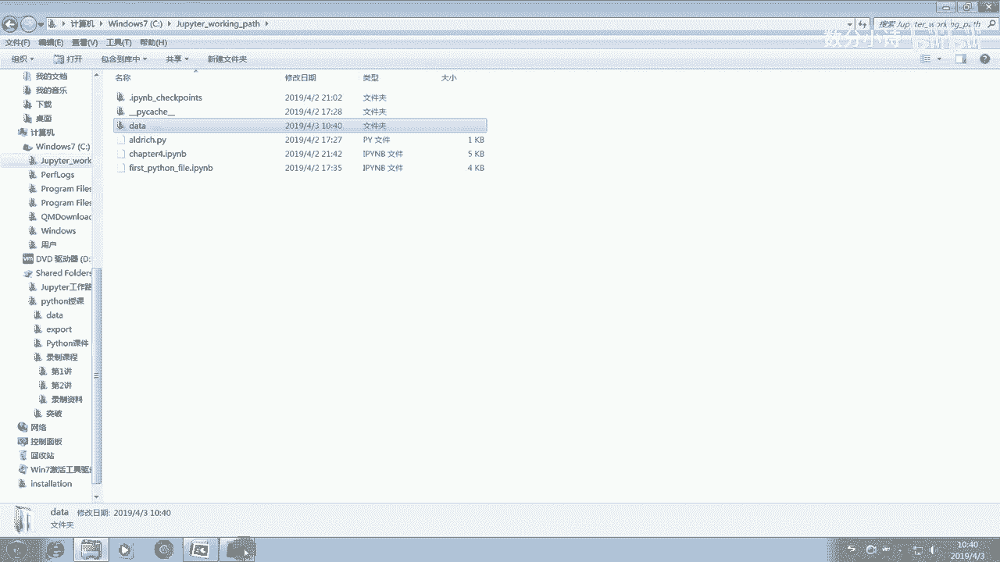

在本节课中，我们将学习Python的进阶知识，重点是文件的读写操作。我们将掌握如何用Python读取和写入TXT文本文件以及Excel电子表格，这是金融数据分析中非常核心的技能。课程最后，我们还会简要介绍类与实例的概念，以及后续将深入学习的三大核心数据分析库。

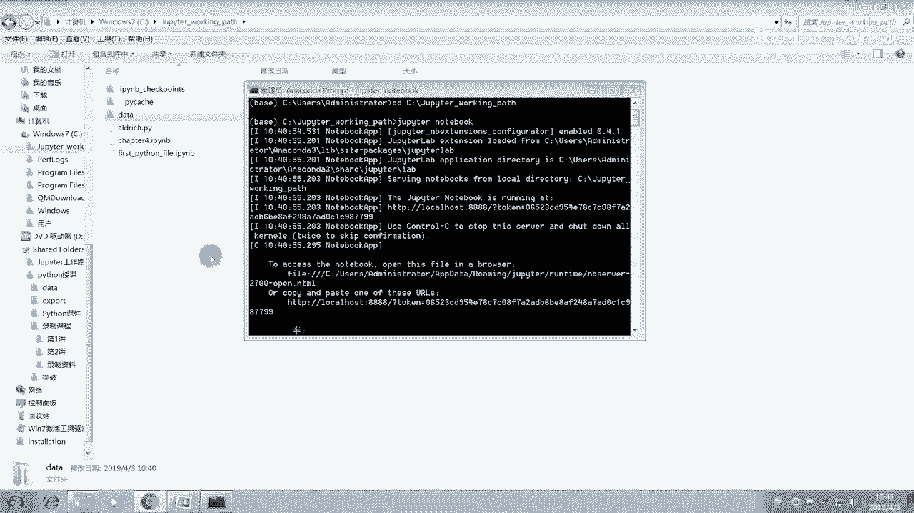


## 文件路径与TXT文件读写 📂


上一节我们介绍了Python的基础语法和数据结构。本节中，我们来看看如何与外部文件进行交互。首先，我们需要理解文件路径的概念。


文件路径是计算机上文件或目录的位置标识。分为绝对路径和相对路径：
*   **绝对路径**：从根目录开始的完整路径，在任何位置都能准确定位文件。
*   **相对路径**：相对于当前工作目录的路径，更简洁。

在Python中，为了确保路径字符串被正确解析，避免转义字符带来的问题，建议在路径字符串前加上 `r` 前缀。

以下是打开TXT文件的两种常用方式：

**方式一：逐行读取**
```python
with open(file_path) as file_handle:
    for line in file_handle:
        # 处理每一行数据
        processed_line = line.strip()  # 去除首尾空白字符
```

**方式二：一次性读取所有行**
```python
with open(file_path) as file_handle:
    lines = file_handle.readlines()  # 返回包含所有行的列表
    for line in lines:
        # 处理每一行数据
```

在第一种方式中，`with open(...) as ...` 语句会打开文件并创建一个文件句柄（`file_handle`）对象。`for line in file_handle` 会逐行迭代文件内容。`line.strip()` 方法用于移除每行末尾的换行符等空白字符。

## 写入TXT文件 ✍️

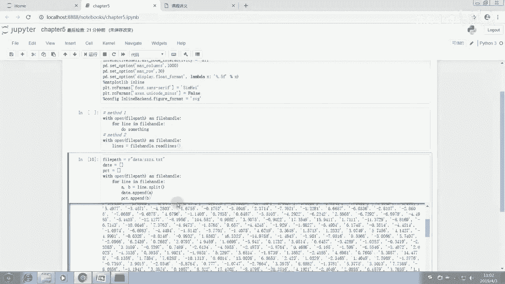


学会了读取文件，接下来我们看看如何将数据写入TXT文件。写入操作主要涉及两种模式：

**`‘w‘` 模式（写入）**：会创建新文件，如果文件已存在则覆盖原有内容。
**`‘a‘` 模式（追加）**：在文件末尾追加新内容，不会覆盖原有数据。

以下是写入操作的示例：

```python
# 1. 写入新文件（覆盖模式）
file_name = ‘first_file_to_write.txt‘
with open(file_name, ‘w‘) as fh:
    fh.write(‘I love programming.\n‘)  # ‘\n‘ 表示换行

# 2. 向现有文件追加内容
with open(file_name, ‘a‘) as fh:
    fh.write(‘I want to be a good programmer.\n‘)
    fh.write(‘I want to be an excellent financial analyst.\n‘)
```

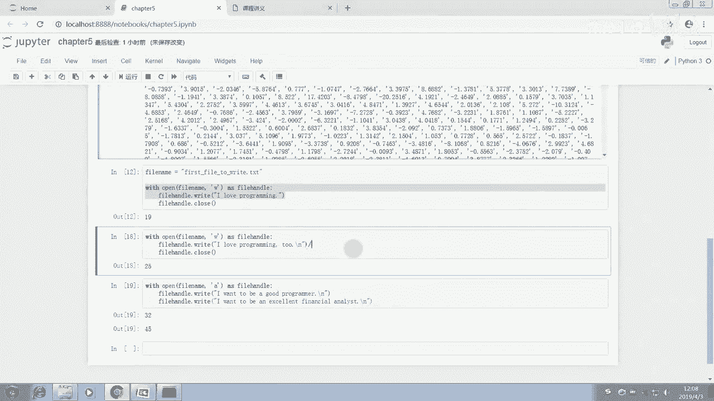


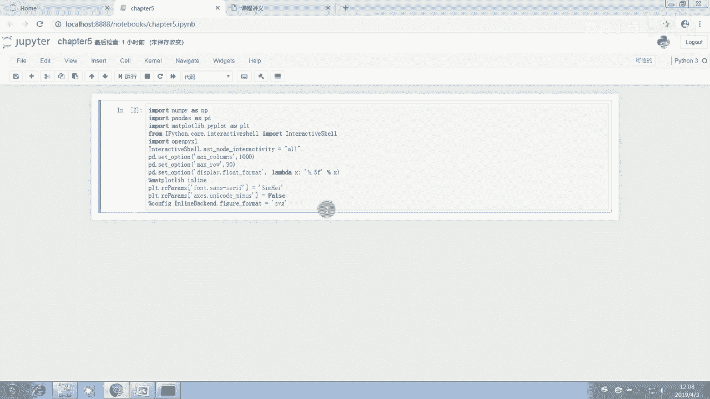


## Excel文件操作 📊

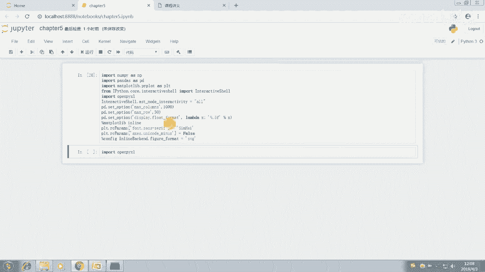


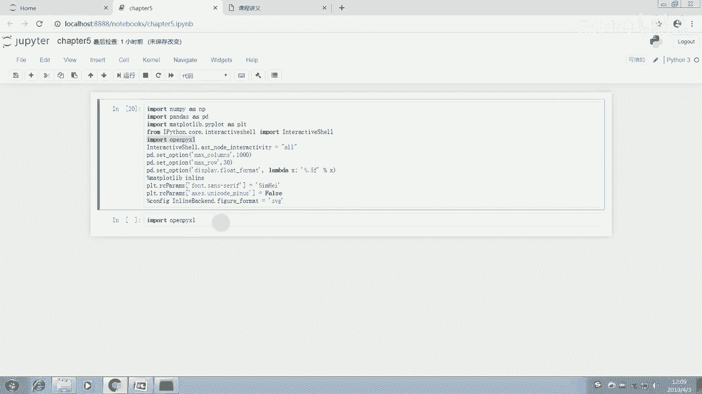


在金融工作中，Excel文件的使用极为频繁。Python可以通过 `openpyxl` 库来读写 `.xlsx` 格式的Excel文件。

首先需要导入模块：
```python
import openpyxl
```

以下是使用 `openpyxl` 的基本操作流程：

**1. 创建新的Excel工作簿并写入数据**
```python
# 创建新工作簿
wb = openpyxl.Workbook()
# 获取当前活动的工作表
ws = wb.active
# 重命名工作表
ws.title = ‘NewTitle‘
# 向单元格写入数据
ws[‘A4‘] = 4
# 保存工作簿
wb.save(‘first_excel_with_python.xlsx‘)
wb.close()
```

**2. 读取已存在的Excel文件并处理数据**
更常见的情况是读取已有的数据文件进行分析。以下是一个实战案例：我们有一个包含股票代码、名称、行业和净利润的Excel表，需要按行业汇总净利润。

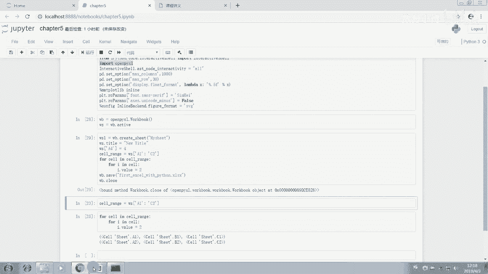


```python
# 加载已存在的工作簿
wb = openpyxl.load_workbook(‘data/test.xlsx‘)
# 获取指定工作表
ws = wb[‘profit‘]

# 使用字典按行业累加净利润
industry_profit_dict = {}
for row in ws.iter_rows(min_row=2, max_col=5, values_only=True):
    industry = row[3]  # 行业列
    profit = row[4]    # 净利润列
    # get方法：如果键存在则返回值，否则返回0
    industry_profit_dict[industry] = industry_profit_dict.get(industry, 0) + profit

# 将汇总结果写回Excel的指定列
for cells in ws[‘H1‘:f‘I{ws.max_row}‘]:
    industry_cell = cells[0]  # H列，行业
    profit_cell = cells[1]    # I列，待填充的利润
    industry_name = industry_cell.value
    if industry_name in industry_profit_dict:
        profit_cell.value = industry_profit_dict[industry_name]

# 保存修改后的文件
wb.save(‘test_finished.xlsx‘)
wb.close()
```

**3. 批量重命名工作表**
`openpyxl` 还能方便地进行批量操作，例如重命名一个工作簿中的所有工作表。

```python
wb = openpyxl.load_workbook(‘data/PE_data_original.xlsx‘)
sheet_names = wb.sheetnames

for i in range(len(sheet_names)):
    ws = wb.worksheets[i]  # 获取第i个工作表对象
    ws.title = f‘A{i}‘     # 重命名为 A0, A1, A2...

wb.save(‘PE_revised.xlsx‘)
wb.close()
```

## 金融分析实战：统计连续上涨周数 📈

让我们结合文件读写和数据处理，完成一个金融分析小任务：统计上证指数历史上连续上涨（周涨幅为正）的周数及其结束日期。

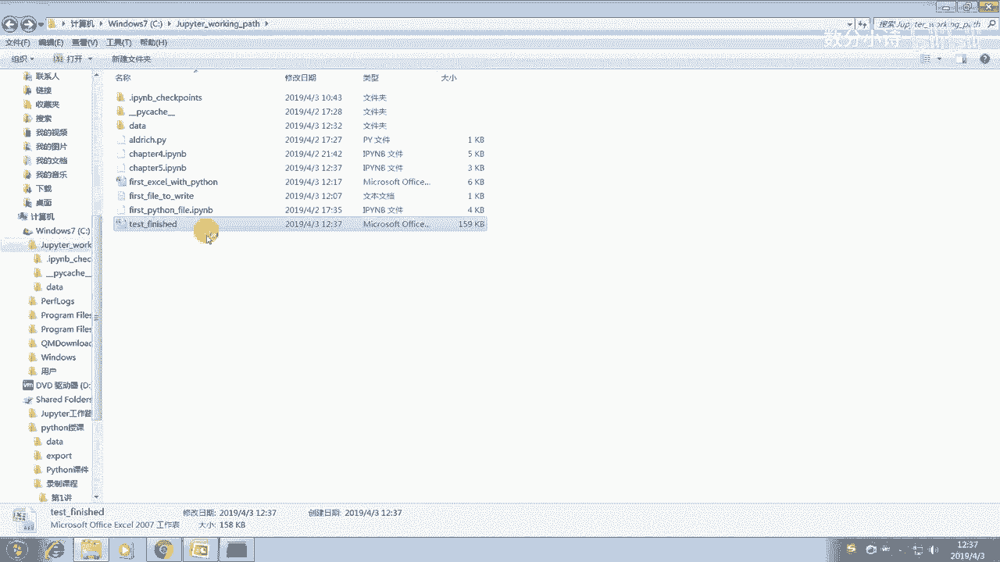


思路如下：
1.  **读取数据**：从TXT文件中读取历史周涨跌幅数据。
2.  **数据清洗**：将字符串格式的涨跌幅转换为浮点数。
3.  **逻辑判断**：遍历数据，使用计数器统计连续为正的周数。
4.  **记录结果**：当涨跌幅转负时，记录之前的连续周数和结束日期。
5.  **输出结果**：将统计结果写入新的TXT文件。


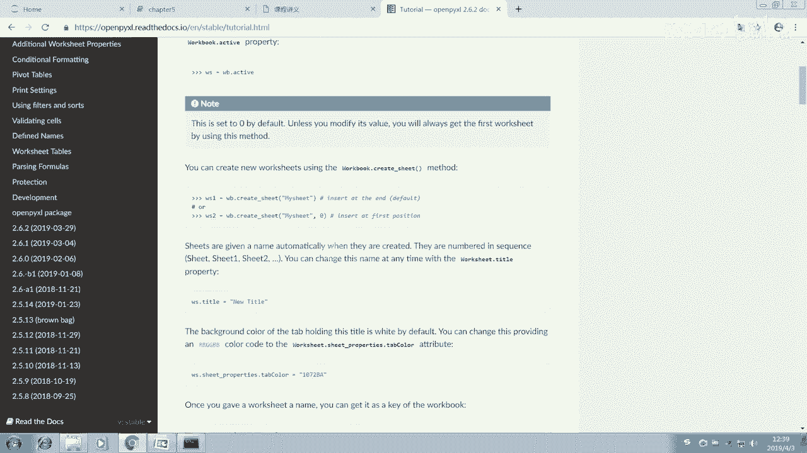

核心实现代码如下：

```python
# 1. 读取数据
date_list, pct_list = [], []
with open(r‘data/SZZS.txt‘) as fh:
    for line in fh:
        date, pct = line.strip().split()
        date_list.append(date)
        pct_list.append(pct)

# 2. 数据清洗：字符串转浮点数
pct_float_list = [float(i) for i in pct_list]

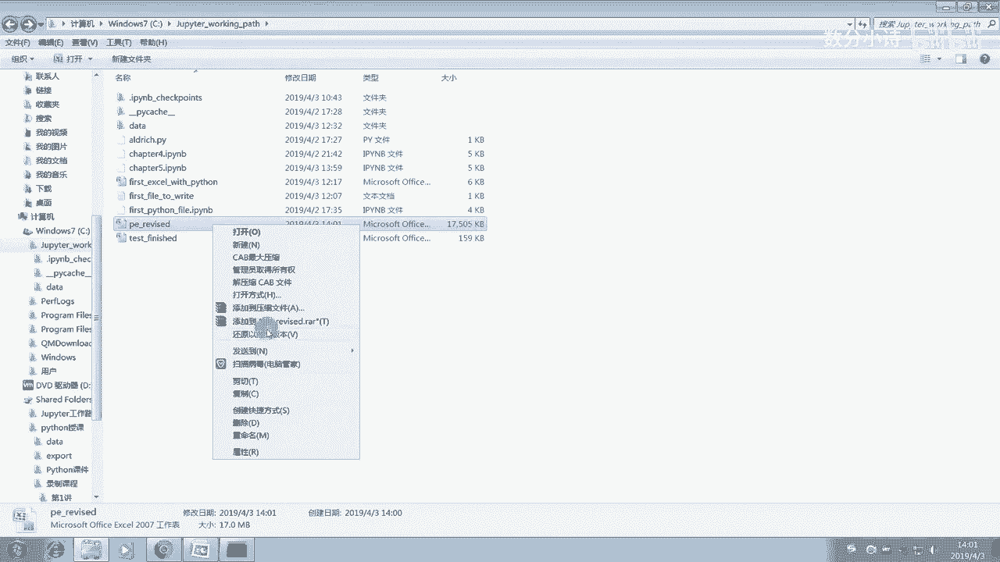


# 3. 创建日期-涨跌幅字典
data_dict = {date_list[i]: pct_float_list[i] for i in range(len(date_list))}

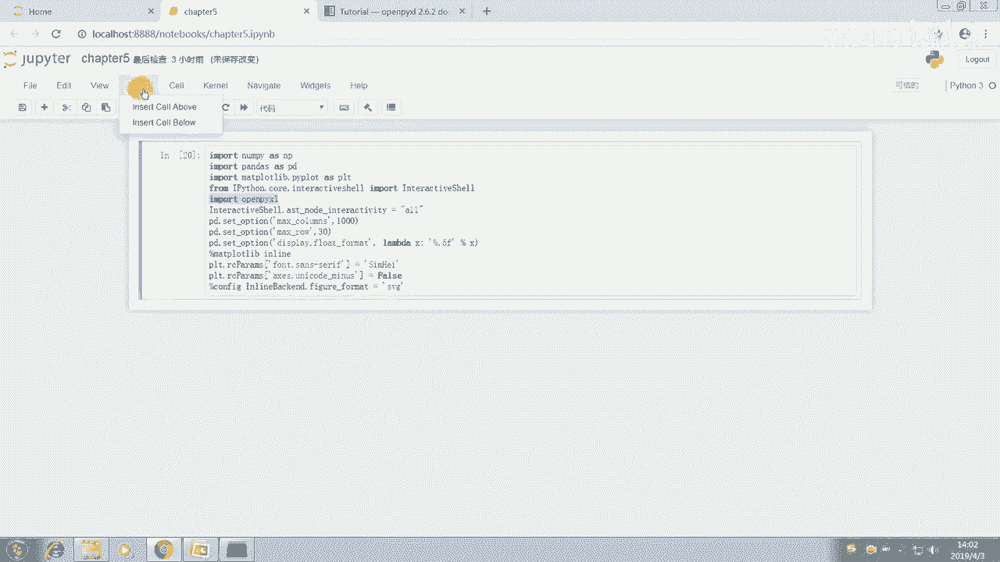

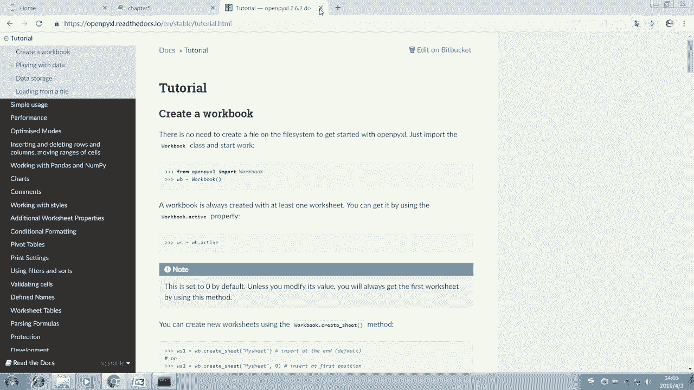

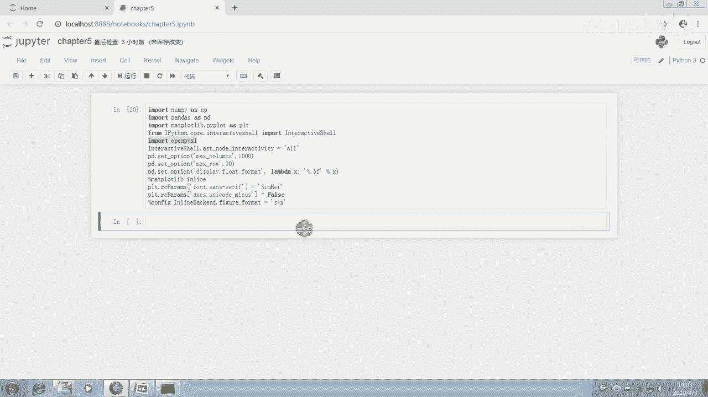


# 4. 统计连续上涨
result_dict = {}
count = 0
temp_date_list = []

for date, pct in data_dict.items():
    if pct > 0:
        count += 1
    else:
        if count >= 1:  # 只记录至少连续上涨1周的情况
            # 将结束日期添加到对应周数的列表中
            result_dict[count] = result_dict.get(count, []) + [date]
        count = 0  # 重置计数器

# 5. 输出结果到文件
with open(‘上证指数连涨统计数据.txt‘, ‘w‘) as fh:
    for weeks, dates in result_dict.items():
        if weeks >= 6:  # 只输出连续上涨6周及以上的情况
            fh.write(f‘连涨{weeks}周的情况，终结日期有：{dates}\n‘)
```

## 类与实例简介 🧩

面向对象编程是组织代码的有效方式。**类** 是对一类具有共同属性和行为的对象的抽象描述，而 **实例** 是根据类创建的具体对象。

定义一个简单的 `Dog` 类：
```python
class Dog:
    """一次模拟小狗的简单尝试"""
    def __init__(self, name, age):
        """初始化属性name和age"""
        self.name = name
        self.age = age

    def sit(self):
        """模拟小狗收到命令时蹲下"""
        print(f‘{self.name} is now sitting.‘)

    def roll_over(self):
        """模拟小狗收到命令时打滚"""
        print(f‘{self.name} rolled over!‘)
```

创建类的实例并调用方法：
```python
my_dog = Dog(‘Willie‘, 6)
print(f‘My dog‘s name is {my_dog.name}.‘)
print(f‘My dog is {my_dog.age} years old.‘)
my_dog.sit()
my_dog.roll_over()
```

在金融数据分析的初级阶段，理解基础的类概念即可，更复杂的面向对象设计可以在后续深入。

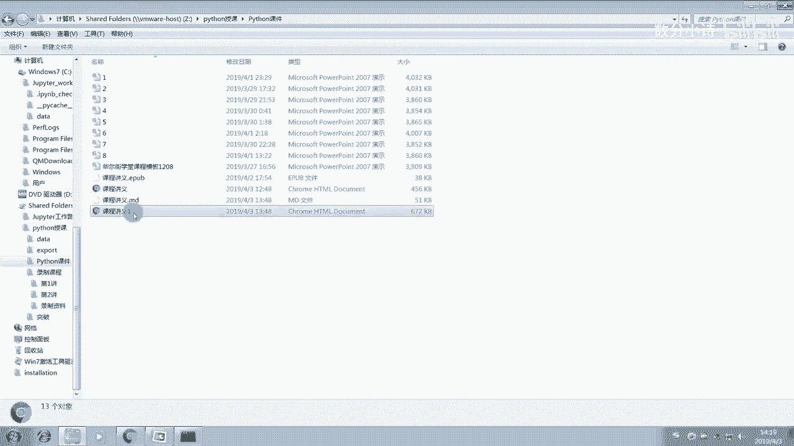


## 常用模块预览 🔧

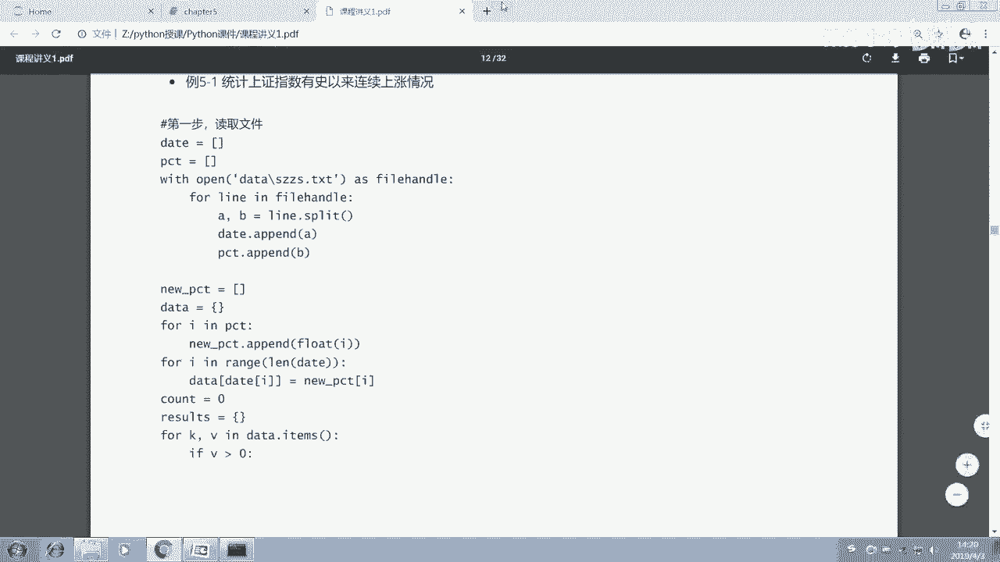

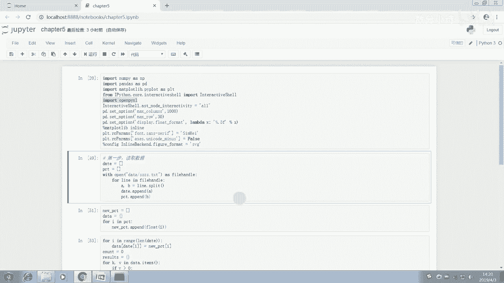

在接下来的课程中，我们将重点学习金融数据分析的三大核心库：

1.  **NumPy**：提供强大的多维数组对象和数学函数，是科学计算的基础。
    *   导入方式：`import numpy as np`
2.  **pandas**：构建于NumPy之上，提供高效易用的数据结构和数据分析工具（如Series和DataFrame），是数据处理的核心。
    *   导入方式：`import pandas as pd`
3.  **Matplotlib**：Python中最著名的绘图库，可以创建高质量的二维图表。
    *   导入方式：`import matplotlib.pyplot as plt`

## 总结 🎯

本节课中我们一起学习了Python文件操作的核心技能。我们掌握了如何读写TXT和Excel文件，并完成了从数据读取、清洗、分析到结果输出的完整流程。我们还初步了解了面向对象编程中类与实例的概念，并预览了后续即将深入学习的NumPy、pandas和Matplotlib这三大数据分析利器。


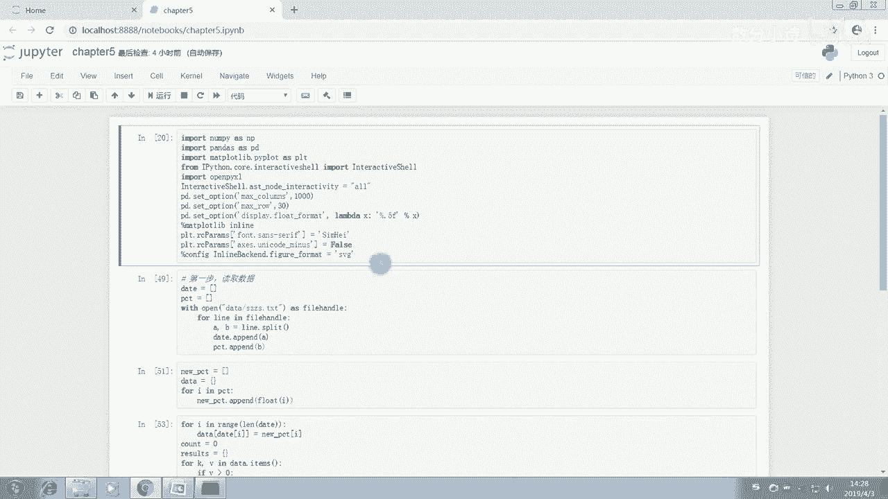

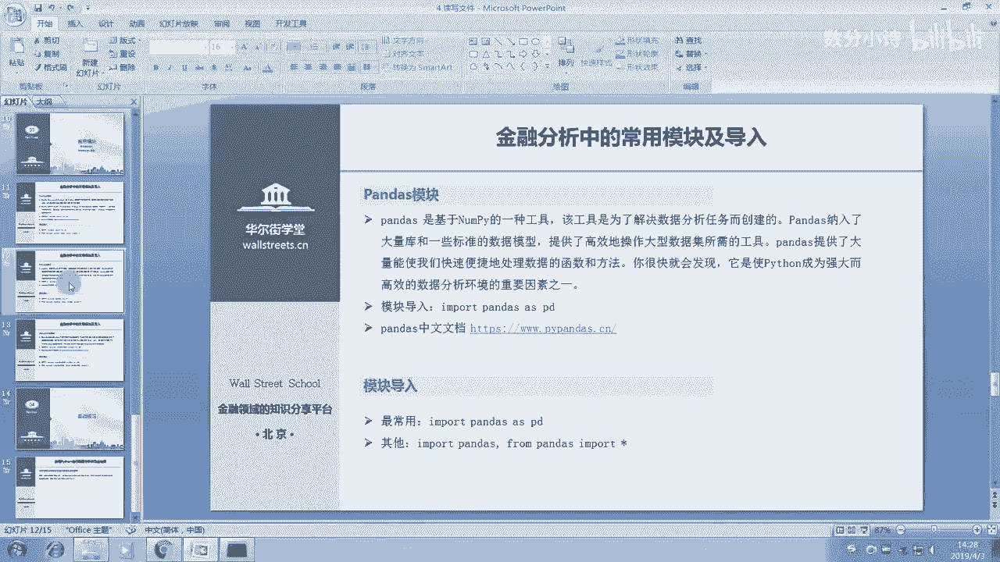

文件操作是连接Python与外部数据的桥梁，是自动化金融分析工作的第一步。请大家务必动手练习课程中的每一个示例，将提供的示例数据放入自己的工作目录并运行代码，在实践中巩固知识。