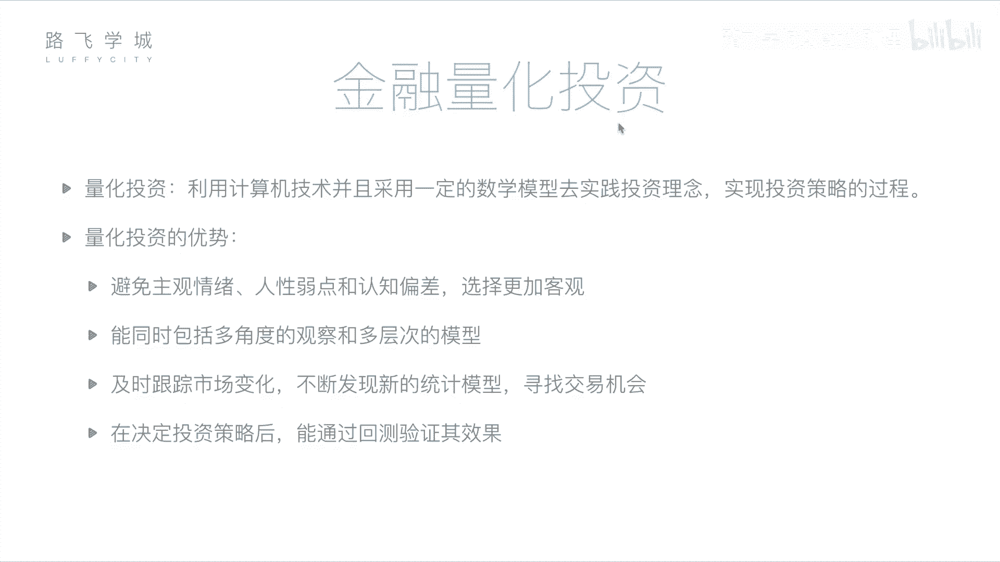
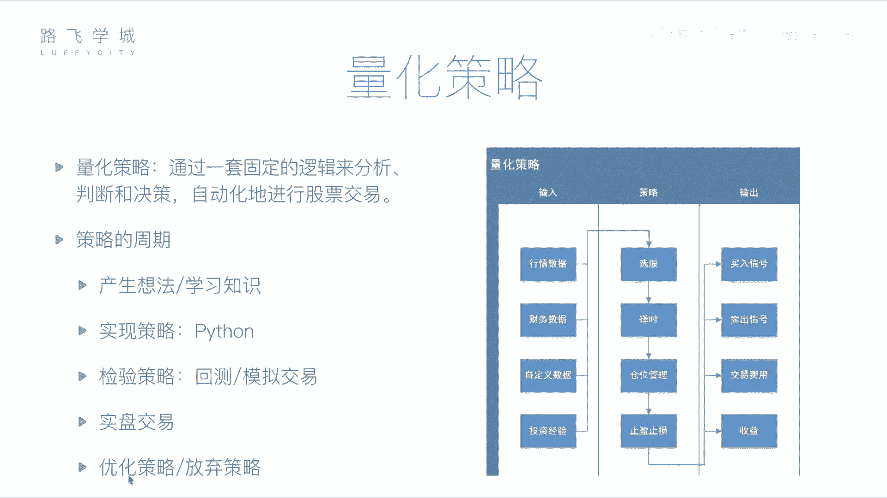

# 金融量化分析：P6：06 金融量化投资介绍 💹

## 概述
在本节课中，我们将要学习金融量化投资的核心概念。我们将了解什么是量化投资，它与传统人工分析的区别，以及一个量化策略是如何构建和运行的。通过本课，你将掌握量化投资的基本框架和关键组成部分。

---

## 从金融分析到量化投资
上一节我们介绍了金融分析的基本面与技术面方法。本节中我们来看看如何将这个过程自动化。

金融分析是通过基本面或技术面对公司或股票做出判断。这个判断过程可以交给计算机来完成。因为无论是基本面分析所需的财务报表，还是技术面分析所需的历史价格与交易记录，都可以被获取。将这些分析过程交由计算机处理，就称为**量化投资**或**量化分析**。

所谓量化投资，是指利用计算机技术，并采用一定的数学模型，去实践投资理念、实现投资策略的过程。它包含三个重要部分：
1.  **计算机技术**：即使用计算机编程的方式。
2.  **数学模型**：即具体的策略或套路，例如均线就是一个数学模型，其公式为 `MA = (P1 + P2 + ... + Pn) / n`。
3.  **实践**：用编写好的计算机程序去执行投资，或预先进行测试以验证策略的可靠性。

---

## 量化投资的优势
量化投资相对于人工投资，主要有以下几点优势：

以下是量化投资的四个主要优势：

1.  **避免主观情绪干扰**：人类投资者容易受到情感、人性弱点和认知偏差的影响。例如，可能因不舍得抛售持续下跌的持仓股票，或因短期波动而恐慌性抛售。量化投资基于预设规则，决策更加客观。
2.  **处理海量信息与复杂模型**：计算机可以同时从多角度、多层次分析大量数据，例如同时监控数千只股票的均线、财报、行业新闻等。其处理速度和广度远超人类。
3.  **及时跟踪与发现机会**：市场每时每刻都在变化。程序可以7x24小时不间断监控，一旦满足交易条件便能瞬时执行，反应远比人工盯盘迅速。同时，也更容易尝试和集成新的交易策略或机器学习模型。
4.  **通过回测验证策略**：在实盘交易前，可以利用历史数据检验策略的有效性。这个过程称为**回测**。例如，可以设定策略，用2012年至2017年的数据模拟交易，观察其盈亏情况。通过多次回测和调整，能在相当程度上验证策略的可靠性，再应用于实盘。

---

## 量化策略的核心构成
量化交易的核心是**量化策略**，即具体的交易“套路”。一个完整的策略主要包括输入、处理逻辑和输出三部分。

### 策略输入：数据来源
策略程序需要数据来进行分析。主要的数据输入包括：

以下是量化策略常见的几种数据输入：

*   **行情数据**：股票历史交易数据，如每日的开盘价、收盘价、最高价、最低价、成交量等。
*   **财务数据**：上市公司的财务报表数据，如利润表、资产负债表、现金流量表。
*   **自定义数据**：投资者根据需要加入的其他数据，例如通过自然语言处理分析的新闻舆情数据、另类数据（如“玄学”指标），或个人总结的投资经验规则。

### 策略处理：四大功能
策略程序基于输入的数据，主要执行以下四类任务：

以下是量化策略处理的四个核心环节：

1.  **选股**：从全市场数千只股票中，筛选出符合特定条件的股票池。例如，筛选出市盈率低于20且近期成交量放大的股票。
2.  **择时**：决定买卖的具体时机。目标是追求“低买高卖”，判断何时是买入或卖出的最佳时点。
3.  **仓位管理**：决定资金在不同股票之间的分配比例。对于看涨概率更高的股票，可以分配更多资金。
4.  **止盈止损**：必要的风险控制手段。
    *   **止损**：当股价下跌达到预设幅度（如-10%）时自动卖出，以控制亏损。
    *   **止盈**：当股价上涨达到预设幅度（如+30%）时自动卖出，以锁定利润，避免回落。

### 策略输出：决策与结果
策略运行后，会产生相应的输出：

以下是量化策略的主要输出内容：

*   **交易信号**：策略生成的直接指令，如“买入”或“卖出”信号。这可以提示给投资者，或直接通过API接口发送给券商系统执行自动交易。
*   **交易费用与收益**：计算本次或周期内交易产生的佣金、手续费等成本，以及最终的盈亏金额和各项收益率指标。

---

## 量化策略的开发周期
一个量化策略从构思到应用，通常会经历一个完整的生命周期。

以下是量化策略从开发到应用的典型周期：

1.  **产生想法**：基于投资经验、新学的指标或灵感，形成初步的交易思路。
2.  **编程实现**：使用编程语言（如Python）将想法转化为可执行的计算机程序。
3.  **回测检验**：使用历史数据运行策略，检验其在过去一段时间内的表现。
4.  **模拟交易**：使用当前开始的实时市场数据运行策略，但不动用真实资金，以观察其在近期市场环境下的表现。
5.  **实盘交易/优化迭代**：如果回测和模拟交易结果令人满意，则可将策略投入实盘运行。在此过程中，仍需持续监控，并根据表现对策略进行优化调整，或决定是否放弃该策略。

---

## 总结
本节课中我们一起学习了金融量化投资的基础知识。我们明确了量化投资是利用计算机技术和数学模型进行自动决策的过程，并了解了其避免情绪干扰、处理高效、可回测验证等优势。我们深入剖析了量化策略的三大构成：数据输入、处理逻辑（选股、择时、仓位管理、止盈止损）和结果输出。最后，我们梳理了策略从构思、编程、回测到实盘应用的完整开发周期。

接下来，我们将开始学习如何使用Python这一强大工具来具体实现量化交易策略。在正式进入编程之前，我们需要先了解几个关键的数据分析模块。