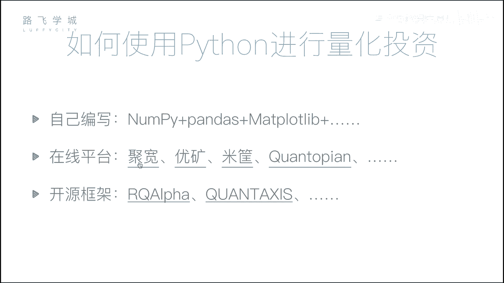
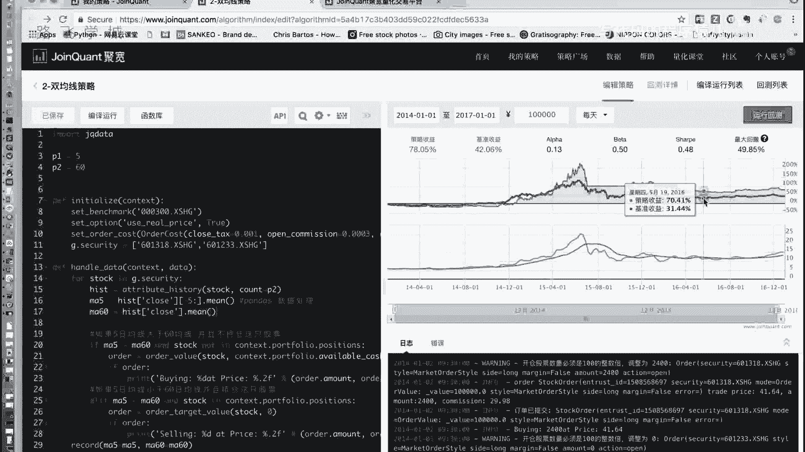
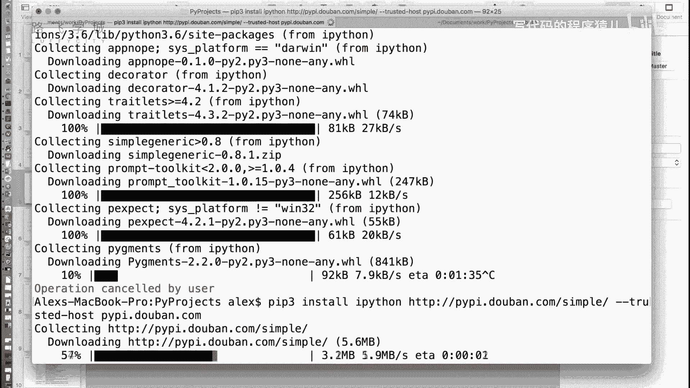
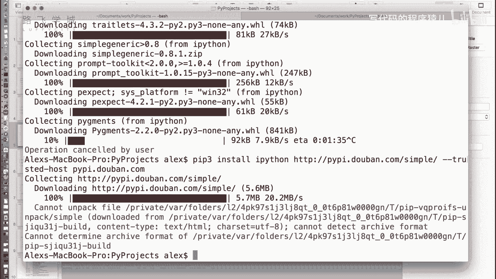
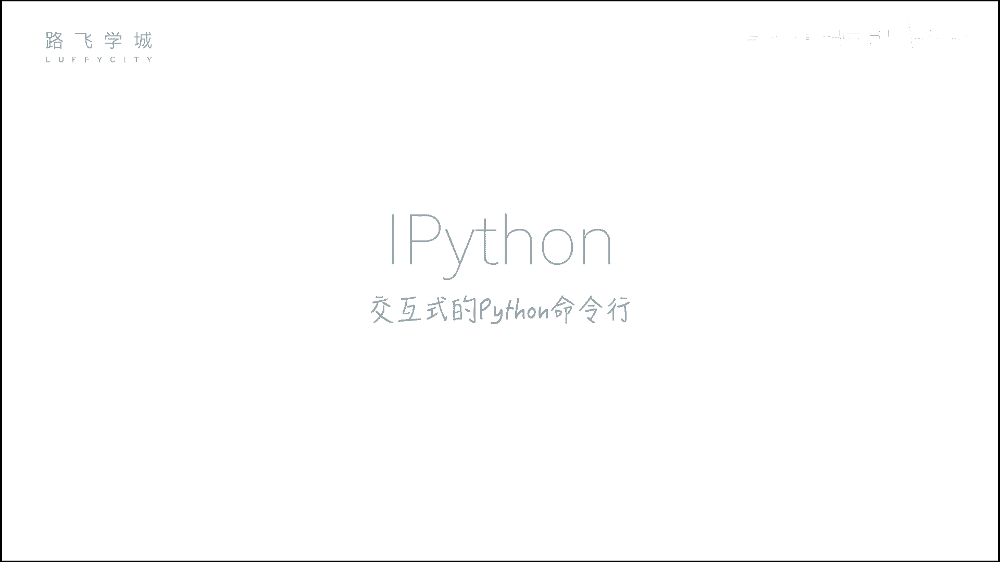
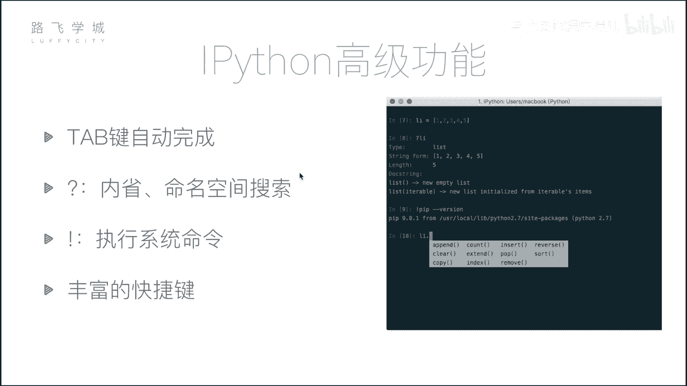
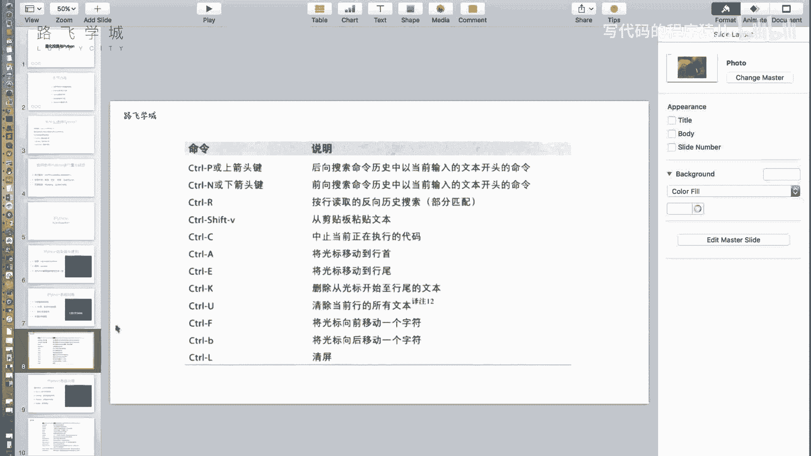

# Python金融量化：P6：量化投资与Python及IPython初识

在本节课中，我们将要学习量化投资的基本概念，了解为何选择Python作为量化投资的工具，并初步认识一个强大的交互式Python环境——IPython。

## 量化投资与Python

上一节我们介绍了量化投资的基本概念。本节中我们来看看如何用Python实现量化投资，以及为何Python是众多工具中的优选。

量化投资本质上是分析数据以得出决策的过程。Python因其强大的数据处理能力和丰富的生态系统，成为量化投资领域的首选语言。

除了Python，市场上也存在其他可用于数据分析的工具。以下是几种常见的选择：



*   **Excel**：无需编程，主要用于手工数据处理。
*   **SAS/SPSS**：专业的统计分析软件，功能强大但同样无需编程。
*   **R语言**：一门专注于统计分析和数据可视化的编程语言，但在量化投资领域的应用广度不及Python。

Python的优势在于其通用性。学习一门语言，即可应用于数据分析、Web开发、自动化脚本等多个领域，实现“一专多能”。



## Python数据分析核心模块

量化投资的核心是数据处理与分析。Python通过几个核心库为此提供了强大支持。以下是三个我们将重点学习的模块：

*   **NumPy**：提供高性能的多维数组对象及数组的批量计算功能。核心是 `ndarray` 数组。
    ```python
    import numpy as np
    arr = np.array([1, 2, 3, 4, 5])
    ```
*   **Pandas**：核心数据分析库，提供了灵活高效的 `DataFrame` 数据结构，用于处理表格型数据。
    ```python
    import pandas as pd
    df = pd.DataFrame({'A': [1, 2, 3], 'B': [4, 5, 6]})
    ```
*   **Matplotlib**：主要的数据可视化库，用于将数据绘制成各种静态图表。
    ```python
    import matplotlib.pyplot as plt
    plt.plot([1, 2, 3], [4, 5, 1])
    plt.show()
    ```

## 量化投资的实现方式





学习了上述模块后，我们可以通过以下两种主要方式进行量化投资实践：

1.  **自建量化框架**：我们将带领大家从零开始，使用NumPy、Pandas和Matplotlib，结合下载的股票数据，构建一个简单的量化投资框架，用于策略编写和回测。
2.  **使用在线平台**：市场上存在成熟的量化投资在线平台。用户只需在平台上编写核心策略代码，平台即可自动完成数据获取、回测和结果可视化。

例如，在一个在线平台中，左侧编写策略代码，右侧会生成策略收益曲线等可视化结果。蓝线代表策略随时间变化的收益情况，可以直观地评估策略的盈亏表现。

此外，也存在一些开源的量化投资框架可供学习和使用。





## IPython交互式环境介绍

在深入学习数据分析模块之前，我们先认识一个强大的工具——IPython。它是一个增强的交互式Python命令行，比标准Python命令行功能更丰富。

### 安装IPython

对于已安装Python的用户，可以通过pip命令安装：
```bash
pip install ipython
```
建议使用国内镜像源（如豆瓣源 `https://pypi.douban.com/simple/`）以加速下载：
```bash
pip install ipython -i https://pypi.douban.com/simple/
```
对于新手，推荐直接安装 **Anaconda** 发行版，它集成了IPython、NumPy、Pandas、Matplotlib等我们所需的所有科学计算库。

安装完成后，在命令行输入 `ipython` 即可启动。

### IPython的核心功能

IPython提供了许多提升效率的功能，以下是几个关键特性：

*   **Tab键自动补全**：输入变量或函数的前几个字母后按Tab键，IPython会提供补全建议。如果直接按Tab，则会列出所有可能的选项。
*   **执行系统命令**：在IPython中可以直接执行一些系统命令（如 `ls`, `pwd`）。对于更复杂的命令，需要在命令前加上感叹号 `!`，例如 `!pip list`。
*   **内省与帮助**：使用问号 `?` 可以查看对象的信息。使用双问号 `??` 可以查看函数源代码（如果可用）。
    *   **模糊搜索**：`obj.*pp*?` 会列出对象所有包含“pp”的方法名。
    *   **查看信息**：`obj?` 或 `function?` 会显示对象的类型、文档字符串等信息。
    *   **查看源码**：`function??` 会尝试显示函数的源代码。
*   **丰富的快捷键**：IPython支持许多快捷键来提高编码效率，例如：
    *   `Ctrl + A`：移动光标到行首。
    *   `Ctrl + E`：移动光标到行尾。
    *   `Ctrl + U`：删除从光标到行首的所有内容。
    *   `Ctrl + K`：删除从光标到行尾的所有内容。
    *   `Ctrl + L`：清屏。



本节课中我们一起学习了量化投资与Python的结合，了解了核心的数据分析模块（NumPy, Pandas, Matplotlib），认识了强大的IPython交互式环境及其高效功能。接下来，我们将开始深入第一个核心库NumPy的学习。