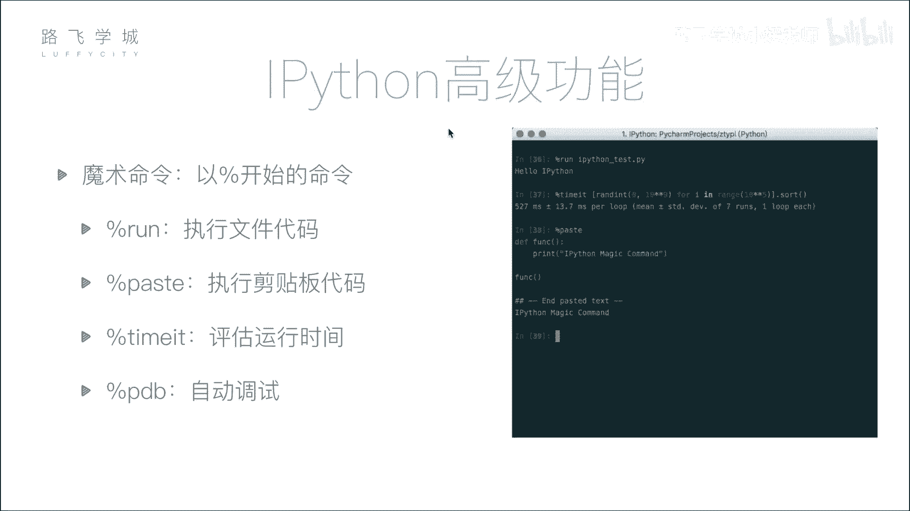
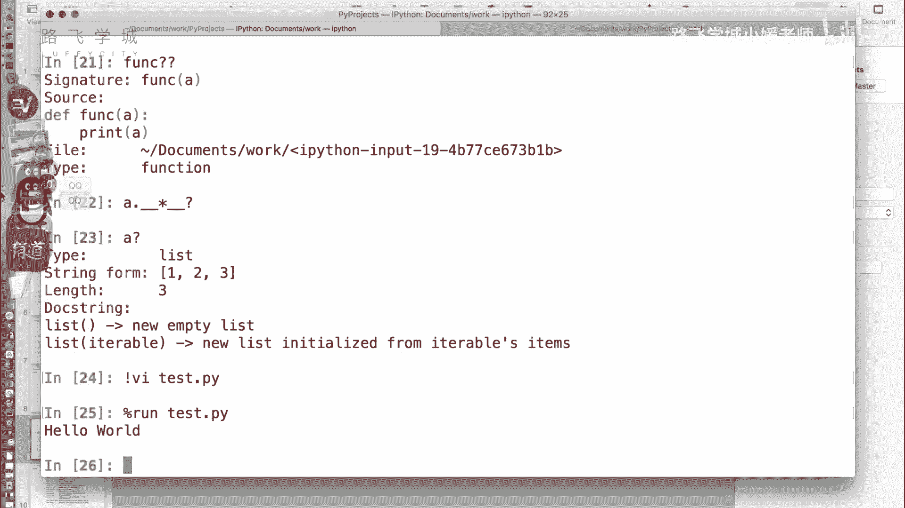
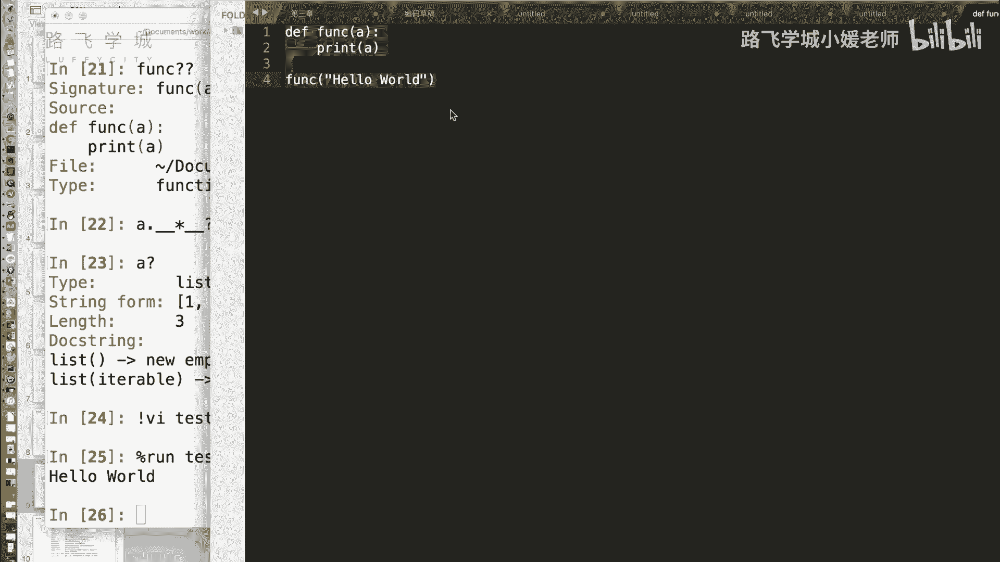
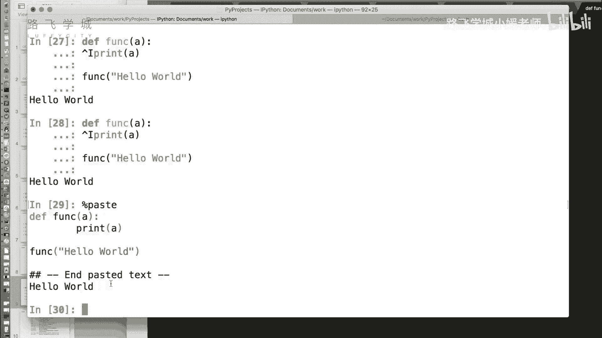
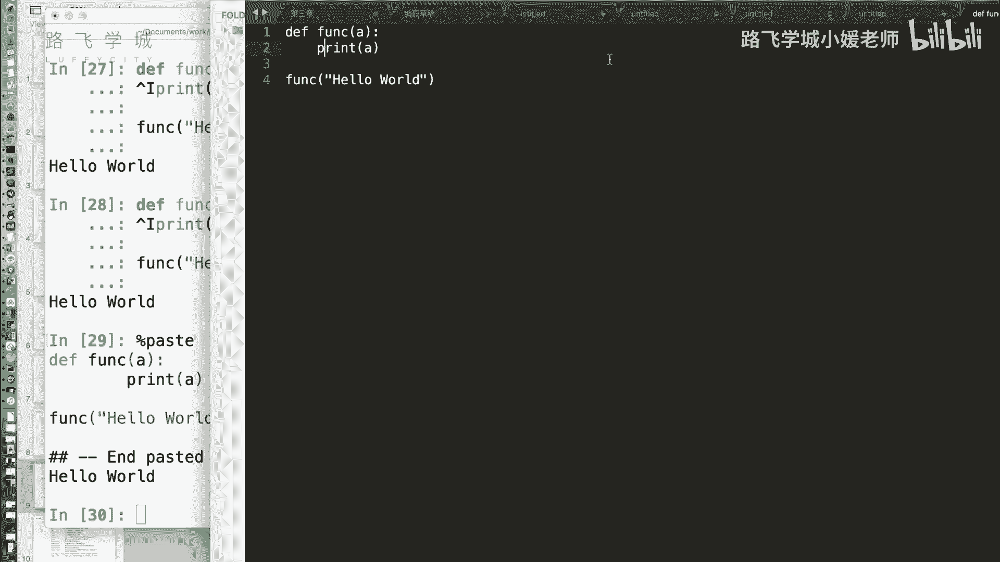
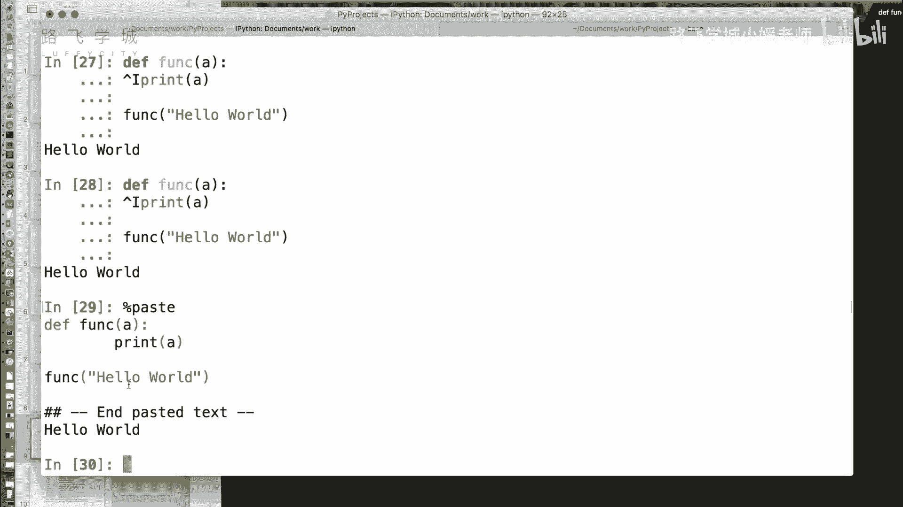
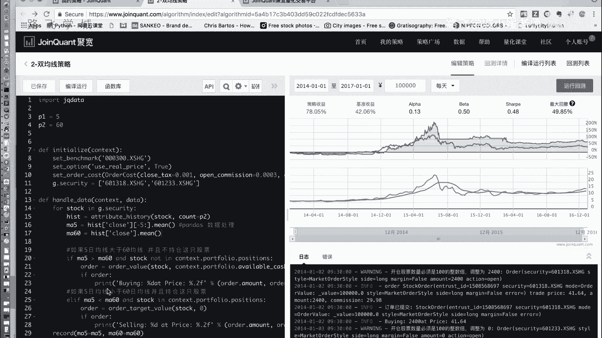
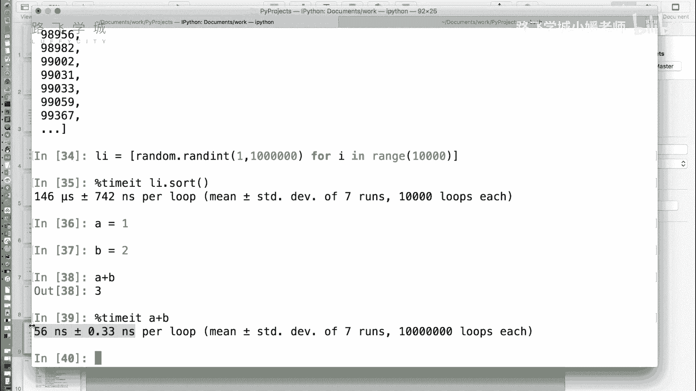

# Python金融量化：P6：08 IPython魔术命令 🪄



在本节课中，我们将学习IPython中一个非常实用且有趣的高级功能——魔术命令。魔术命令以百分号 `%` 开头，能够直接在交互式环境中执行一些特殊操作，例如运行外部脚本、粘贴代码、测量代码执行时间等，极大地提升了数据分析和代码测试的效率。

---

## 运行外部Python脚本

在标准的Python命令行中，若想运行一个外部`.py`文件，通常需要退出交互模式，然后在终端执行 `python filename.py`。在IPython中，我们无需退出，可以直接使用魔术命令 `%run` 来执行脚本。



**命令格式**：
```python
%run 文件名.py
```



例如，假设我们在当前目录下有一个名为 `hello.py` 的脚本，其内容为简单的 `print("Hello World")`。我们可以在IPython中直接输入 `%run hello.py` 来运行它，结果会显示在当前的交互环境中。

---

## 粘贴并执行剪贴板中的代码

有时，我们可能从编辑器或其他地方复制了一段代码，希望直接在IPython中执行测试。虽然可以直接粘贴，但若代码中包含缩进（如Tab键），可能会导致格式错误。为此，IPython提供了 `%paste` 魔术命令。



**命令格式**：
```python
%paste
```



执行 `%paste` 命令后，IPython会先打印出剪贴板中的代码内容，并用分隔符标出，然后自动执行这段代码。这尤其适用于测试较长的代码片段，而无需单独创建文件。





---

## 测量代码执行时间

在性能分析和优化时，我们经常需要测量某段代码或函数的执行时间。虽然可以使用Python的 `time` 模块，但对于执行时间极短的代码，单次测量可能不准确（结果可能为0秒）。IPython的 `%timeit` 魔术命令通过多次运行取平均值的方式，提供了更精确的微基准测试。

**命令格式**：
```python
%timeit 代码语句
```

例如，我们想测量对一个包含1万个随机数的列表进行排序所需的时间：
```python
import random
lst = [random.random() for _ in range(10000)]

%timeit sorted(lst)
```
`%timeit` 会自动决定运行的次数（例如，运行7轮，每轮循环100万次），最终输出平均执行时间及其标准差（例如，“146 µs ± 742 ns per loop”）。这对于优化频繁调用的、耗时较短的代码块非常有帮助。

---

## 总结

本节课我们一起学习了IPython中三个核心的魔术命令：
1.  **`%run`**：用于在交互环境中直接运行外部Python脚本。
2.  **`%paste`**：用于安全地粘贴并执行剪贴板中的代码，避免格式错误。
3.  **`%timeit`**：用于精确测量短小代码片的执行时间，是代码性能分析的利器。



掌握这些魔术命令，能让你在金融量化分析、数据清洗和探索过程中更加高效便捷。下一节，我们将继续探索IPython的其他强大功能。