# Python金融量化：P7：01 使用Numpy数组实现金融数据高效计算 🚀


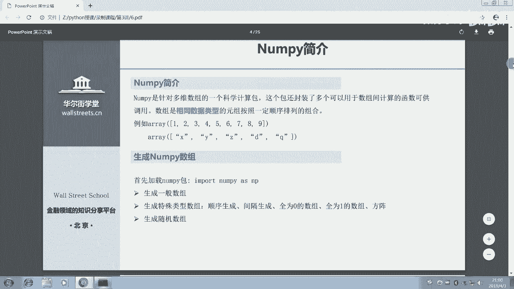

在本节课中，我们将学习如何使用Python的Numpy库进行高效的金融数据计算。Numpy是Python科学计算的核心库，特别擅长处理多维数组和矩阵运算，其速度远超Python原生列表，是金融数据分析、量化交易等领域不可或缺的工具。我们将从Numpy数组的基础创建开始，逐步学习其属性、数据选取、预处理、重塑以及各种数学运算。


## Numpy数组介绍 📊


上一节我们概述了本课程的目标。本节中，我们来看看Numpy的基本概念。

Numpy是Python语言的一个扩展程序库，它支持大量的维度数组与矩阵运算，并为数组运算提供了大量的数学函数库。Numpy是一个运算速度非常快的数学库，在Python中主要用它来进行数组计算。

在金融领域，Numpy通常与SciPy和Matplotlib一起使用，这种组合被广泛用于替代MATLAB，构成了一个强大的科学计算环境，有助于我们通过Python学习数据科学和机器学习。

Numpy是一个针对多维数组的科学计算包，其中包含许多可调用的科学计算函数。数组是**相同数据类型**的元素按照一定顺序排列的组合。

## 生成Numpy数组 🛠️

了解了Numpy的基本概念后，我们来看看如何创建Numpy数组。生成数组是使用Numpy的第一步。

首先，我们需要导入Numpy库，并通常将其重命名为`np`。
```python
import numpy as np
```

以下是生成Numpy数组的几种常用方法：

*   **使用`np.array()`直接创建**：这是最基础的创建方法。
    ```python
    arr1 = np.array([0, 1, 2, 3, 4, 5, 6])
    ```


*   **使用`np.arange()`生成序列数组**：类似于Python的`range()`函数，但直接生成数组。
    ```python
    arr3 = np.arange(10) # 生成0到9的数组
    arr4 = np.arange(1, 20, 2) # 从1开始，到20结束（不含20），步长为2
    ```


*   **生成特殊数组**：
    ```python
    # 生成全1数组
    ones_arr = np.ones(3)
    ones_matrix = np.ones((3, 2)) # 生成3行2列的全1数组
    # 生成单位矩阵
    eye_matrix = np.eye(3)
    ```

*   **生成随机数组**：这在模拟和测试中非常有用。
    ```python
    # 生成0到1之间的随机数
    rand_arr = np.random.rand(3)
    rand_matrix = np.random.rand(2, 3) # 2行3列的随机矩阵
    # 生成标准正态分布随机数
    normal_arr = np.random.randn(3)
    # 在指定范围内生成随机整数
    randint_arr = np.random.randint(0, 100, 10)
    # 从已有数组中随机抽样
    sample_arr = np.random.choice(randint_arr, 5)
    # 随机打乱数组顺序
    np.random.shuffle(arr1)
    ```

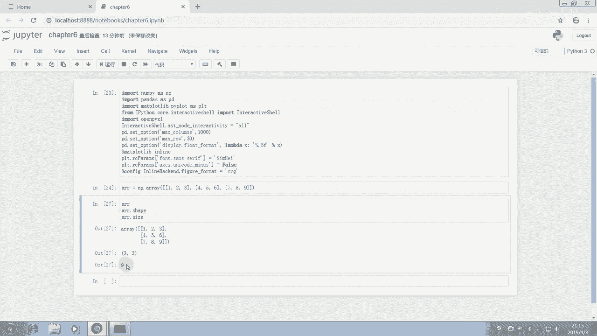

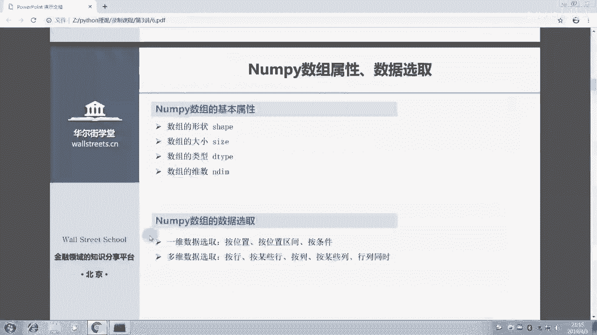

## Numpy数组的属性和数据选取 🔍

我们已经学会了如何创建数组，接下来需要了解如何查看和操作数组中的数据。

Numpy数组有一些基本属性，用于描述其形状、大小和类型。

```python
arr = np.array([[1, 2, 3], [4, 5, 6], [7, 8, 9]])
# 查看形状（几行几列）
shape = arr.shape # 输出：(3, 3)
# 查看元素总数
size = arr.size # 输出：9
# 查看数据类型
dtype = arr.dtype # 输出：dtype(‘int32‘)
# 查看数组维度
ndim = arr.ndim # 输出：2
```

数据选取是数据分析中的核心操作。以下是Numpy数组数据选取的方法：

*   **索引和切片**：与Python列表类似。
    ```python
    arr = np.arange(10)
    print(arr[3]) # 获取索引为3的元素
    print(arr[3:9]) # 切片，获取索引3到8的元素
    print(arr[2:-2]) # 获取索引2到-2（倒数第二个）的元素
    ```

*   **条件选取**：这是Numpy强大且高效的功能。
    ```python
    print(arr[arr > 3]) # 选取所有大于3的元素
    print(arr[(arr > 7) & (arr < 12)]) # 多条件选取
    ```

*   **多维数组选取**：遵循“由外向内，层层索引”的原则。
    ```python
    arr_2d = np.array([[1, 2, 3], [4, 5, 6], [7, 8, 9]])
    print(arr_2d[0]) # 选取第一行
    print(arr_2d[1, 1]) # 选取第二行第二列的元素
    print(arr_2d[:, 0:2]) # 选取所有行的前两列
    print(arr_2d[0:2, 1:]) # 选取前两行，从第二列开始的所有列
    ```

## 数据预处理与重塑 🧹

在实际分析中，原始数据往往需要经过清洗和整理。本节我们学习Numpy中常用的数据预处理和数组重塑方法。


数据预处理主要包括类型转换、缺失值处理和去重。

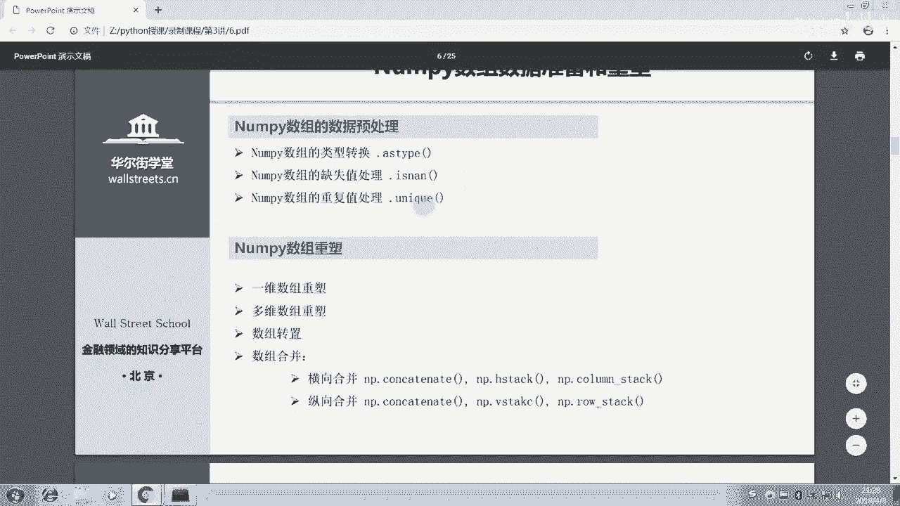

```python
# 1. 数据类型转换
arr_int = np.arange(5) # dtype: int32
arr_float = arr_int.astype(np.float64) # 转换为浮点型

# 2. 缺失值处理
arr_with_nan = np.array([1, 2, np.nan, 4])
# 查找缺失值
mask = np.isnan(arr_with_nan)
print(mask) # 输出：[False False True False]
# 替换缺失值（例如替换为0）
arr_with_nan[mask] = 0

# 3. 去除重复值
arr_dup = np.array([2, 1, 3, 1, 4, 2])
arr_unique = np.unique(arr_dup)
```

数组重塑是指改变数组的形状而不改变其数据。

```python
arr = np.arange(8) # 一维数组，形状为(8,)
# 重塑为2行4列
arr_reshaped = arr.reshape((2, 4))
# 重塑为4行2列
arr_reshaped2 = arr.reshape((4, 2))
# 注意：reshape不改变原数组，而是返回新数组
```

对于多维数组，只要总元素数不变，可以重塑为任意形状。


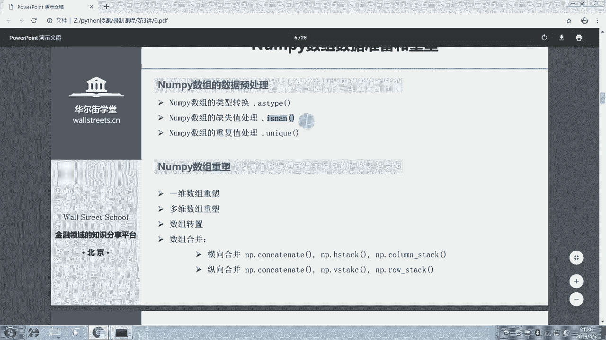

```python
arr_2d = np.array([[1,2,3,4], [5,6,7,8], [9,10,11,12]])
print(arr_2d.shape) # (3, 4)
# 重塑为4行3列
new_arr = arr_2d.reshape((4, 3))
# 重塑为一维数组
flat_arr = arr_2d.reshape(12)
# 转置数组（行变列，列变行）
transposed = arr_2d.T
```

## Numpy数组的计算与合并 ➕

数组创建和整理好后，就可以进行各种计算了。Numpy支持高效的数组运算。

数组计算主要分为两类：

1.  **数组与数字的运算**：对数组中每个元素进行相同操作。
    ```python
    arr = np.array([[1,2], [3,4]])
    print(arr + 1) # 每个元素加1
    print(arr * 2) # 每个元素乘2
    print(arr ** 0.5) # 每个元素开平方
    ```

2.  **数组与数组的运算**：要求数组形状相同，对应位置元素进行计算。
    ```python
    a = np.array([1,2,3])
    b = np.array([4,5,6])
    print(a + b) # 对应元素相加
    print(a * b) # 对应元素相乘
    ```

数组合并在处理多个数据源时非常有用，主要分为横向合并和纵向合并。

```python
arr1 = np.array([[1,2], [3,4]])
arr2 = np.array([[5,6], [7,8]])

# 方法一：使用 np.concatenate，通过axis参数指定方向
# 纵向合并 (axis=0，默认值)
v_stack = np.concatenate([arr1, arr2], axis=0)
# 横向合并 (axis=1)
h_stack = np.concatenate([arr1, arr2], axis=1)

# 方法二：使用专用函数
v_stack2 = np.vstack((arr1, arr2)) # 纵向
h_stack2 = np.hstack((arr1, arr2)) # 横向
```


## Numpy常用函数与高级操作 ⚙️

最后，我们学习一些Numpy中强大的内置函数，它们能极大简化数据分析工作。

Numpy提供了丰富的数学和统计函数。

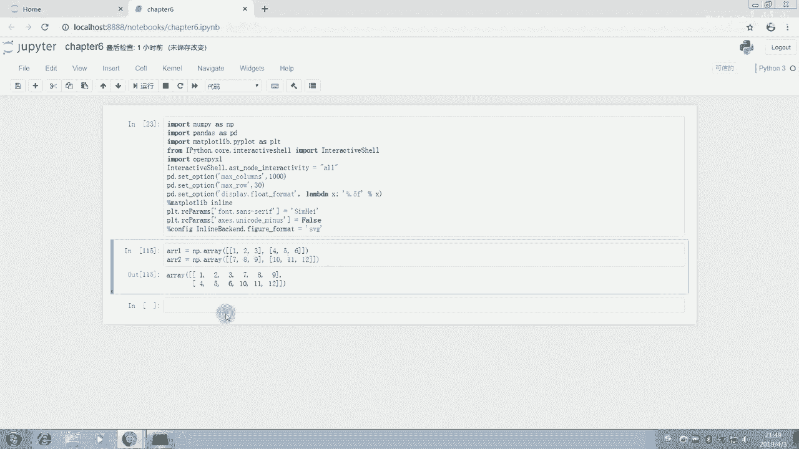

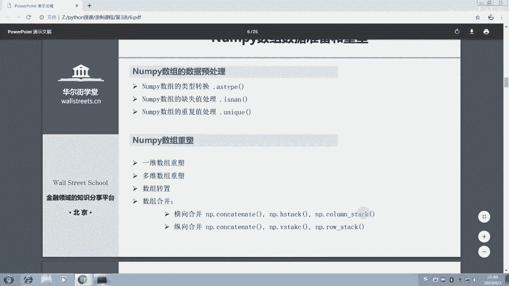

```python
arr = np.random.randint(0, 100, 20).reshape(4,5)

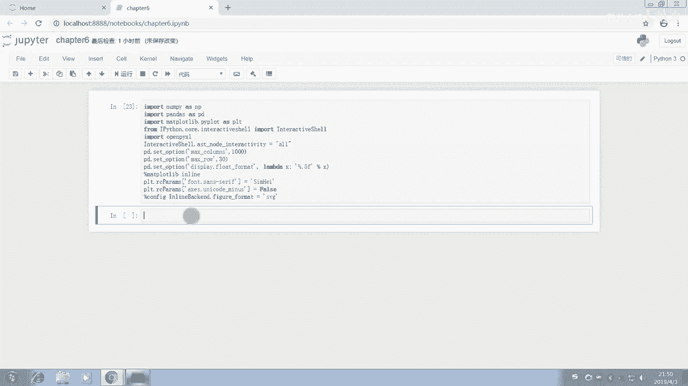

# 元素级函数
print(np.abs(arr)) # 绝对值
print(np.square(arr)) # 平方
print(np.sqrt(arr)) # 平方根

# 描述性统计函数
print(arr.sum()) # 所有元素求和
print(arr.sum(axis=0)) # 按列求和 (axis=0)
print(arr.sum(axis=1)) # 按行求和 (axis=1)
print(arr.mean()) # 平均值
print(arr.std()) # 标准差
print(arr.var()) # 方差
print(arr.min(), arr.max()) # 最小值和最大值
print(arr.argmin(), arr.argmax()) # 最小值和最大值的索引

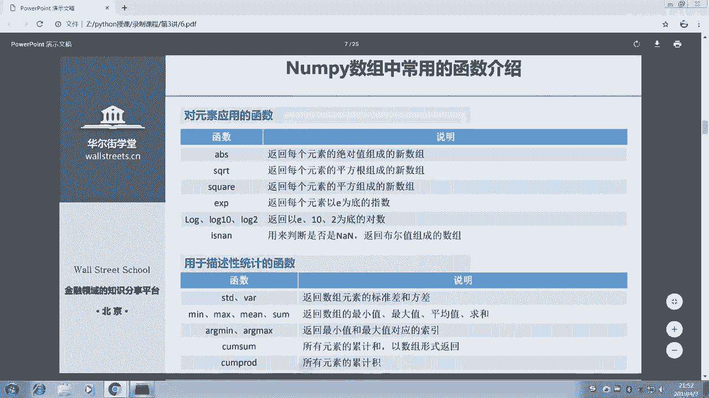


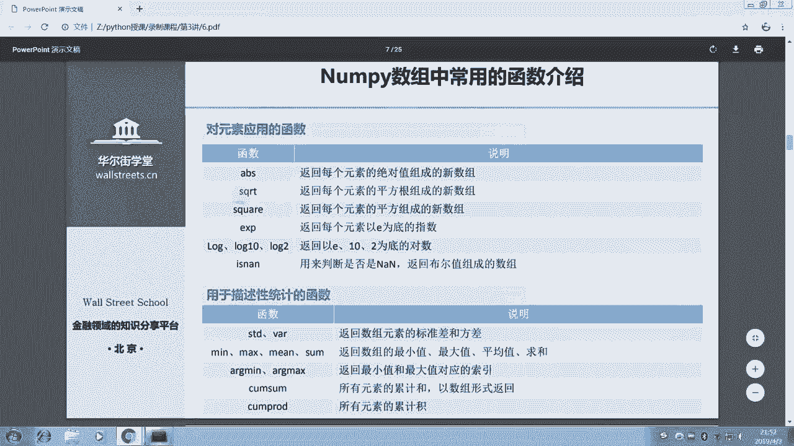

# 累积函数
print(arr.cumsum()) # 累积和
print(arr.cumprod()) # 累积积
```

此外，Numpy还支持集合运算和条件判断。

```python
a = np.array([1,2,3,4])
b = np.array([3,4,5,6])

# 集合运算
print(np.intersect1d(a, b)) # 交集
print(np.union1d(a, b)) # 并集
print(np.setdiff1d(a, b)) # 差集 (在a中但不在b中)


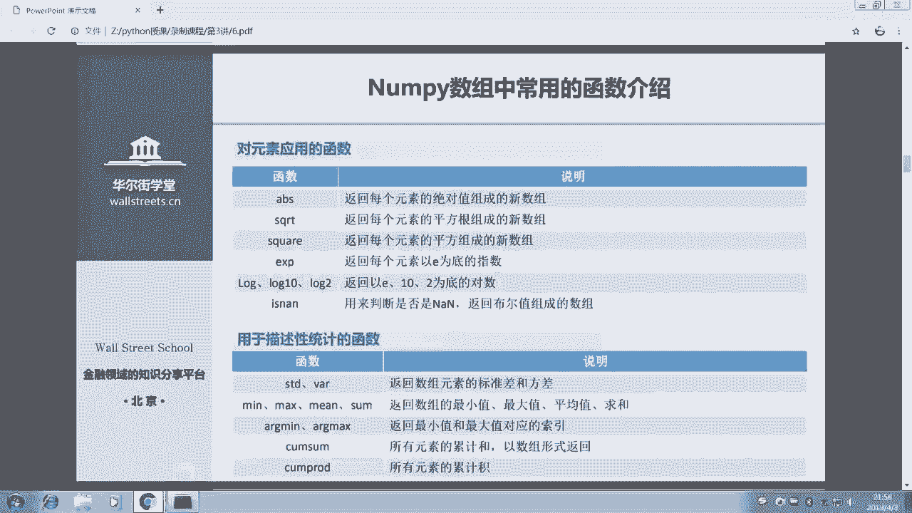

# 条件函数 np.where (类似于Excel的IF)
cond_arr = np.array([65, 88, 92, 45, 73])
# 如果元素大于80，标记为1，否则标记为0
result = np.where(cond_arr > 80, 1, 0)
```

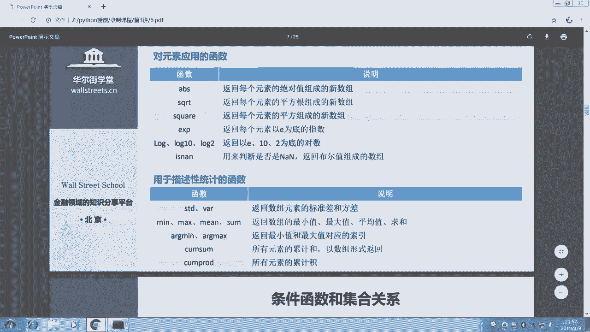

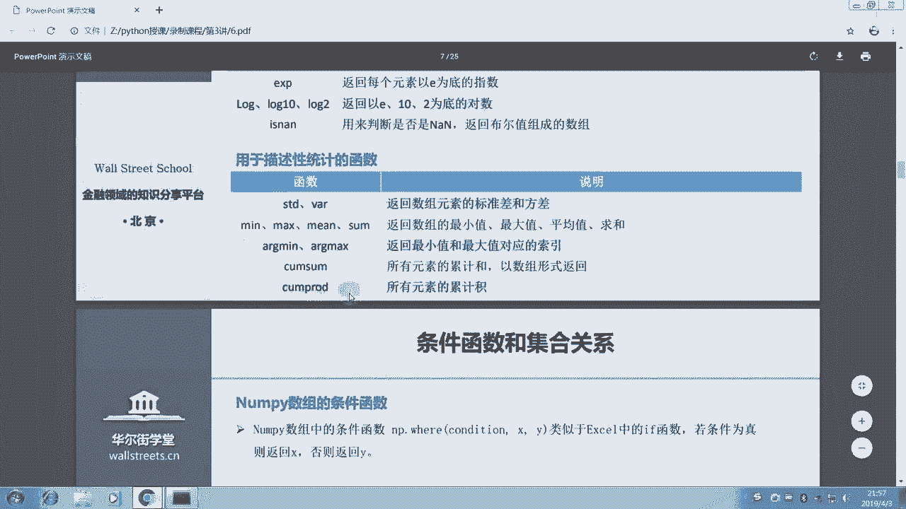

对于需要进行线性代数运算的情况，Numpy也提供了支持。

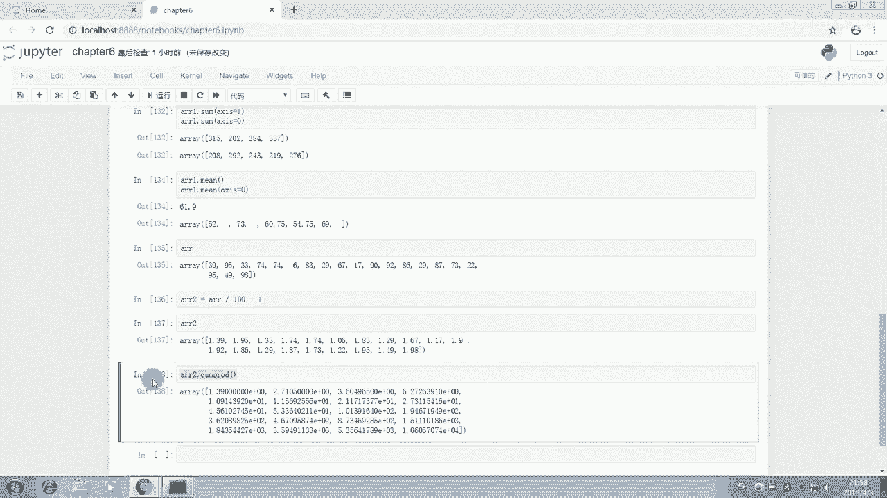

```python
# 矩阵运算
A = np.random.rand(3,3)
A_mat = np.mat(A) # 转换为矩阵类型

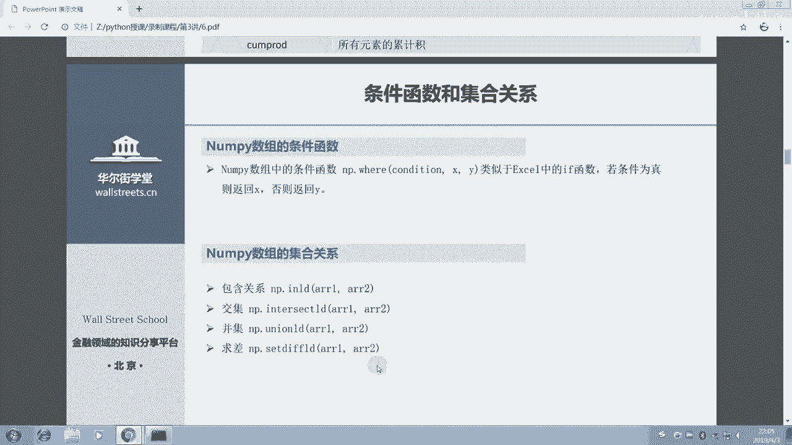

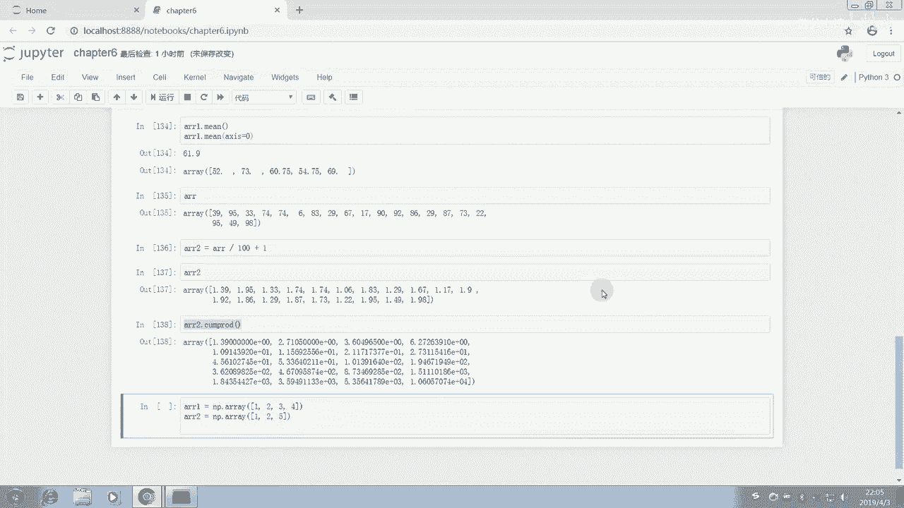

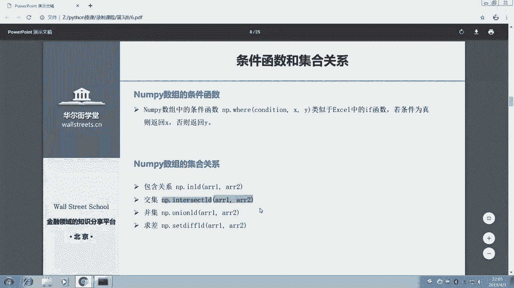

# 求矩阵的逆
from numpy.linalg import inv
A_inv = inv(A_mat)

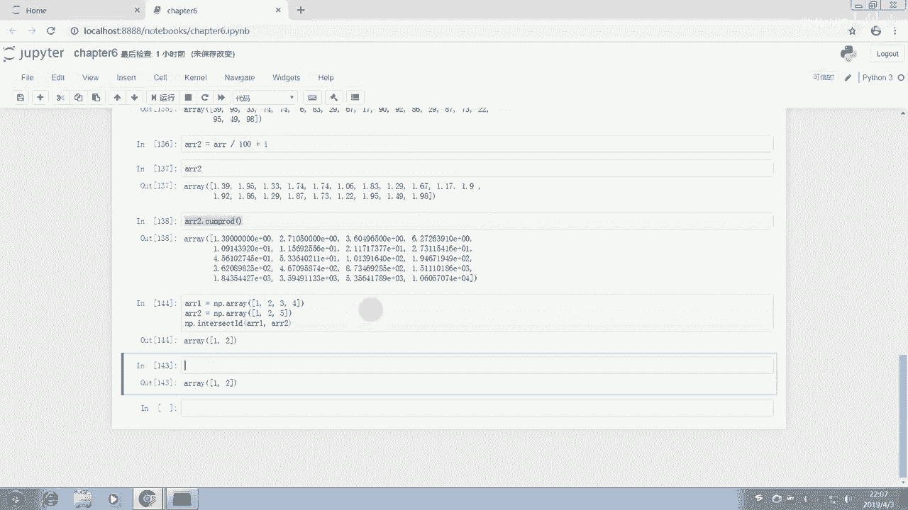

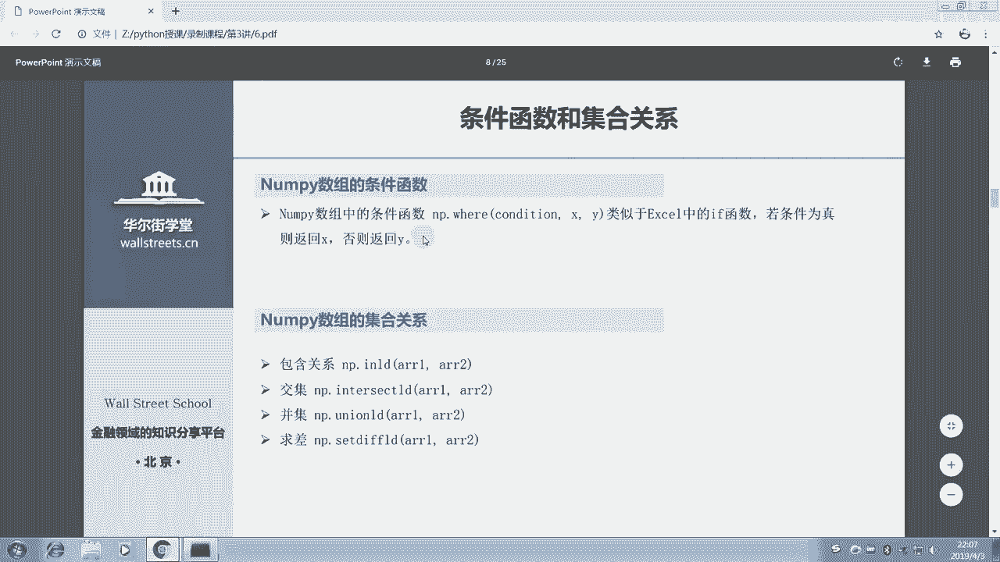

# 验证 A * A_inv 应近似于单位矩阵
print(A_mat.dot(A_inv))

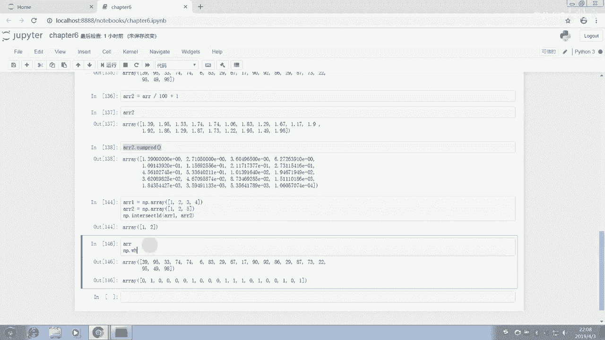

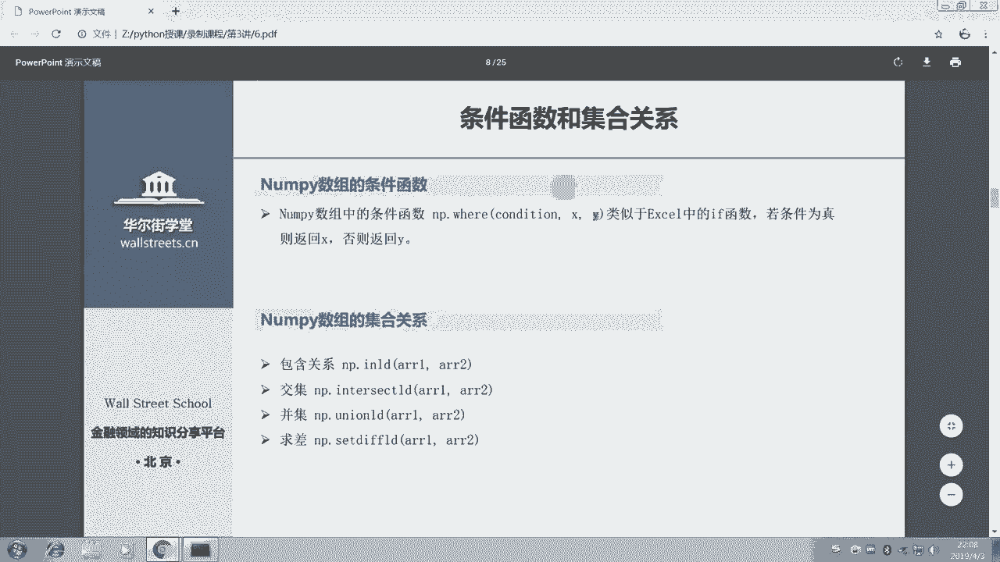

# 求特征值和特征向量
from numpy.linalg import eig
eigenvalues, eigenvectors = eig(A)
print(“特征值：“, eigenvalues)
print(“特征向量：“, eigenvectors)
```

## 总结 📝

本节课中，我们一起学习了Python Numpy库的核心知识。我们从Numpy数组的创建讲起，学习了如何查看数组属性、选取数据、进行数据预处理（如类型转换、处理缺失值和去重）以及重塑数组形状。接着，我们探索了数组的基本计算、合并操作，并介绍了大量实用的数学和统计函数，如求和、均值、标准差等。最后，我们还简要了解了集合运算、条件函数`np.where`以及基础的线性代数操作。

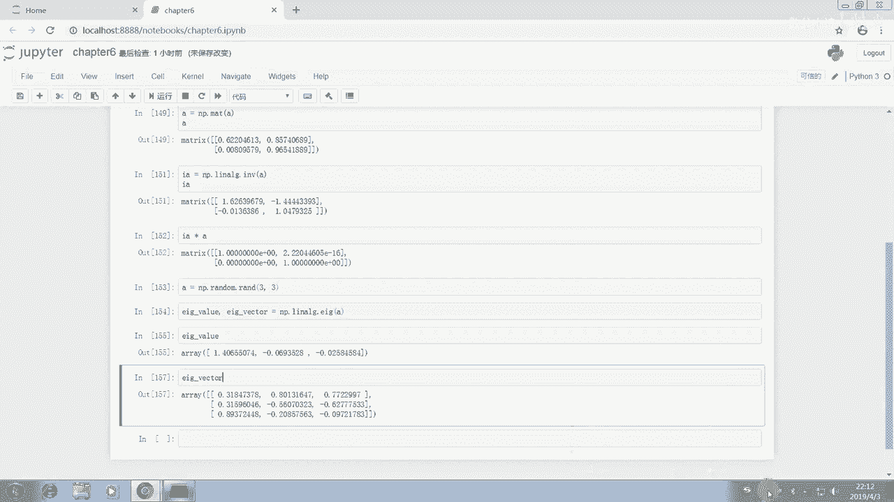

掌握Numpy的高效数组操作，是进行金融数据计算、量化分析和科学建模的基石。它让你能够以接近C语言的速度处理大规模数据集，从而将更多精力集中在策略和模型本身，而非数据处理细节上。在接下来的课程中，我们将基于Numpy的知识，学习更贴近金融分析场景的Pandas库。