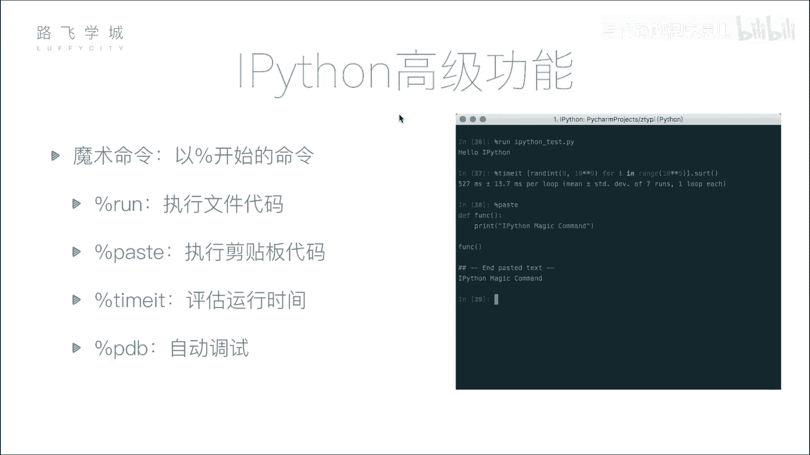
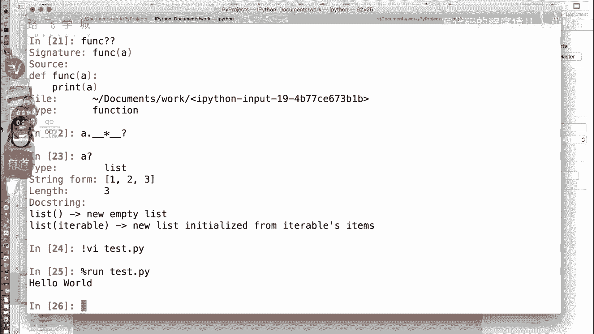
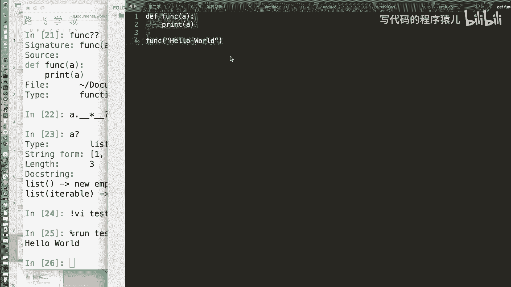
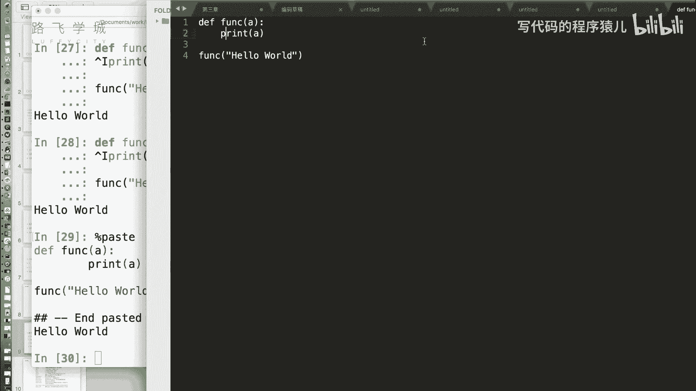
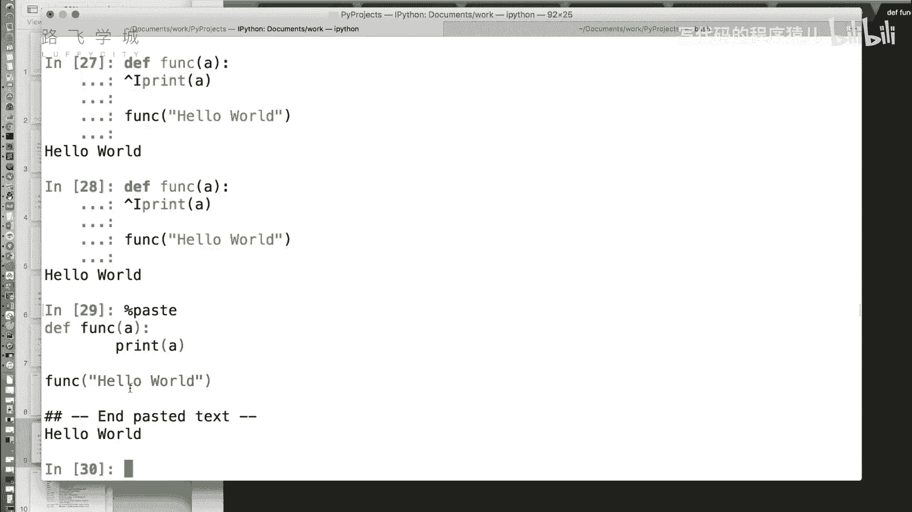
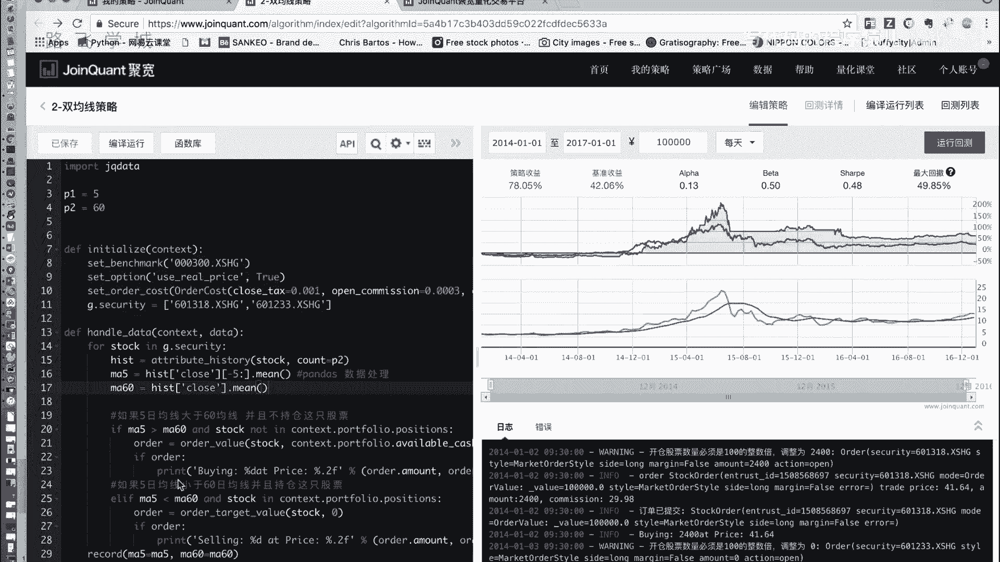
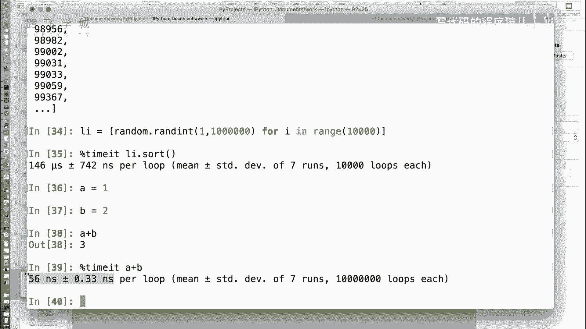

# Python金融量化：P7：IPython魔术命令



在本节课中，我们将学习IPython中一个非常实用且有趣的高级功能——魔术命令。魔术命令以百分号（`%`）开头，能够直接在交互式环境中执行一些特殊操作，例如运行外部脚本、粘贴代码、测量代码执行时间等，极大地提升了开发和测试的效率。

## 魔术命令简介

上一节我们介绍了IPython的基本交互功能。本节中，我们来看看IPython提供的“魔术命令”。魔术命令是IPython特有的功能，它们以百分号（`%`）开头，可以直接在交互式命令行中执行，无需退出环境。

例如，在常规Python命令行中，要运行一个外部`.py`文件，需要先退出命令行，再使用`python filename.py`命令。而在IPython中，我们可以使用魔术命令`%run`直接运行。

## 运行外部脚本：`%run`



以下是`%run`命令的使用方法。它允许我们在IPython交互器中直接执行一个独立的Python脚本文件。

*   **`%run filename.py`**：执行指定的Python脚本文件。脚本中定义的变量、函数等在执行后会导入到当前的IPython命名空间中，方便后续调用。



假设我们有一个名为`hello.py`的文件，内容如下：
```python
# hello.py
def say_hello():
    print("Hello World!")

say_hello()
```
在IPython中，我们可以这样运行它：
```python
%run hello.py
```
执行后，不仅会打印出“Hello World!”，`say_hello`函数也会被载入当前环境，之后可以直接调用`say_hello()`。

## 粘贴与执行代码：`%paste` 与 `%cpaste`

在编写代码时，我们经常需要从编辑器或其他地方复制一段代码到交互式环境进行测试。直接粘贴可能会因为缩进（如Tab键）等问题导致错误。IPython提供了两个命令来解决这个问题。


以下是`%paste`和`%cpaste`命令。它们专门用于安全地执行剪贴板中的代码。



*   **`%paste`**：此命令会直接执行当前剪贴板中的代码。IPython会先打印出要执行的代码内容，然后用分隔符隔开，最后执行它。这能确保代码以其原始的、正确的格式运行。
*   **`%cpaste`**：此命令会进入一个特殊的粘贴模式。输入`%cpaste`后，你可以自由地粘贴多行代码，甚至可以手动编辑。当你粘贴完毕，输入`--`并回车，IPython才会执行之前粘贴的所有代码。这给了你更多的控制权。





例如，从编辑器复制了一段代码后，在IPython中直接输入`%paste`即可运行，避免了格式错误。

## 测量代码执行时间：`%time` 与 `%timeit`

性能分析是量化分析和编程中的重要环节。我们需要知道某段代码或某个函数执行需要多长时间。IPython提供了两个强大的时间测量命令。

以下是时间测量相关的魔术命令。`%time`用于测量单次执行时间，而`%timeit`则通过多次执行来获得更精确的平均耗时，尤其适用于测量非常短的操作。

*   **`%time`**：测量其后跟随的**单条语句**的执行时间。
    ```python
    %time sorted([i for i in range(10000, 0, -1)])
    ```
*   **`%timeit`**：自动多次运行一条语句，以计算其平均执行时间。这对于执行速度极快（纳秒或微秒级）的代码片段特别有用，因为单次测量的误差会很大。
    ```python
    %timeit a = 1; b = 2; c = a + b
    ```
    `%timeit`会智能地决定运行次数（例如“7次运行，每次循环100万遍”），并输出平均每次循环的时间，结果非常可靠。

**核心概念解释**：为什么需要`%timeit`？因为计算机的计时器精度有限，且操作系统存在调度开销。对于极短的操作，单次测量时间可能为0，或者波动巨大。通过**多次执行取平均值**，可以平滑这些随机误差，得到更稳定、更具代表性的性能数据。

## 其他实用魔术命令

除了上述命令，IPython还包含许多其他有用的魔术命令。以下是几个例子：

*   **`%lsmagic`**：列出所有可用的魔术命令。
*   **`%pwd`**：显示当前工作目录。
*   **`%cd`**：更改当前工作目录。
*   **`%history`**：查看命令历史记录。
*   **`%whos`**：列出当前交互环境中所有变量的信息（类型、值等）。
*   **`%reset`**：清除当前交互环境中的所有变量和名称。

你可以使用`%magic`命令查看魔术命令的详细帮助文档，或者对任一魔术命令使用`?`来获取其特定帮助，例如`%run?`。

---



本节课中我们一起学习了IPython的魔术命令。我们掌握了如何使用`%run`直接运行外部脚本，使用`%paste`和`%cpaste`安全地粘贴和执行代码，以及使用`%time`和`%timeit`来精确测量代码的执行时间。这些工具能显著提升你在IPython环境中进行数据分析、算法测试和代码调试的效率。熟练掌握它们，是成为高效Python程序员的重要一步。