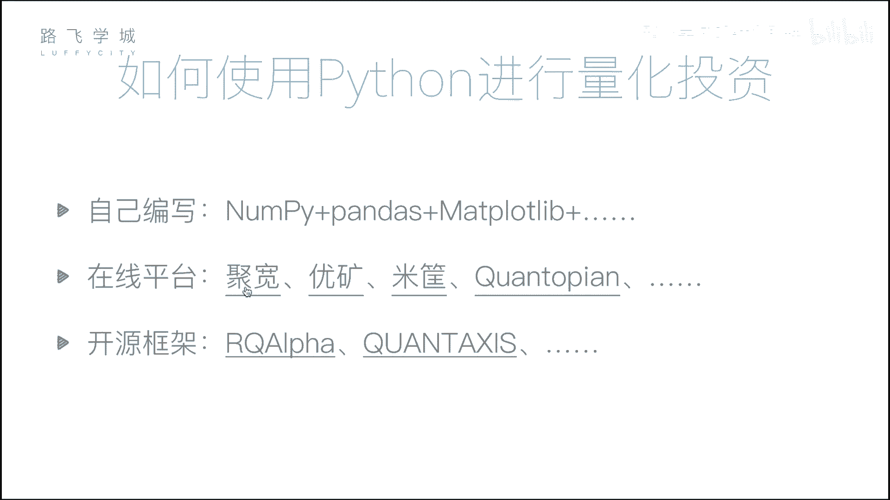
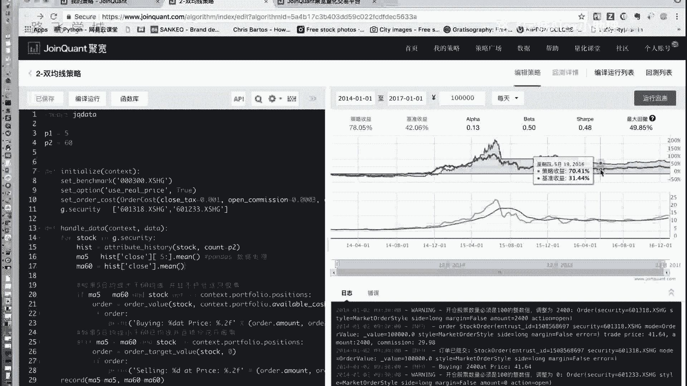
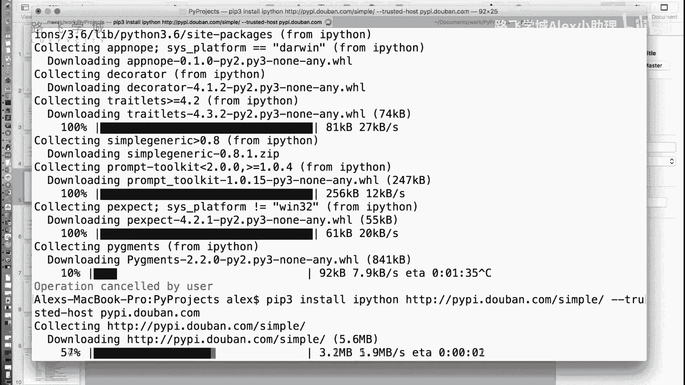
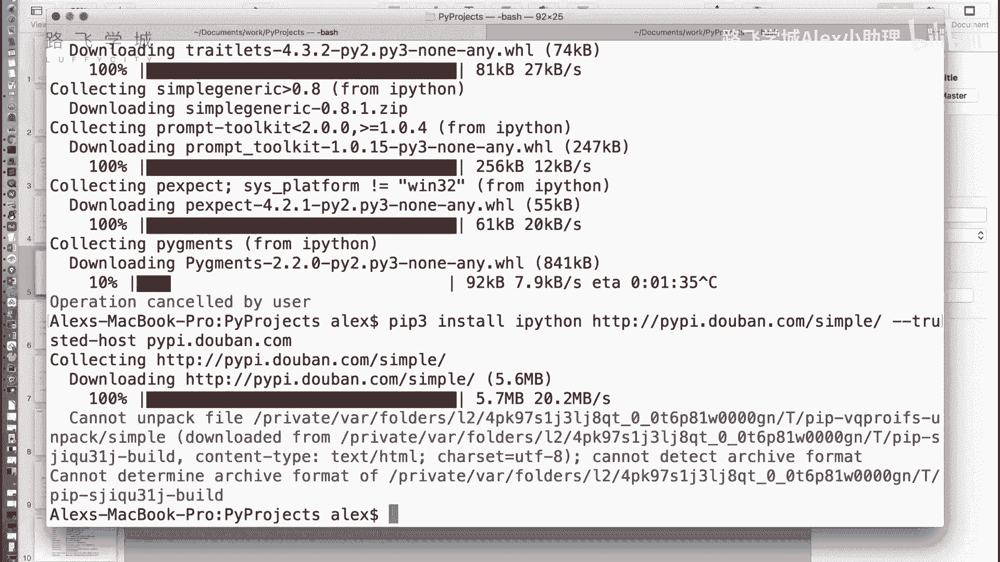
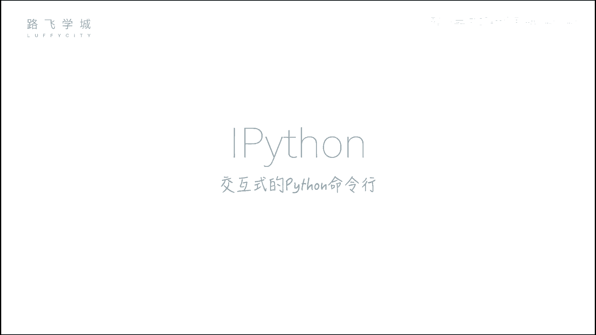
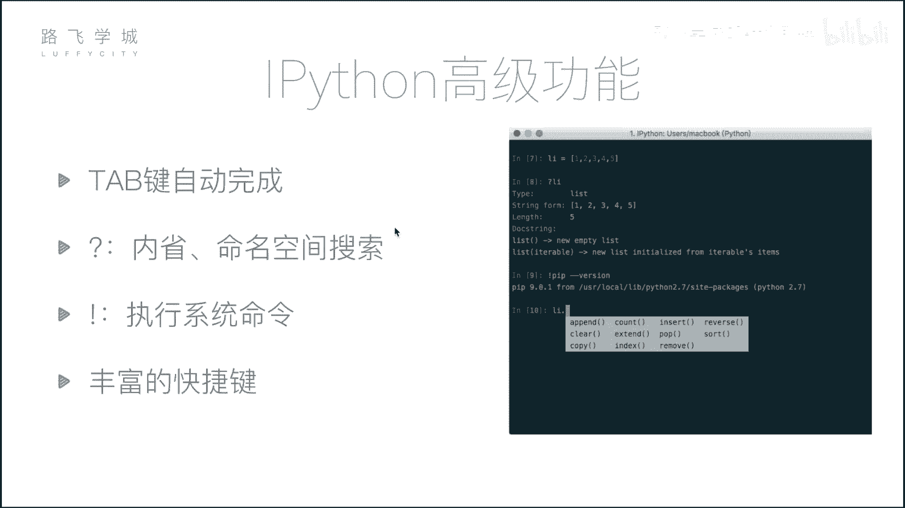
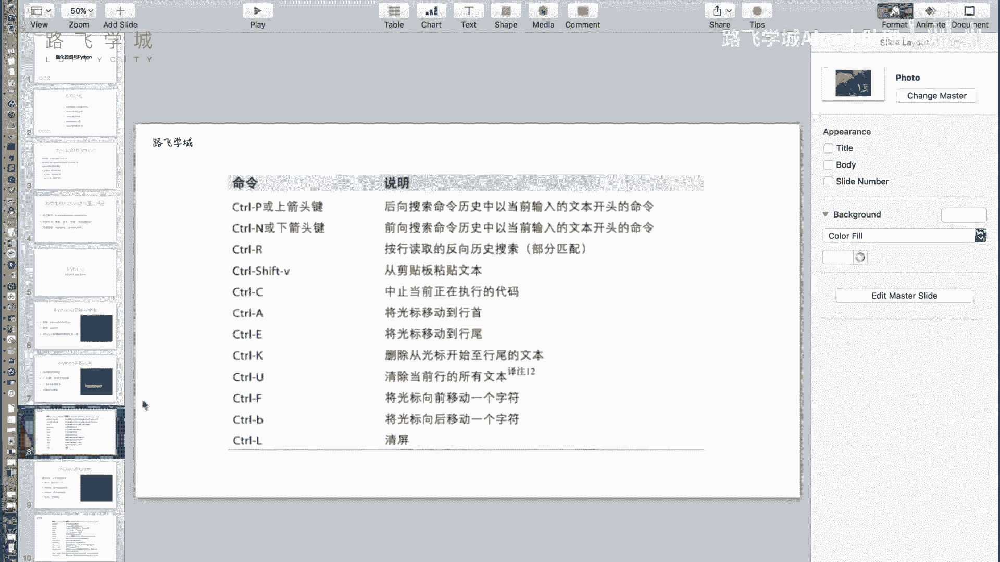

# Python金融量化分析：07：量化投资与Python及IPython初识

在本节课中，我们将要学习量化投资的基本概念，了解为何选择Python作为量化分析的工具，并初步认识一个强大的交互式Python环境——IPython。

## 量化投资与Python

上一节我们介绍了量化分析的基本概念，本节中我们来看看如何用Python实现量化投资。量化投资的核心是分析数据以得出决策。Python因其强大的数据处理能力和丰富的生态系统，成为量化投资领域的首选语言。

除了Python，市场上也存在其他可用于数据分析的工具。以下是几种常见的选择：

*   **Excel**：无需编程，主要用于手工数据处理。
*   **SAS/SPSS**：专业的统计分析软件，能进行均值计算、图表生成等操作，但同样不涉及编程。
*   **R语言**：一门专注于统计分析和数据可视化的编程语言，但在量化投资领域的应用广度不及Python。



Python的优势在于其通用性。学习一门Python语言，即可应用于数据分析、Web开发、自动化脚本等多个领域，实现“一专多能”。

## Python量化分析的核心模块



要进行量化投资，我们需要处理和分析数据。Python提供了几个核心的数据分析库：

1.  **NumPy**：用于进行高效的**数组批量计算**。其核心是`ndarray`对象。
    ```python
    import numpy as np
    arr = np.array([1, 2, 3, 4, 5])
    mean_value = np.mean(arr)  # 计算平均值
    ```

2.  **Pandas**：这是数据分析的**核心库**。它提供了`DataFrame`和`Series`这两种灵活的数据表结构，便于进行数据清洗、转换和分析。
    ```python
    import pandas as pd
    df = pd.DataFrame({'价格': [10, 20, 30], '成交量': [100, 200, 300]})
    ```

3.  **Matplotlib**：用于**数据可视化**。我们可以将分析结果绘制成图表，直观地展示数据趋势和策略表现。
    ```python
    import matplotlib.pyplot as plt
    plt.plot([1, 2, 3], [4, 5, 1])
    plt.show()
    ```





## 实现量化投资的途径

掌握了上述模块后，我们可以通过以下方式实践量化投资：

*   **自建框架**：使用NumPy、Pandas和Matplotlib，从零开始构建一个简单的量化投资框架。你可以下载股票数据，在其中编写并回测自己的交易策略。
*   **在线平台**：市场上存在许多现成的量化交易平台。你只需在平台上编写策略的核心代码，平台会自动进行回测并生成可视化报告。报告中的收益曲线可以直观反映策略在一段时间内的表现，并与大盘基准收益进行对比。
*   **开源框架**：此外，还有一些成熟的开源量化框架可供学习和使用。

## IPython交互式环境介绍





在深入学习数据分析模块之前，我们先认识一个强大的工具——IPython。它是一个增强的交互式Python命令行，提供了比标准Python命令行更丰富的功能。

### 安装IPython

你可以使用Python自带的包管理工具`pip`进行安装。为了获得更快的下载速度，可以使用国内的镜像源。
```bash
pip install ipython -i https://pypi.douban.com/simple/
```
对于尚未安装Python环境的初学者，推荐直接安装**Anaconda**。这是一个Python发行版，它集成了IPython、NumPy、Pandas、Matplotlib等我们即将用到的所有核心库。

安装完成后，在命令行输入`ipython`即可启动。

### IPython的核心特性

IPython提供了多项提升效率的功能，以下是几个关键特性：

*   **Tab键自动补全**：在输入变量名、函数名或模块名时，按下Tab键可以自动补全或列出所有可能的选项。
*   **执行系统命令**：在IPython中可以直接执行一些系统命令（如`ls`, `pwd`）。对于更复杂的命令，需要在命令前加上感叹号`!`。
    ```python
    !ls  # 列出当前目录文件
    !pip list  # 查看已安装的Python包
    ```
*   **内省与帮助**：使用问号`?`可以查看对象的信息。使用双问号`??`可以查看函数或方法的源代码（如果可用）。
    ```python
    import pandas as pd
    pd.DataFrame?  # 查看DataFrame的文档信息
    ```
*   **丰富的快捷键**：IPython支持许多高效的快捷键，例如：
    *   `Ctrl + A`：移动光标到行首。
    *   `Ctrl + E`：移动光标到行尾。
    *   `Ctrl + U`：删除从光标到行首的所有内容。
    *   `Ctrl + K`：删除从光标到行尾的所有内容。

---



本节课中我们一起学习了量化投资与Python的结合，了解了Python在量化领域的优势及其核心数据分析模块（NumPy, Pandas, Matplotlib）。我们还初步认识了功能强大的IPython交互式环境，它将成为我们后续学习和探索数据的重要工具。下一节，我们将开始深入第一个核心库——NumPy的学习。