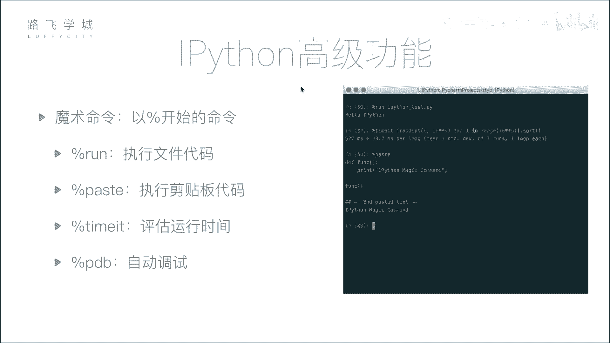
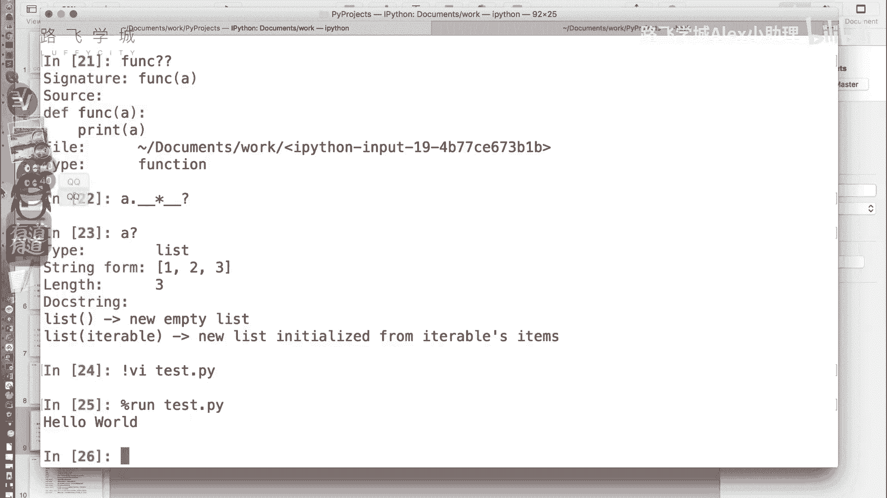
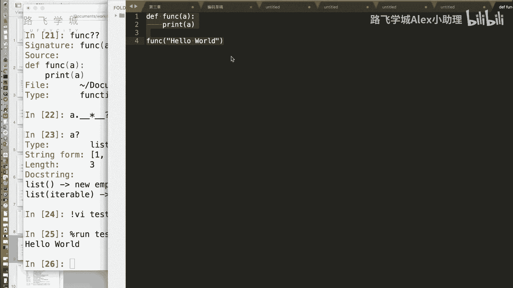
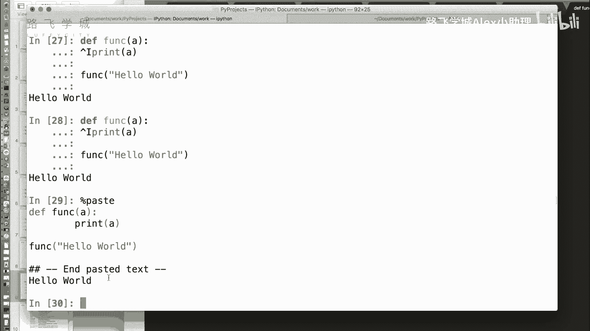
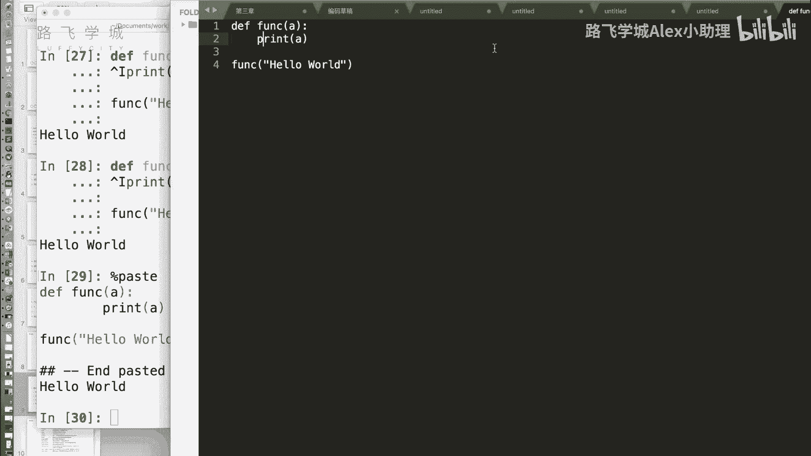
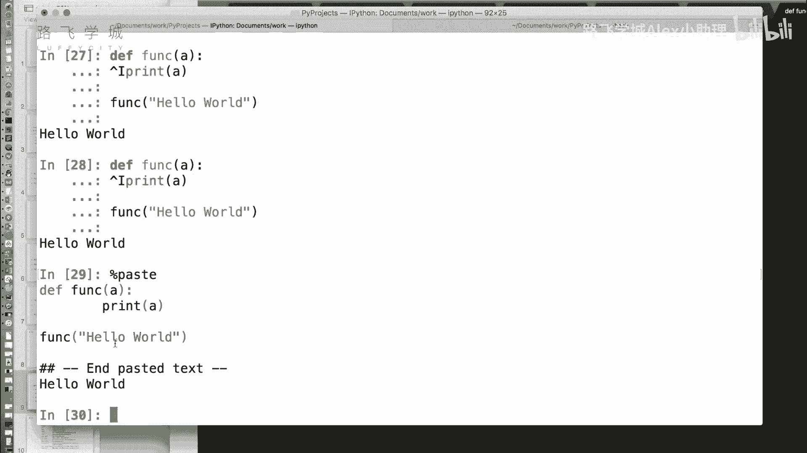
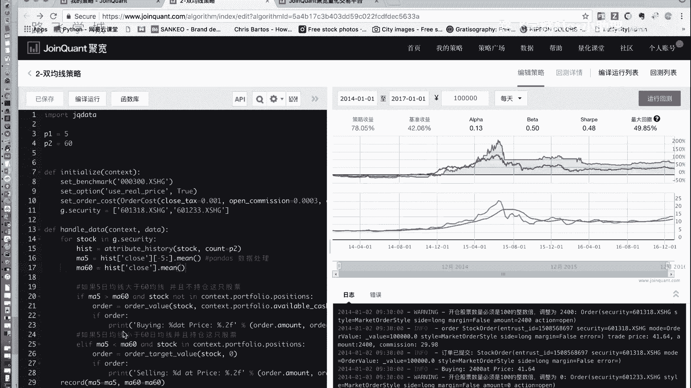
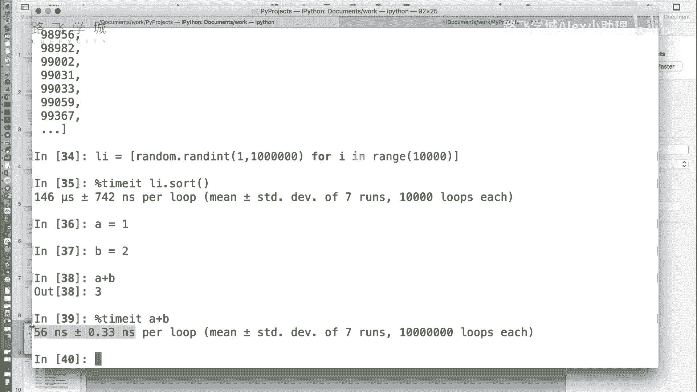

# Python金融量化：P8：08 IPython魔术命令 🪄



在本节课中，我们将学习IPython中一些非常实用的“魔术命令”。这些命令以百分号开头，能让我们在交互式环境中更高效地执行文件、粘贴代码、测试性能等操作，无需频繁切换窗口或退出命令行。



---



上一节我们介绍了IPython的基本使用，本节中我们来看看如何利用其内置的魔术命令提升工作效率。

魔术命令以单个百分号 `%` 开头，可以直接在IPython的交互式提示符下执行。它们为日常开发提供了许多便利。





以下是几个核心的魔术命令及其用法：





**1. `%run`：在交互器中运行Python脚本**
通常，在命令行中运行一个Python文件需要退出Python环境。但在IPython中，你可以使用 `%run` 命令直接执行外部脚本。
```python
%run hello_world.py
```
执行此命令后，脚本 `hello_world.py` 中的代码将在当前IPython会话中运行，其定义的变量和函数也会被导入到当前命名空间。

**2. `%paste`：执行剪贴板中的代码**
有时你需要测试一段较长的代码，但不想为此专门创建一个文件。`%paste` 命令可以直接执行你复制到剪贴板中的代码块。
```python
%paste
```
执行后，IPython会先打印出剪贴板中的代码，然后执行它。这避免了因缩进或格式问题导致的粘贴错误。

**3. `%timeit`：测量代码执行时间**
在优化代码性能时，我们需要精确测量某段代码或函数的运行时间。`%timeit` 命令会自动多次运行代码，并计算平均执行时间，对于测量非常短的操作尤其准确。
```python
%timeit sorted([5, 2, 8, 1, 9])
```
该命令会输出类似 `146 µs ± 742 ns per loop` 的结果，表示平均每次循环耗时146微秒，并给出了误差范围。这对于性能分析和优化非常有帮助。

---



本节课中我们一起学习了IPython的三个核心魔术命令：`%run` 用于运行外部脚本，`%paste` 用于执行剪贴板代码，`%timeit` 用于精确测量代码执行时间。掌握这些命令能让你在数据分析和量化开发的交互式探索中更加得心应手。