# Python金融量化：P8：Series介绍 📊

在本节课中，我们将学习Pandas库中的第一个核心数据结构——**Series**。我们将了解它的创建方式、基本特性以及它如何结合了列表（数组）和字典的优点，为后续的数据分析工作打下基础。

上一节我们介绍了NumPy库，它是数据分析的基础。本节中我们来看看Pandas库，它在NumPy的基础上提供了更高级、更便捷的数据结构。

Pandas是基于NumPy构建的，因此继承了NumPy的许多特性，如布尔索引和花式索引。Pandas的核心功能包括提供两种主要数据结构：**DataFrame**和**Series**。它还集成了时间序列功能，提供了丰富的数学运算，并能灵活处理缺失数据。

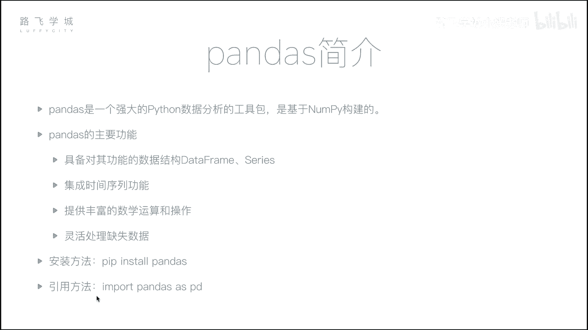

安装Pandas非常简单，使用`pip`命令即可。官方建议的导入方式如下：

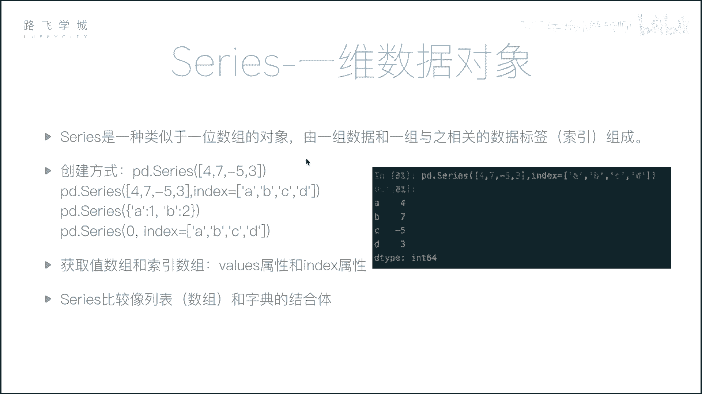

```python
import pandas as pd
```

---

## Series：一维数据的容器 📦

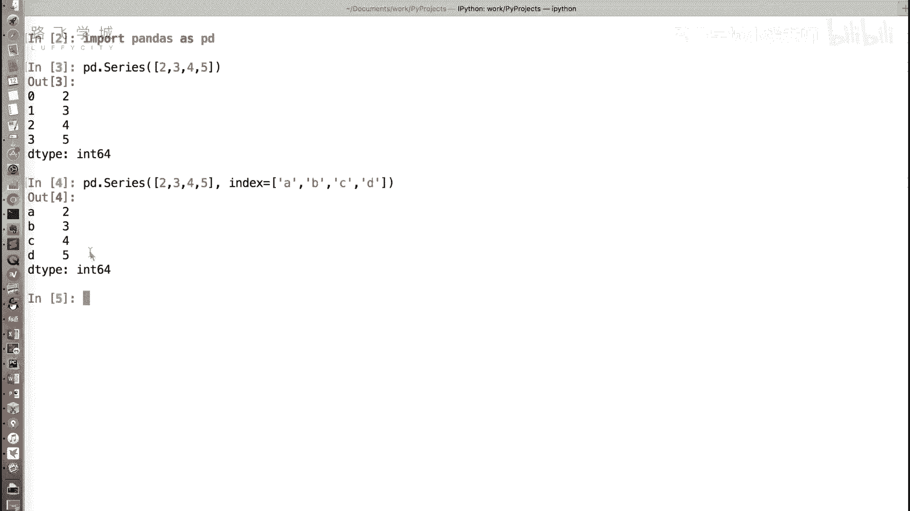

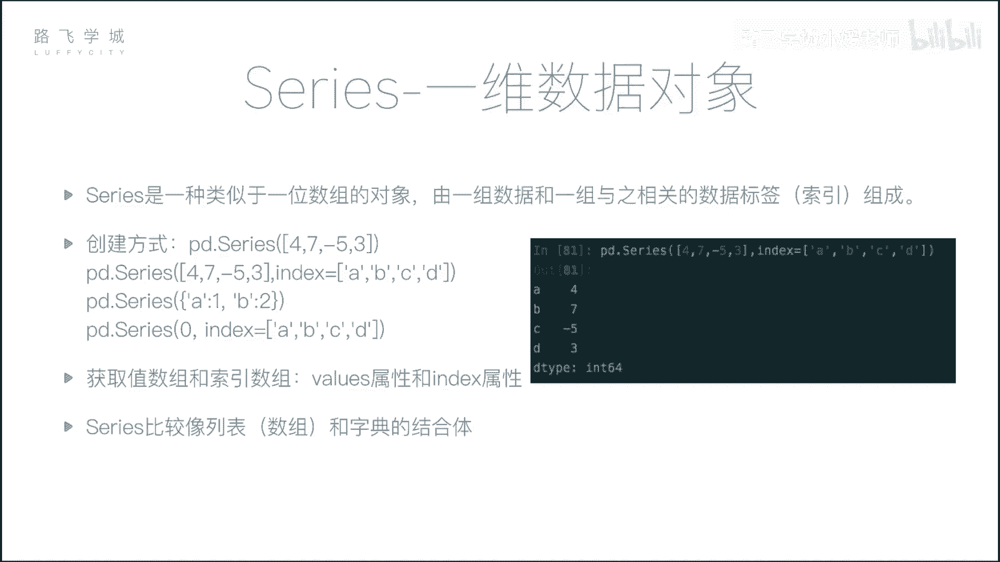

Series是一种类似于一维数组的对象。我们可以将其理解为**数组和字典的结合体**。

### 创建Series

创建Series的基本方法是使用`pd.Series()`函数。

**从列表创建：**
```python
import pandas as pd
s = pd.Series([2, 3, 4, 5])
print(s)
```
输出结果左侧是默认的整数索引（0, 1, 2, 3），右侧是数据值。这看起来就像一个列表或数组。

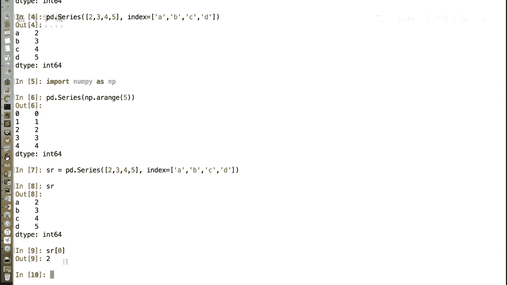

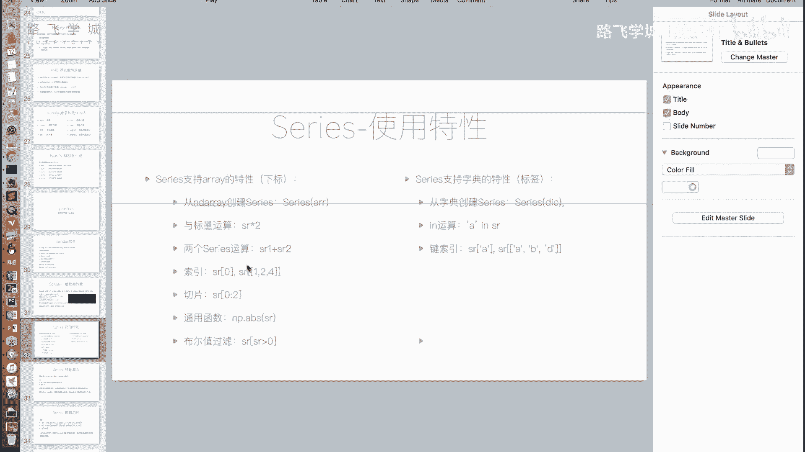

**自定义索引（标签）创建：**
我们可以通过`index`参数为数据指定标签，使其更像一个字典。
```python
s = pd.Series([2, 3, 4, 5], index=[‘a‘, ‘b‘, ‘c‘, ‘d‘])
print(s)
```
此时，输出左侧的索引变成了‘a‘, ‘b‘, ‘c‘, ‘d‘。Series同时具备了数组的下标和字典的键值对特性。

### 继承自数组的特性

Series继承了NumPy数组的许多操作特性。

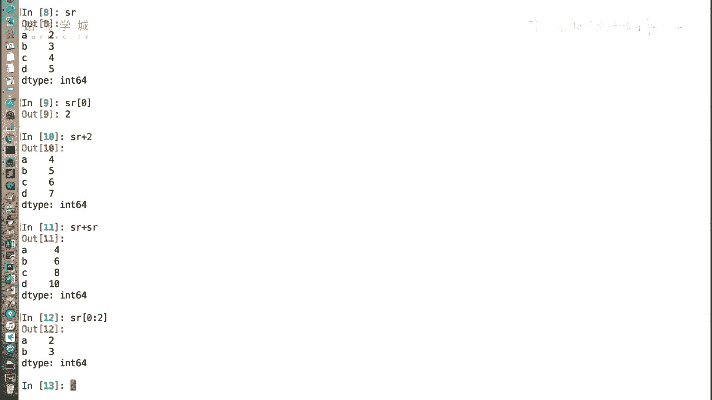

**从数组创建：**
Series也可以直接从NumPy数组创建。
```python
import numpy as np
arr = np.array([1, 2, 3])
s = pd.Series(arr)
```

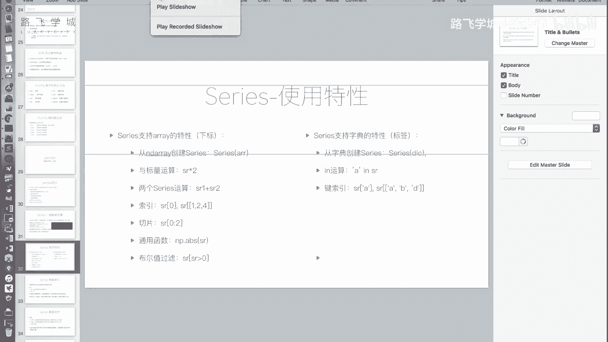

**通过下标访问：**
即使我们为Series定义了自定义标签，仍然可以通过整数下标访问数据。
```python
s = pd.Series([2, 3, 4, 5], index=[‘a‘, ‘b‘, ‘c‘, ‘d‘])
print(s[0])  # 输出：2
```

**向量化运算：**
Series支持与标量（单个数字）进行运算，也支持两个相同大小的Series之间进行逐元素运算（加减乘除、比较等）。
```python
s1 = pd.Series([1, 2, 3])
s2 = pd.Series([4, 5, 6])
print(s1 + s2)  # 输出：0:5, 1:7, 2:9
```

**切片操作：**
和列表一样，Series支持切片。
```python
s = pd.Series([2, 3, 4, 5])
print(s[0:2])  # 输出索引0和1的数据
```

**支持通用函数和布尔索引：**
Series支持NumPy的通用函数（如`np.abs`），也支持布尔索引进行条件筛选。
```python
s = pd.Series([2, 3, 4, 5])
print(s[s > 3])  # 输出大于3的数据
```

### 继承自字典的特性

Series也具备一些类似字典的操作。

**从字典创建：**
这是创建Series的一种自然方式，字典的键（key）会自动成为Series的索引（标签）。
```python
data = {‘a‘: 1, ‘b‘: 2, ‘c‘: 3}
s = pd.Series(data)
```

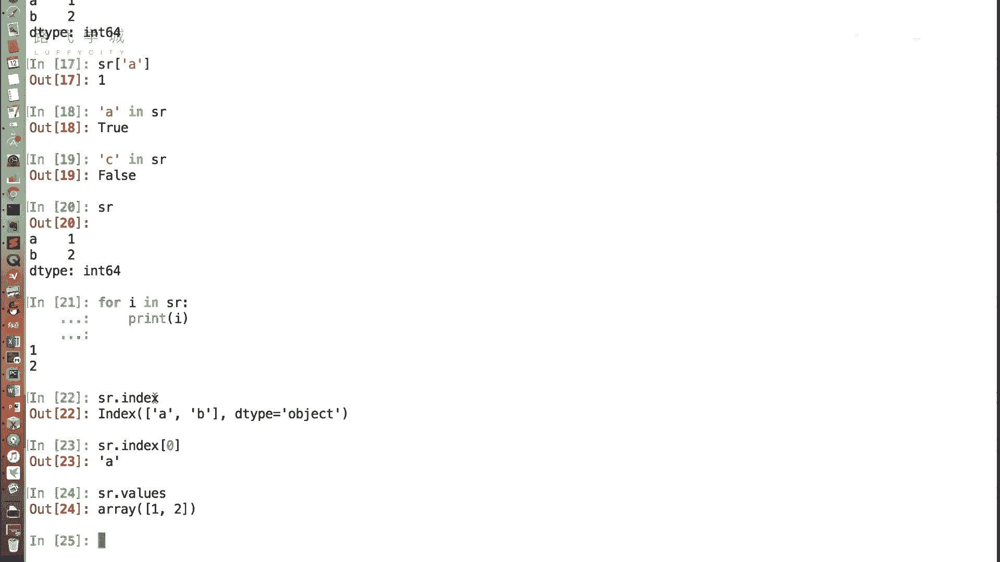

**通过标签访问：**
除了下标，我们可以直接使用标签来获取值。
```python
s = pd.Series([2, 3, 4, 5], index=[‘a‘, ‘b‘, ‘c‘, ‘d‘])
print(s[‘a‘])  # 输出：2
```

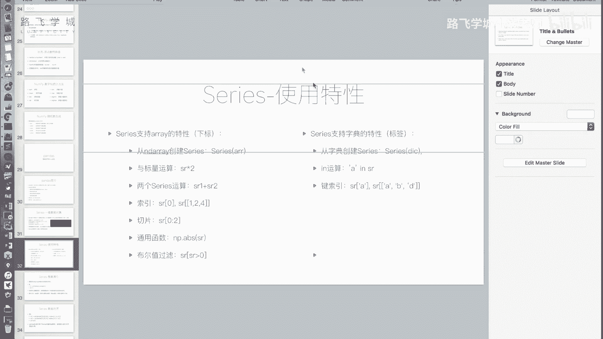

**`in`操作：**
可以检查某个标签是否存在于Series的索引中。
```python
s = pd.Series([2, 3, 4, 5], index=[‘a‘, ‘b‘, ‘c‘, ‘d‘])
print(‘a‘ in s)  # 输出：True
print(‘z‘ in s)  # 输出：False
```
**注意**：对Series进行`for`循环遍历时，默认输出的是**值**，而不是索引（键）。这与遍历字典不同。

**获取索引和值：**
可以通过`.index`和`.values`属性分别获取Series的索引对象和值数组。
```python
s = pd.Series([2, 3, 4, 5], index=[‘a‘, ‘b‘, ‘c‘, ‘d‘])
print(s.index)  # 输出索引
print(s.values) # 输出值数组
```

### 标签索引的高级用法

**标签花式索引：**
可以传入一个标签列表，一次性获取多个值。
```python
s = pd.Series([2, 3, 4, 5], index=[‘a‘, ‘b‘, ‘c‘, ‘d‘])
print(s[[‘a‘, ‘c‘]])  # 输出标签‘a‘和‘c‘对应的值
```

**标签切片：**
使用标签进行切片时，切片范围是**前闭后闭**的（包含结束标签），这与整数下标切片（前闭后开）不同。
```python
s = pd.Series([2, 3, 4, 5], index=[‘a‘, ‘b‘, ‘c‘, ‘d‘])
print(s[‘a‘:‘c‘])  # 输出标签‘a‘, ‘b‘, ‘c‘对应的值
```

---

## 总结 🎯

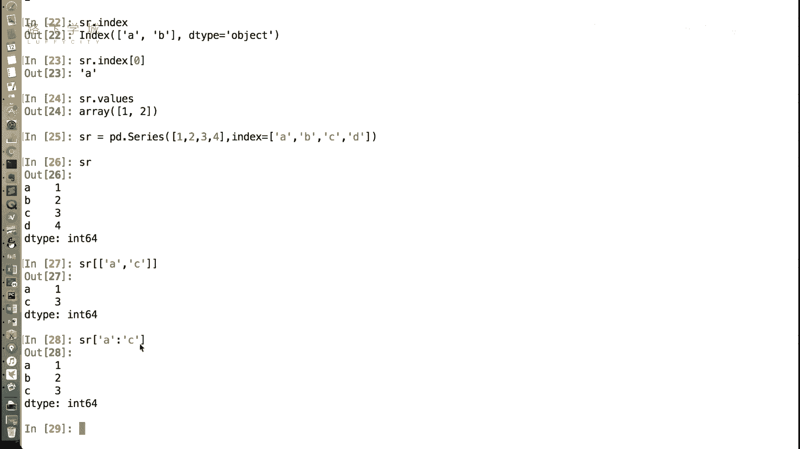

本节课中我们一起学习了Pandas的**Series**对象。我们了解到：

1.  Series是一个**一维**的、带标签的数组，是数组和字典特性的结合体。
2.  可以通过列表、NumPy数组或字典来创建Series。
3.  它继承了数组的特性，如下标访问、向量化运算、切片、布尔索引等。
4.  它也具备了字典的特性，如通过标签访问、检查键是否存在等，并提供了`.index`和`.values`属性来分别获取索引和值。
5.  标签索引支持花式索引和切片，且标签切片是“前闭后闭”的。

Series的这种设计，使得处理像股票每日收盘价（日期为标签，价格为值）这类一维有序数据变得非常方便和高效。在下一节，我们将学习Pandas中更强大的二维表格结构——**DataFrame**。