# Python金融量化：P9：03 使用Pandas数组实现金融数据高效计算（二）


## 概述

在本节课中，我们将要学习如何使用Pandas进行更高级的数据操作。主要内容包括数据的选取、数值的替换与排序、数据的删除、区间划分、长宽表转换以及时间序列处理等核心技能。这些操作是金融数据分析中数据清洗和预处理的关键步骤。

## 数据选取

上一节我们介绍了Pandas的基本数据结构，本节中我们来看看如何从DataFrame中选取我们需要的特定数据。数据选取类似于NumPy数组的索引，但Pandas提供了更多基于标签和条件的方法。

### 列选择

以下是选取单列或多列的方法：

*   **选取单列**：通过列名直接选取，例如 `df['column_name']`。
*   **选取多列**：传入一个包含列名的列表，例如 `df[['col1', 'col2']]`。
*   **使用 `iloc` 按位置选取**：`df.iloc[:, column_index]`，其中 `:` 表示选取所有行，`column_index` 是列的整数位置（从0开始）。

### 行选择

以下是选取单行或多行的方法：

*   **使用 `loc` 按标签选取行**：`df.loc[row_label]` 或 `df.loc[[row_label1, row_label2]]`。
*   **使用 `iloc` 按位置选取行**：`df.iloc[row_index, :]`，其中 `row_index` 是行的整数位置。

### 按条件选择行

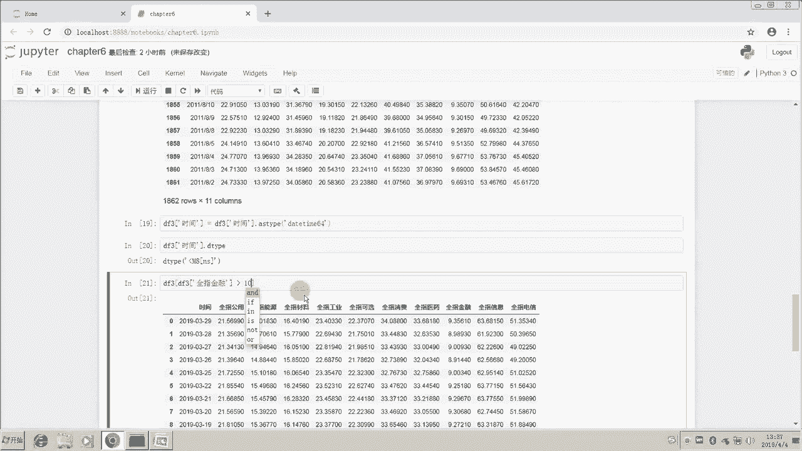

在实际分析中，我们经常需要选取满足特定条件的行。这通过布尔索引实现。


```python
# 假设我们有一个包含时间列‘date’的DataFrame `df`
# 首先确保‘date’列是datetime类型
df['date'] = pd.to_datetime(df['date'])

# 选取2019年2月1日之后的数据
condition = df['date'] > '2019-02-01'
df_later = df[condition]

# 选取‘全指金融’PE高于10倍的数据
df_high_pe = df[df['全指金融'] > 10]
```

通过组合行、列选择与条件索引，我们可以灵活地提取DataFrame中的任意子集。

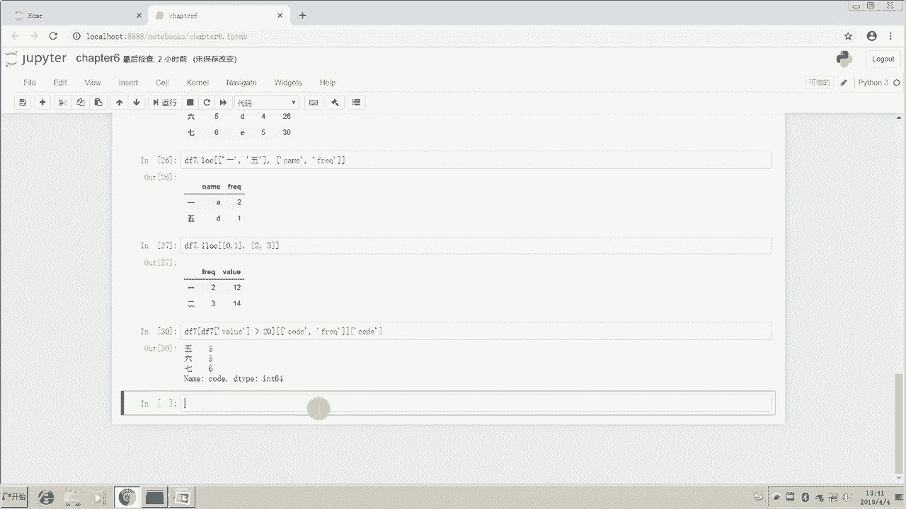

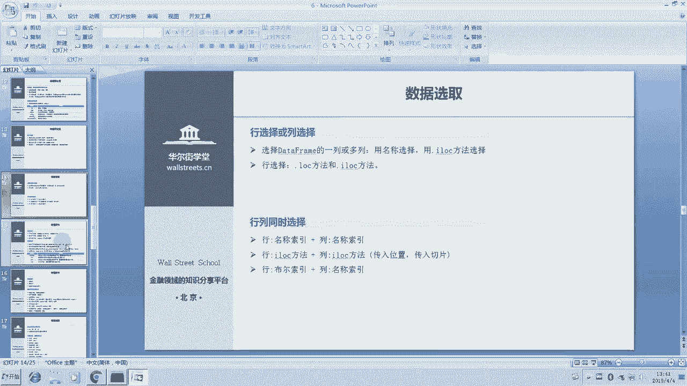

## 行列同时选取与数值操作

上一节我们分别介绍了行和列的选择，本节中我们来看看如何同时指定行和列进行选取，并开始学习数值的替换与排序。

### 行列同时选取

使用 `loc` 和 `iloc` 可以同时指定行和列的索引。

```python
# 使用loc，同时按标签选取行和列
df_selected = df.loc[['row_label1', 'row_label5'], ['col_name1', 'col_name2']]

# 使用iloc，同时按位置选取行和列
df_selected = df.iloc[[0, 1], [2, 3]] # 选取第0、1行，第2、3列
```

### 数值替换

在数据清洗中，经常需要替换某些值。Pandas的 `replace` 方法非常强大。

```python
# 一对一替换：将列‘value’中的所有17替换为0
df['value'].replace(17, 0, inplace=True)

# 多对一替换：将17和20都替换为0
df['value'].replace([17, 20], 0, inplace=True)

# 多对多替换：使用字典指定映射关系，例如将‘a’替换为‘A’，‘b’替换为‘B’
df['name'].replace({'a': 'A', 'b': 'B'}, inplace=True)
```

### 数值排序

对数据进行排序是常见操作，可以使用 `sort_values` 方法。

```python
# 按单列排序，默认升序
df_sorted = df.sort_values(by='全指金融')

# 按单列降序排序
df_sorted_desc = df.sort_values(by='全指金融', ascending=False)

# 处理缺失值：将缺失值放在最后
df_sorted_na = df.sort_values(by='全指金融', na_position='last')

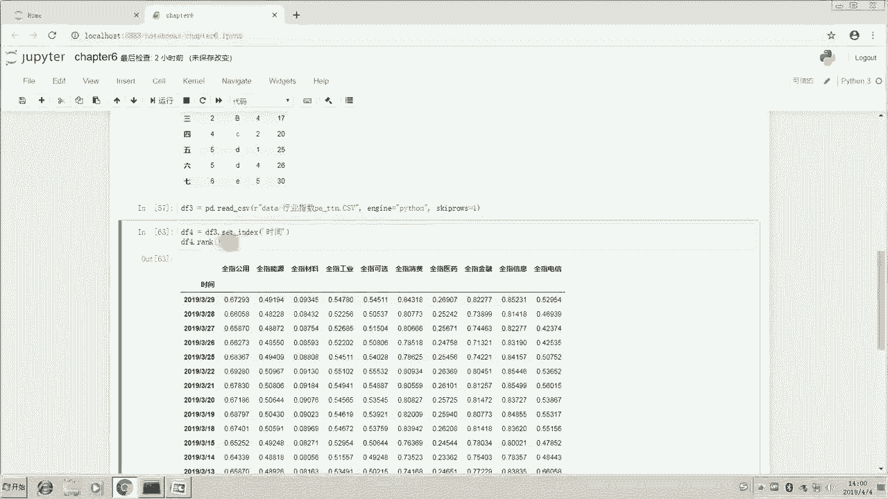

# 按多列排序：先按‘全指金融’降序，再按‘全指工业’升序
df_multi_sorted = df.sort_values(by=['全指金融', '全指工业'], ascending=[False, True])
```

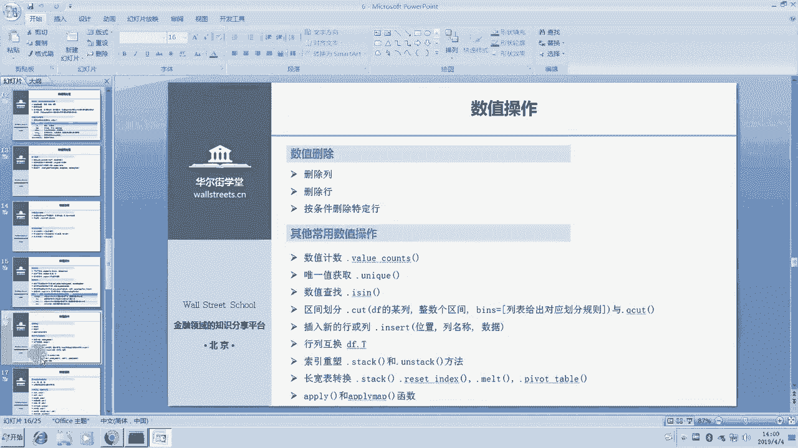

### 数据排名（Rank）

`rank` 方法可以为数据分配排名，类似于Excel的RANK函数。

```python
# 计算‘全指金融’PE的排名（分位数）
df['rank'] = df['全指金融'].rank(pct=True) # pct=True返回百分比排名
# 排名方法：method参数可选‘average’（默认，并列取平均）, ‘min’, ‘max’, ‘first’等
```

## 数据删除与其他常用操作

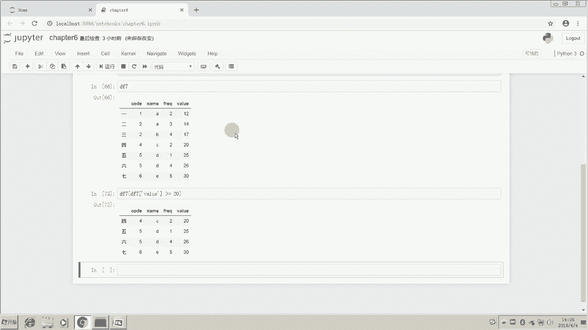

上一节我们学习了数据的替换与排序，本节中我们来看看如何删除数据，并介绍一些其他在金融数据分析中常用的操作，如唯一值获取、区间划分等。

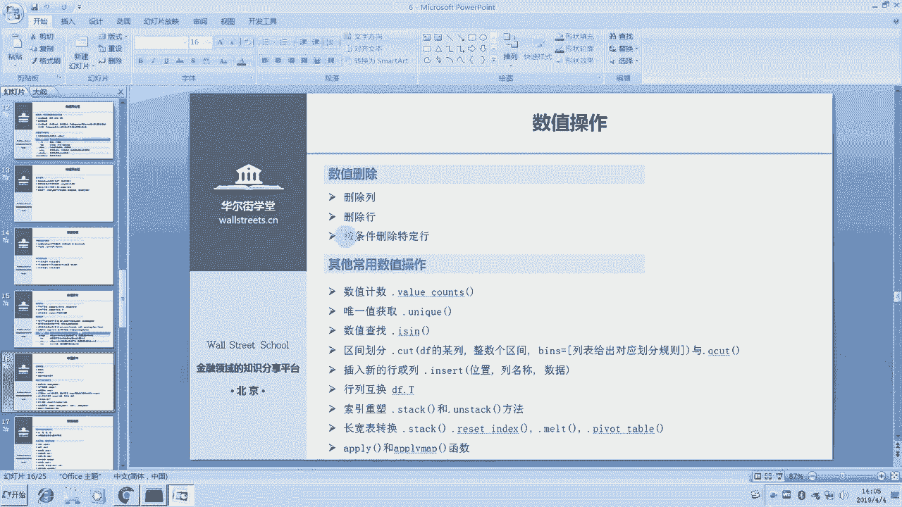

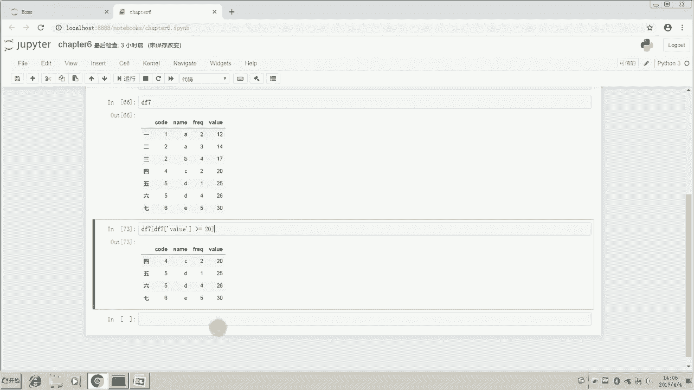

### 数据删除


使用 `drop` 方法可以删除指定的行或列。

```python
# 删除列：指定列名和轴axis=1（或使用columns参数）
df_dropped_col = df.drop(['freq', 'value'], axis=1)
# 等价于
df_dropped_col = df.drop(columns=['freq', 'value'])

# 删除行：指定行索引和轴axis=0（或使用index参数）
df_dropped_row = df.drop([1, 5], axis=0)

# 按条件“删除”行：通常使用反选，即选取保留的行
df_kept = df[df['value'] >= 20] # “删除”value小于20的行
```

### 其他常用数值操作

以下是数据处理中一系列有用的操作：

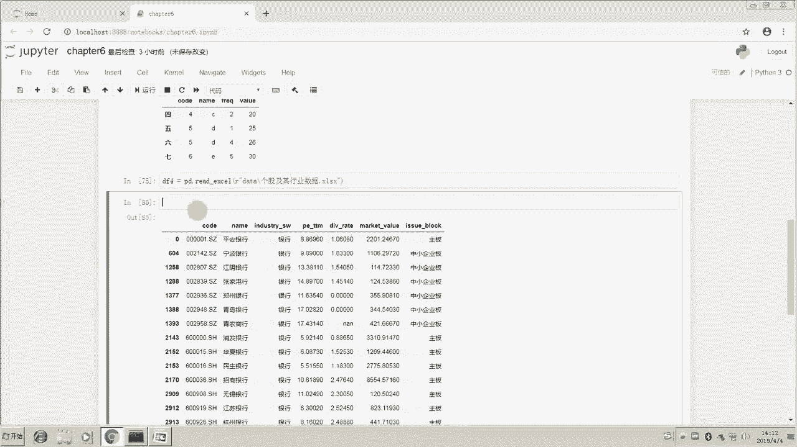


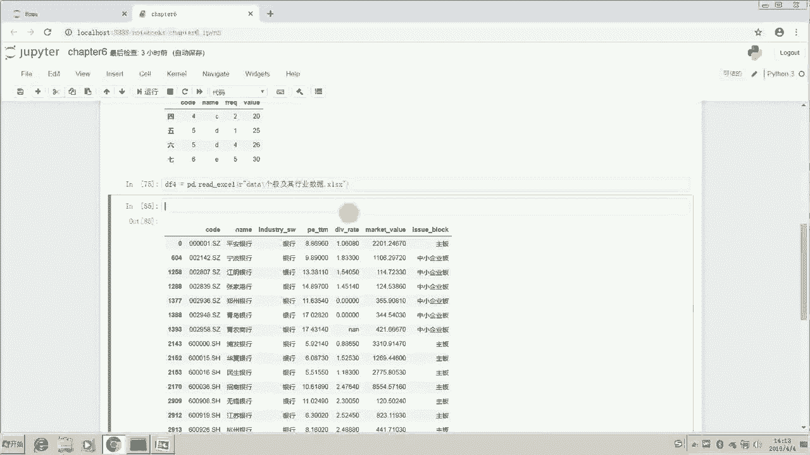

*   **数值计数**：`df['industry'].value_counts()` 统计某列各唯一值出现的次数。
*   **获取唯一值**：`df['industry'].unique()` 获取某列的所有唯一值。
*   **数值查找**：`df['name'].isin(['平安银行'])` 判断元素是否在列表中，返回布尔序列，可用于筛选。

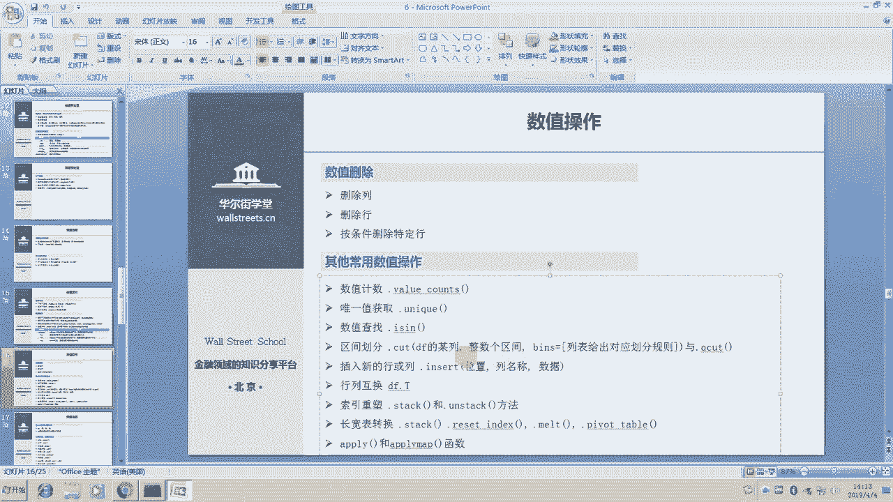

### 区间划分

`cut` 和 `qcut` 函数用于将连续数据划分为离散的区间（分箱），在金融分析中常用于估值分档。

```python
# cut：按自定义区间划分
bins = [-np.inf, 0, 20, 60, 100, np.inf]
labels = ['垃圾股', '价值股', '成长股', '高估值', '泡沫']
df['PE_category'] = pd.cut(df['PE'], bins=bins, labels=labels)

# qcut：按分位数划分（等频划分）
df['PE_quantile'] = pd.qcut(df['PE'], q=5) # 划分为5个分位数区间
```

### 插入行列与转置

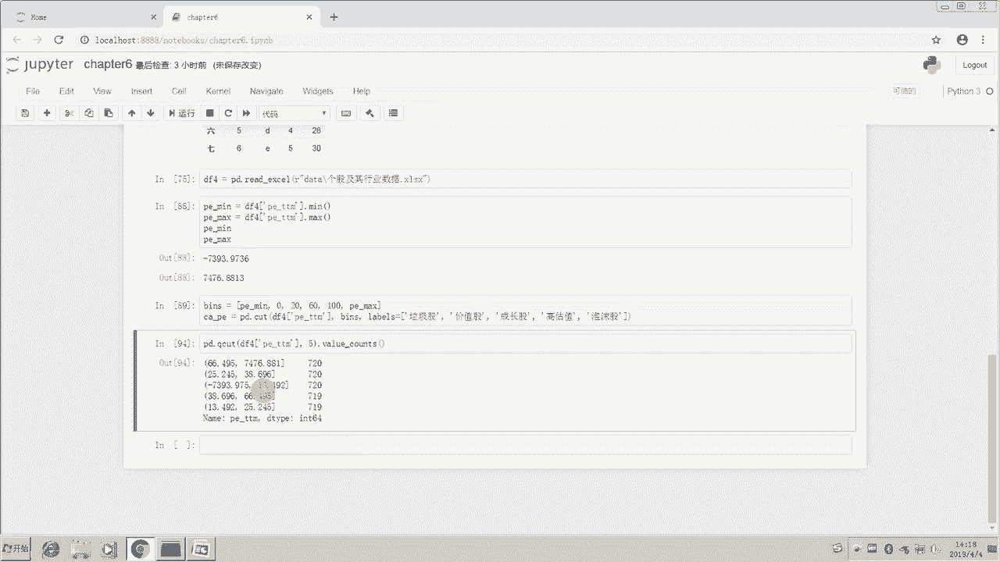

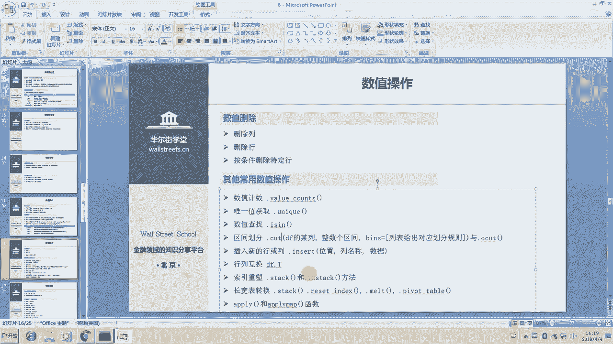

```python
# 插入新列
df.insert(loc=1, column='new_col', value=[1,2,3]) # 在位置1插入新列

# 转置 DataFrame
df_transposed = df.T
```

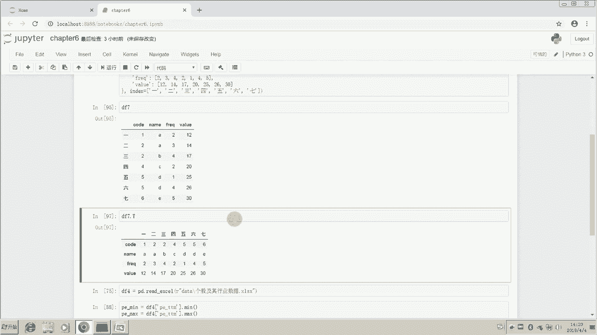


## 索引重塑、长宽表转换与应用函数

上一节介绍了一些离散化操作，本节中我们来看看如何改变数据的结构，包括堆叠（stack）、展开（unstack）以及长宽格式的转换，这些在处理面板数据时非常有用。

### 索引重塑（Stack/Unstack）

`stack` 将列索引“堆叠”到行索引，形成多层索引；`unstack` 是其逆操作。

```python
# 假设df有两层列索引（年份）和行索引（股票代码）
df_stacked = df.stack() # 将年份堆叠到行，形成（股票，年份）的多层索引
df_unstacked = df_stacked.unstack() # 将年份层展开回列
```

### 长宽表转换

*   **宽表转长表**：使用 `melt` 方法。
    ```python
    # id_vars: 作为标识符的列， value_vars: 需要被转换为值的列
    df_long = pd.melt(df, id_vars=['code', 'name'], value_vars=['2015', '2016', '2017'],
                      var_name='year', value_name='YOY')
    ```
*   **长表转宽表**：使用 `pivot_table` 方法（数据透视表）。
    ```python
    df_wide = df_long.pivot_table(index=['code', 'name'], columns='year', values='YOY')
    ```

### 应用函数：Apply

`apply` 和 `applymap` 允许将自定义函数应用于DataFrame。

```python
# apply：将函数应用于DataFrame的每一行或每一列
def add_one(x):
    return x + 1
df_applied = df.apply(add_one) # 默认应用于每一列

# applymap：将函数应用于DataFrame的每一个元素
df_applied_map = df.applymap(lambda x: x+1)

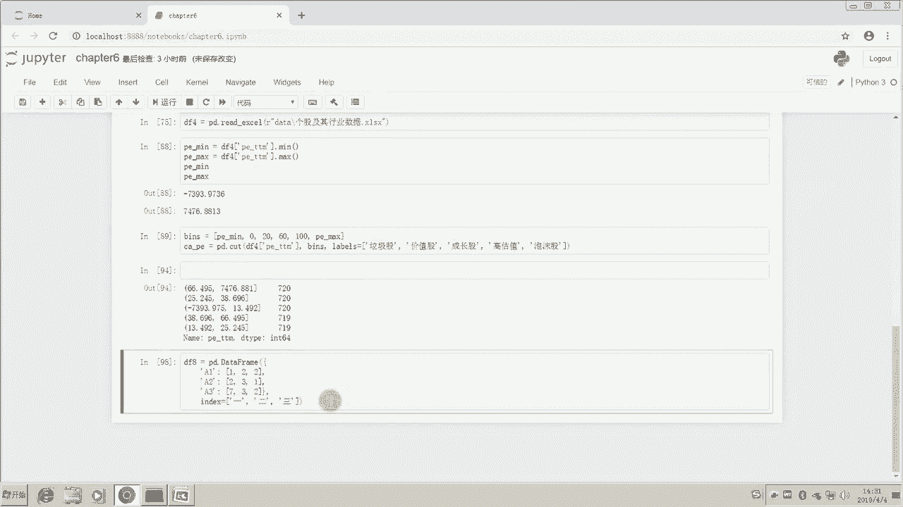


# apply也支持聚合函数
df_sum = df.apply('sum') # 对每一列求和
```

## 数据运算、汇总与时间序列处理

在本节最后，我们来看看Pandas中的数据运算、统计汇总以及如何处理金融数据分析中至关重要的时间序列数据。

### 数据运算

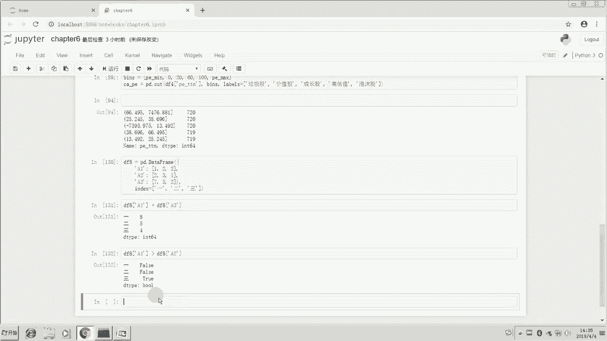

Pandas支持元素级的算术运算和比较运算。


```python
# 列与列之间的运算
df['new_col'] = df['col1'] + df['col2']

# 比较运算，产生布尔序列
bool_series = df['col1'] > df['col2']
```

### 汇总统计

Pandas提供了丰富的汇总统计方法。

```python
# 基本统计
df_count = df.count()   # 非NA值计数
df_sum = df.sum()       # 求和
df_mean = df.mean()     # 均值
df_std = df.std()       # 标准差
df_min = df.min()       # 最小值
df_max = df.max()       # 最大值
df_median = df.median() # 中位数

# 分位数
df_quantile = df.quantile([0.1, 0.5, 0.9]) # 计算10%，50%，90%分位数

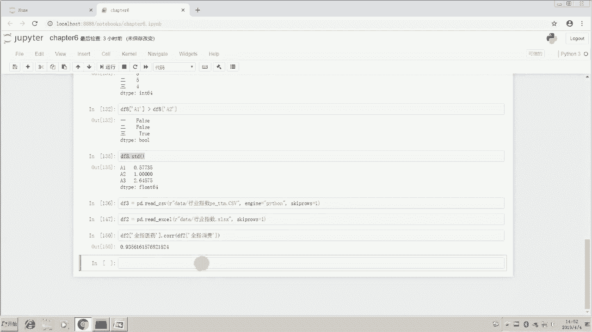

# 相关性矩阵（非常实用）
corr_matrix = df.corr()
# 计算两列之间的相关系数
corr_value = df['col1'].corr(df['col2'])
```


### 时间序列处理

金融数据大多是时间序列。Pandas的 `datetime` 类型和 `DatetimeIndex` 提供了强大的时间处理能力。

```python
from datetime import datetime

# 获取当前时间
now = datetime.now()
print(now.strftime('%Y-%m-%d')) # 格式化输出

# 字符串转datetime
date_str = '2019-04-04'
date_obj = datetime.strptime(date_str, '%Y-%m-%d')

# 设置时间索引
df['date'] = pd.to_datetime(df['date']) # 确保列为datetime类型
df.set_index('date', inplace=True)

# 基于时间索引的切片（非常方便！）
df_2018 = df['2018'] # 选取2018年全年数据
df_2018_jan = df['2018-01'] # 选取2018年1月数据
df_range = df['2018-01':'2019-01'] # 选取时间范围
```

## 总结

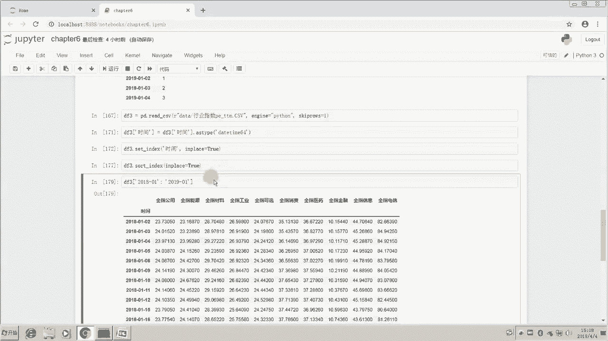


本节课中我们一起学习了Pandas在金融数据分析中的一系列核心操作。我们从数据选取开始，掌握了按标签、位置和条件筛选数据的技巧。接着，我们深入探讨了数值的替换、排序、删除以及区间划分，这些是数据清洗的基石。然后，我们学习了如何通过索引重塑和长宽表转换来改变数据结构以适应不同的分析需求，并介绍了`apply`函数来实现自定义计算。最后，我们涵盖了数据运算、汇总统计以及至关重要的时间序列处理方法。熟练掌握这些内容，将能极大地提升你处理和分析金融数据的效率与深度。