# Python金融量化分析：P9：IPython高级功能 🚀

在本节课中，我们将学习IPython的几个高级功能，包括调试、命令历史、输入输出获取、目录标签以及Notebook。这些工具能显著提升你的开发效率和调试体验。

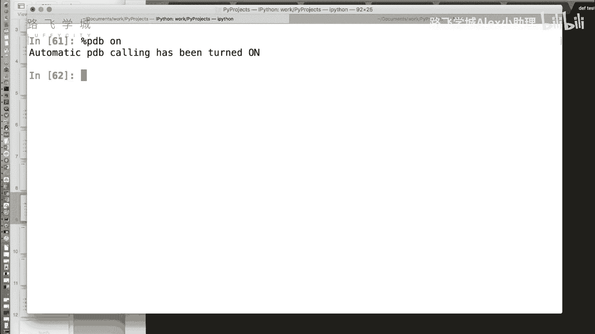

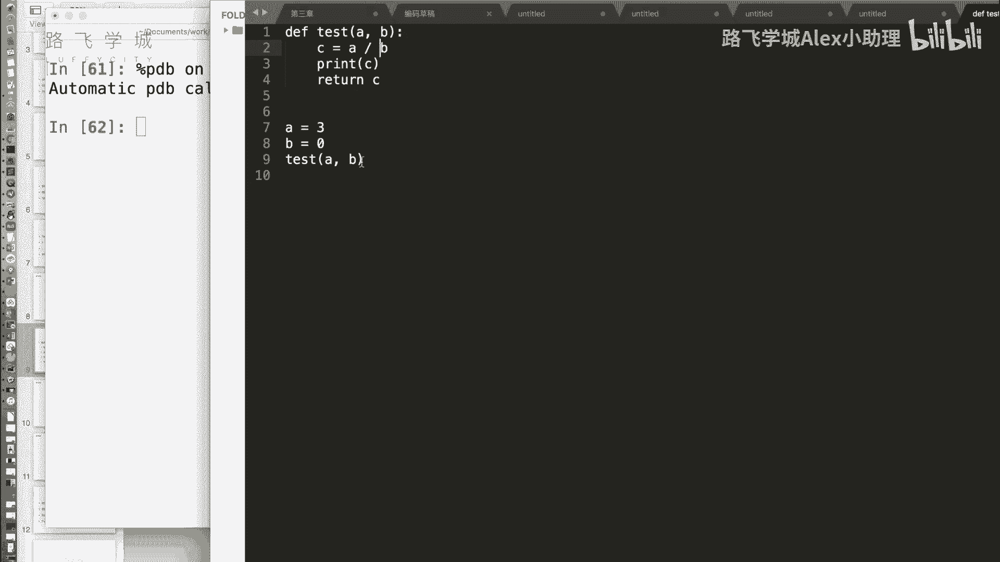

## 调试利器：PDB命令 🔍

在编写代码时，经常会遇到报错。传统调试方法需要手动添加断点，过程繁琐。IPython提供了一个名为`%pdb`的魔术命令，它是一个开关，能自动在代码报错前进入调试模式。

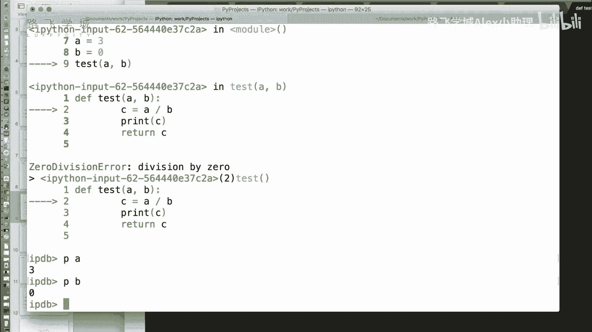

### 开启与关闭PDB
使用以下命令开启和关闭PDB调试模式：
```python
%pdb on  # 开启PDB调试模式
%pdb off # 关闭PDB调试模式
```

### PDB调试示例
假设我们有以下测试函数：
```python
def test(a, b):
    c = a / b
    return c
```
调用`test(3, 0)`会引发除零错误。在`%pdb on`模式下运行此代码，IPython会在报错行之前自动暂停，并进入交互式调试器。

在调试器中，可以使用`p`命令打印变量的当前值，帮助定位问题：
```python
p a  # 打印变量a的值，例如：3
p b  # 打印变量b的值，例如：0
```

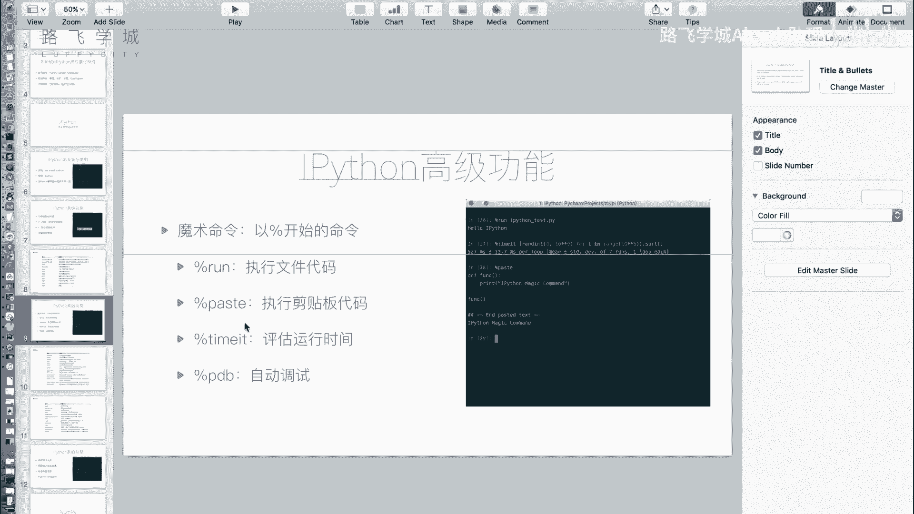

### 常用PDB命令
以下是PDB调试器中一些常用的命令：
*   `h`：查看帮助文档。
*   `q`：退出调试器。
*   `n`：执行下一行代码。
*   `break`：设置断点。

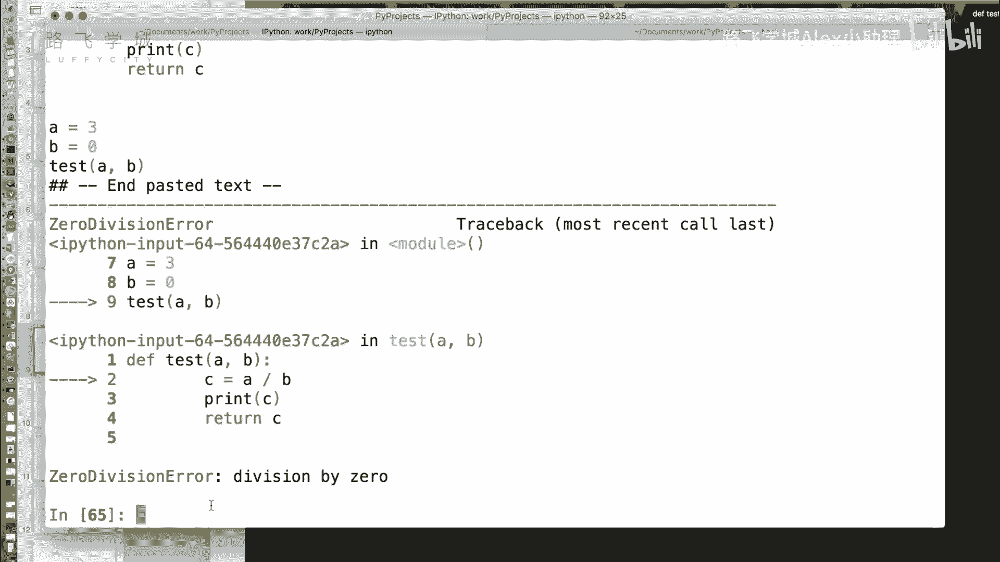

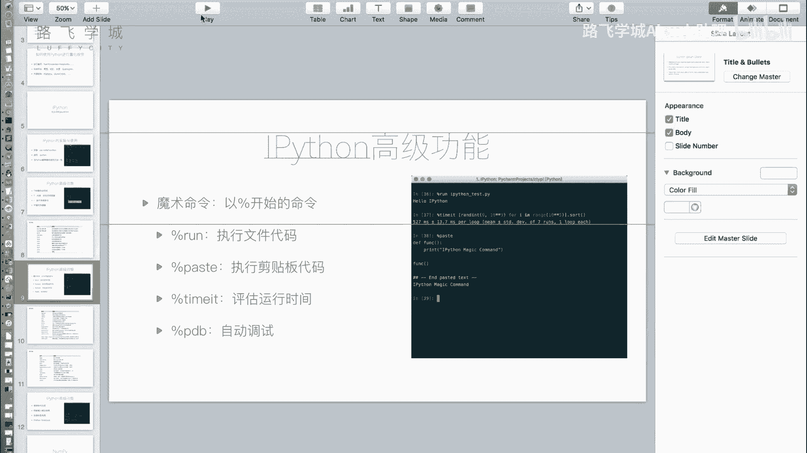

对于简单的错误检查，通常使用`p`命令查看变量状态就足够了。更复杂的调试可以使用`%debug`命令从头开始，或借助PyCharm等专业IDE。

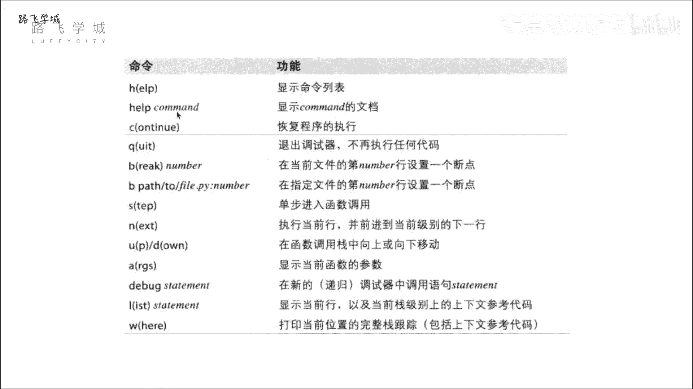

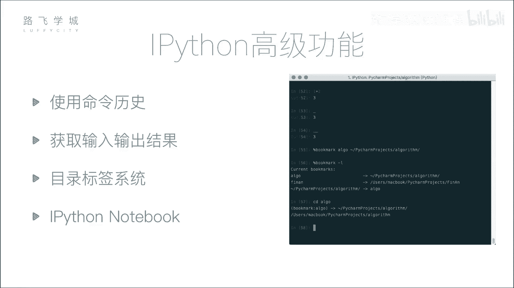

## 便捷操作：命令历史与输入输出 🔄

上一节我们介绍了调试工具，本节中我们来看看如何更高效地复用之前的命令和结果。

### 使用命令历史
在IPython中，可以使用上下箭头键浏览之前输入过的命令。此外，输入部分字符后按上箭头，可以搜索匹配该字符开头的历史命令。

例如，输入`a`后按上箭头，会循环显示历史中以`a`开头的命令。

### 获取历史输出与输入
IPython可以方便地获取之前代码块的输出和输入内容。

*   **获取输出**：使用单个下划线`_`获取上一行代码的输出结果。使用双下划线`__`获取上上一行的输出，依此类推。
    ```python
    a = 1
    b = 2
    a + b  # 输出：3
    _ * 10 # 获取上一行的输出3，并计算 3 * 10 = 30
    ```

*   **获取输入**：使用`_i`加行号（例如`_i72`）可以获取指定行输入的代码字符串。使用`_ih`可以获取整个输入历史列表。

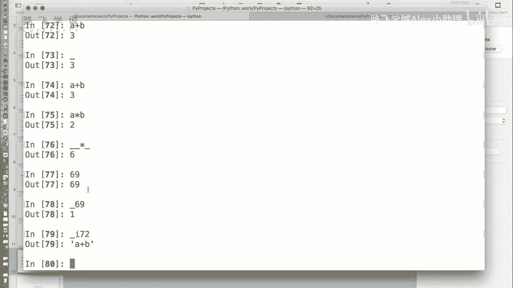

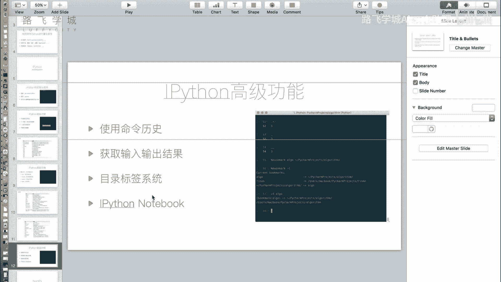

## 高效导航：目录标签系统 📂

在不同项目或目录间频繁切换时，反复输入长路径非常麻烦。IPython的`%bookmark`魔术命令可以创建目录别名，实现快速跳转。

### 书签管理命令
以下是管理目录书签的常用命令：

*   **添加书签**：`%bookmark 别名 目录路径`
*   **查看所有书签**：`%bookmark -l`
*   **跳转到书签目录**：`cd 别名`
*   **删除特定书签**：`%bookmark -d 别名`
*   **删除所有书签**：`%bookmark -r`

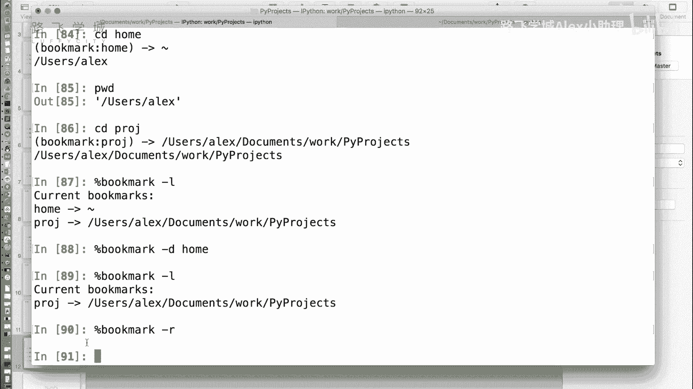

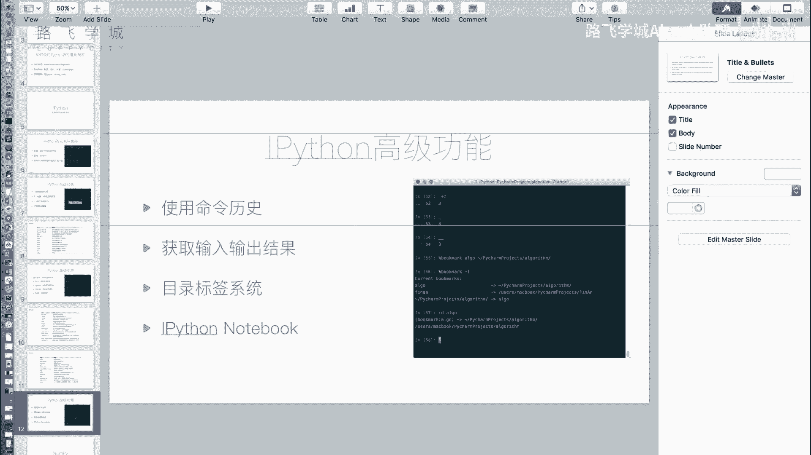

例如：
```python
%bookmark proj /home/user/my_project  # 为项目目录创建别名
%bookmark -l                          # 列出所有书签
cd proj                               # 快速跳转到项目目录
```

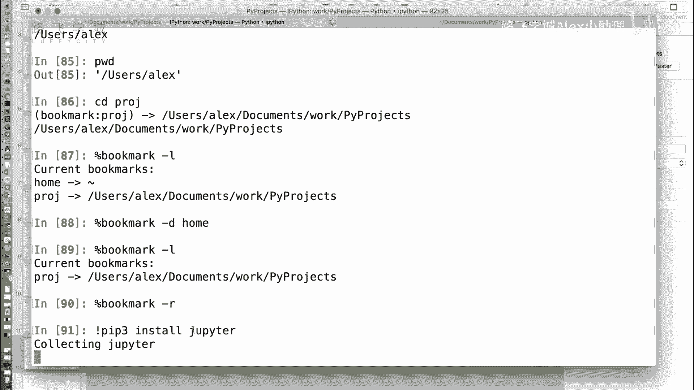


## 交互式笔记本：Jupyter Notebook 📓

除了命令行界面，IPython生态还提供了强大的Web交互式笔记本——Jupyter Notebook。它特别适合数据分析、教学和撰写包含代码、图表和文本的报告。

### 启动Jupyter Notebook
首先需要安装`jupyter`模块。在系统命令行中运行以下命令启动：
```bash
jupyter notebook
```
该命令会自动在浏览器中打开一个本地Web页面，显示当前目录的文件管理器。

### Notebook的核心功能
在Notebook中，你可以：
1.  创建新的`Python`笔记本文档。
2.  在单元格中编写并运行代码，结果（包括文本、表格、图表）会直接显示在下方。
3.  将单元格类型切换为`Markdown`，用于编写格式化的说明文本、标题和公式。
4.  将整个笔记本导出为多种格式，如`.py`脚本、`.html`网页、`.pdf`文档等。

Notebook将代码执行、结果展示和文档撰写融为一体，是进行数据探索、可视化和分享工作成果的绝佳工具。

## 课程总结 📝

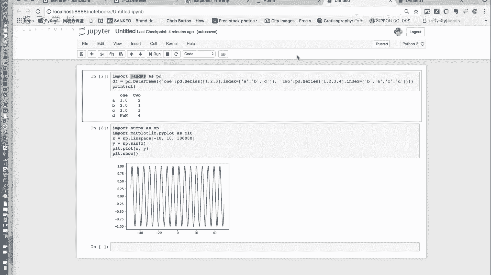

本节课我们一起学习了IPython的多个高级功能：
1.  **`%pdb`调试命令**：能自动在代码报错前进入调试状态，方便快速定位问题。
2.  **命令历史与输入输出获取**：利用上下箭头和历史变量（`_`, `_i`），可以高效复用之前的命令和结果。
3.  **`%bookmark`目录标签**：通过创建目录别名，实现项目间的快速导航。
4.  **Jupyter Notebook**：一个基于Web的交互式计算环境，完美结合了代码执行、结果可视化和文档编写，尤其适合数据分析与展示。


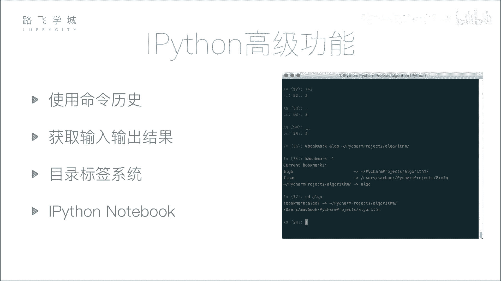


掌握这些工具，能让你的Python编程，特别是在金融量化分析这类交互式探索场景中，变得更加流畅和高效。