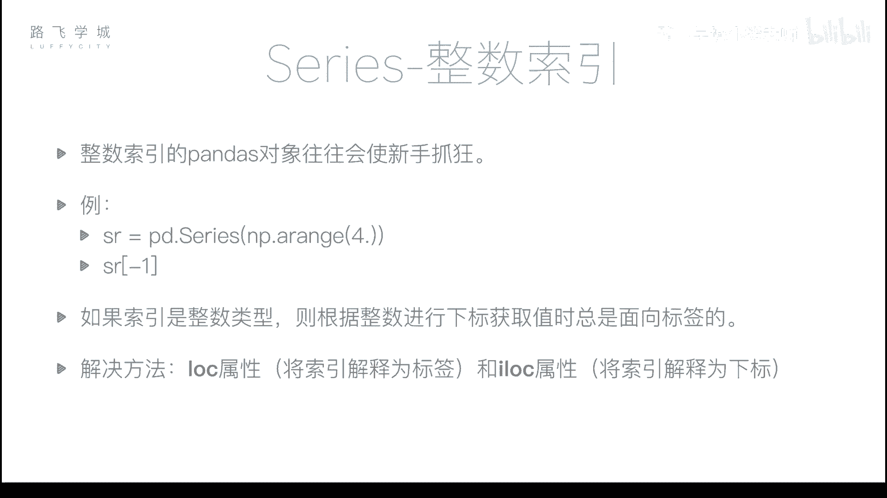
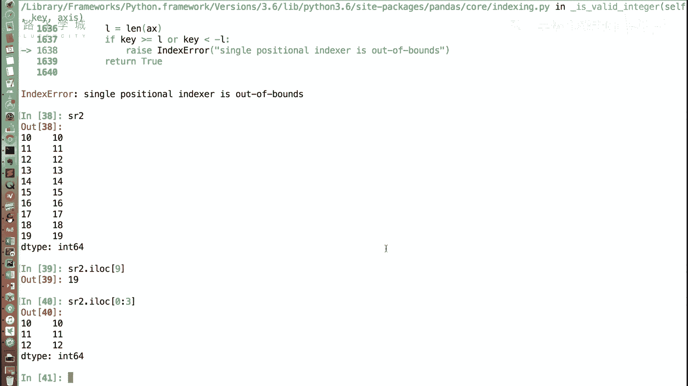
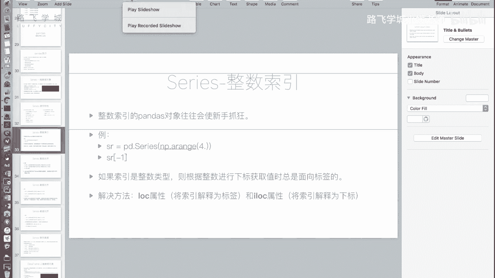

# Python金融量化：P9：Series整数索引问题 🐍

在本节课中，我们将要学习Pandas Series对象在使用整数索引时可能遇到的一个关键问题。这个问题常常让初学者感到困惑，但理解并掌握解决方法后，就能轻松应对。



上一节我们介绍了Series的一些基本特性，本节中我们来看看当Series的索引为整数时，需要注意的特殊情况。


## 问题引入：整数索引的歧义

整数索引是指索引值为数字的Series。例如，创建一个没有指定索引的Series，它会自动生成从0开始的整数索引。

```python
import pandas as pd
import numpy as np

# 创建一个自动生成整数索引的Series
sr = pd.Series(np.arange(20))
print(sr)
```

现在，我们通过切片创建一个新的Series对象 `sr2`，它包含原Series从索引10开始到末尾的部分。

```python
# 通过切片创建新Series
sr2 = sr[10:].copy()
print(sr2)
```

此时，`sr2` 的索引是从10开始的整数。如果我们想获取 `sr2` 的第一个值，直觉上可能会尝试 `sr2[0]`。但这样操作会报错。同样，尝试 `sr2[10]` 也不会返回我们期望的第一个值（标签为10的值），而是返回索引位置为10的值（即原Series的第11个值）。这就是整数索引带来的歧义：Pandas无法确定中括号 `[]` 内的数字是代表“标签”还是代表“位置下标”。

## 解决方案：`.loc` 与 `.iloc`

为了解决这个歧义，Pandas提供了两个明确的属性来区分操作意图：
*   **`.loc[]`**：**基于标签** 进行索引。中括号内的值被解释为索引的标签。
*   **`.iloc[]`**：**基于位置** 进行索引。中括号内的值被解释为从0开始的位置下标。

以下是具体使用方法：

```python
# 使用 .loc，明确按标签获取
value_by_label = sr2.loc[10]  # 获取标签为10的值
print(f"使用 .loc[10] 获取的值: {value_by_label}")

# 使用 .iloc，明确按位置获取
value_by_position = sr2.iloc[0]  # 获取第一个位置（下标0）的值
print(f"使用 .iloc[0] 获取的值: {value_by_position}")
```

这两个属性不仅支持单个值的获取，也完全支持切片、布尔索引和花式索引。

以下是 `.loc` 和 `.iloc` 在切片上的应用示例：

```python
# 使用 .iloc 进行位置切片（获取前3个元素）
slice_by_iloc = sr2.iloc[0:3]
print("使用 .iloc[0:3] 切片:")
print(slice_by_iloc)

# 使用 .loc 进行标签切片（获取标签10到12的元素）
slice_by_loc = sr2.loc[10:12]
print("\n使用 .loc[10:12] 切片:")
print(slice_by_loc)
```

## 核心要点总结



本节课中我们一起学习了Pandas Series整数索引的核心问题与解决方案。

1.  **问题本质**：当Series的索引为整数时，直接使用 `sr[整数]` 会产生歧义，Pandas默认会将其解释为**标签索引**，这可能与初学者期望的**位置索引**行为不符。
2.  **解决方案**：使用 `.loc` 和 `.iloc` 属性来明确索引方式。
    *   使用 **`sr.loc[]`** 进行**基于标签**的索引。
    *   使用 **`sr.iloc[]`** 进行**基于位置**的索引。
3.  **最佳实践**：只要涉及到整数索引，为了代码清晰且避免错误，**强烈建议使用 `.loc` 或 `.iloc`** 来明确你的意图。



记住这个简单的规则，你就能轻松驾驭Series的整数索引，不再为此“疯掉”。在后续处理金融时间序列数据（其索引常为日期）时，这个概念将更加重要。