# Python金融时间序列分析与量化交易：1：课程内容与大纲介绍 📚

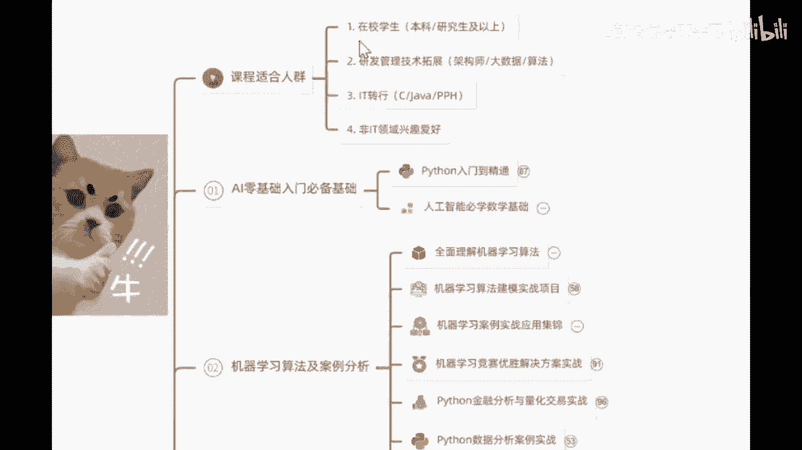

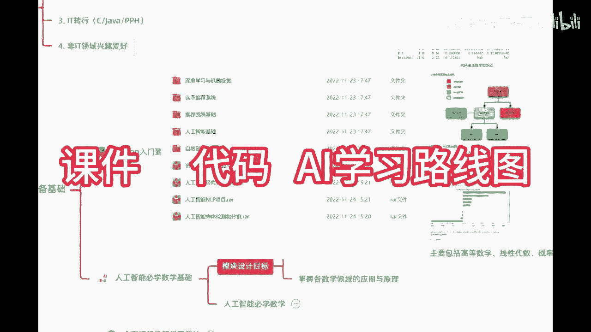

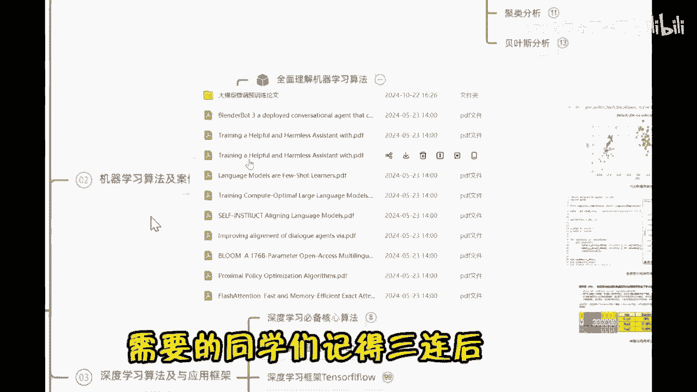

在本节课中，我们将要学习这门课程的整体内容安排、核心模块以及学习风格，为后续的深入学习打下基础。

## 课程概述

本课程是一门零基础的Python金融分析与量化交易实战课程。课程的核心重点在于如何使用Python代码实现金融数据分析与量化交易策略，而非讲授金融理论知识或炒股技巧。课程内容全部基于实践数据，通过代码演示完成各项任务。

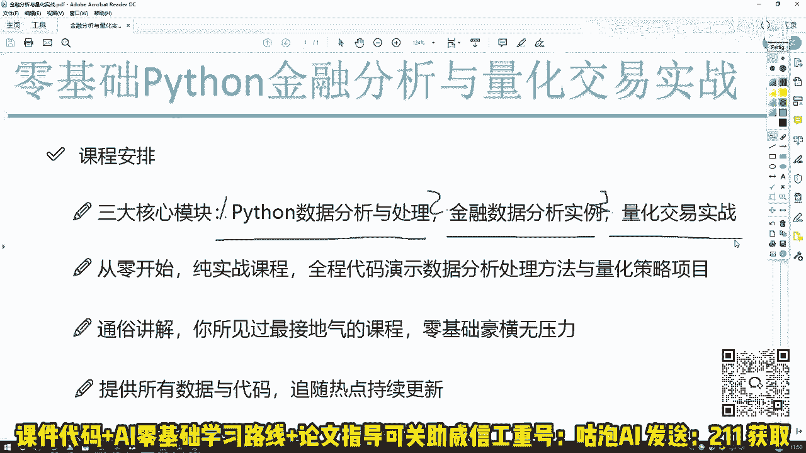

## 核心模块介绍

上一节我们介绍了课程的整体定位，本节中我们来看看课程具体包含的三大核心模块。

课程内容主要涉及以下三大模块：

1.  **Python数据分析与处理**
    本模块将讲解如何使用Python处理和分析数据。核心是掌握在Python中“玩转”数据的方法。

2.  **金融数据分析**
    本模块将聚焦于股票等金融数据。我们将学习如何对金融时间序列数据进行操作、分析和建模。

3.  **量化交易策略**
    本模块将深入量化交易。我们将学习如何将策略想法编写成代码，并在历史数据上进行回测，以评估策略的盈利能力和各项指标。

## 课程工具与风格

了解了核心模块后，我们来看看课程中将使用的主要工具以及教学风格。

课程全程采用代码实战演示，没有传统PPT。主要使用Jupyter Notebook等工具进行讲解，确保所有知识点都能通过代码实现。

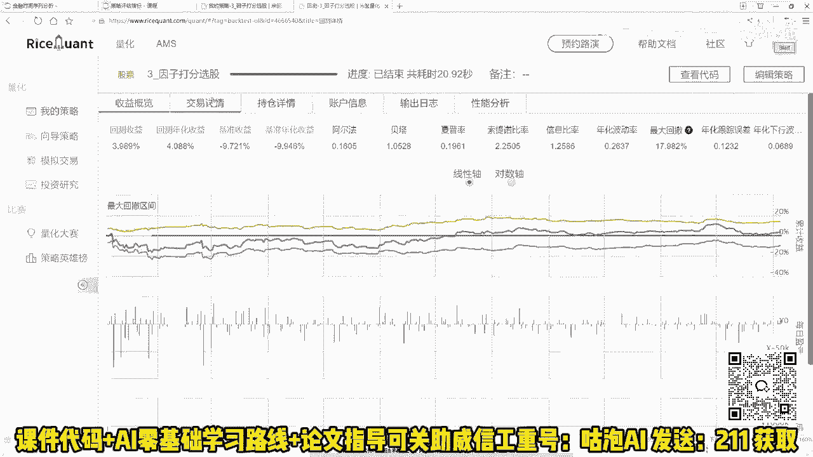

以下是课程的主要特点：

*   **零基础入门**：课程从Python基础及必要工具包讲起，无需前置知识。
*   **纯实战导向**：每节课均围绕具体代码案例展开，重点在于“如何做”。
*   **通俗易懂**：采用接地气的讲解方式，让复杂概念变得简单明了。
*   **资料完备**：课程提供所有涉及到的数据、代码和资料，方便练习。

## 详细课程大纲

最后，我们来详细了解一下课程的具体大纲安排。

课程大纲同样分为三个循序渐进的模块：

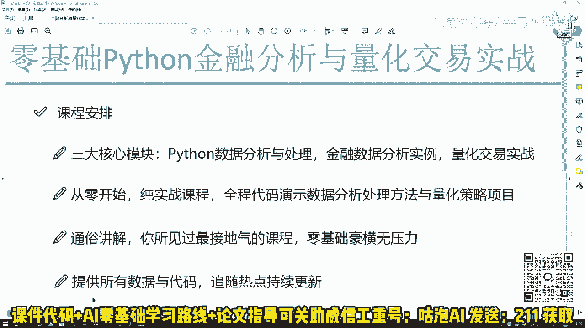

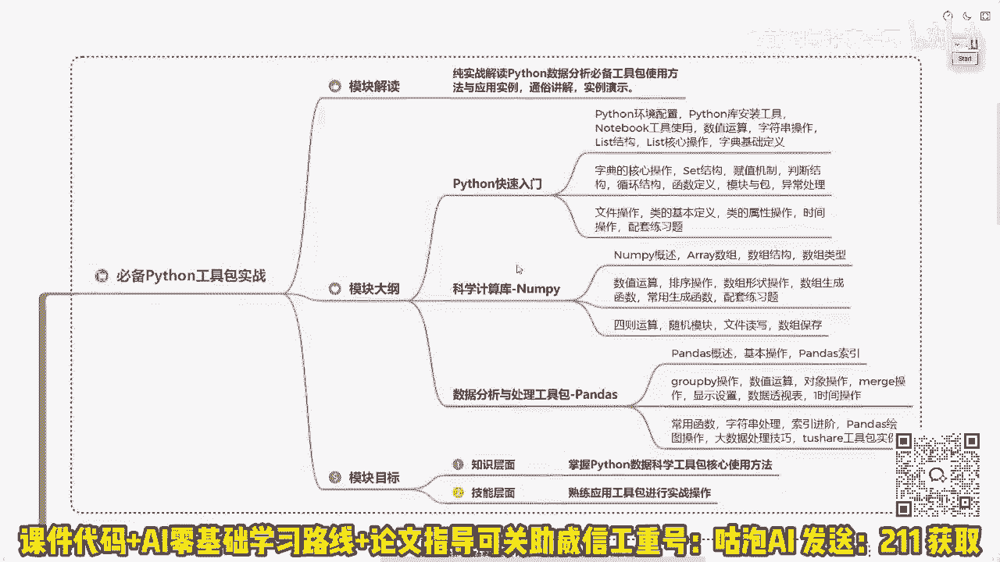

**第一模块：Python必备工具包实战**
本模块是基础篇。我们将学习Python核心知识点、环境配置与安装，并重点掌握两个在后续课程中至关重要的工具包：
*   **NumPy**：用于数值计算。
*   **Pandas**：用于数据分析和处理。

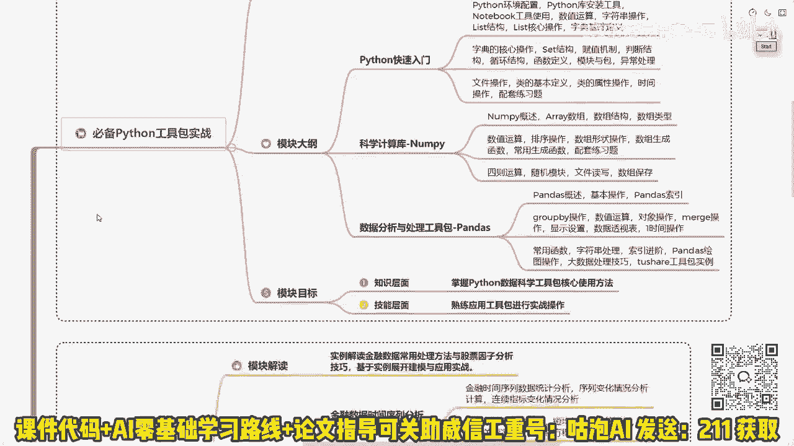

**第二模块：Python金融数据分析实战**
本模块是过渡篇。我们将拿到真实的股票数据，学习如何对其进行分析、建模和统计。同时，我们将首次使用量化回测平台，完成第一个回测项目，验证策略在历史数据中的表现。

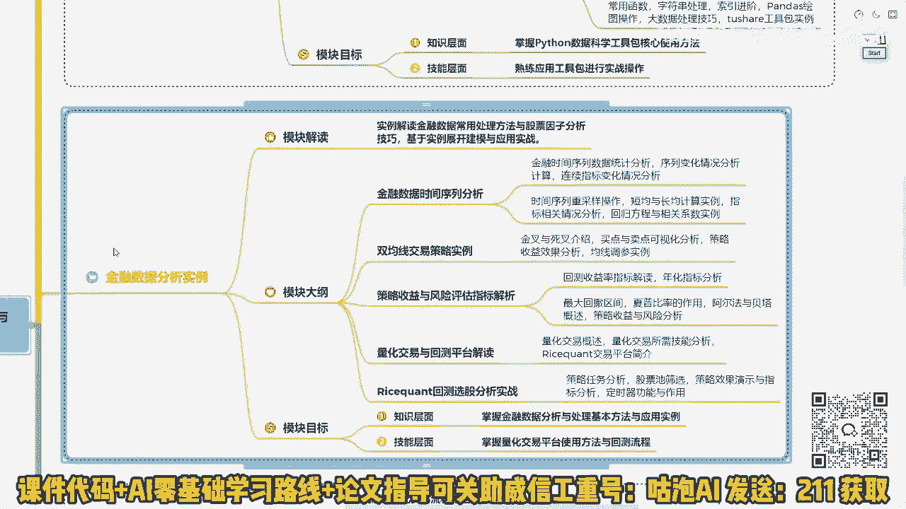

**第三模块：量化交易策略深入实战**
本模块是进阶篇。我们将深入量化交易领域，学习常用的经典策略。重点关注在实际操作中如何处理数据、分析因子、改进策略，并最终在回测中获得理想的收益结果。

## 总结

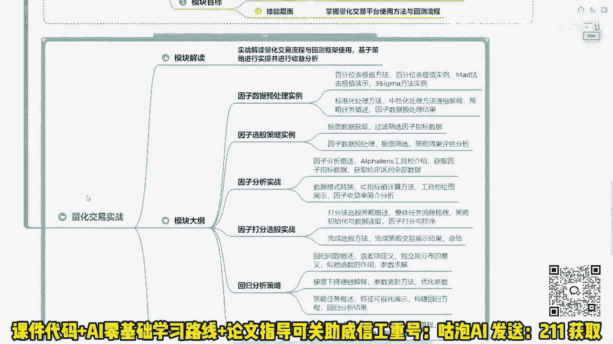

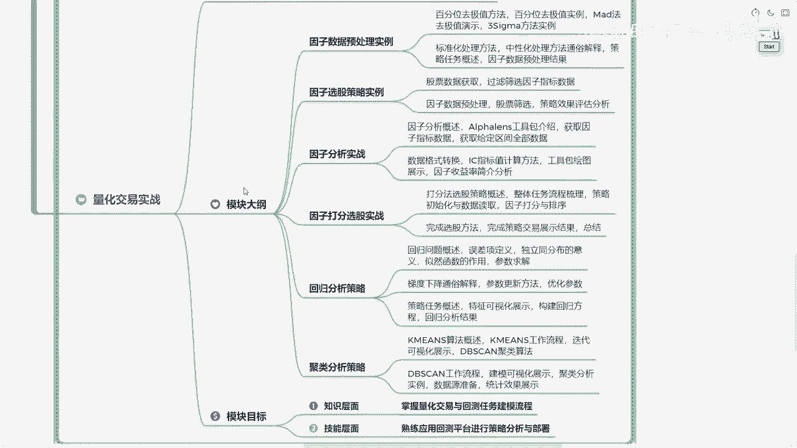

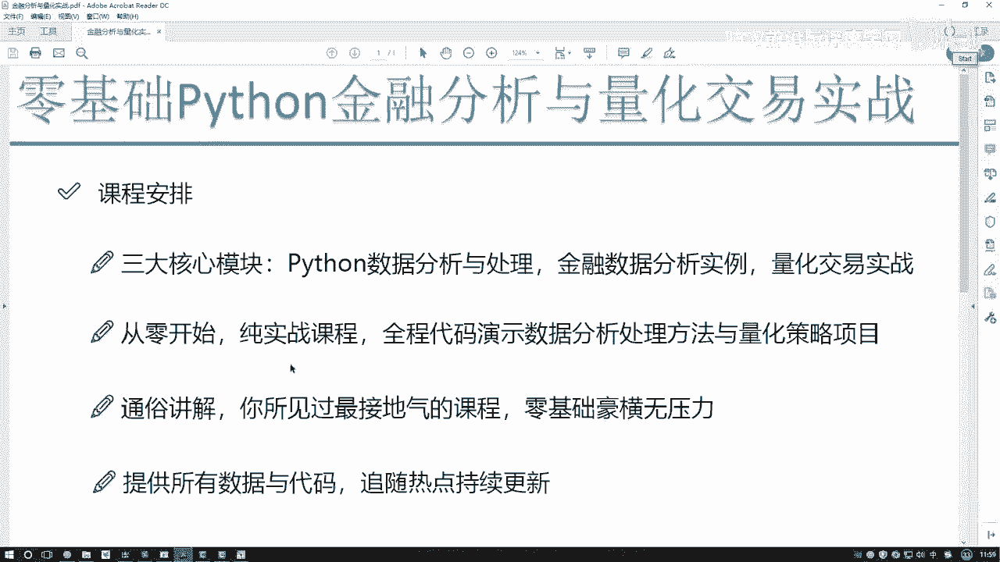

本节课中，我们一起学习了这门《Python金融时间序列分析与量化交易》课程的整体框架。我们明确了课程纯代码实战的定位，了解了涵盖**数据处理**、**金融分析**和**量化策略**的三大核心模块，熟悉了零基础、重实践的教学风格，并预览了从基础工具到策略实战的详细学习路径。接下来，我们将正式进入代码世界，开始第一模块的学习。