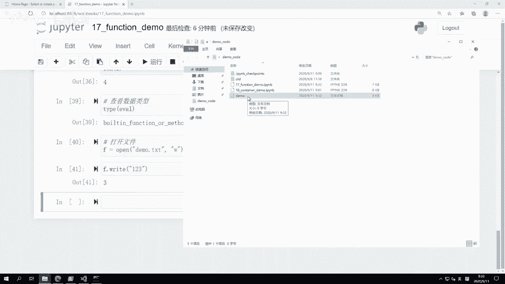
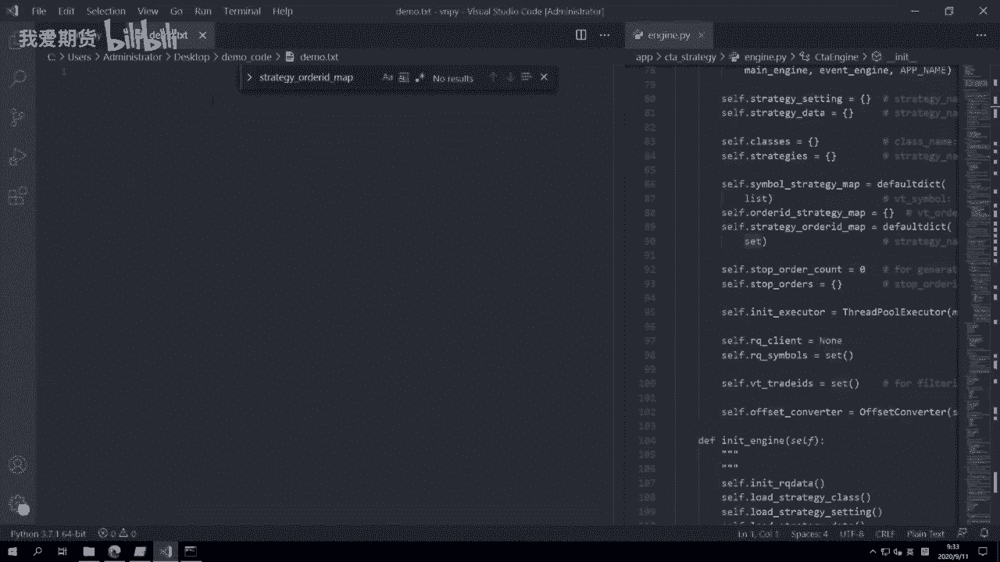
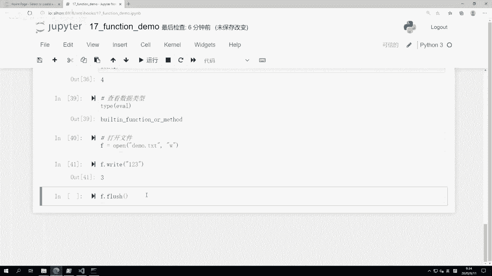
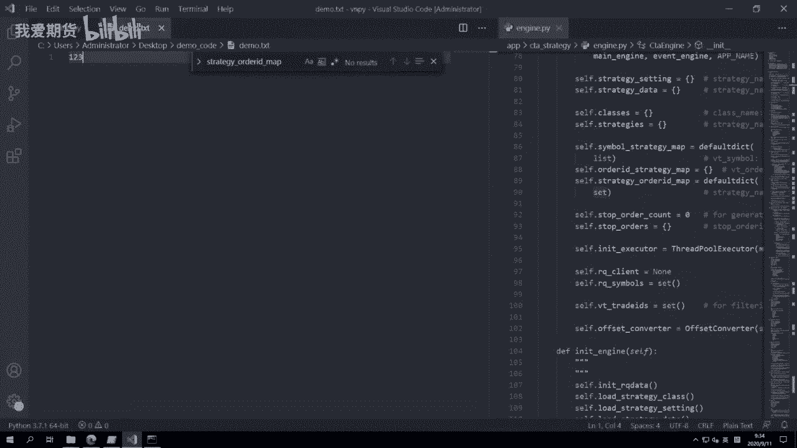
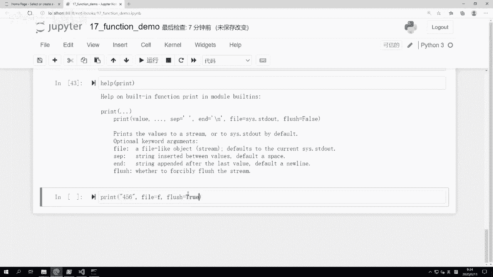
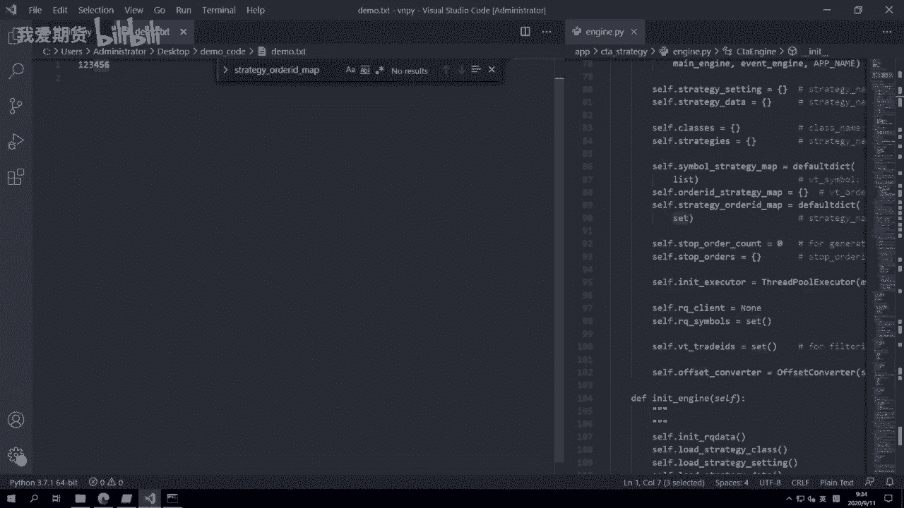
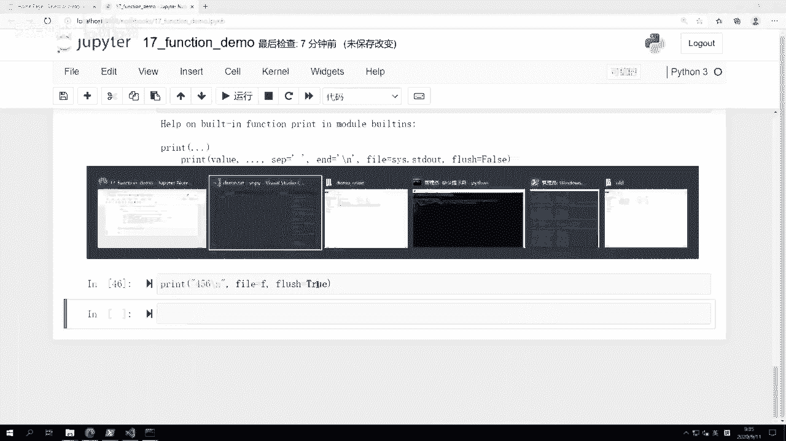
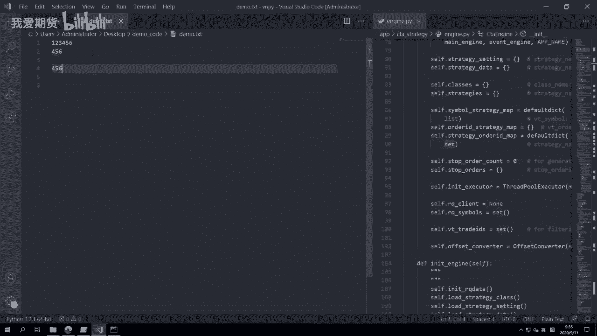
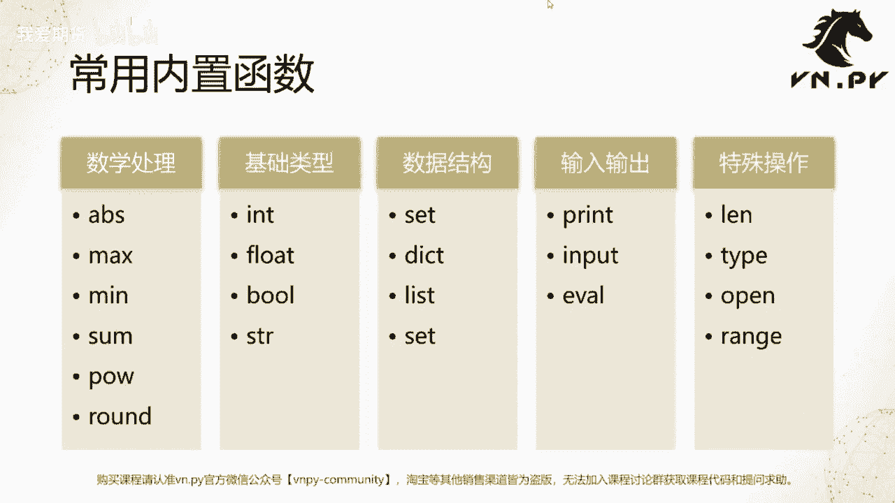

# Python量化开发：17：函数的定义与内置函数详解

在本节课中，我们将要学习Python中一个非常重要的概念——函数。我们将从理解函数的基本概念开始，然后详细探讨Python内置的一些常用函数及其用法。

## 什么是函数？

上一节我们完成了对Python数据容器的阶段性讲解。本节中，我们来看看编程中的“函数”。

在数学或代数中，函数大家可能已经学过。在编程语言层面，函数的作用可以用一个词来形容：**抽象封装**。其主要目的有两个：
1.  **代码复用**：一段计算逻辑如果经常被使用，将其封装成函数可以避免每次使用时都重复编写相同的代码，从而减少代码量，增强可维护性。
2.  **简化代码**：使代码逻辑更清晰，更容易被人理解。

## 重新认识 `print` 函数

我们接触的第一个Python函数就是 `print`。之前我们一直在使用它输出内容，现在我们来更全面地认识它。

`print` 是Python的一个内置函数，主要用于输出内容。它的功能比我们最初使用的更强大：
*   可以输出单个或多个数据。
*   可以使用不同的分隔符分隔多个数据。
*   可以指定输出结束时的字符。
*   不仅可以在控制台输出，还可以将内容输出到文件中。

以下是 `print` 函数的一些用法示例：

```python
# 打印单个值
print("Hello, World!")
print(1)
print(True)

# 打印多个值，默认用空格分隔
print("今天上海天气是", "暴雨", "温度是", 26, "度")

# 使用 sep 参数指定分隔符
print("今天上海天气是", "暴雨", "温度是", 26, "度", sep=" & ")

# 使用 end 参数指定结束符（默认是换行符 \n）
print(1, end="+")
print(2, end="+")
print(3)
# 输出结果为：1+2+3
```

运行函数非常简单：先输入函数名，后跟括号，括号内传入参数。前面直接传入值的方式称为**位置参数**。而像 `sep=" & "` 这样指定参数名称的方式称为**关键字参数**，通常用于传递可选属性。

### 如何了解一个函数的用法？

当你遇到一个新函数时，如何知道它有哪些参数以及哪些是可选的？Python提供了一个非常贴心的 `help()` 函数。

```python
help(print)
```

执行上述代码，你会看到 `print` 函数的详细说明，包括每个参数的含义和默认值，例如 `sep` 默认为空格，`end` 默认为换行符 `\n`，`file` 默认为系统标准输出。

## 其他常用内置函数

除了 `print`，Python还提供了许多其他内置函数。我们可以将它们大致分为几类：数学处理、基础类型转换、数据结构操作、输入输出和特殊操作。

接下来，我们逐一演示这些常用函数。

### 数学处理函数

以下是几个常用的数学处理函数：

*   **`abs(x)`**：返回数字 `x` 的绝对值。
    ```python
    abs(-100)  # 返回 100
    ```
*   **`max(iterable)` / `max(a, b, c...)`**：返回给定参数的最大值。
    ```python
    max(4, 40)  # 返回 40
    ```
*   **`min(iterable)` / `min(a, b, c...)`**：返回给定参数的最小值。
    ```python
    min(4, 40)  # 返回 4
    ```
*   **`sum(iterable)`**：对可迭代对象（如列表、元组）中的所有元素求和。
    ```python
    sum(range(1, 101))  # 计算1到100的和，返回 5050
    ```
*   **`pow(x, y)`**：返回 `x` 的 `y` 次幂，等同于 `x ** y`。
    ```python
    pow(8, 2)  # 返回 64
    ```
*   **`round(number, ndigits)`**：对浮点数进行四舍五入，`ndigits` 指定保留的小数位数。
    ```python
    round(1.595, 2)  # 返回 1.59
    round(1.5)       # 返回 2 (注意：返回的是浮点数 2.0)
    ```

### 基础类型转换函数

这四个函数用于在不同数据类型间进行转换：



*   **`str(object)`**：将对象转换为字符串。
    ```python
    str(123)  # 返回 '123'
    ```
*   **`int(x)`**：将 `x` 转换为整数。
    ```python
    int('456')  # 返回 456
    ```
*   **`float(x)`**：将 `x` 转换为浮点数。
*   **`bool(x)`**：将 `x` 转换为布尔值。



### 输入输出函数





我们已经详细讲解了 `print`。另一个重要的输入函数是 `input`。





*   **`input([prompt])`**：接受用户的输入，并以字符串形式返回。可选参数 `prompt` 是提示信息。
    ```python
    name = input("请输入你的名字：")
    print("你好，", name)
    ```
    **注意**：即使用户输入的是数字，`input()` 返回的也是字符串类型。





### 特殊操作函数

这些函数执行一些特定的、有用的操作。

*   **`len(s)`**：返回对象（如字符串、列表、元组）的长度。
    ```python
    my_list = [1, 2, 3, 4]
    len(my_list)  # 返回 4
    ```
*   **`type(object)`**：返回对象的类型。
    ```python
    type(123)        # 返回 <class 'int'>
    type([1,2,3])    # 返回 <class 'list'>
    type(print)      # 返回 <class 'builtin_function_or_method'>
    ```
*   **`eval(expression)`**：执行一个字符串表达式，并返回结果。这体现了Python的动态特性。
    ```python
    eval('99 + 100 / 2')  # 返回 149.0
    ```
*   **`open(file, mode)`**：用于打开一个文件，返回文件对象。这是进行文件读写的基础。
    ```python
    # 以写入模式打开文件
    f = open('demo.txt', 'w')
    f.write('Hello, File!')
    f.flush()  # 将缓冲区内容写入硬盘
    f.close()  # 关闭文件，释放资源

    # 使用 print 写入文件
    with open('demo.txt', 'a') as f: # ‘a’ 表示追加模式
        print('New line', file=f)
    ```
    **重要**：操作文件后，务必使用 `close()` 方法关闭文件，或使用 `with` 语句（后续会讲）自动管理。
*   **`range(start, stop[, step])`**：生成一个整数序列，常用于 `for` 循环。在Python 3中，它返回的是一个“range对象”（可迭代器），而不是直接生成列表。
    ```python
    # 生成一个range对象
    r = range(1, 5)  # 包含 1, 2, 3, 4
    print(r)         # 输出 range(1, 5)

    # 如果需要列表，可以强制转换
    list_from_range = list(range(1, 5))  # 返回 [1, 2, 3, 4]
    ```
    `range` 对象更节省内存，但在需要列表操作时，需用 `list()` 进行转换。

## 总结



本节课中，我们一起学习了Python函数的核心概念——**抽象封装**，它主要用于代码复用和简化逻辑。我们深入探讨了最常用的 `print` 函数的各种参数，并学习了如何使用 `help()` 函数获取帮助信息。此外，我们还分类介绍并演示了Python中一系列常用的内置函数，包括数学运算、类型转换、输入输出和特殊操作（如 `len`, `type`, `eval`, `open`, `range`）。掌握这些内置函数是编写高效、简洁Python代码的基础。