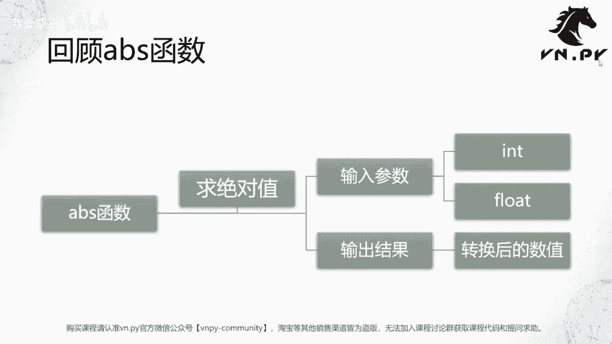
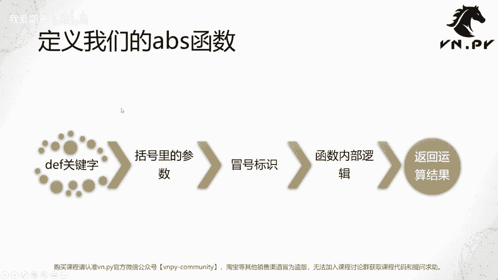
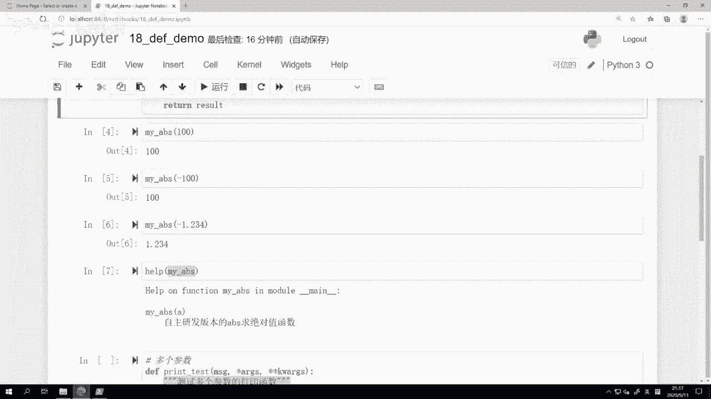
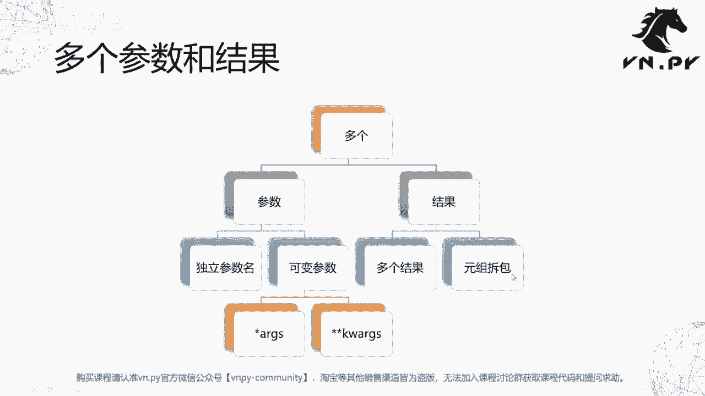
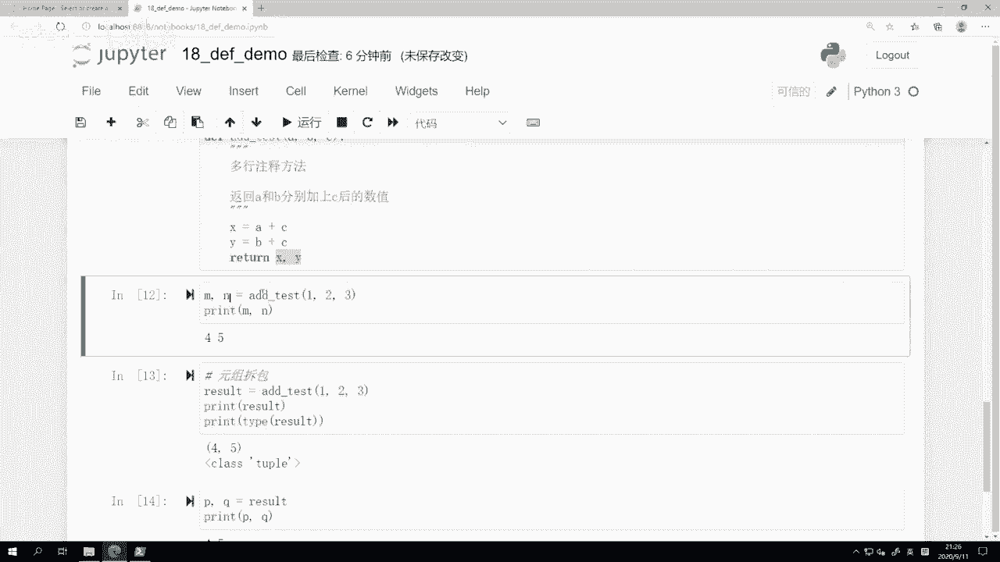
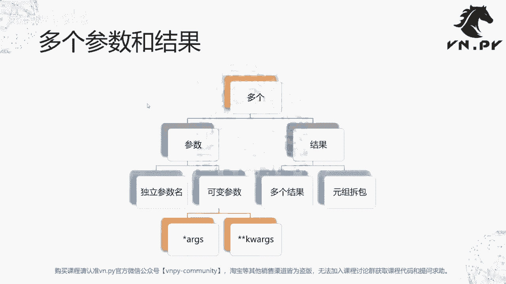

# 量化交易零基础入门：18：函数的参数与返回值 🧮

在本节课中，我们将学习如何定义自己的函数，并深入理解函数的核心概念：参数与返回值。我们将从零开始，创建一个简单的函数，并逐步探索如何让函数接收多个参数以及返回多个结果。

---

## 回顾与概述



上一节我们初步接触了函数的概念，并了解了Python内置函数的用法。本节中，我们将亲手开发自己的函数，重点掌握如何定义函数的参数以及如何让函数返回计算结果。

函数是组织代码、实现特定功能的基本单元。理解参数（输入）和返回值（输出）是掌握函数的关键。

---



## 定义第一个函数：绝对值函数

我们将从模仿Python内置的 `abs()` 函数开始，创建一个名为 `my_abs` 的绝对值函数。

### 函数定义的基本结构

在Python中，使用 `def` 关键字来定义函数。其基本流程可分为五步：
1.  使用 `def` 关键字。
2.  为函数命名。
3.  在括号内定义参数。
4.  在冒号后编写函数内部逻辑。
5.  使用 `return` 语句返回结果。

### 代码实现

以下是 `my_abs` 函数的完整实现：

```python
def my_abs(a):
    """
    自主开发版本的abs求绝对值函数
    """
    if a > 0:
        result = a
    else:
        result = -a
    return result
```

**代码解析：**
*   `def my_abs(a):`：定义了一个名为 `my_abs` 的函数，它接受一个参数 `a`。
*   三引号 `"""..."""` 内的字符串是函数的**文档字符串**，可以通过 `help()` 函数查看。
*   `if a > 0:`：判断输入的数字是否大于0。
*   `result = a`：如果是正数，结果就是它本身。
*   `else:`：否则（即数字小于或等于0）。
*   `result = -a`：对数字取反。对于0，`-0` 的结果依然是0。
*   `return result`：将计算得到的 `result` 返回给调用者。

定义完成后，我们可以像使用内置函数一样调用它：

```python
print(my_abs(100))    # 输出: 100
print(my_abs(-100))   # 输出: 100
print(my_abs(-1.234)) # 输出: 1.234
```

### 查看函数文档

使用 `help()` 函数可以查看我们为函数编写的文档字符串：

```python
help(my_abs)
```
输出内容将包含我们写在三引号内的说明。



---

## 进阶：处理多个参数与返回值

我们刚刚定义的 `my_abs` 函数是一个简单的特例：一个输入，一个输出。在实际开发中，函数往往需要处理更复杂的情况。

### 接收多个参数



Python函数可以灵活地接收任意数量的参数。以下是两种处理多参数的高级方式：

1.  **可变位置参数 (`*args`)**：接收任意数量的普通参数，在函数内部作为一个**元组**处理。
2.  **可变关键字参数 (`**kwargs`)**：接收任意数量的“参数名=值”形式的参数，在函数内部作为一个**字典**处理。

以下是一个演示函数：

```python
def print_test(message, *args, **kwargs):
    print(f"信息: {message}")
    print(f"args的类型是: {type(args)}")
    for arg in args:
        print(f"  位置参数: {arg}")

    print(f"kwargs的类型是: {type(kwargs)}")
    for key, value in kwargs.items():
        print(f"  关键字参数: {key} = {value}")
```

**调用示例：**

```python
# 只传递必需参数
print_test("Hello World")

# 传递多个位置参数
print_test("测试打印函数", 1, 2, 3, 4, 5)

# 传递关键字参数
print_test("参数测试", ma=30, rsi=20, cci=50)
```

通过这种方式，函数的灵活性和通用性得到了极大增强。

### 返回多个结果

在许多编程语言中，函数只能返回一个值。但在Python中，我们可以“返回”多个值，这背后利用了**元组拆包**的特性。

定义一个返回两个结果的函数：

```python
def add_test(a, b, c):
    x = a + c
    y = b + c
    return x, y  # 实际上返回的是一个元组 (x, y)
```

**调用方式：**

```python
# 方法一：直接用多个变量接收，Python会自动拆包
m, n = add_test(1, 2, 3)
print(m, n)  # 输出: 4 5

# 方法二：验证其本质是返回一个元组
result = add_test(1, 2, 3)
print(result)        # 输出: (4, 5)
print(type(result))  # 输出: <class 'tuple'>

# 手动对元组进行拆包
p, q = result
print(p, q)          # 输出: 4 5
```

**核心概念：**
当函数使用 `return x, y` 语句时，它实际上返回的是一个元组 `(x, y)`。在调用时，使用 `m, n = add_test(...)` 的写法，Python会自动将这个元组拆包，并分别赋值给 `m` 和 `n`。这使得从使用感受上，函数仿佛直接返回了多个值。

---



## 总结

本节课中我们一起学习了函数开发的核心知识：
1.  **定义函数**：使用 `def` 关键字，遵循“定义、命名、参数、逻辑、返回”五步流程。
2.  **参数传递**：函数可以接收单个参数、多个明确参数，以及通过 `*args` 和 `**kwargs` 接收可变数量的参数，极大提升了灵活性。
3.  **返回值**：函数通过 `return` 语句返回结果。利用Python元组拆包的特性，可以实现形式上返回多个结果的效果，其本质是返回一个元组后再进行拆包。



参数和返回值是函数的“接口”，定义了函数如何与外部代码交互。掌握它们，你就具备了封装基础功能模块的能力。在后续的课程中，我们将把这些基础知识应用到更实际的量化交易场景中。