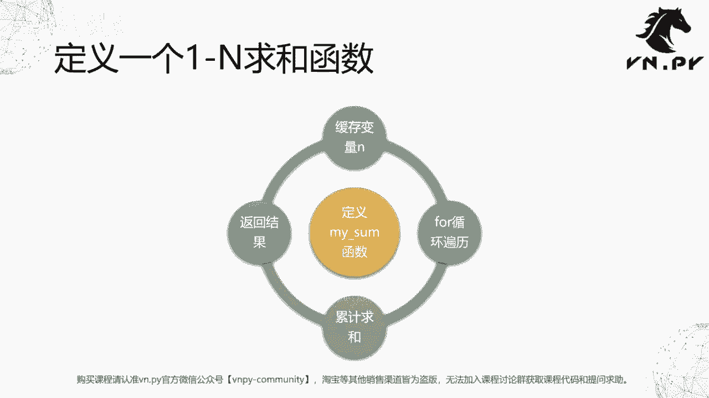
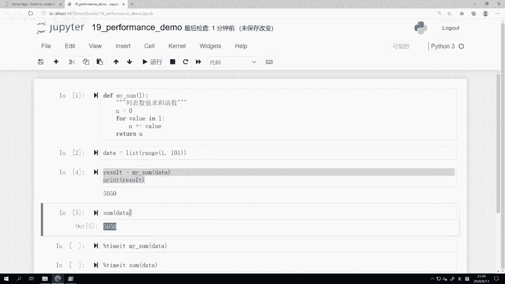
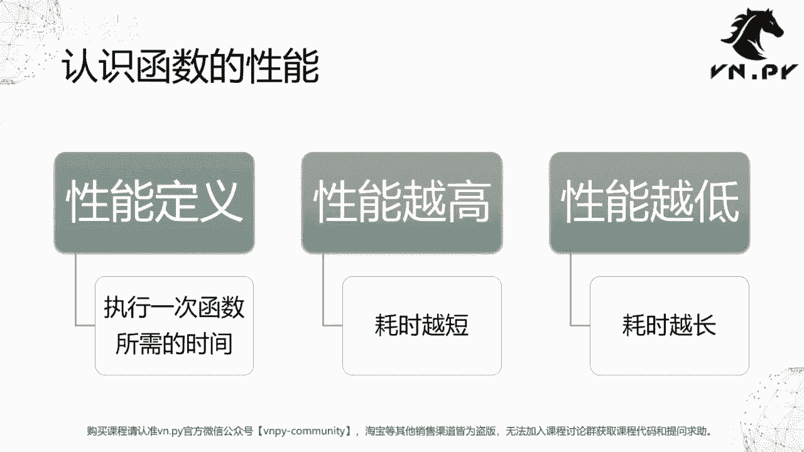
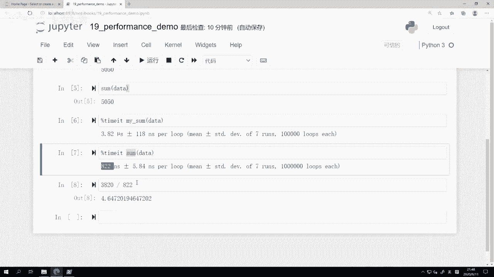
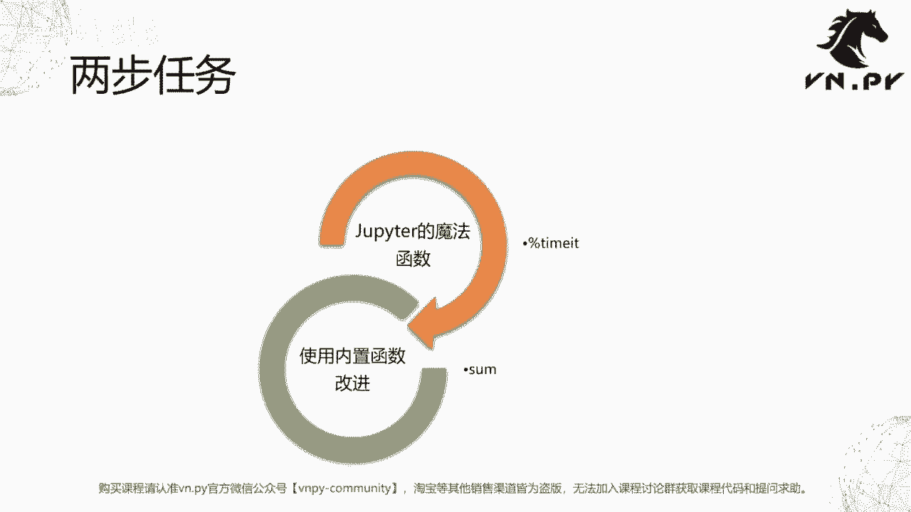

# 量化交易零基础入门：19：函数性能测试 🚀

在本节课中，我们将学习如何测试函数的性能。我们将通过定义一个自定义的求和函数，并与Python内置的`sum`函数进行性能对比，来理解性能的概念和测量方法。

## 概述

上一节我们介绍了如何定义函数、支持多参数和多返回值。本节中，我们来看看如何评估一个函数的性能。性能是衡量函数执行效率的关键指标，对于编写高效的量化交易策略至关重要。



## 定义自定义求和函数

首先，我们来定义一个名为`my_sum`的函数，其功能是对一个数字列表进行求和。这个函数将接收一个列表作为参数，并使用循环累加列表中的所有值。

```python
def my_sum(l):
    """
    列表数值求和函数
    """
    n = 0  # 初始化缓存变量
    for value in l:
        n += value  # 累加列表中的每个值
    return n  # 返回求和结果
```

这个函数的逻辑与我们之前学习的`for`循环求和示例类似，只是将其封装成了一个可复用的函数。

## 生成测试数据

为了测试函数，我们需要一些数据。这里，我们生成一个包含数字1到100的列表。

```python
data = list(range(1, 101))  # 生成1到100的数字列表
```

## 测试函数功能

调用我们定义的`my_sum`函数，并传入测试数据，验证其功能是否正确。

```python
result = my_sum(data)
print(result)  # 输出结果应为5050
```



同时，我们也可以使用Python内置的`sum`函数进行同样的操作，以作对比。

```python
builtin_result = sum(data)
print(builtin_result)  # 输出结果同样为5050
```

## 理解函数性能

函数的性能通常定义为**执行一次函数所需的时间**。性能越高，耗时越短；性能越低，耗时越长。在量化交易中，高性能的代码可以节省大量计算时间，提升策略开发和回测的效率。

## 测量函数性能



我们将使用Jupyter Notebook的魔法命令`%timeit`来测量函数的执行时间。这个命令会自动多次运行代码，并给出平均耗时和标准差，从而获得更准确的性能数据。

以下是测量自定义`my_sum`函数性能的方法：


```python
%timeit my_sum(data)
```

运行上述命令后，`%timeit`会输出类似以下的结果：
- 平均执行时间（例如：3.82 µs）
- 时间标准差（例如：118 ns）
- 总运行次数

接下来，我们测量内置`sum`函数的性能：

```python
%timeit sum(data)
```

## 性能对比与分析

通过对比两个`%timeit`命令的输出，我们可以发现：
- 自定义的`my_sum`函数平均耗时可能在几微秒（µs）级别。
- Python内置的`sum`函数平均耗时通常在几百纳秒（ns）级别。

**性能对比公式**可以表示为：
\[
\text{性能提升倍数} = \frac{\text{自定义函数耗时}}{\text{内置函数耗时}}
\]
例如，如果`my_sum`耗时3.82 µs，`sum`耗时822 ns，则性能提升倍数约为：
\[
\frac{3.82 \text{ µs}}{0.822 \text{ µs}} \approx 4.65
\]
这意味着内置`sum`函数的性能大约是自定义函数的4.65倍。

## 性能差异的原因

内置函数性能更高的主要原因在于：
- **实现语言**：Python内置函数（如`sum`）通常由C语言实现，执行效率远高于纯Python代码。
- **优化程度**：官方团队对内置函数进行了深度优化，以最大化执行速度。

这个对比告诉我们一个重要的编程原则：在实现功能时，应优先使用Python内置的函数或库，因为它们通常经过高度优化，性能更优。

## 实践与作业

为了巩固理解，建议你进行以下实践：

1.  使用`%timeit`测量其他自定义函数与对应内置函数的性能差异。
2.  尝试优化`my_sum`函数（例如使用不同的算法），并观察性能是否有所提升。

以下是一个作业示例：对比上节课中自定义的`my_abs`函数与内置的`abs`函数的性能。

```python
# 定义my_abs函数
def my_abs(x):
    if x >= 0:
        return x
    else:
        return -x

# 测试数据
test_num = -10

# 性能对比
%timeit my_abs(test_num)
%timeit abs(test_num)
```

## 总结



本节课中我们一起学习了函数性能测试的核心概念和方法。我们掌握了：
1.  **性能的定义**：即函数执行所需的时间。
2.  **测量工具**：使用Jupyter的`%timeit`魔法命令进行性能测试。
3.  **对比分析**：通过对比自定义函数与内置函数的性能，理解了优先使用内置函数的重要性。
4.  **性能优化原则**：所有程序优化的第一步是准确测量，找到“热点”后再进行针对性优化。



掌握性能测试是编写高效量化交易代码的基础技能。在后续课程中，我们将继续学习更多提升代码性能的技巧。