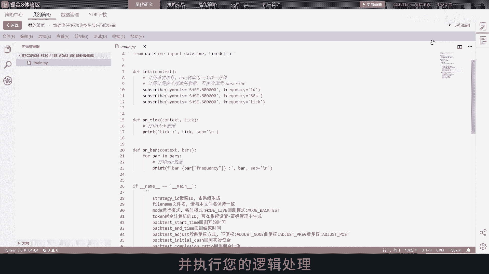
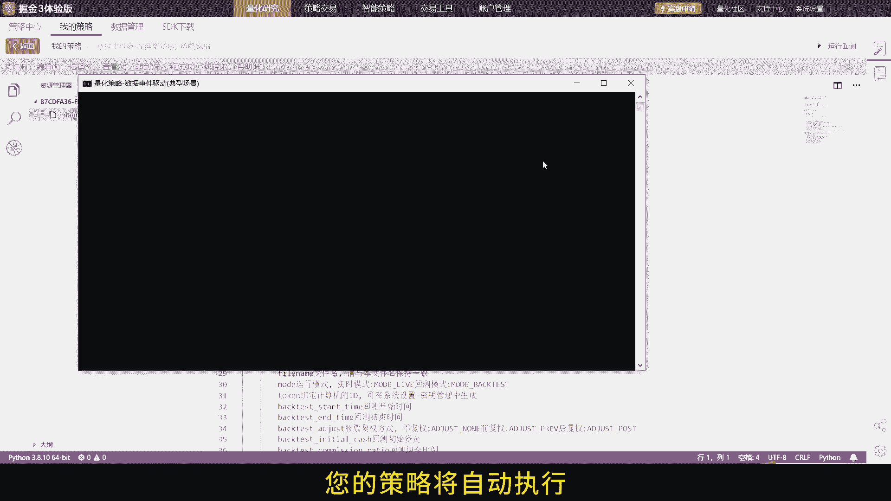
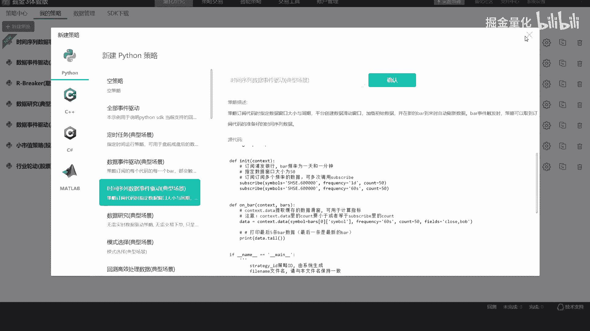
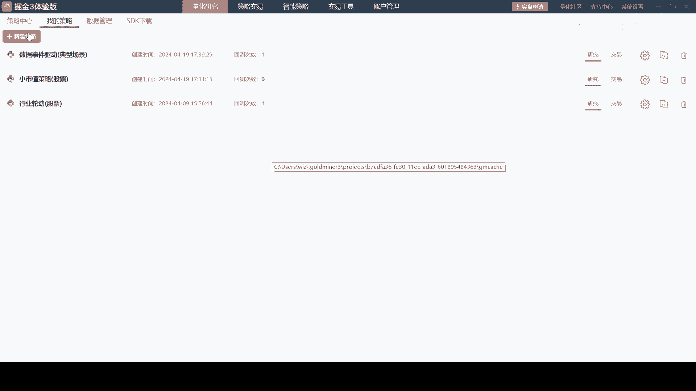
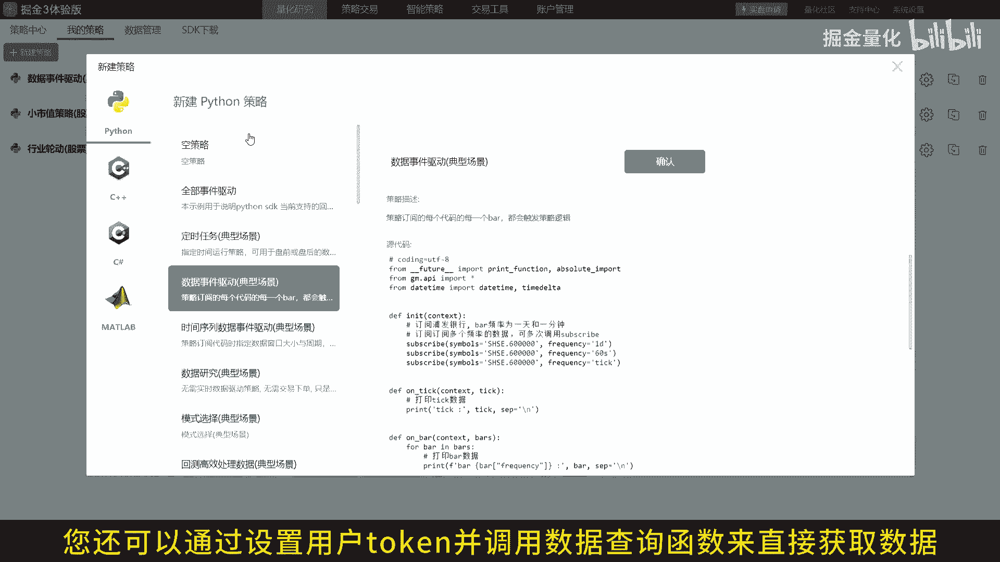
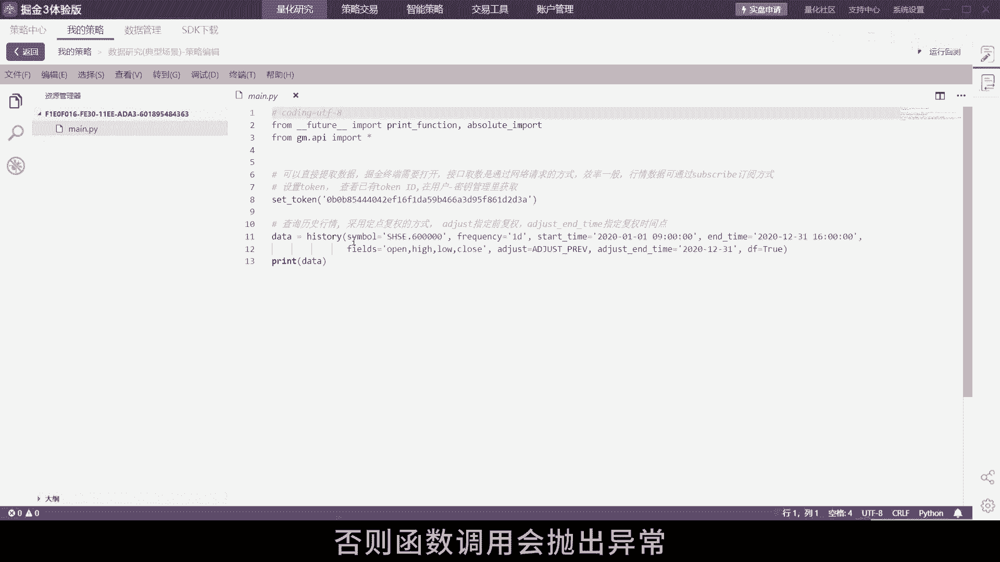
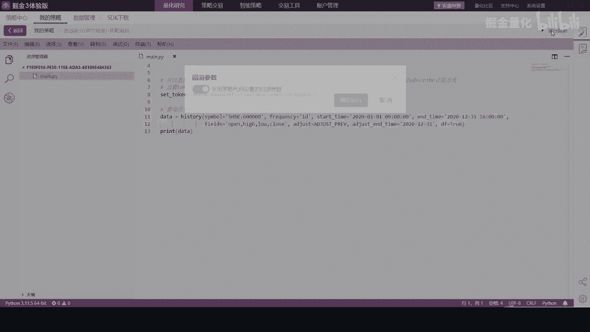
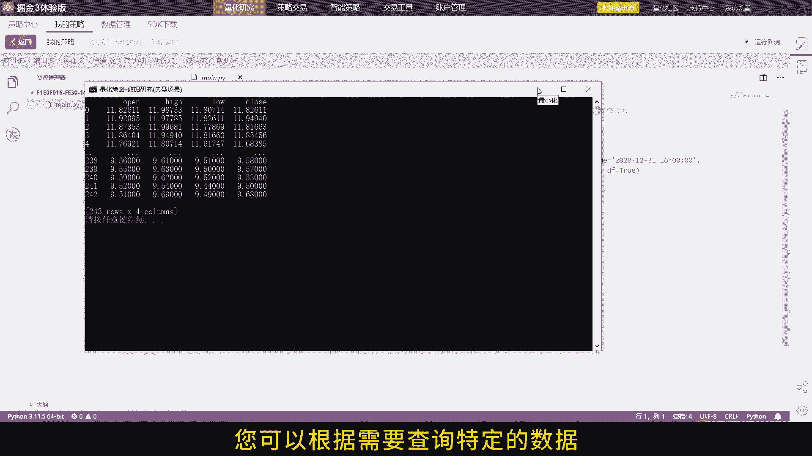
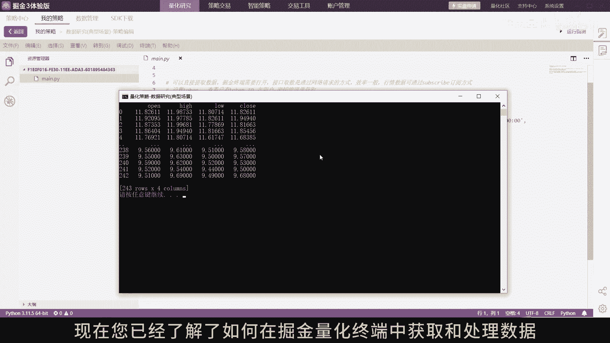
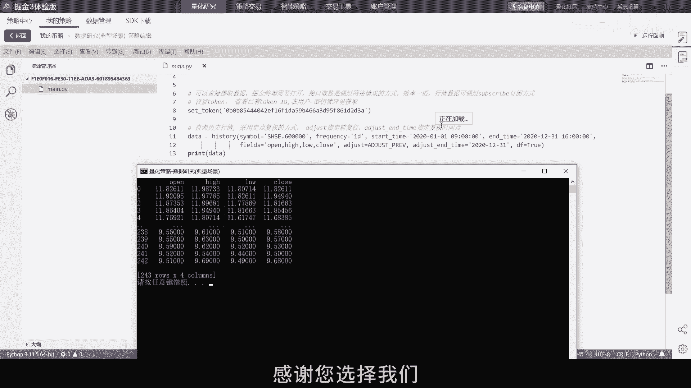

# 掘金量化终端：2.1：获取数据 📊

在本节课中，我们将学习如何通过掘金量化终端获取高频行情数据与历史数据。我们将介绍两种主要方法：通过订阅方式实时接收数据，以及通过查询接口获取历史数据。掌握这些方法，是构建和运行量化交易策略的基础。

## 初始化与数据订阅

首先，我们需要在策略文件中设置初始化函数。在 `init` 函数中，我们将调用 `subscribe` 函数来订阅所需的数据。

```python
def init(context):
    # 在此订阅您需要的股票或期货合约数据
    subscribe(symbols='SHSE.000001', frequency='tick')
```

上一节我们介绍了初始化设置，本节中我们来看看如何处理推送的数据。

## 处理实时数据

当订阅的数据更新时，系统会自动触发相应的事件处理函数。您需要在策略中实现 `on_tick` 或 `on_bar` 函数来处理这些实时推送的数据。



以下是关键的事件驱动函数：

*   **`on_tick`**：当新的tick数据（如逐笔成交）到来时被触发。
*   **`on_bar`**：当新的K线（如1分钟K线）形成时被触发。



您可以在这些函数中添加您的交易逻辑，以响应市场的变化。


现在，当数据更新时，您的策略将自动执行预设的逻辑。


## 使用滑窗提取历史数据

除了处理最新推送的数据，您可能还需要访问最近一段时间的历史数据进行分析。掘金终端提供了数据滑窗功能。



滑窗数据为包含当前时刻推送的 tick 或 bar 的前 `count` 个数据对象。


订阅后的数据滑窗储存在 `context.data` 中。您可以通过调用 `context.data` 接口来提取这些数据。

```python
def on_bar(context, bar):
    # 获取当前合约最近10根K线
    recent_bars = context.data(symbol=bar['symbol'], count=10, frequency='1m')
```

无论是在自定义函数中，还是在 `on_tick` 和 `on_bar` 事件驱动函数中，都可以使用此方法。



## 通过查询接口获取数据

除了通过订阅被动接收数据，您还可以主动调用数据查询函数来直接获取特定数据。

首先，您需要在平台设置中获取并配置您的用户 `token`。




然后，在代码中调用相应的查询函数，例如 `history`。



```python
# 查询历史K线数据示例
history_data = history(symbol='SHSE.000001', frequency='1d', start_time='2023-01-01', end_time='2023-01-31', fields='open,high,low,close,volume')
```

请确保您的 `token` 配置正确。




否则函数调用会抛出异常。




通过接口查询的数据将一次性返回，您可以根据需要查询特定的数据，例如历史行情数据或实时市场快照。




## 总结

本节课中我们一起学习了在掘金量化终端中获取和处理数据的两种核心方法。

1.  **实时订阅**：通过在 `init` 中订阅，并在 `on_tick`/`on_bar` 中处理，实现事件驱动的策略逻辑。同时，可以利用 `context.data` 获取数据滑窗进行历史分析。
2.  **主动查询**：通过配置 `token` 并调用 `history` 等查询函数，主动获取指定时间段的历史数据。

无论您是通过订阅实时响应市场，还是通过查询进行深入分析，这些功能都能有效地支持您的量化策略开发与执行。




感谢您的观看，祝您投资顺利。掘金量化终端，您量化投资之路上的得力助手。

