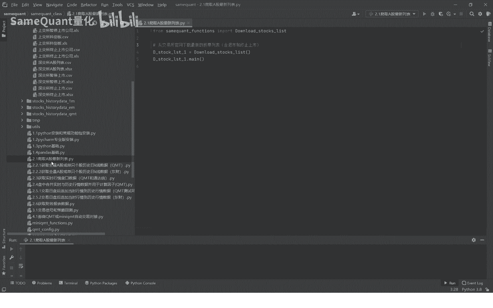
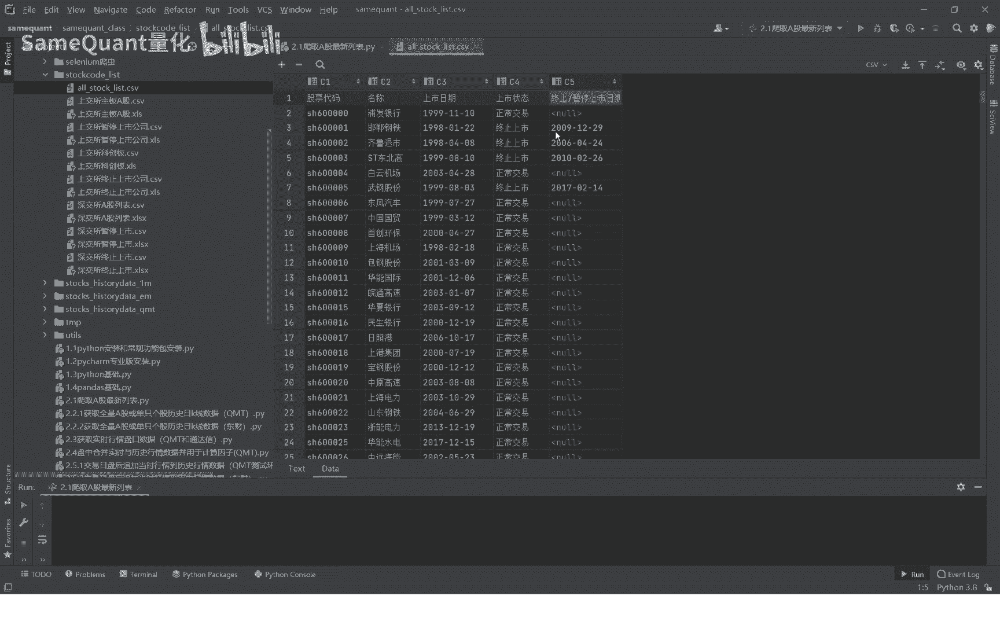
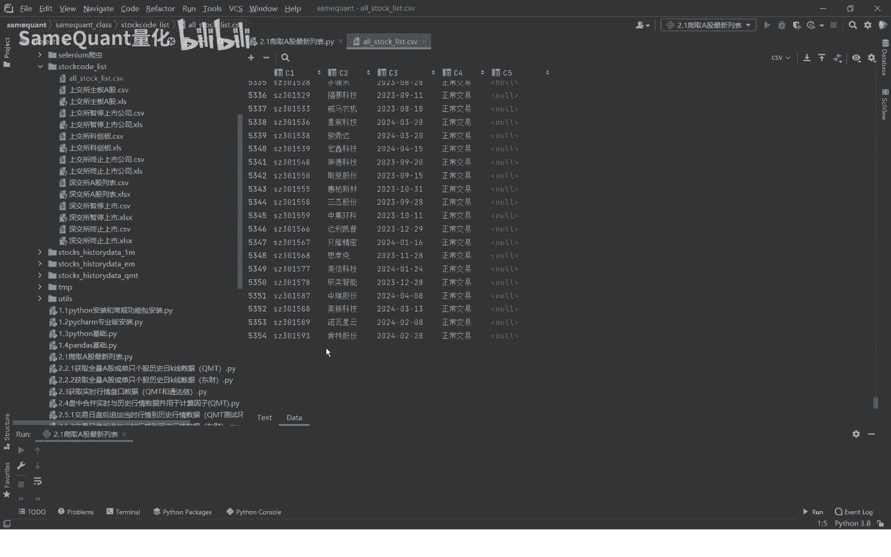
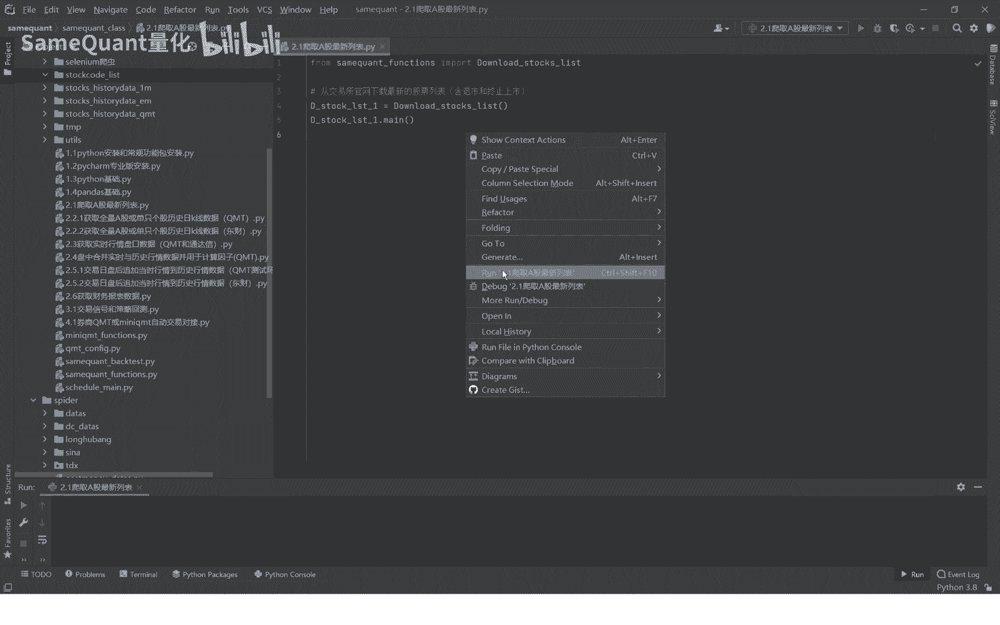
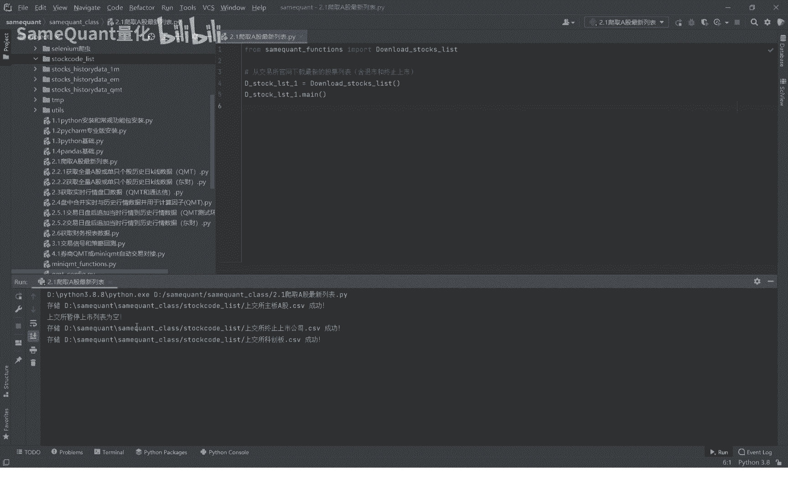
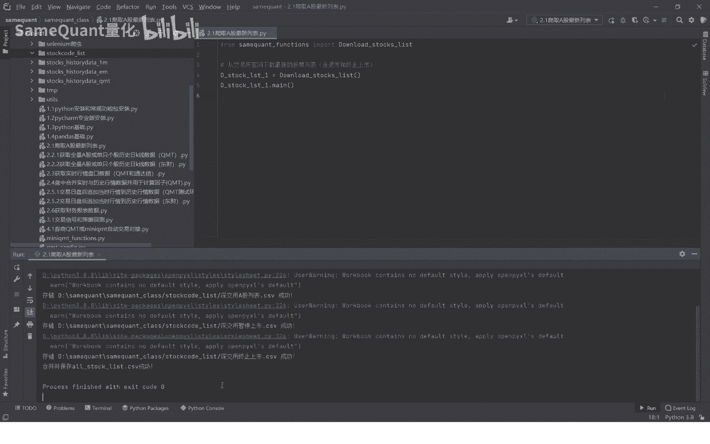
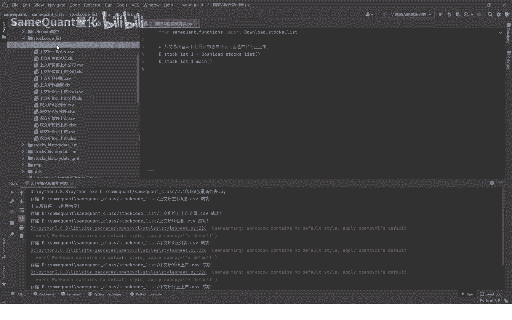
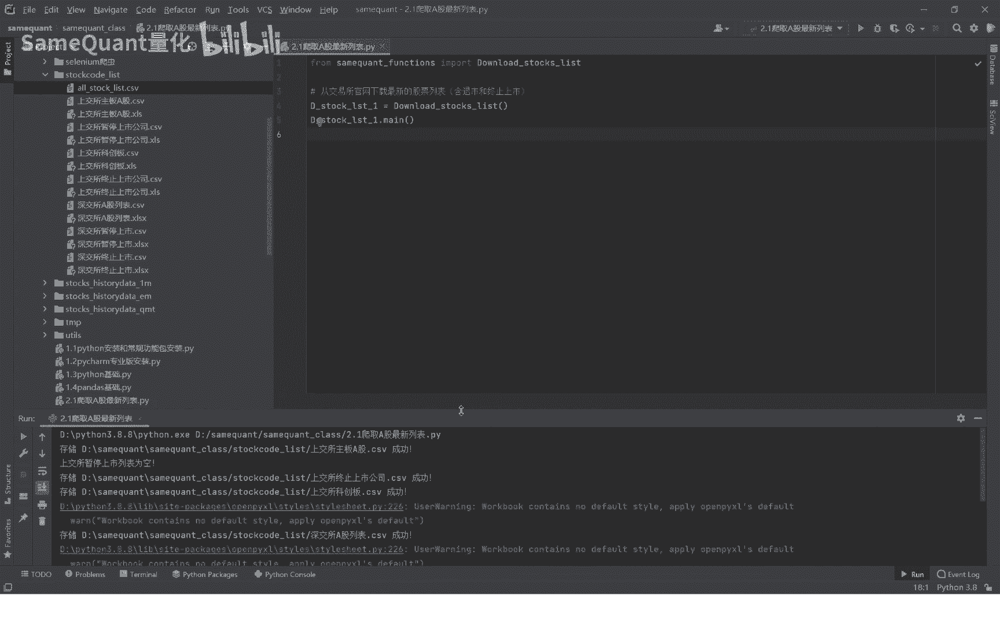
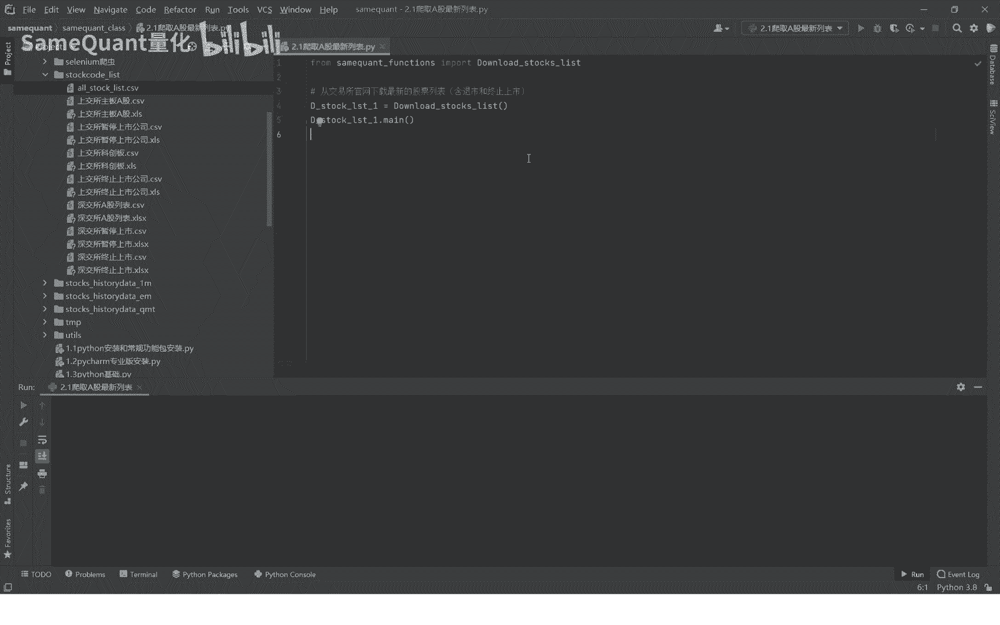

# 量化交易基础：2.1：获取A股最新列表 📈

在本节课中，我们将学习如何获取一份包含所有A股上市公司最新信息的列表。这份列表是进行量化分析的基础数据，包含了股票代码、名称、上市日期等关键信息。

## 课程概述

我们将通过一个程序，从公开数据源获取A股（包括上海证券交易所和深圳证券交易所）所有上市公司的列表。最终生成的表格将包含以下字段：**股票代码**、**股票名称**、**上市日期**、**上市状态**以及**终止或暂停上市日期**。

## 最终成果展示

程序运行后，将生成一个类似下图的表格文件。

这个表格包含了A股市场的完整列表，总计超过5000条记录，其中也包含了历史上已经退市或终止上市的股票。

## 操作演示

在开始演示下载过程前，我们先删除之前已下载的旧文件，以确保获取的是最新数据。

运行下载程序后，程序会按顺序从不同板块获取数据。

以下是程序获取数据的主要步骤：
1.  首先获取上海证券交易所主板的股票列表（包括暂停上市的股票）。
2.  接着获取上海证券交易所科创板的股票列表。
3.  然后获取深圳证券交易所的A股列表（包括暂停上市的股票）。
4.  最后获取深圳证券交易所终止上市的股票列表。

所有数据获取完成后，程序会将它们拼接在一起，并保存为新的文件。此时可以看到，之前删除的表格文件已被重新生成。

打开新生成的文件，即可看到一份包含**上市日期**、**上市状态**等最新信息的A股完整列表。

## 关于源代码

本课程涉及的完整源代码已提供。代码详细展示了每一步的操作，包括：
*   数据从何处下载。
*   如何将数据保存为 `XLS` 文件。
*   如何将文件转换为 `CSV` 格式。
*   最终如何合并所有数据并生成我们看到的表格。

由于网络爬虫技术可能涉及一些网站的合规使用问题，为避免不必要的麻烦，我们在此不公开讲解和传播具体的爬虫源码。请大家理解，并自行查阅已提供的代码进行学习。

## 课程总结

本节课中，我们一起学习了如何自动化获取A股市场的最新上市公司列表。我们了解了最终数据表格的构成，并观看了程序运行的完整过程。这份列表是构建量化交易策略的数据基石，掌握其获取方法至关重要。

