# 量化交易基础：2.2.1：下载A股历史行情数据 📊

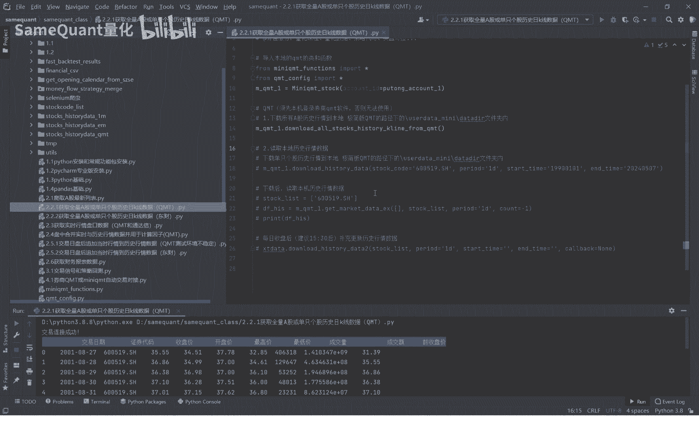

在本节课中，我们将学习如何在QMT量化交易平台中下载A股的历史行情数据。这是进行量化策略回测和数据分析的基础步骤。我们将介绍如何下载全市场数据以及单只个股的数据，并演示如何读取已下载的数据。

## 下载全市场A股历史数据

上一节我们介绍了历史行情数据的重要性，本节中我们来看看具体的下载方法。我们使用一个名为 `mini_qmt_dog` 的封装类，它集成了登录、查询资金账户、下载历史数据等多种功能。

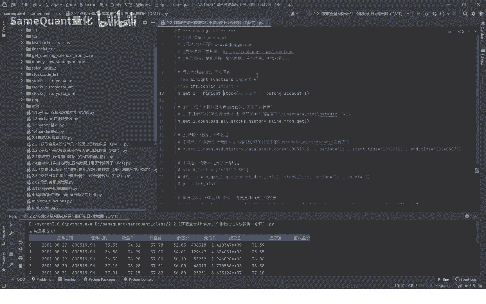

下载全市场A股历史行情数据的方法是 `download_history_data`。运行该方法即可开始下载。

以下是下载全市场数据的核心代码：

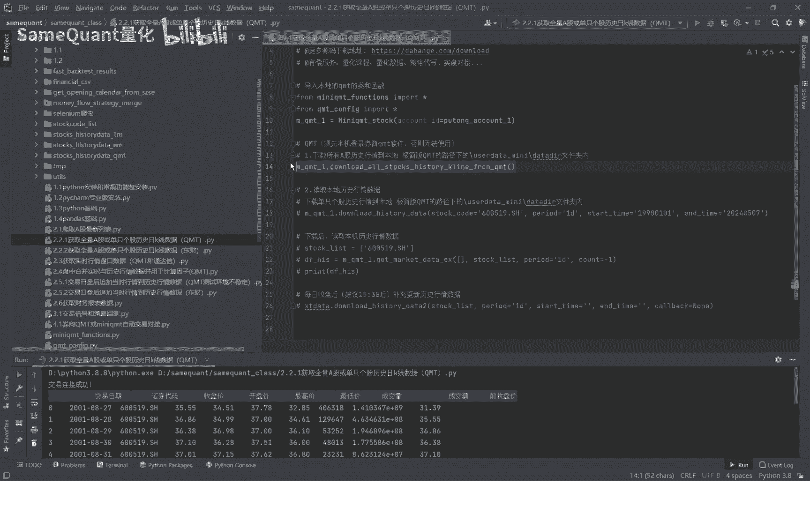

```python
# 假设已实例化mini_qmt_dog类为dog
dog.download_history_data()
```

由于全市场数据量较大，下载过程可能需要较长时间。在收到课程源码后，你可以直接运行上述代码进行自动下载。

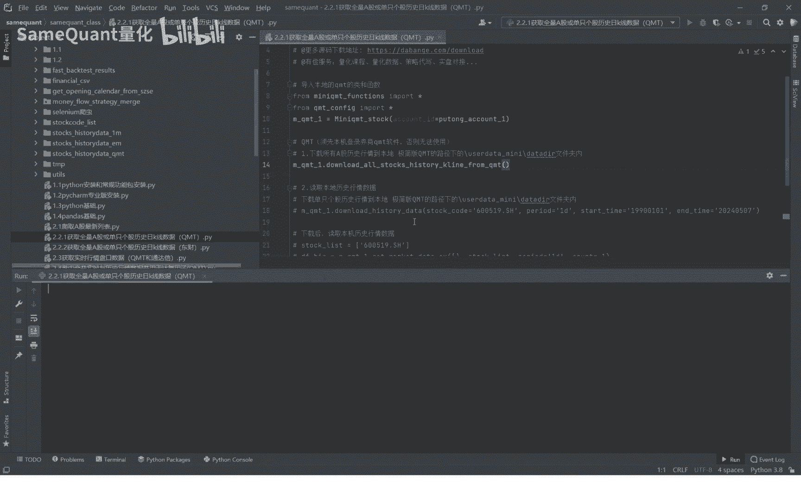

## 下载单只个股历史数据

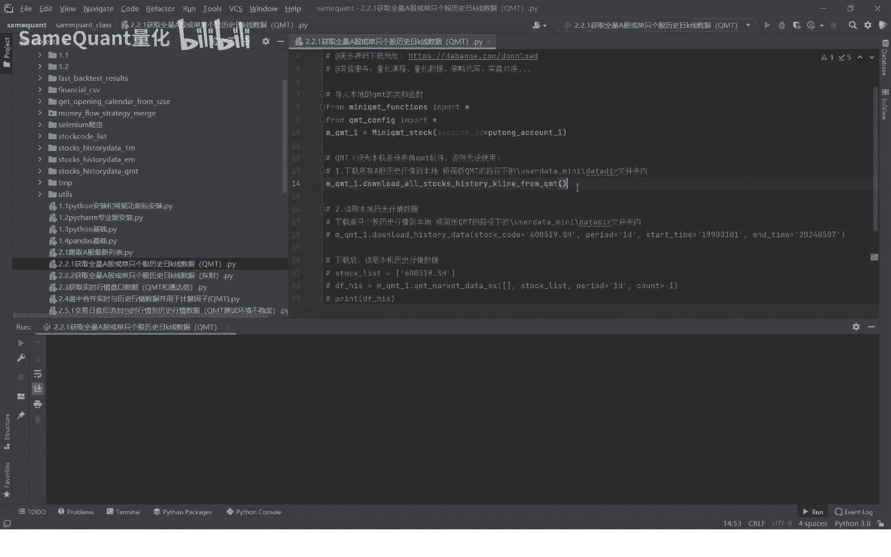

了解了全市场下载后，我们来看看如何下载单只股票的数据。这适用于针对特定股票进行分析。

以下是下载单只个股数据的步骤和代码：

1.  **设置股票代码**：例如，贵州茅台的代码为 `'600519.SH'`。
2.  **设置周期**：例如，`'1D'` 代表日K线。该方法也支持 `'5m'`、`'30m'`、`'1W'` 等其他周期。
3.  **设置时间范围**：`start_time` 可以设置为 `'1990-01-01'`，`end_date` 设置为最近的交易日。

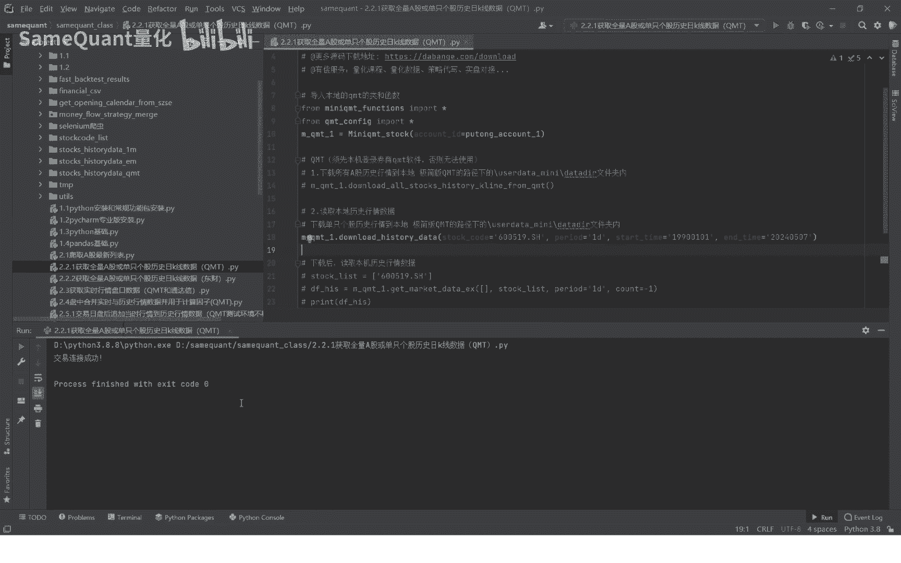

核心代码如下：

```python
# 下载贵州茅台从1990年至今的日K线数据
dog.download_history_data(stock_code='600519.SH', period='1D', start_time='1990-01-01', end_date='2023-10-27')
```

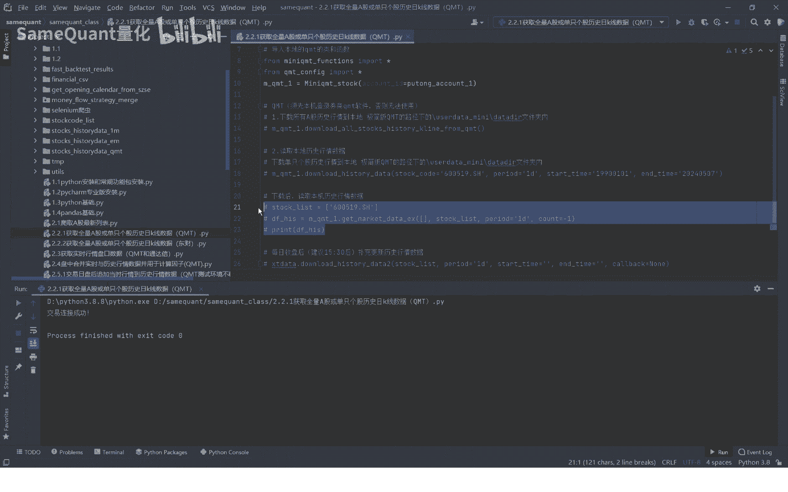

运行代码后，数据将下载到本地。

## 读取已下载的历史数据

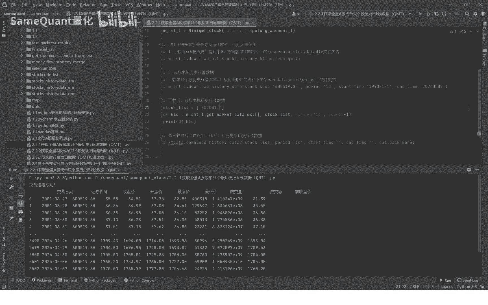

数据下载完成后，我们需要读取它以进行后续分析。读取数据使用 `get_history_data` 方法。

以下是读取数据的示例：

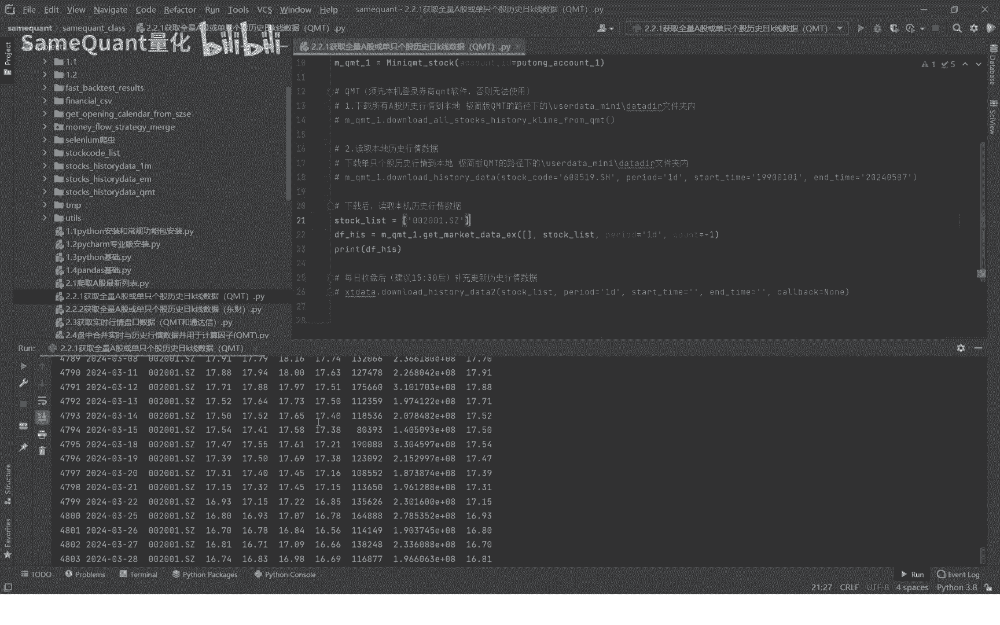

```python
# 读取已下载的贵州茅台日K线数据
data = dog.get_history_data(stock_code='600519.SH', period='1D')
print(data)
```

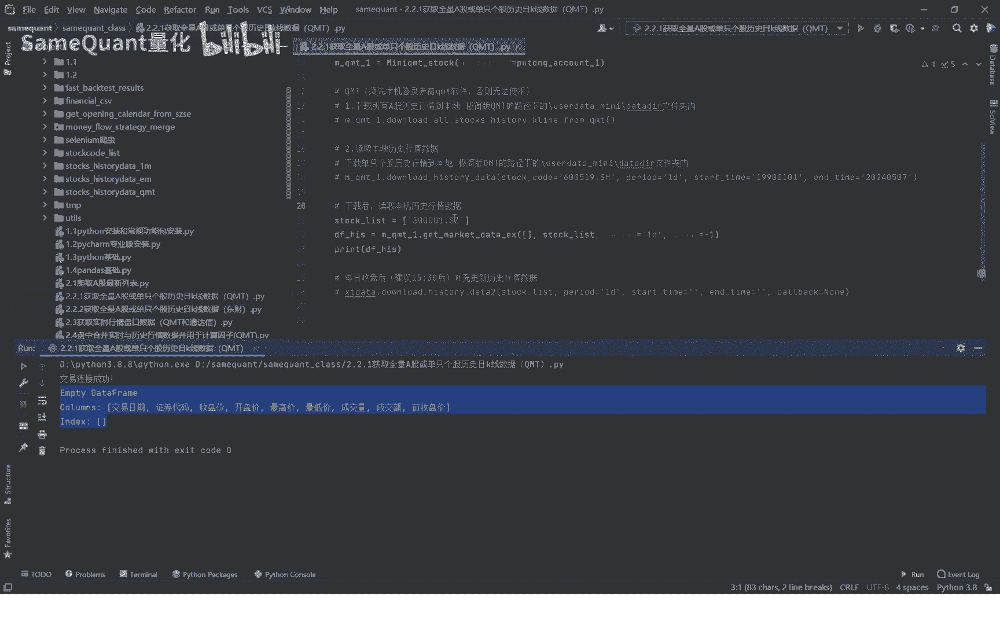

如果数据成功下载，上述代码将输出一个包含开盘价、最高价、最低价、收盘价和成交量等信息的DataFrame。如果尝试读取一个尚未下载的股票数据，则无法获取到数据。

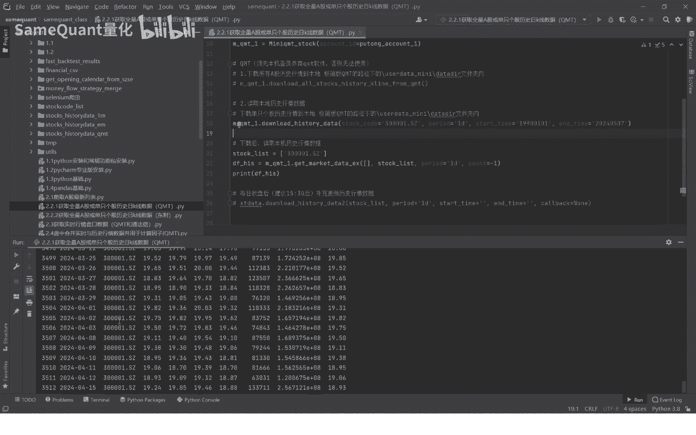

**核心逻辑关系**可以总结为：
**下载数据** → **数据存储于本地** → **读取本地数据**

因此，在读取数据前，务必确保已经执行了下载步骤。

## 数据更新与后续课程

除了初始的历史数据下载，每个交易日还需要将最新的行情数据补充到历史数据库中。我们将在后续课程中详细介绍如何实现数据的定时更新。

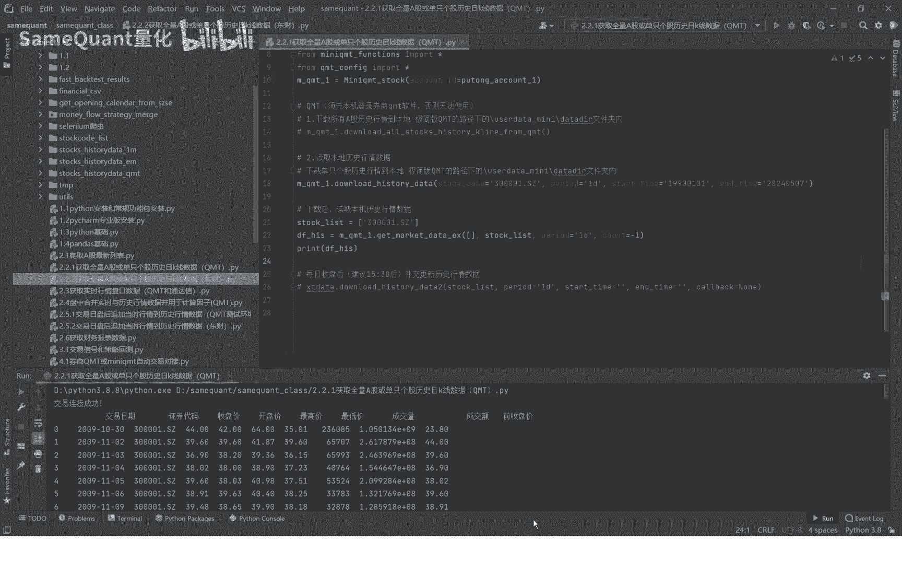

本节课中我们一起学习了在QMT平台下载A股全市场及单只个股历史行情数据的方法，并掌握了读取本地数据的基本操作。这是构建量化分析流程的第一步。下节课，我们将介绍通过其他数据通道（如东方财富）获取A股历史行情数据的方法。