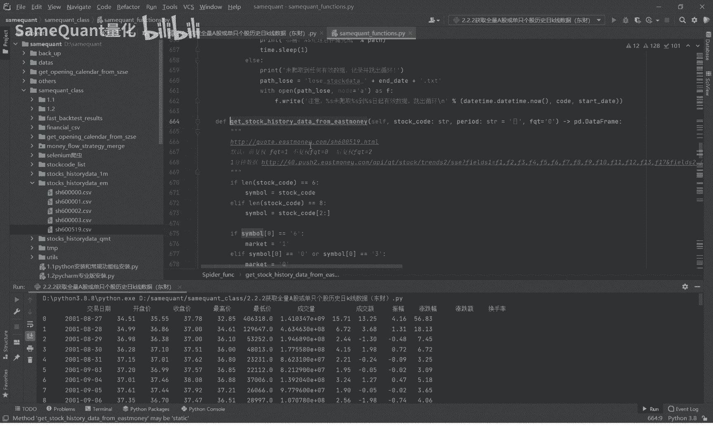
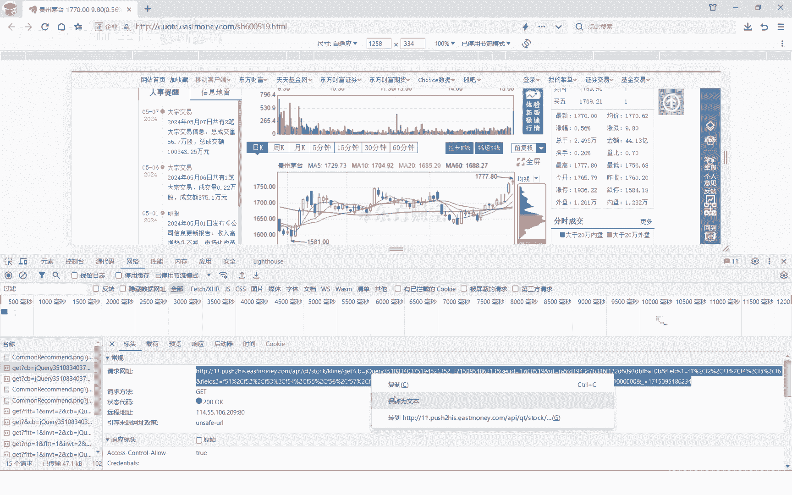
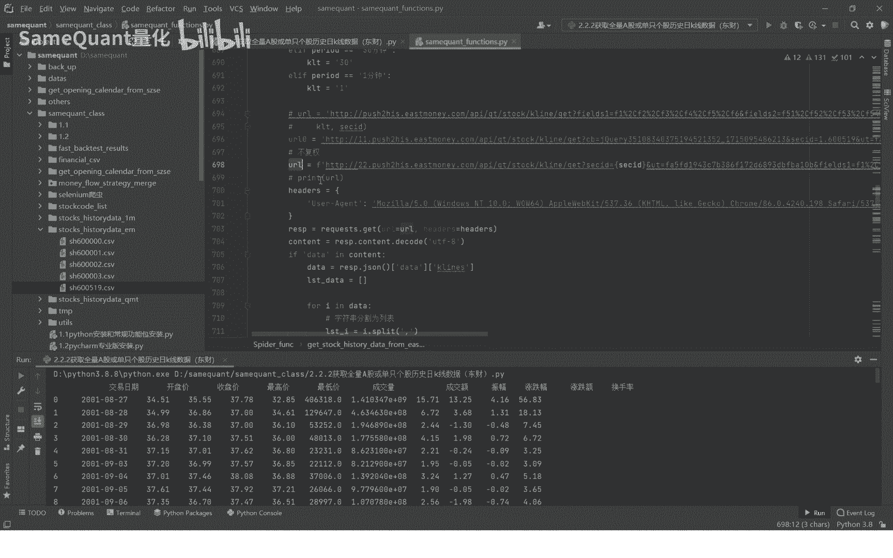
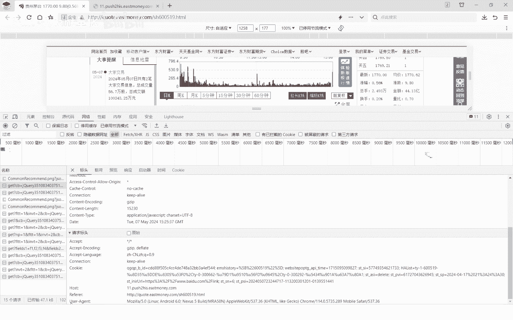
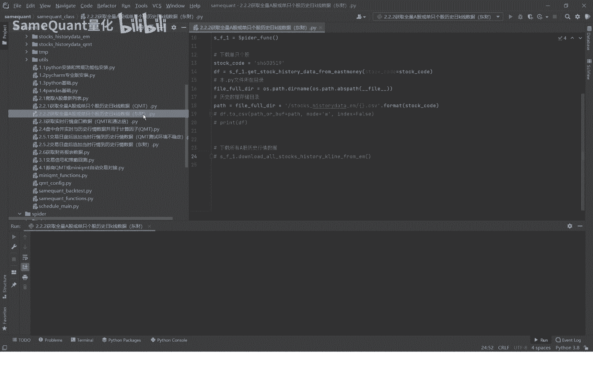

# 量化交易基础：2.2.2：从东方财富网下载A股历史行情数据 📈

在本节课中，我们将学习如何从东方财富网爬取单只股票以及全部A股的历史行情数据。我们将使用一个预先封装好的Python类来完成这项任务，并详细讲解其背后的实现原理。掌握这项技能是进行量化回测和策略研究的基础。

## 第一步：下载单只股票数据

首先，我们来演示如何使用封装好的类下载单只股票的历史数据。以下是核心步骤：

以下是下载单只股票数据的具体操作流程：



1.  **设置股票代码**：将目标股票的代码（例如 `600519` 代表贵州茅台）传入指定的函数。
2.  **指定存储路径**：数据下载后需要存储到本地。我们需要指定一个目录。示例代码中，路径由当前Python文件所在目录与 `stock_history_data` 子目录拼接而成。
3.  **生成文件名**：每只股票的数据将单独保存为一个CSV文件，文件名即为股票代码。
4.  **执行下载**：运行函数，程序将自动从网络获取数据并保存到指定路径。

运行成功后，你将在指定目录下看到以股票代码命名的CSV文件，其中包含了该股票从上市至今（或接口提供的最早日期）到最新交易日的所有历史行情数据。

## 第二步：爬取原理详解

上一节我们演示了如何下载数据，本节中我们来看看程序是如何从东方财富网获取这些数据的。理解原理有助于你未来定制或调试自己的数据获取模块。



整个过程基于对东方财富网K线数据接口的分析和请求。

以下是分析并获取数据接口的关键步骤：

1.  **定位数据接口**：在东方财富网的个股K线图页面，通过浏览器的“开发者工具”（审查元素）监控网络请求。点击切换“日K”、“周K”等周期时，会发现一个返回历史K线数据的API请求。
2.  **分析请求参数**：查看该请求的“标头”和“参数”，可以找到请求的URL。分析URL可以发现规律，例如 `secid=1.600519`，其中 `1` 代表上海证券交易所，`600519` 是股票代码。
3.  **理解关键参数**：
    *   `klt`：K线周期，例如 `101` 代表日K线数据。
    *   `fqt`：复权类型，`1` 代表前复权。
4.  **构造请求**：在Python中，使用 `requests` 库向分析得到的API地址发送HTTP GET请求。请求时需要添加必要的请求头（如 `User-Agent`）来模拟浏览器访问。
5.  **解析与存储**：接口返回的数据通常是JSON格式。我们将其解析为Python数据结构（如列表或字典），然后转换为更易处理的 `pandas DataFrame` 格式，最后保存为CSV文件。

核心的请求代码结构如下：
```python
import requests
import pandas as pd

# 构造请求URL和请求头
secid = f"{market}.{stock_code}"  # 例如：'1.600519'
url = f"https://push2his.eastmoney.com/api/qt/stock/kline/get?secid={secid}&klt=101&fqt=1"
headers = {'User-Agent': 'Mozilla/5.0...'}



# 发送请求
response = requests.get(url, headers=headers)
data_json = response.json()



# 解析JSON数据
kline_data = data_json['data']['klines']
# 将数据转换为DataFrame并保存
df = pd.DataFrame([item.split(',') for item in kline_data])
df.to_csv('path/to/save.csv', index=False)
```

## 第三步：下载全部A股数据

掌握了单只股票的下载方法后，要获取全市场数据就很简单了。思路是遍历一个包含所有A股股票代码的列表，然后循环调用单只股票的下载函数。

我们同样提供了一个封装好的函数来完成批量下载。

以下是批量下载的简要逻辑：

1.  **获取股票列表**：需要一个包含所有待下载股票代码的列表。这个列表可以来自本地文件、数据库或实时从网络获取。
2.  **循环遍历**：使用 `for` 循环遍历股票列表中的每一个代码。
3.  **调用下载函数**：在循环体内，将当前股票代码传入上一节介绍的单只股票下载函数。
4.  **统一存储**：所有股票的数据将按照既定规则（如以股票代码命名）存储在同一目录下。

运行此函数，程序将开始依次下载列表中所有股票的历史数据。你可以在输出目录中看到文件数量逐渐增加。

## 第四步：数据更新与维护

历史数据下载完成后，并非一劳永逸。市场每日都会产生新的交易数据，我们需要将这些最新数据追加到已有的历史文件中，以保证数据的完整性和时效性。

每日更新数据，而不是重新下载全部历史数据，是更高效、更节省网络资源的方法。我们将在后续课程中讲解如何实现每日收盘后自动追加最新行情数据的功能。

## 总结

本节课中我们一起学习了从东方财富网获取A股历史行情数据的完整流程。

我们首先演示了如何下载单只股票的数据，接着深入剖析了其背后的网络请求原理，包括如何分析API接口、构造请求参数以及解析返回的数据。然后，我们扩展了方法，介绍了如何通过循环遍历来批量下载全市场股票的历史数据。最后，我们提到了后续的数据更新维护思路。



掌握本课内容，你就拥有了构建本地量化研究数据库的基础能力。东方财富网是数据来源之一，类似的数据接口在新浪财经、腾讯财经等平台也存在，其原理大同小异。