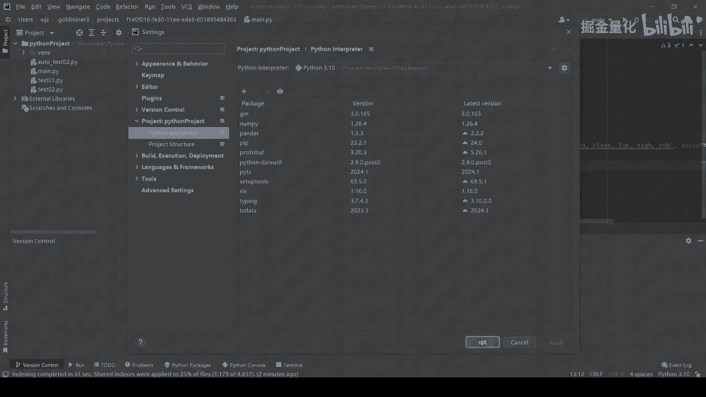
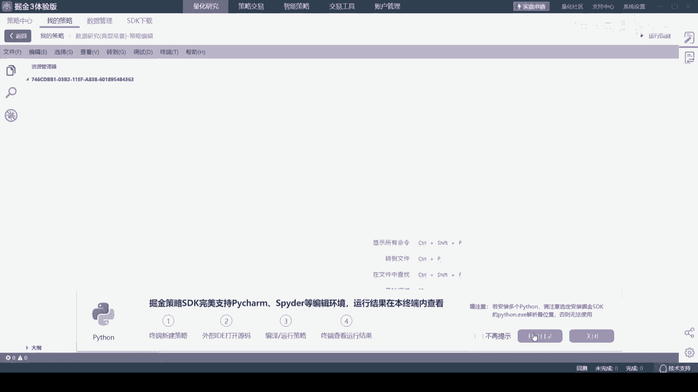
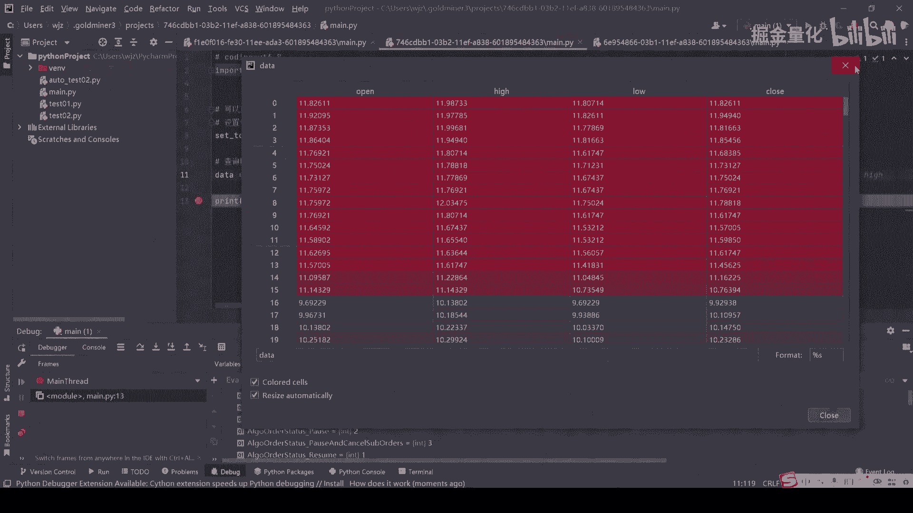
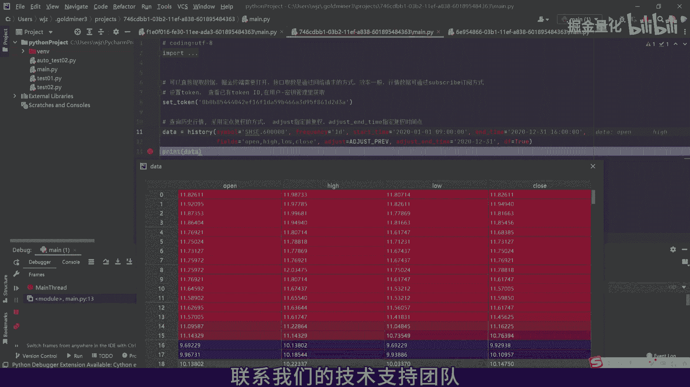

掘金量化：2.2：在PyCharm中获取掘金量化数据 📊


在本教程中，我们将学习如何在第三方集成开发环境（IDE）中获取掘金平台的历史行情数据。我们将以PyCharm为例，演示从环境准备到数据获取与调试的完整流程。

### 环境准备

在开始之前，请确保满足以下先决条件。

以下是具体步骤：
1.  确保掘金量化终端已经打开并正常运行。
2.  确保PyCharm中配置的Python解释器已安装`gm`包。可通过命令 `pip install gm` 安装。
3.  确保您已在代码中设置有效的访问令牌（token）。



### 创建并运行示例项目

上一节我们完成了环境准备，本节中我们来看看如何创建一个示例项目并运行代码。

最简单的方式是在PyCharm中新建一个项目。您可以创建一个用于数据研究的示例策略测试文件。



项目设置完成后，我们可以运行以下示例代码来提取所需的历史行情数据。

```python
import gm.api as gm

# 设置token，请替换为您的有效token
gm.set_token('您的token')

# 获取历史行情数据示例：获取沪深300指数（SHSE.000300）的1分钟K线数据
data = gm.history(symbol='SHSE.000300', frequency='1m', start_time='2024-01-01 09:00:00', end_time='2024-01-01 15:00:00', fields='open,high,low,close,volume', df=True)
print(data)
```

运行代码后，您将看到数据被成功获取，并展示在PyCharm的运行控制台中。



### 使用调试功能深入分析

为了更深入地了解数据获取的过程，我们可以在代码中设置断点，并使用PyCharm的调试功能来逐步执行代码。

以下是调试的核心步骤：
1.  在代码行号旁点击，设置断点。
2.  右键点击编辑区，选择“Debug ‘文件名’”启动调试。
3.  使用调试控制台的步进按钮（如Step Over）逐步执行。
4.  在“Variables”窗口观察变量（如`data`）的数据流动和变化。

通过调试，我们不仅可以确认数据是否正确获取，还可以检查数据处理逻辑是否按预期执行。



### 总结

本节课中我们一起学习了在PyCharm中获取掘金量化历史数据的完整流程。我们从环境配置开始，接着创建并运行了示例代码，最后利用调试功能对数据获取过程进行了深入分析。掌握这些方法将极大地提高您开发和测试量化策略的效率。