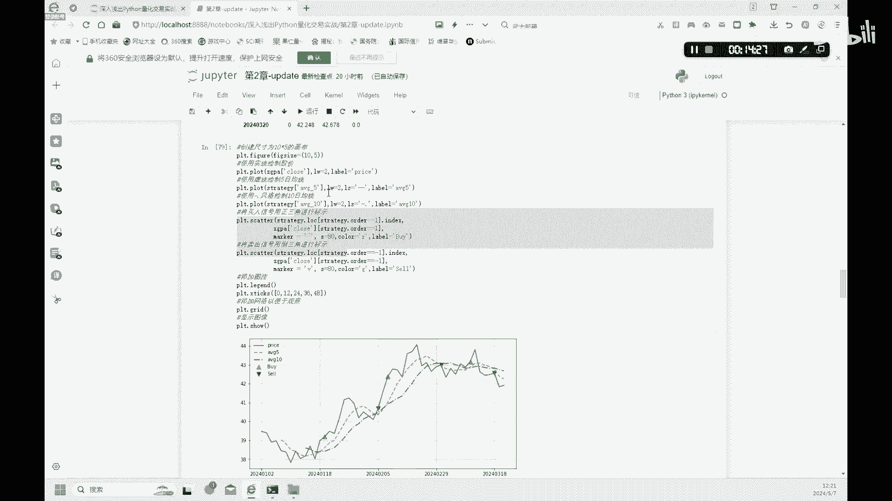

# 金融科技：2.2：移动平均策略 📈


在本节课中，我们将学习量化交易中一个经典且基础的策略——移动平均策略。我们将从单一移动平均线开始，逐步深入到双移动平均线（金叉/死叉）策略的构建、信号生成与回测分析。通过本教程，你将掌握使用Python实现这些策略的核心技巧。

## 单一移动平均线策略

上一节我们介绍了量化编程的基础，本节中我们来看看如何构建一个简单的单一移动平均线策略。移动平均线能平滑价格数据，帮助我们识别趋势。

首先，我们需要计算10日移动平均线。以下是实现步骤：

1.  **设置参数与初始化容器**：我们定义计算均线的周期（例如10天），并创建空列表来存储计算过程中的平均值。
    ```python
    period = 10  # 设置均线周期，例如10日
    average10 = []  # 用于储存最终的10日均线值列表
    average_value = None  # 用于动态计算每10天的价格均值
    ```

2.  **循环计算移动平均值**：我们遍历每日的收盘价，动态计算移动平均值。其基本原理是：对于前N天（N小于周期），计算已有所有数据的平均值；当数据达到或超过周期后，始终取最近N个数据的平均值。
    ```python
    for price in close_prices:  # close_prices 是收盘价序列
        # 动态计算逻辑：将当前价格加入临时列表，并保持列表长度不超过周期
        # 计算临时列表中所有价格的平均值，并添加到 average10 列表中
        ...
    ```
    通过以上循环，我们最终得到一列与原始数据对应的10日移动平均值 `average10`。

3.  **可视化结果**：计算出均线后，我们可以将其与原始股价一同绘制出来，直观观察趋势。
    ```python
    import matplotlib.pyplot as plt
    plt.figure(figsize=(10, 6))
    plt.plot(close_prices, label='Close Price', color='black')  # 绘制收盘价
    plt.plot(average10, label='10-Day MA', linestyle='--', color='blue')  # 绘制10日均线
    plt.legend()
    plt.show()
    ```
    图表中，黑色实线代表股票收盘价，蓝色虚线代表计算出的10日移动平均线。

## 双移动平均线与交易信号

理解了单一均线后，我们进一步探索更常用的双移动平均线策略。该策略通过短期和长期均线的交叉点来生成买卖信号。

我们首先创建一个新的数据框架来构建策略，并计算5日（短期）和10日（长期）移动平均线。

以下是构建交易信号列的步骤：

1.  **创建策略数据框架**：复制原始数据，并初始化一个全为0的`signal`信号列。
    ```python
    import pandas as pd
    strategy_df = pd.DataFrame(index=original_data.index)  # 保留原始索引（交易日期）
    strategy_df['signal'] = 0  # 初始化信号列
    ```

2.  **计算双均线**：在数据框架中分别计算5日和10日移动平均线。
    ```python
    strategy_df['MA_5'] = close_prices.rolling(window=5).mean()  # 5日均线
    strategy_df['MA_10'] = close_prices.rolling(window=10).mean() # 10日均线
    ```

3.  **生成交易信号**：我们根据“金叉”（短线上穿长线）和“死叉”（短线下穿长线）的规则来更新`signal`列。
    *   **金叉 (买入信号)**：当`MA_5`的值大于`MA_10`时，标记为1。
    *   **死叉 (卖出信号)**：当`MA_5`的值小于`MA_10`时，标记为0（或-1表示卖出）。
    ```python
    # 当5日均线上穿10日均线时，标记为1（买入）
    strategy_df.loc[strategy_df['MA_5'] > strategy_df['MA_10'], 'signal'] = 1
    # 当5日均线下穿10日均线时，标记为0（卖出/空仓）
    strategy_df.loc[strategy_df['MA_5'] < strategy_df['MA_10'], 'signal'] = 0
    ```
    为了更清晰地表示买卖点，我们可以根据`signal`列的变化（例如从0变为1）来生成具体的`order`订单列（如1代表买入，-1代表卖出）。

4.  **可视化交易信号**：将双均线与买卖信号在同一图表中展示。
    ```python
    plt.figure(figsize=(10, 6))
    plt.plot(close_prices, label='Close Price', alpha=0.5)
    plt.plot(strategy_df['MA_5'], label='5-Day MA', linestyle='--')
    plt.plot(strategy_df['MA_10'], label='10-Day MA', linestyle='--')
    # 标记买入点（金叉）
    buy_signals = strategy_df[strategy_df['order'] == 1]
    plt.scatter(buy_signals.index, buy_signals['MA_5'], marker='^', color='green', label='Buy', s=100)
    # 标记卖出点（死叉）
    sell_signals = strategy_df[strategy_df['order'] == -1]
    plt.scatter(sell_signals.index, sell_signals['MA_5'], marker='v', color='red', label='Sell', s=100)
    plt.legend()
    plt.show()
    ```
    在生成的图表中，可以清晰看到均线交叉点以及对应的买入（绿色上三角）和卖出（红色下三角）信号。

## 策略回测分析

生成交易信号后，我们需要通过回测来评估策略的历史表现。回测是模拟在历史数据上按照策略信号进行交易，并计算收益的过程。

假设我们初始有20，000元现金。以下是简化的回测步骤：

1.  **初始化账户**：创建记录持仓、现金和总资产的数据结构。
    ```python
    initial_cash = 20000
    portfolio = pd.DataFrame(index=strategy_df.index)
    portfolio['cash'] = initial_cash  # 现金列
    portfolio['holdings'] = 0  # 持有股票的数量
    portfolio['total'] = initial_cash  # 总资产列
    ```

2.  **模拟交易**：遍历每一个交易日，根据`order`信号执行买卖操作，并更新账户状态。
    *   **买入**：当信号为买入时，用部分现金购买股票，现金减少，持仓增加。
    *   **卖出**：当信号为卖出时，卖出全部持仓，现金增加，持仓归零。
    *   **每日更新总资产**：总资产 = 剩余现金 + 持仓股票数量 * 当日股价。

3.  **分析回测结果**：通过观察最终的总资产、收益率曲线，可以评估策略效果。例如，教程中的示例策略在测试期内可能并未盈利，这说明了策略编写与策略有效性是两回事，需要进行参数优化和严格评估。

4.  **参数优化**：移动平均策略的表现很大程度上取决于周期参数（如5日和10日）。我们可以尝试不同的组合（如20日与60日）进行回测，寻找更适应特定股票的参数。

## 总结



本节课中我们一起学习了移动平均策略的核心实现。我们从**单一移动平均线**的计算与绘图开始，进而构建了能产生**金叉/死叉**信号的**双移动平均线**策略，并学会了如何将买卖信号可视化。最后，我们介绍了**策略回测**的基本流程，通过模拟历史交易来评估策略的潜在表现。记住，一个能够编程实现的策略并不等同于一个能盈利的策略，实际应用中需要结合更多风险管理和市场分析。