# 量化交易基础：2.3：获取实时盘口行情数据 📈

在本节课中，我们将学习如何通过两种不同的通道获取实时的股票盘口行情数据。我们将重点介绍QMT通道和通达信通道，并了解它们提供的关键数据字段。

## 概述

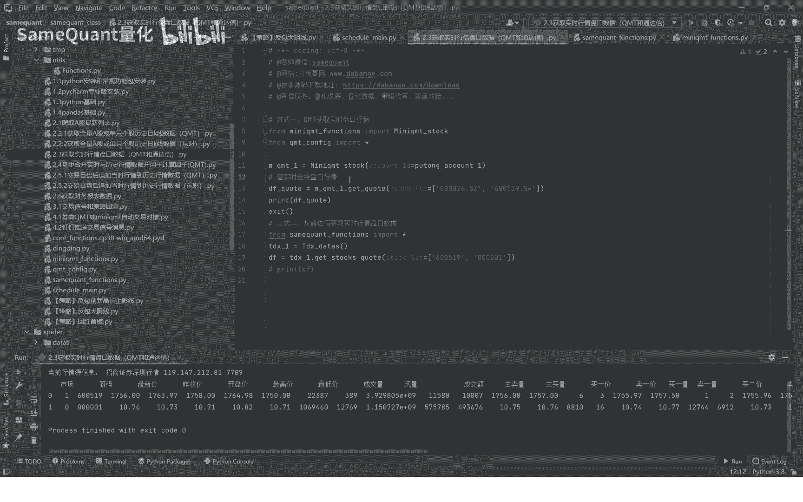

实时行情数据是量化交易的基础。本节将演示两种获取实时盘口数据的方法：QMT官方通道和通达信通道。我们将看到如何运行代码、获取数据，并对数据字段进行统一处理，以便后续分析。

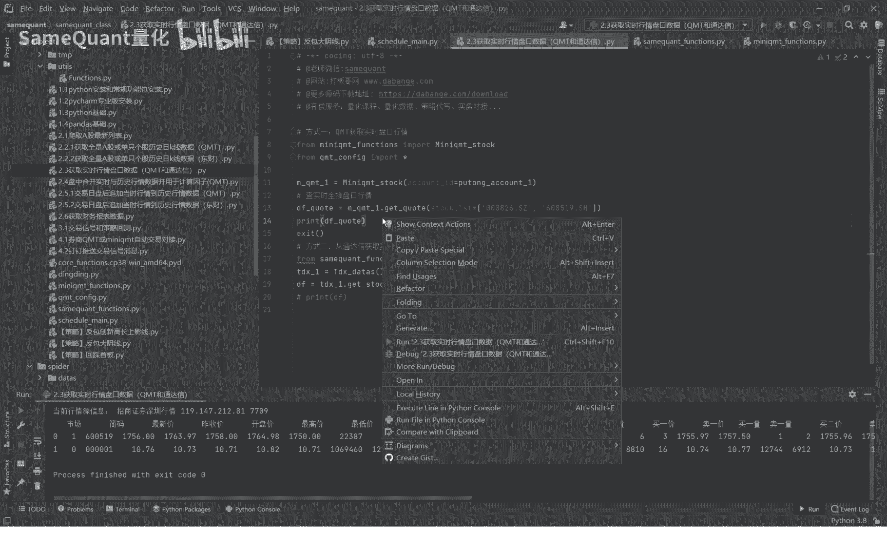

## QMT通道获取实时行情

上一节我们介绍了实时行情的重要性，本节中我们来看看如何使用QMT通道获取数据。使用QMT通道前，必须确保QMT软件已打开并成功登录。

以下是获取QMT实时行情数据的核心代码示例：

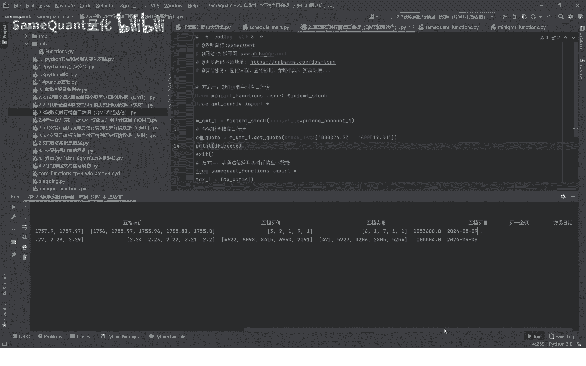

```python
# 示例：使用QMT API获取实时行情
from qmt_client import get_real_time_quote

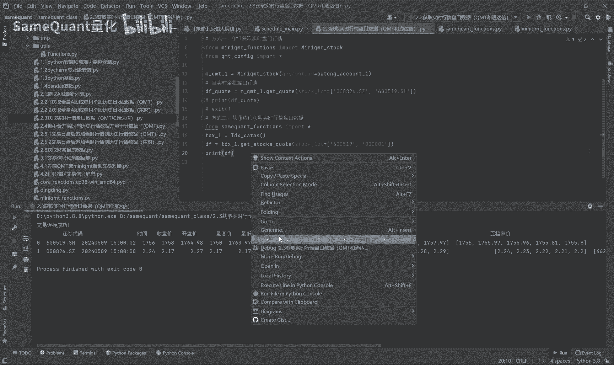

data = get_real_time_quote(stock_code='000001.SZ')
print(data)
```

运行代码后，可以获取到包含多个字段的行情数据。

以下是QMT通道返回的主要数据字段列表：
*   **太高收低**：今日开盘价、最高价、最低价、收盘价（前收）。
*   **最新价与成交额**：当前最新成交价及今日累计成交金额。
*   **五档买卖盘**：买一至买五的委托价和委托量，卖一至卖五的委托价和委托量。
*   **买一档金额**：买一档位的总委托金额。

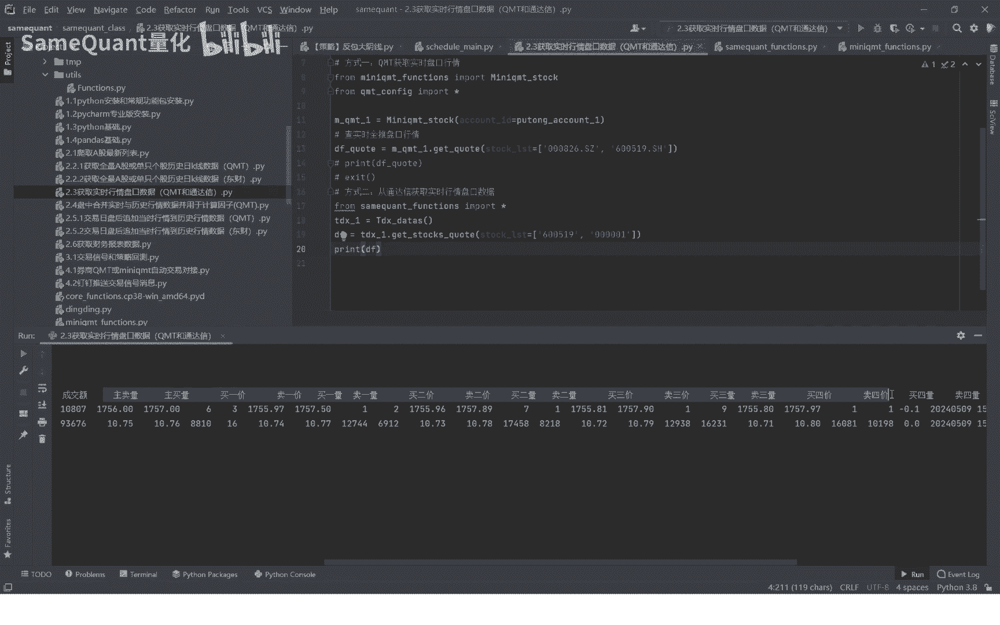

## 通达信通道获取实时行情

了解了QMT通道后，我们再来看看通达信通道。其使用方法类似，但数据源和部分字段有所不同。

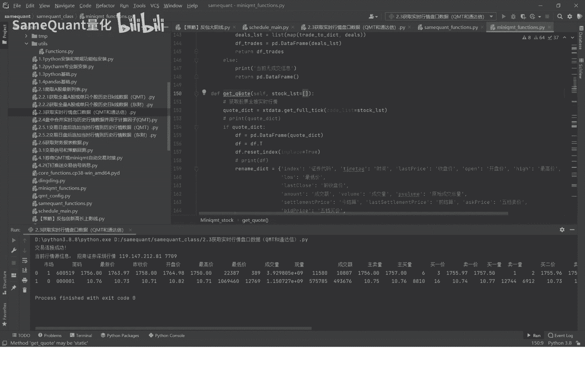

以下是获取通达信实时行情数据的核心代码示例：

```python
# 示例：连接通达信行情源
from tdx_client import connect_tdx, get_tdx_quote

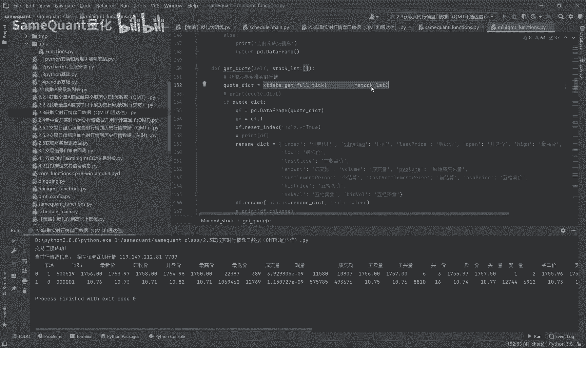

connect_tdx()
data = get_tdx_quote(stock_code='000001')
print(data)
```

运行代码后，同样可以获取到详细的盘口数据。

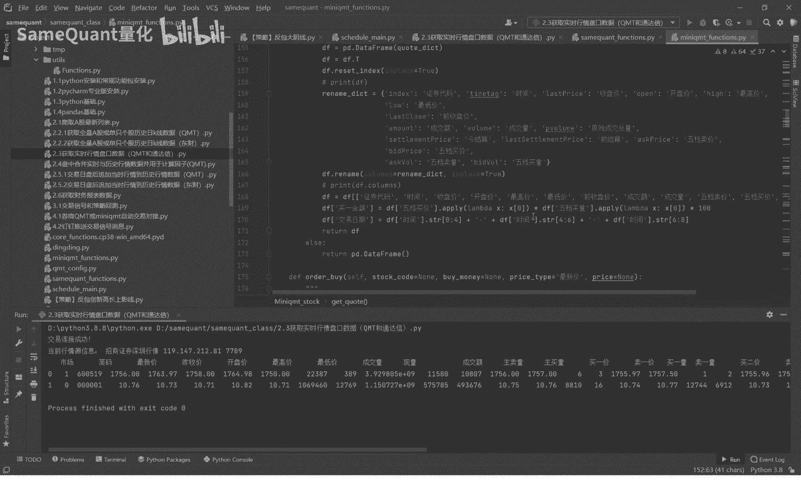

以下是通达信通道返回的主要数据字段列表：
*   **基本行情**：时间、开盘价、最高价、最低价、最新价、成交额。
*   **主买主卖量**：主动买入和主动卖出的成交量，这是相比QMT多出的字段。
*   **十档买卖盘**：买一至买五、卖一至卖五的委托价和委托量。
*   **现手**：最新一笔成交的成交量。

## 代码封装与字段统一

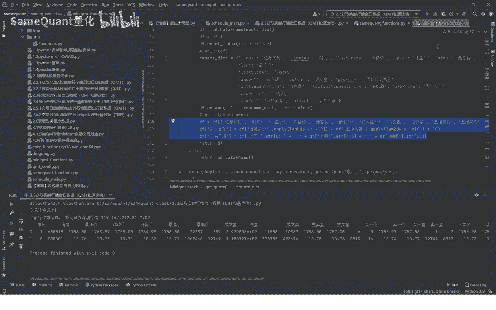

获取到原始数据后，为了便于后续使用，我们需要对数据进行处理。无论是QMT还是通达信的数据，我们都对其进行了封装，并将列名统一改为中文。

这样做的目的是为了方便**实时行情与历史行情的合并**，用于盘中实时计算因子或交易信号。核心步骤可以概括为以下公式：

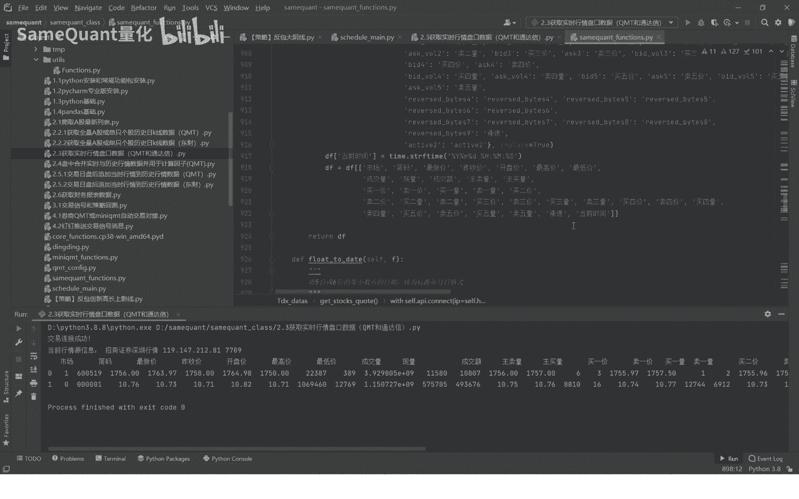

**数据处理流程 = 获取原始数据 → 统一列名 → 格式化 → 输出**

对于QMT数据，我们封装了官方函数，并统一了列名。对于通达信数据，我们先连接行情源，获取数据后同样进行列名中文化处理。这使得不同来源的数据具有一致的结构，简化了后续分析步骤。

## 总结

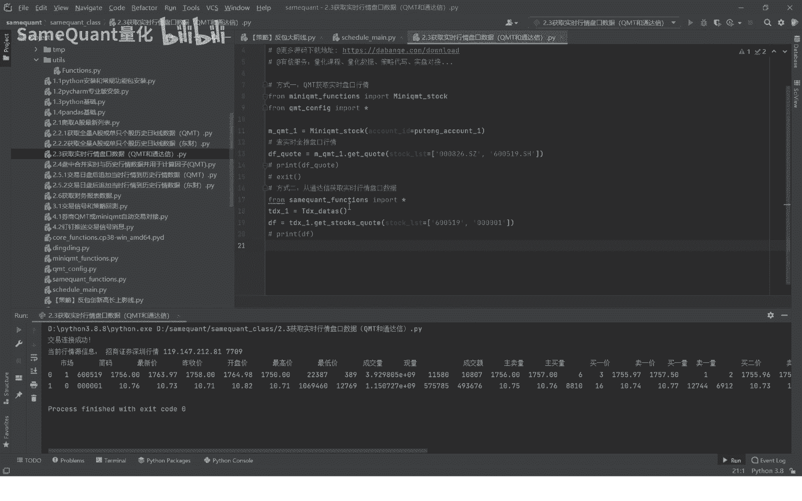

本节课中我们一起学习了通过QMT和通达信两个通道获取实时盘口行情数据的方法。我们了解了各自需要的前提条件、看到的数据字段差异，并明白了将数据字段统一处理的重要性。这为下一节课——合并实时行情与历史行情——打下了坚实的基础。