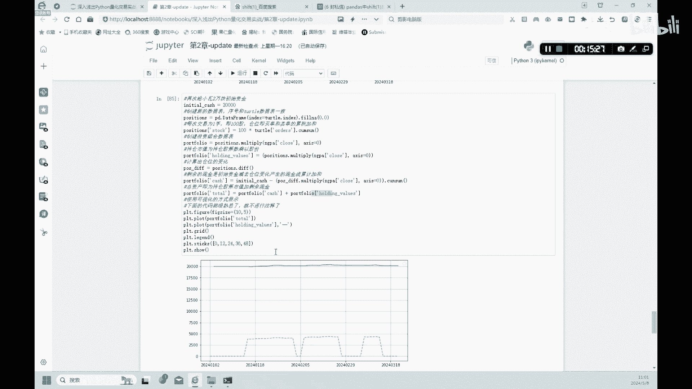

# 金融科技：2.3：海龟策略 - P1 🐢


在本节课中，我们将要学习一个经典的量化交易策略——海龟策略。我们将了解其核心定义，并使用Python代码来实现它，最后通过一个简单的回测来检验策略的收益情况。

## 策略定义

上一节我们介绍了移动平均线等基础概念，本节中我们来看看海龟策略。海龟策略的定义是：在股价超过过去N个交易日的股价最高点时买入。在股价低于过去N个交易日的股价最低点时卖出。

上述的若干最高点和最低点会组成一个通道，这个通道被称为唐奇安通道。

## 策略实现

接下来，我们将通过代码来实现这个策略。首先，我们需要创建一个名为`turtle`的DataFrame来存储数据，并保留其索引。

以下是创建数据表并计算最高点的步骤：

```python
# 设置最高点列
turtle['high'] = stock_data['close'].rolling(5).max().shift(1)
```

这段代码中，`rolling(5).max()`用于找出过去5个交易日的最高价。`shift(1)`的作用是将数据整体向下移动一行，这样做的目的是为了避免使用未来数据进行交易决策。

为了更清晰地理解`shift(1)`，请看以下示例：假设原始股价数据中，6月1日的股价是17.86。使用`shift(1)`后，6月1日的数据会移动到6月2日的位置。这在计算差分（例如用6月2日的股价减去6月1日的股价）时非常有用。

定义完最高点后，我们继续定义最低点：

```python
# 设置最低点列
turtle['low'] = stock_data['close'].rolling(5).min().shift(1)
```

命令与计算最高点类似，只是将`max`函数替换为`min`函数。

## 生成交易信号

在有了最高点和最低点之后，我们需要生成买入和卖出的交易信号。

以下是生成交易信号的逻辑：

1.  **买入信号**：当股价突破上沿（即超过过去N日的最高点）时，发出买入信号。
    ```python
    turtle['buy'] = stock_data['close'] > turtle['high']
    ```
2.  **卖出信号**：当股价跌破下沿（即低于过去N日的最低点）时，发出卖出信号。
    ```python
    turtle['sell'] = stock_data['close'] < turtle['low']
    ```

运行代码后，`buy`和`sell`列中会出现`True`或`False`。`True`代表触发相应信号，`False`代表不触发。

## 仓位管理

上一部分我们生成了交易信号，但仅有信号还不够，我们还需要管理具体的买卖操作和持仓状态。

以下是仓位管理的逻辑，通过一个循环来模拟交易过程：

```python
position = 0  # 初始持仓为0
orders = []   # 记录订单

for i in range(len(turtle)):
    # 买入条件：买入信号为True，且当前没有持仓
    if turtle['buy'].iloc[i] == True and position == 0:
        orders.append(1)  # 买入1手
        position = 1      # 持仓变为1手
    # 卖出条件：卖出信号为True，且当前持有仓位
    elif turtle['sell'].iloc[i] == True and position > 0:
        orders.append(-1) # 卖出1手
        position = 0      # 持仓清零
    else:
        orders.append(0)  # 不操作
```

这段代码的核心是：当满足买入条件时，下单买入并将持仓加1；当满足卖出条件时，下单卖出并将持仓清零。这样可以确保不会重复买入或在没有持仓时卖出。

## 策略可视化

为了更直观地观察策略的运行情况，我们可以将股价、通道线以及买卖信号绘制在图表上。

以下是绘图代码的简要说明：

1.  绘制股价的收盘价曲线（蓝色实线）。
2.  绘制唐奇安通道的上沿（红色虚线）和下沿（绿色虚线）。
3.  在股价突破上沿的位置，用红色正三角形标注买入信号。
4.  在股价跌破下沿的位置，用绿色倒三角形标注卖出信号。

通过图表，可以清晰地看到策略在何时发出交易指令。

## 策略回测

最后，我们对策略进行一个简单的回测，以检验其盈利能力。假设初始资金为20000元，用于交易中国平安的股票。

以下是计算资产变化的步骤：

1.  根据之前的`orders`列表，计算出每个时间点的持仓数量`position`。
2.  计算剩余现金：`cash = initial_cash - (持仓数量 * 股价)`。
3.  计算总资产：`total_asset = cash + (持仓数量 * 当前股价)`。

通过绘制总资产曲线图，可以看到资金随时间的变化。例如，在某个测试周期内，初始资金20000元最终变成了20188元，表明该策略在此周期内实现了盈利。我们也可以通过调整回测周期来观察策略在不同市场环境下的表现。

## 总结



本节课中我们一起学习了海龟策略。我们从策略的定义出发，理解了其在股价突破通道时买入、跌破时卖出的核心逻辑。接着，我们使用Python代码逐步实现了该策略，包括计算唐奇安通道、生成交易信号、进行仓位管理以及可视化结果。最后，通过一个简单的回测案例，我们验证了策略在特定时间段内能够产生盈利。这是一个系统性的入门实践，帮助你理解量化策略从概念到实现的基本流程。