# SameQuant量化：2.4：合并实时与历史行情数据计算因子 📊

在本节课中，我们将学习如何将实时行情数据与历史行情数据合并，并利用合并后的数据计算一个简单的交易因子（信号）。整个过程包括数据获取、处理、合并以及信号计算，适合量化交易初学者。

---

## 第一步：导入必要的包与函数

首先，需要导入操作KMT交易所数据所需的包、方法和函数。前提是您已在本地计算机上登录了KMT软件。

```python
# 导入所需库的示例代码
import kmt_api
import pandas as pd
```

---

## 第二步：下载历史行情数据

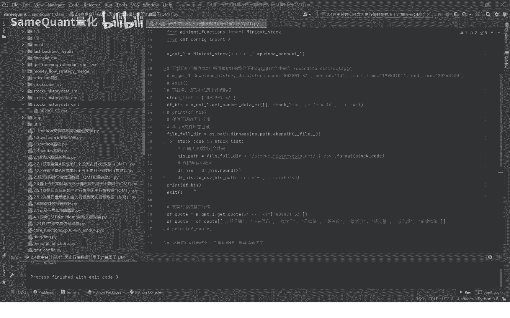

因为涉及合并历史与实时数据，所以第一步是下载某只股票的历史行情数据。在前期课程中已分享过此方法，这里重新演示。

运行以下函数即可完成下载。

```python
# 下载历史行情数据
history_data = download_history_data(stock_code='示例代码', start_date='2023-01-01', end_date='2024-05-17')
```

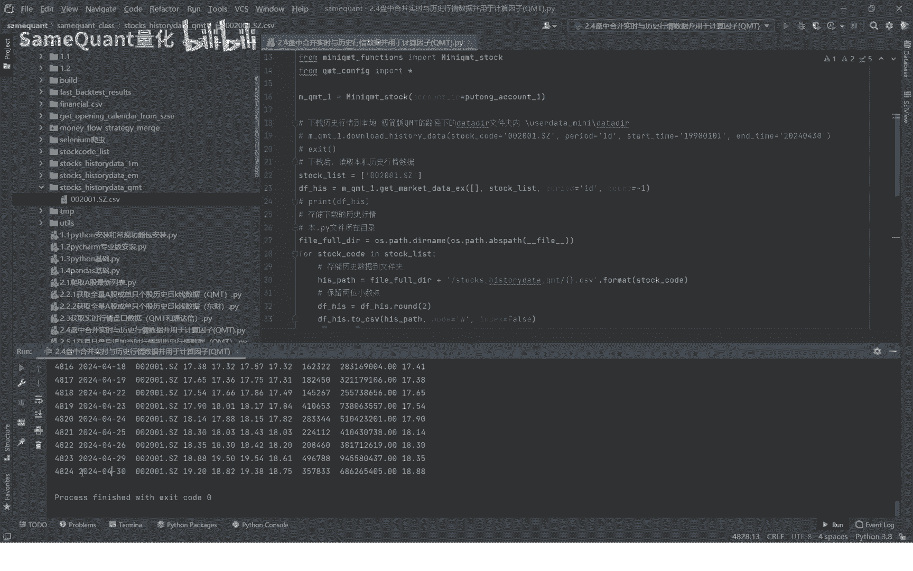

下载完成后，可以将这行代码注释掉，避免重复下载。

---

## 第三步：读取并存储历史数据

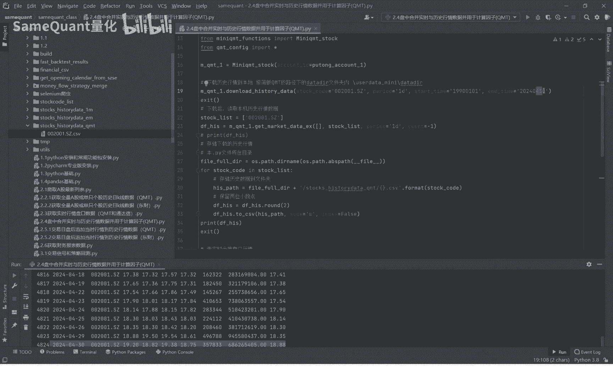

下载完成后，我们需要读取已下载到本地的历史行情数据。

读取数据后，可以将其存储到自定义的文件夹路径下，例如 `history_DQ_mt` 文件夹。

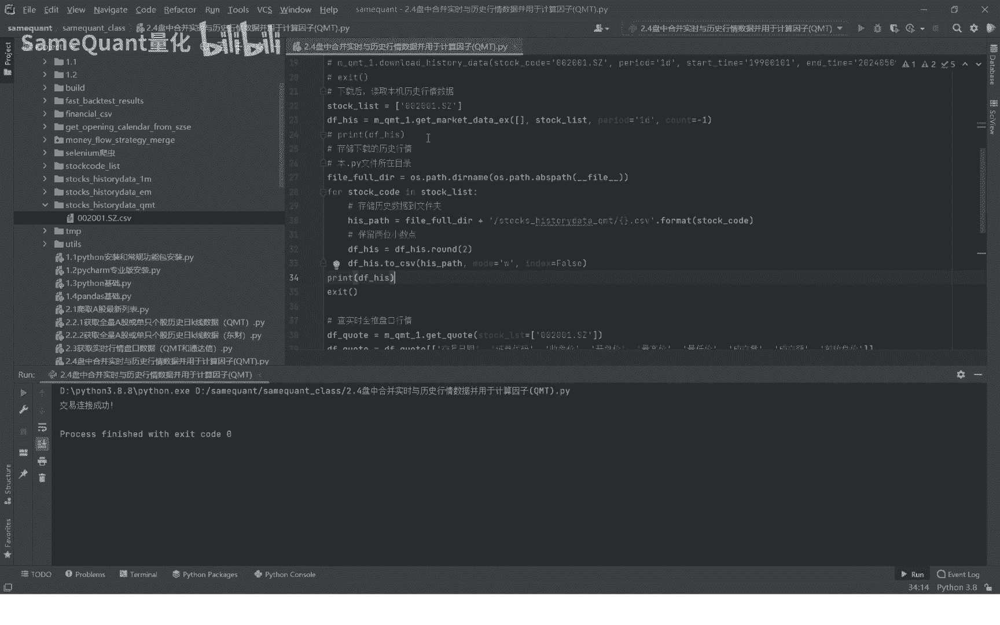

运行以下代码后，该股票的历史行情数据将被打印出来并保存到本地。

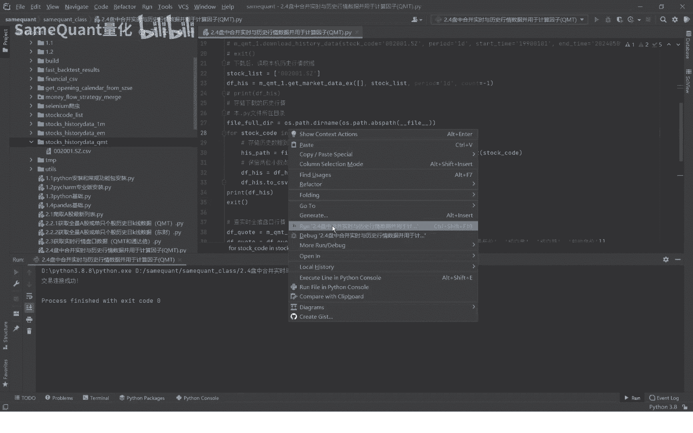

```python
# 读取本地历史数据
df_history = read_local_history_data(file_path='path/to/history_data.csv')
# 存储到自定义文件夹
df_history.to_csv('custom_folder/history_DQ_mt/stock_data.csv', index=False)
```

检查数据时，可能会发现日期字段存在问题。例如，结束日期可能不是今天。这时需要修正日期参数，重新下载数据。

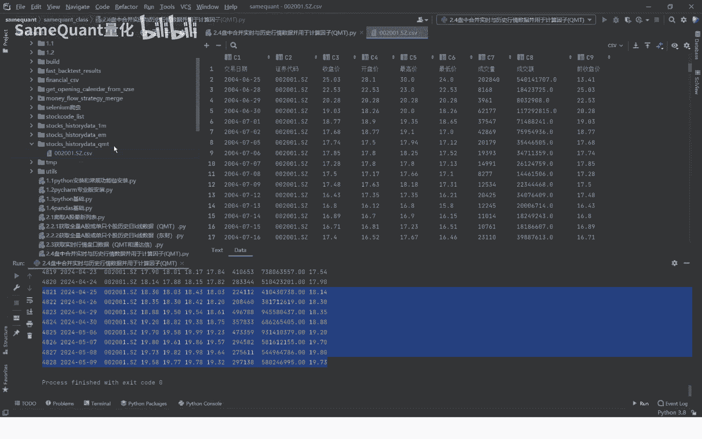

修正日期后，再次运行下载和存储步骤，确保获得包含最新数据的历史行情文件。数据字段通常包括：交易日期、代码、开盘价、最高价、最低价、收盘价、成交量、成交额、前收盘价等。

---

## 第四步：获取实时行情数据

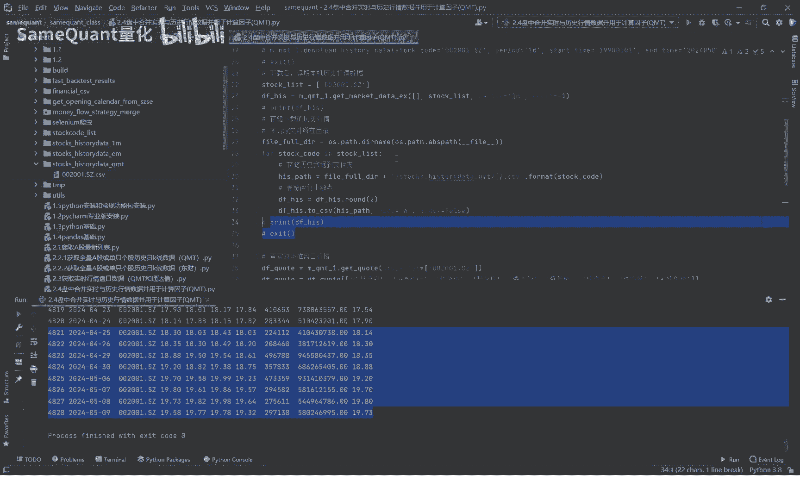

上一节课程中，我们已经介绍了如何获取KMT的实时行情数据。

为了与历史数据合并计算，我们需要对实时数据的字段进行截取，只保留与历史数据相同的字段（如开盘价、收盘价等）。字段不一致会导致无法合并或计算错误。

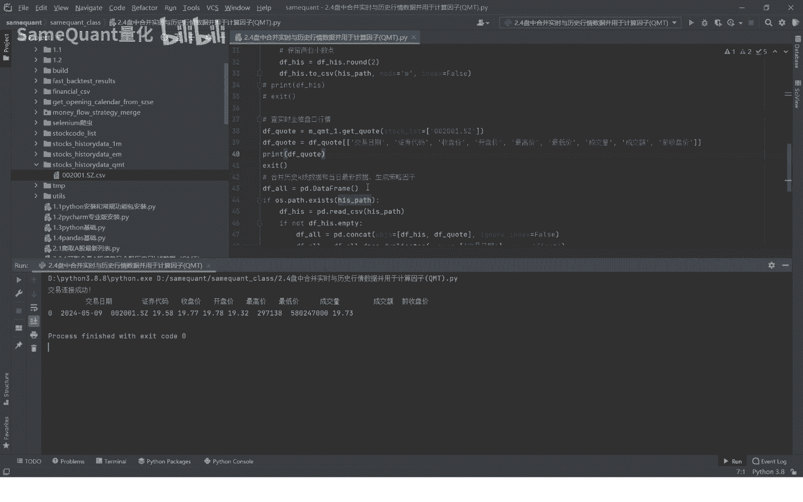

```python
# 获取实时行情数据并截取字段
realtime_data = get_realtime_data(stock_code='示例代码')
# 只保留需要的列，与历史数据字段对齐
realtime_data = realtime_data[['trade_date', 'open', 'high', 'low', 'close', 'volume', 'amount']]
```

---

## 第五步：合并数据并计算交易信号

现在，我们将进入核心环节：合并数据并计算交易信号。

首先，读取存储好的历史行情数据，然后与最新的实时盘口数据合并。

合并时可能会遇到重复的交易日数据。我们需要根据交易日期去重，只保留唯一记录，避免重复数据影响后续计算（例如计算移动平均时会产生偏差）。

去重后，重置DataFrame的索引。

```python
# 合并历史与实时数据
combined_data = pd.concat([df_history, realtime_data])
# 根据交易日期去重
combined_data = combined_data.drop_duplicates(subset=['trade_date'])
# 重置索引
combined_data = combined_data.reset_index(drop=True)
```

接下来，我们计算一个简单的交易信号。这里以“均线多头”信号为例，其逻辑是：当5日均线大于10日均线，并且今日的5日均线与10日均线均高于昨日对应的均线时，产生“均线多头”信号。

以下是计算步骤：

1.  **计算5日均线**：使用收盘价的5日简单移动平均。
    `ma5 = combined_data['close'].rolling(window=5).mean()`
2.  **计算10日均线**：使用收盘价的10日简单移动平均。
    `ma10 = combined_data['close'].rolling(window=10).mean()`
3.  **定义信号条件**：
    *   条件1：`ma5 > ma10`
    *   条件2：今日`ma5` > 昨日`ma5` （即 `ma5 > ma5.shift(1)`）
    *   条件3：今日`ma10` > 昨日`ma10` （即 `ma10 > ma10.shift(1)`）
4.  **生成信号**：当以上三个条件同时满足时，标记为“均线多头”。

```python
# 计算移动平均线
combined_data['ma5'] = combined_data['close'].rolling(5).mean()
combined_data['ma10'] = combined_data['close'].rolling(10).mean()

# 计算均线多头信号
condition1 = combined_data['ma5'] > combined_data['ma10']
condition2 = combined_data['ma5'] > combined_data['ma5'].shift(1)
condition3 = combined_data['ma10'] > combined_data['ma10'].shift(1)

combined_data['signal'] = '其他'
combined_data.loc[condition1 & condition2 & condition3, 'signal'] = '均线多头'
```

运行计算后，可以查看最近的数据。例如，查看最近10条记录，可能全部显示为“均线多头”，表示近期持续符合该条件。查看更多记录（如20条）时，可能会发现从某个特定日期开始，信号才转变为“均线多头”，此日期之前则为其他状态。

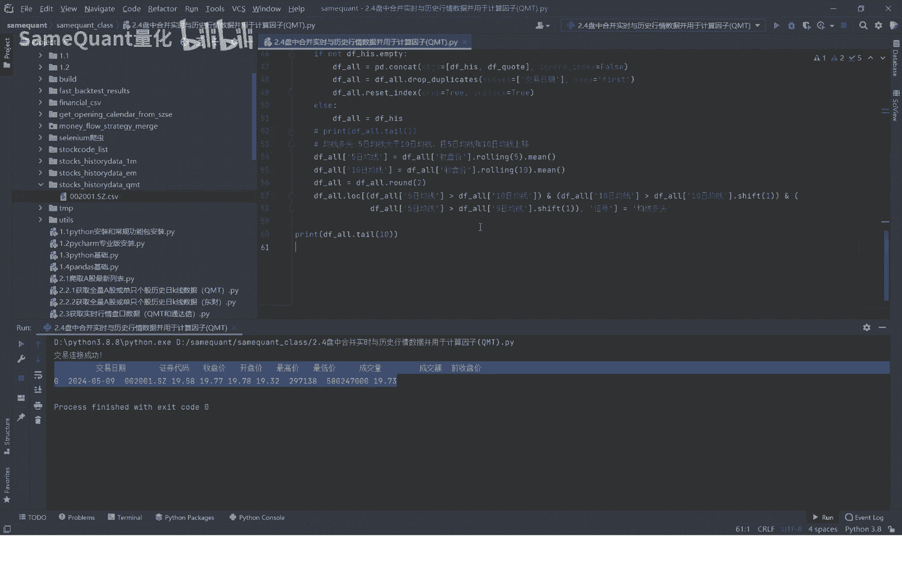

---

## 第六步：策略应用设想

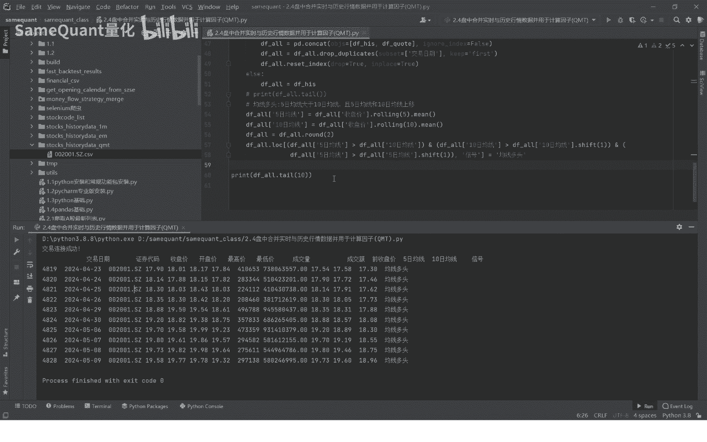

基于计算出的信号，可以构建简单的交易策略。例如，当首次出现“均线多头”信号时，执行买入操作。

**请注意**：这只是一个非常简化的示例，用于演示数据合并与因子计算流程。实际盘中交易策略的构建要复杂和严谨得多，需要考虑更多因素。

```python
# 策略示例：标记首次出现“均线多头”的日期
first_buy_signal_index = (combined_data['signal'] == '均线多头').idxmax()
if first_buy_signal_index:
    print(f"首次均线多头信号出现在: {combined_data.loc[first_buy_signal_index, 'trade_date']}")
```

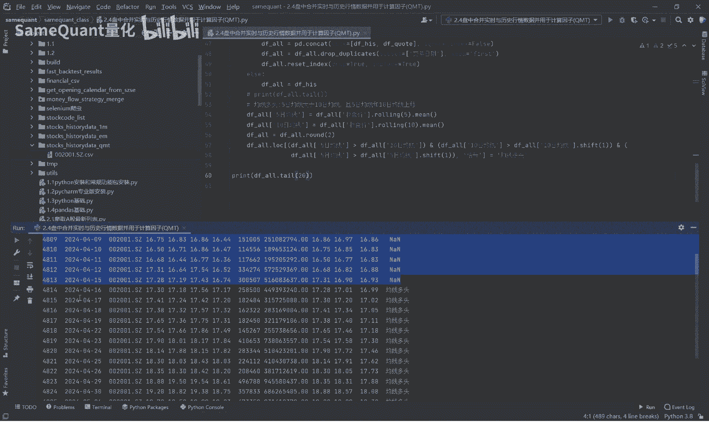

---

## 总结

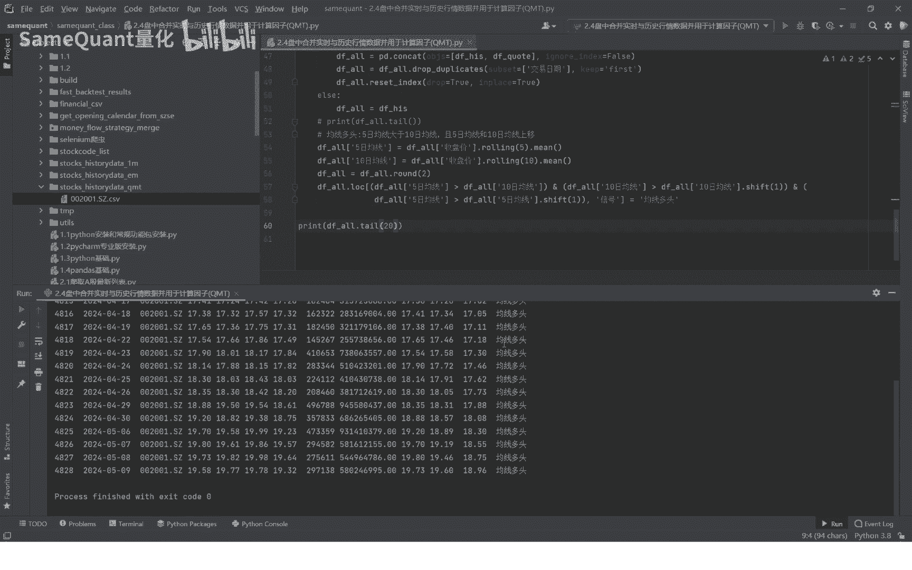

本节课中，我们一起学习了量化分析中的一个关键操作：合并实时与历史行情数据并计算交易因子。

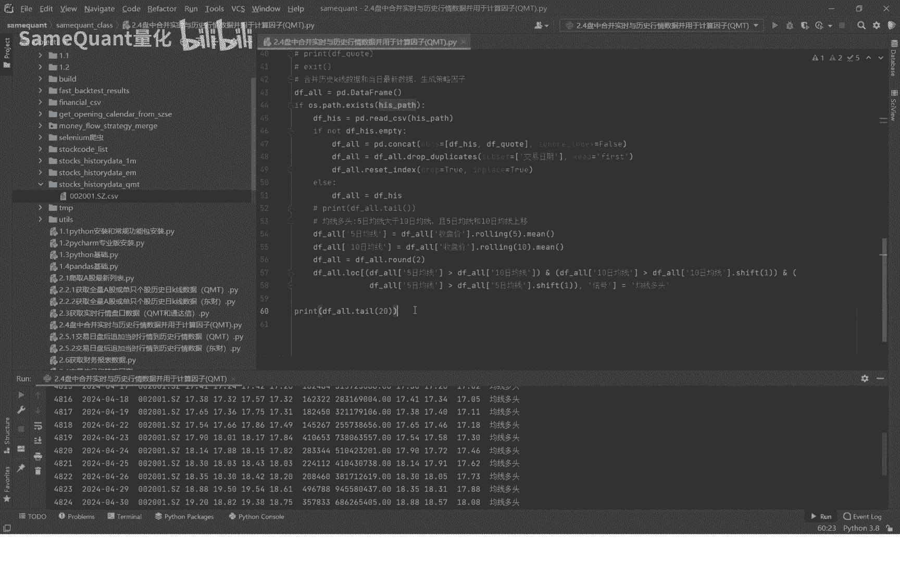

我们分步完成了**数据准备**（导入、下载、读取历史数据）、**实时数据获取与处理**、**数据合并与清洗**（去重、索引重置），最后实现了一个简单的**“均线多头”因子计算**。

整个过程展示了从原始数据到生成可用交易信号的基本流水线。掌握这个流程后，你可以尝试替换更复杂的因子公式，构建属于自己的量化策略模型。