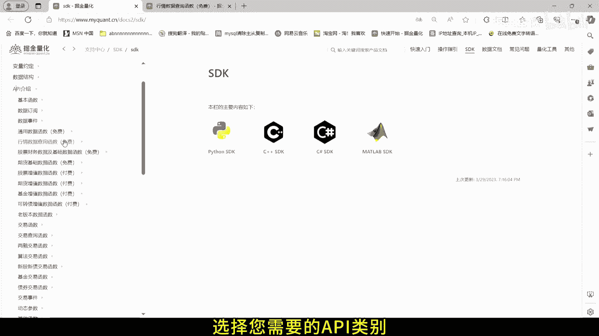
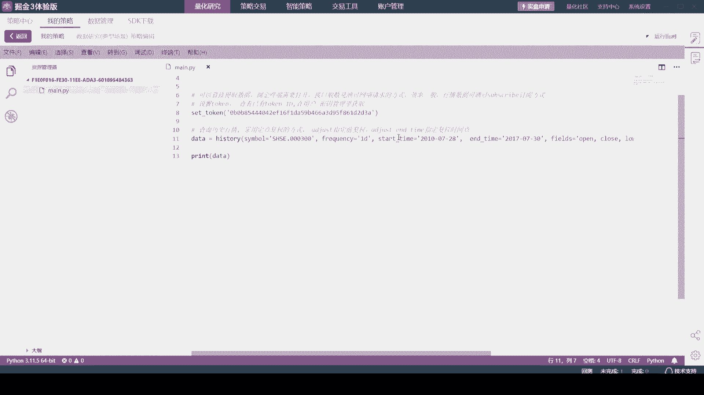
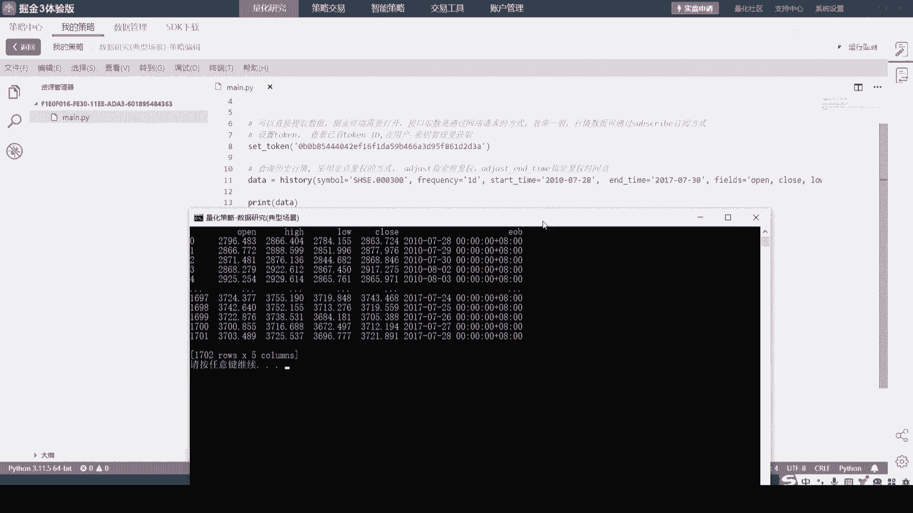
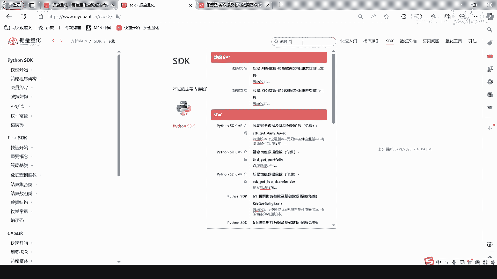
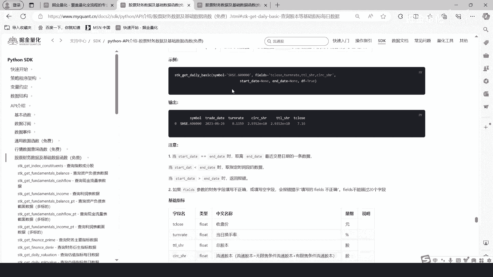
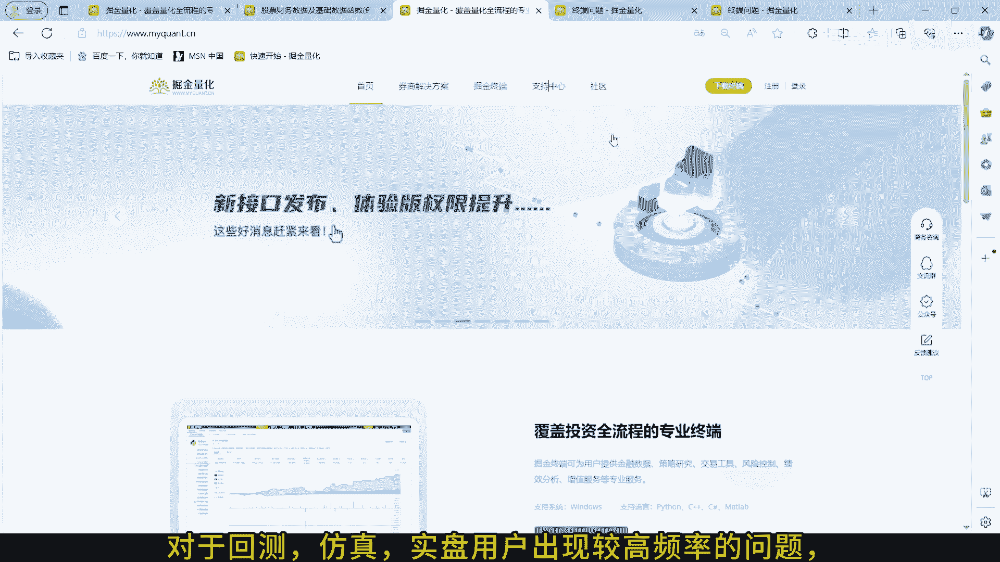
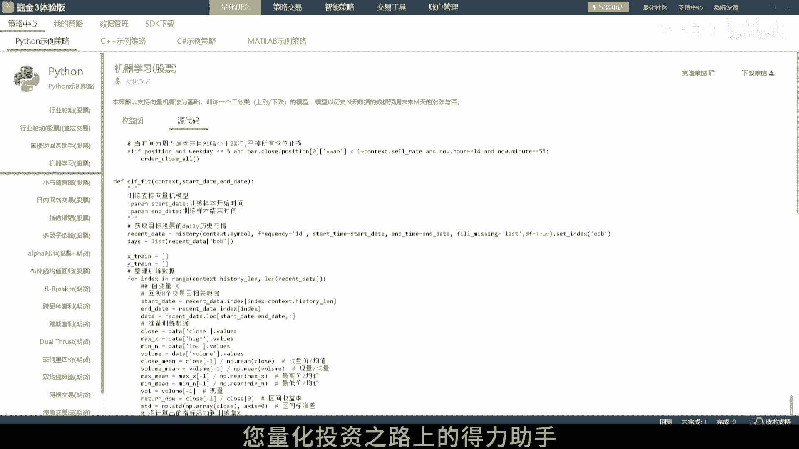

# 掘金量化API使用介绍：2.4：SDK文档使用指南 📚


在本节课中，我们将学习如何有效地使用掘金量化的SDK文档，以开始您的量化策略开发之旅。我们将介绍文档的结构、核心功能以及如何快速查找所需信息和获取帮助。

## 概述

掘金量化的SDK文档是开发者进行量化策略编程的核心资源。它详细介绍了各类API的功能和使用方法。掌握如何高效地查阅和使用这份文档，是成功进行量化开发的第一步。

## 访问SDK文档

首先，您需要在浏览器中访问掘金量化的SDK文档页面。输入官方提供的链接即可进入。

## API分类介绍



掘金量化的API主要分为四大类，每一类都服务于不同的量化开发需求。

以下是主要的API类别：



*   **通用类API**：提供基础的系统功能和配置接口。
*   **行情类API**：用于获取实时或历史的股票、期货等市场行情数据。
*   **财务数据类API**：提供上市公司财务报表、财务指标等基本面数据。
*   **交易类API**：用于执行下单、撤单、查询持仓和订单等交易操作。

## 查阅与使用API



在文档中，您可以找到每个API的详细描述、参数说明和返回值。为了便于使用，文档通常直接提供可运行的代码示例。

您可以直接复制这些代码片段到您的项目中，并根据需要进行修改。例如，一个获取行情数据的函数调用可能如下所示：

```python
# 示例：使用行情类API获取股票数据
data = get_history(symbol=“SHSE.600000”, frequency=“1d”, count=10)
```

## 学习示例与搜索功能



如果您需要更具体的例子来理解API如何组合使用，掘金终端内的“策略中心”提供了丰富的示例策略，您可以参考它们来编写自己的策略。



同时，文档页面提供了强大的搜索功能，方便您快速定位到所需的API或概念。

以下是使用搜索功能的步骤：



1.  打开官网的支持中心或SDK文档界面。
2.  点击页面右上角的搜索框。
3.  输入您想查询的关键词（如“下单”、“K线数据”等）即可获得相关结果。

## 常见问题与技术支持

对于在回测、仿真或实盘交易中可能遇到的常见问题，掘金量化提供了详细的常见问题（FAQ）文档。

以下是查阅常见问题文档的步骤：

1.  打开官网的支持中心或SDK文档界面。
2.  找到并点击“常见问题”栏目。
3.  在其中浏览或查找您遇到的问题。

如果在使用过程中遇到任何文档未能解决的问题，您可以通过官网提供的联系方式（如添加指定QQ号）加入技术交流群。掘金量化的技术团队会在群内为您提供帮助。



## 总结

本节课我们一起学习了如何高效利用掘金量化的SDK文档。我们了解了API的主要分类、如何查阅和使用具体的API接口、以及如何通过示例策略、搜索功能和常见问题文档来辅助开发。最后，我们还知道了在遇到难题时如何寻求技术支持。现在，您可以开始使用掘金量化的API来构建您的量化策略，进行高效的数据分析和交易了。