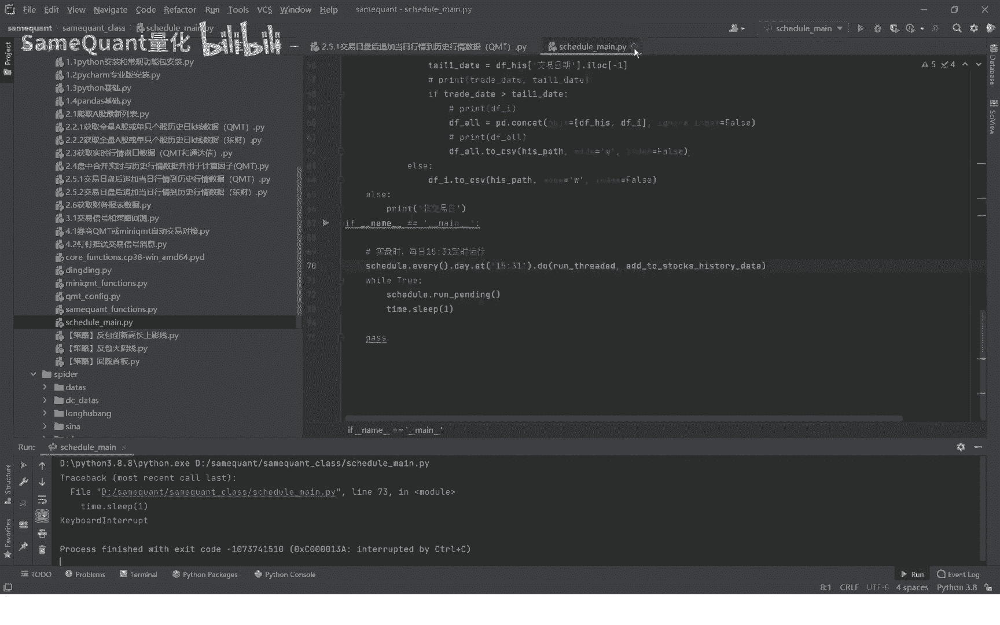

# QMT量化教程：2.5.1：交易日盘后追加历史行情数据

在本节课中，我们将学习如何在每个交易日收盘后，将当日最新的行情数据追加到历史行情数据库中，以确保数据完整性，为后续的量化分析提供准确的基础。

## 概述

历史行情数据的完整性对于量化策略的信号计算至关重要。如果数据缺失，可能导致策略信号出现错误。本节将介绍如何在QMT平台中，通过编程方式实现每日盘后自动追加行情数据。

上一节我们介绍了数据获取的基础，本节中我们来看看如何维护数据的连续性。

## 核心步骤与代码实现

首先，我们需要导入QMT的相关模块，并确保本机的券商QMT终端已登录。

```python
# 导入QMT模块
import xtquant.xtdata as xt
```

以下是实现数据追加功能的核心代码流程：

1.  **获取股票列表**：首先读取需要更新数据的个股代码列表。
2.  **循环追加数据**：遍历列表中的每只股票，调用QMT内置方法，将当日最新行情数据追加到其历史数据文件中。
3.  **设置定时任务**：为了完全自动化，需要设置一个定时程序，在每日收盘后自动执行上述追加操作。

以下是核心的追加数据函数：

```python
def add_to_stock_history_data():
    # 1. 获取所有股票代码列表
    stock_list = xt.get_stock_list_in_sector('沪深A股')

    # 2. 循环为每只股票追加当日数据
    for stock_code in stock_list:
        # 调用QMT封装好的方法，追加数据
        xt.download_history_data(stock_code, period='1d')
        print(f"已更新 {stock_code} 的数据")
```

## 实现自动化运行

在实际使用中，我们不可能每天手动运行上述脚本。因此，需要设计一个定时程序。

我们已提前封装好一个定时运行程序。你只需设置一个触发时间，例如每天15:31（收盘后），让它自动执行 `add_to_stock_history_data()` 函数即可。

```python
# 示例：使用schedule库设置定时任务（需自行安装）
import schedule
import time

# 定义每天15:31执行的任务
schedule.every().day.at("15:31").do(add_to_stock_history_data)

while True:
    schedule.run_pending()
    time.sleep(1)
```

这样，系统会在每个交易日的15:31自动运行数据追加任务，保证你在盘中实盘交易时，所用的历史行情数据始终是最新且完整的，从而避免因数据缺失导致的信号计算错误。



## 总结


本节课中我们一起学习了在QMT平台中维护历史行情数据完整性的方法。核心是通过编程调用 `xt.download_history_data` 方法，并借助定时任务实现每日盘后自动追加数据。这确保了量化策略分析所依赖的数据基础是准确和连续的。

在下期内容中，我们将分享补充历史行情数据的另一个通道——东财通道。