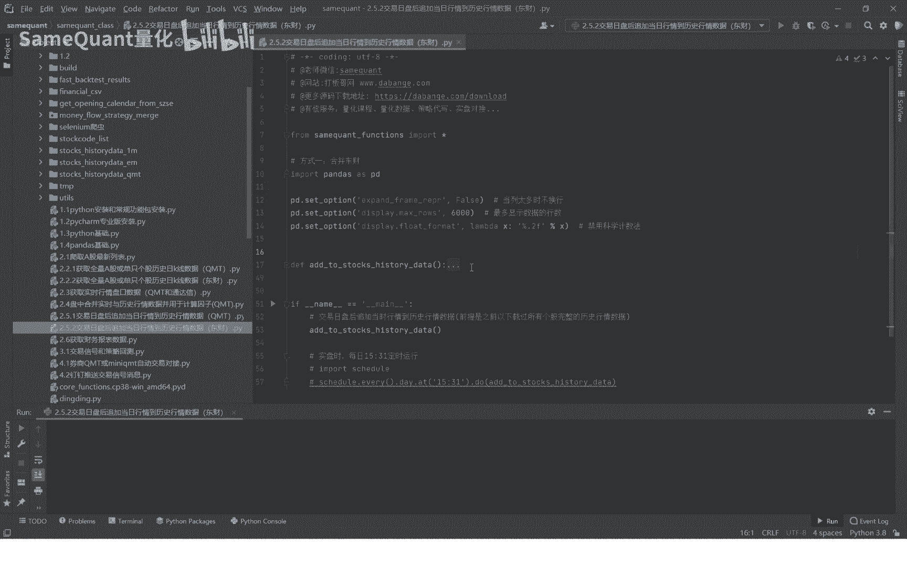
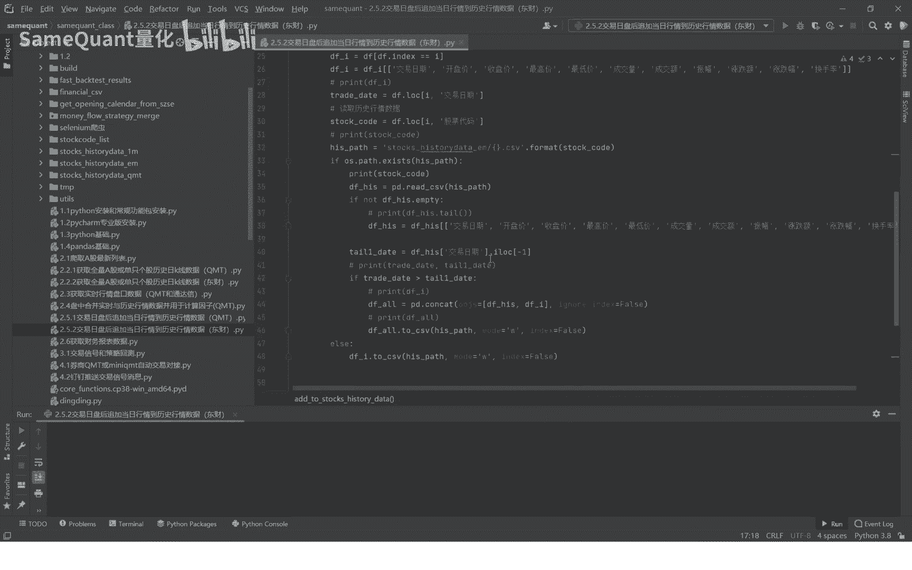
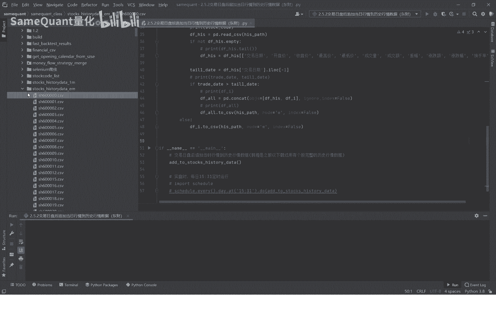
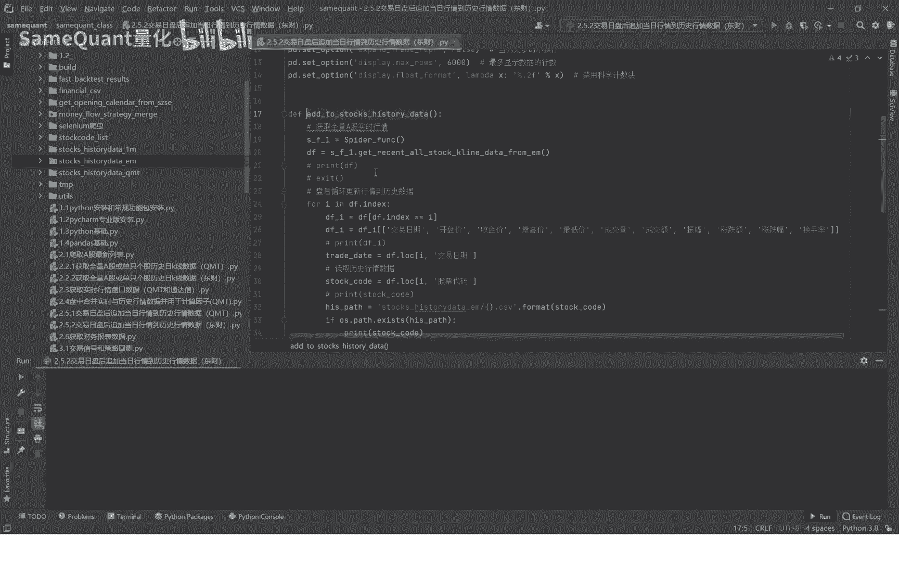
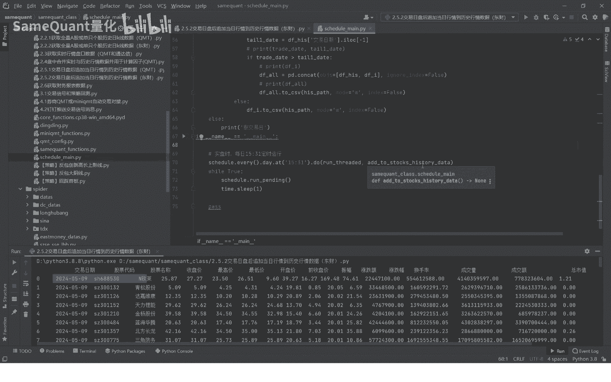

# 量化交易基础：2.5.2：交易日盘后追加历史行情数据 📈

在本节课中，我们将学习如何在每个交易日结束后，自动将当日的行情数据追加到历史数据文件中。这个步骤对于确保我们每日盘中计算交易信号时所使用的历史数据是完整且最新的至关重要。

我们已经编写好了一个名为 `add_to_stocks_hd` 的函数来完成这项任务。

直接运行这个函数，它会开始循环增量补充数据。由于数据量可能很大，我们可以先中断运行。运行结束后，本机文件夹下的历史数据文件就会包含当日的行情数据。

接下来，我们详细讲解这个函数的工作原理。

## 函数工作流程详解

首先，在每日盘后，函数会获取全量A股的实时行情数据。

这个过程非常快，不到一秒即可完成。获取的数据包含股票代码、名称、最新价、成交量等多种字段。

获取到实时数据后，函数会遍历每一只股票的实时行情数据。以下是核心的处理步骤：

1.  **数据字段对齐**：首先，从实时数据中截取该股票当日的行情记录。这里的关键是，所选取的字段必须与历史行情数据文件的字段保持一致，以确保数据能够正确合并。
2.  **读取历史数据**：接着，读取该只股票已有的历史行情数据文件。
3.  **数据合并与去重**：将当日的实时数据与历史数据进行拼接。拼接后，会进行去重操作，防止同一日的数据被重复记录。
4.  **覆盖存储**：最后，将合并并去重后的完整数据，覆盖写回该股票的历史数据文件中。

完成一只股票的处理后，程序会循环遍历所有股票，重复上述步骤。

对于新上市的股票，这个过程同样有效。因为新股在第一天没有历史数据文件，程序在读取时会自动创建新文件并写入第一条数据。

## 实现自动化运行

在实际的策略运行环境中，我们不会手动执行这个函数。为了实现自动化，我们需要用到定时程序。

我们可以利用上期课程分享的Python定时程序文件。你可以在其中设置任务，让它在每个交易日的15:30自动运行 `add_to_stocks_hd` 函数来补充数据。

这样，程序就会在指定时间自动运行，完成数据追加后结束，确保我们的历史数据库每日都能得到更新。

## 总结

本节课中，我们一起学习了如何通过一个自动化函数，在交易日盘后将当日行情数据增量追加到历史数据库中。我们了解了函数的核心步骤：获取实时数据、对齐字段、合并历史数据、去重并存储。最后，我们还探讨了如何通过定时任务实现这一过程的完全自动化，从而保证量化策略所使用的历史数据始终是完整和及时的。