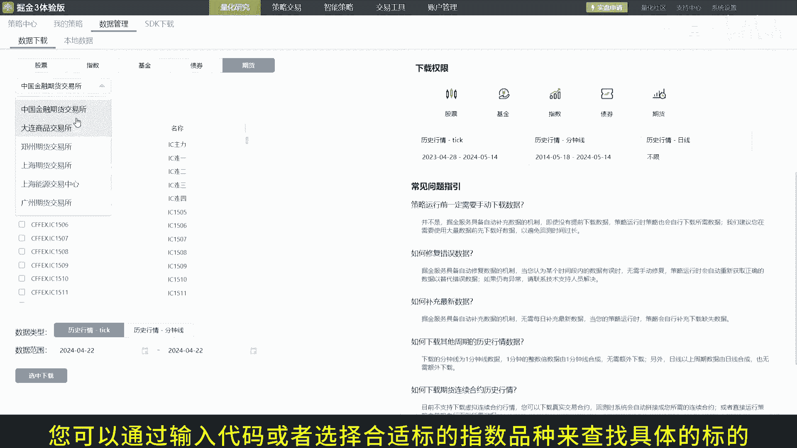
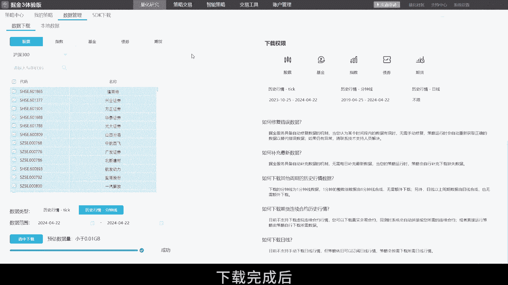
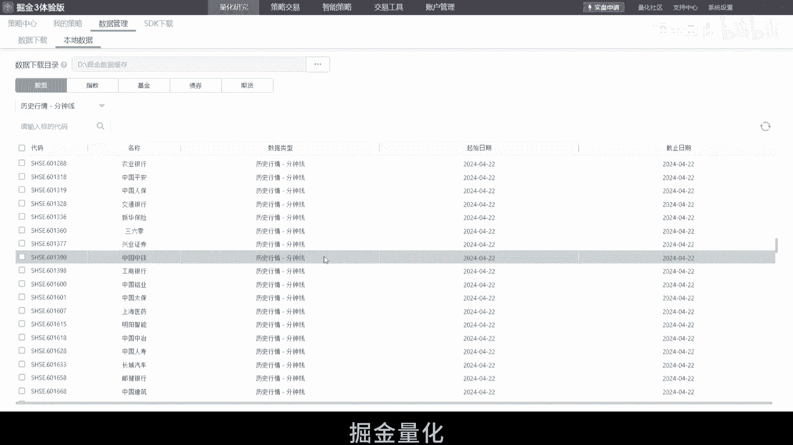

# 掘金量化终端本地数据管理下载教程：2.5：本地数据管理与下载

在本节课中，我们将学习如何在掘金量化终端中设置数据下载目录、下载历史行情数据以及管理本地数据。掌握这些操作能有效提升您的回测速度和策略开发效率。

## 🗂️ 设置数据下载目录

上一节我们介绍了课程目标，本节中我们来看看如何设置数据存储的位置。

从3.17版本开始，您需要手动设置数据下载目录。请按照以下步骤操作：

1.  点击顶部菜单栏的 **“量化研究”**。
2.  在下拉菜单中选择 **“数据管理”**，然后点击 **“本地数据”**。
3.  在弹出的配置窗口中，选择一个合适的本地文件夹路径作为数据下载目录。
4.  设置完成后，**务必点击“重启”按钮**以使更改生效。

## 🔐 确认数据权限

在开始下载数据之前，有一个重要的前提需要确认。

请确保您当前的掘金账号拥有您想要下载的数据类型的相应权限。您可以在终端内查询您的具体权限范围。

## 📥 下载历史行情数据

设置好目录并确认权限后，我们就可以开始下载所需的数据了。以下是下载数据的具体步骤：

1.  依次点击 **“量化研究” -> “数据管理” -> “数据下载”**。
2.  在数据下载界面，您需要指定下载任务的具体参数：
    *   **选择标的**：首先选择标的的大类品种（如股票、期货）。
    *   **查找标的**：通过输入代码或选择相关指数，找到并选中您需要下载的具体标的。
    *   **选择数据类型**：选择您需要的数据类型，例如：
        *   `tick` 数据（逐笔成交）
        *   `1m` / `5m` 等分时K线数据
    *   **设置时间范围**：设定数据的开始日期和结束日期。
3.  参数设置完毕后，点击 **“选中下载”** 按钮来建立下载任务。
    *   **请注意**：如果本地已存在最新的数据，系统将不会重复下载，以避免资源浪费。

## 📊 管理本地数据

数据下载完成后，您可以在本地数据页面进行查看和管理。

您可以返回 **“量化研究 -> 数据管理 -> 本地数据”** 页面。这里会清晰列出所有已下载的数据记录，包括通过手动下载和策略运行自动下载的数据。

---

本节课中我们一起学习了掘金量化终端本地数据管理的完整流程：从设置存储目录、确认权限，到下载指定标的和类型的历史数据，最后查看和管理本地数据文件。现在，您已经可以利用这些本地数据进行更高效、更快速的回测分析和策略开发了。

如果您在使用过程中遇到任何问题，欢迎随时联系掘金量化技术支持团队。