# 量化分析基础：2.6：获取A股历史和最新财务报表数据 📊

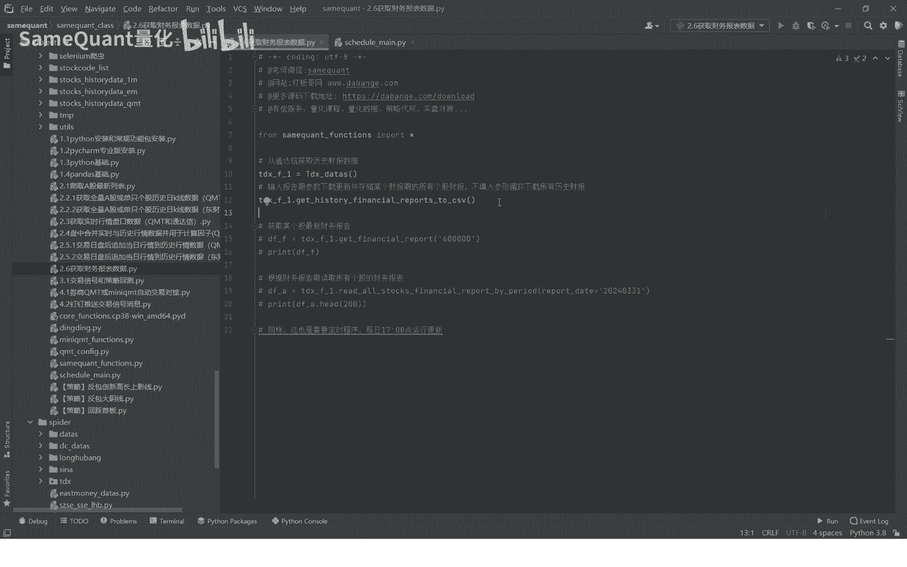

在本节课中，我们将学习如何获取全量A股的历史及最新财务报表数据。我们将使用通达信数据包作为数据源，演示从数据下载、解析到查看的完整流程。

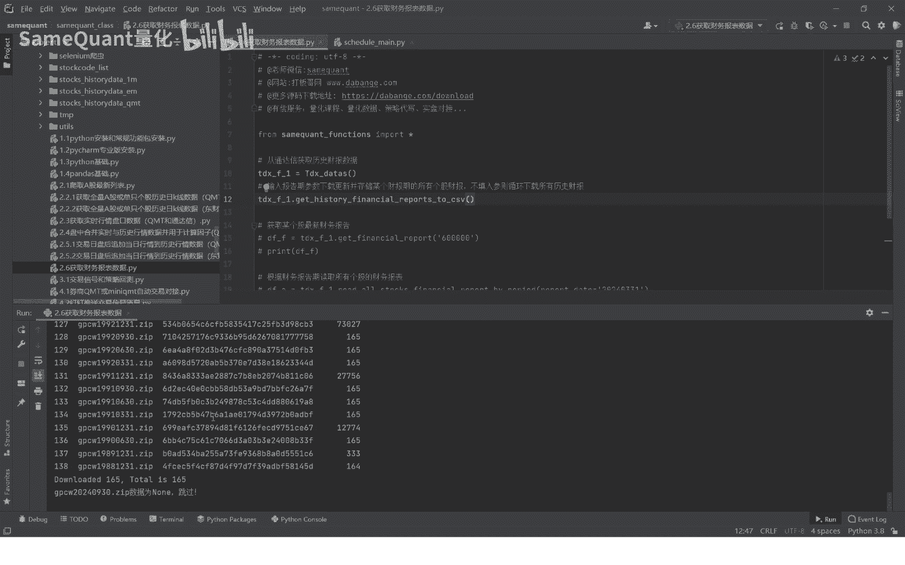

## 数据下载与解析

上一节我们介绍了数据源，本节中我们来看看如何具体下载和解析财报数据。首先，我们需要导入通达信数据包。

```python
# 导入通达信数据包
import tdx_data
```

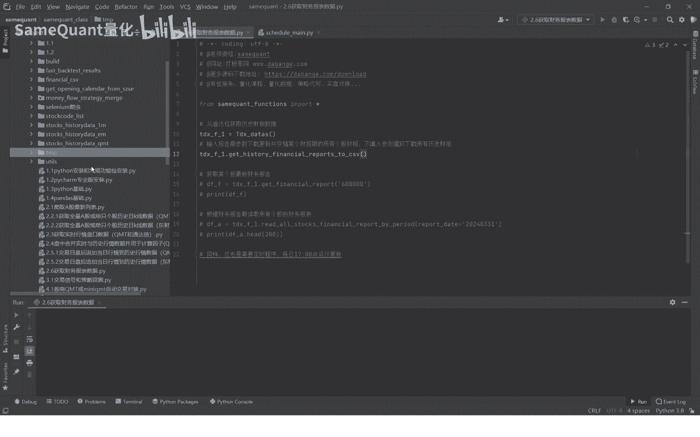

以下是获取财报数据的具体步骤：

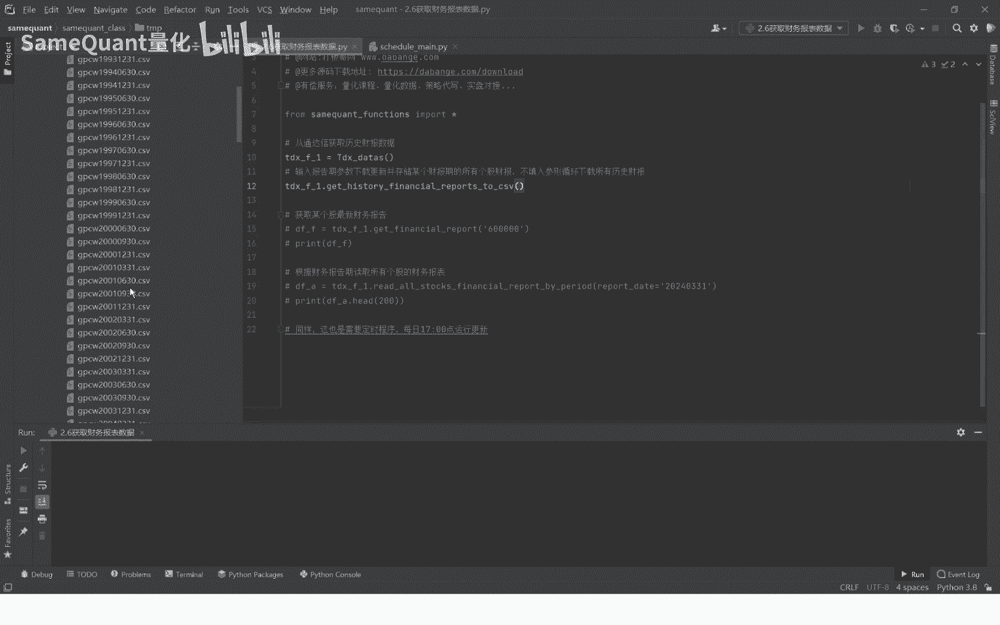

1.  在每个交易日结束后，运行下载程序以获取最新的财报数据。
2.  程序运行后，会自动开始下载包含财报数据的ZIP压缩包。
3.  下载完成后，程序会对ZIP文件进行解析，提取出结构化的财务报表数据。

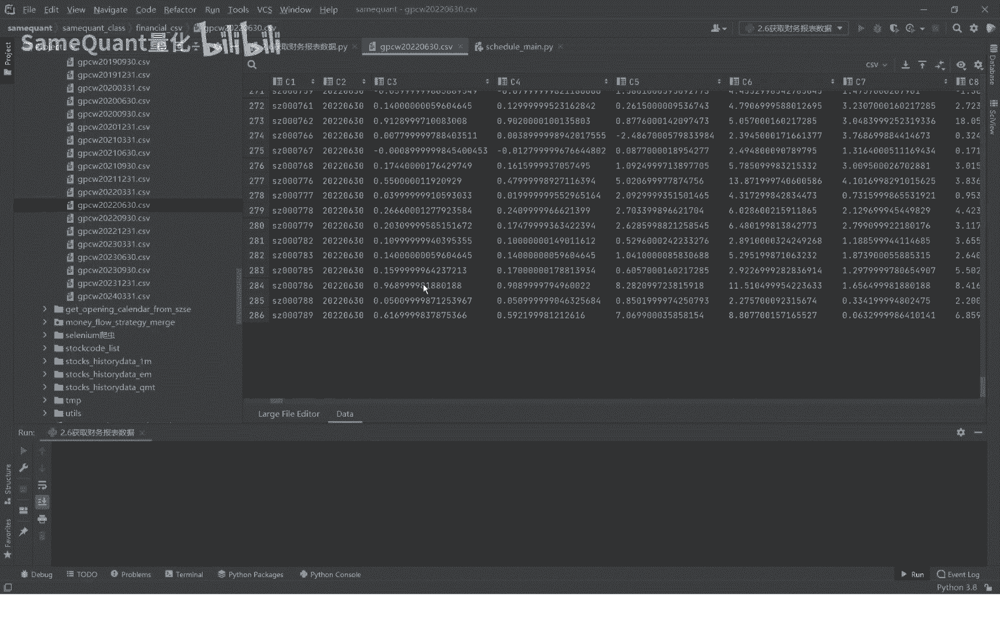

下载的文件默认保存在课程指定的目录下（例如 `./7mp/`），解析后会生成一个CSV格式的文件（例如 `FINANCIAL.csv`）。该文件包含了指定报告期内所有A股上市公司的财务数据。

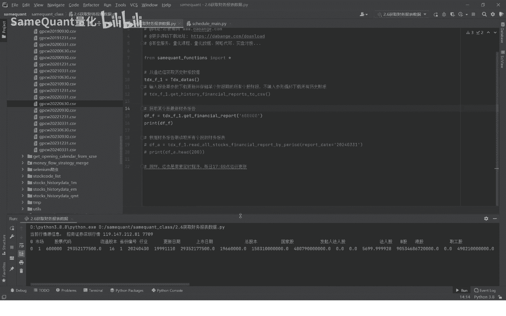

## 查看财报数据

下载并解析完数据后，我们就可以按个股来查看具体的财报信息了。

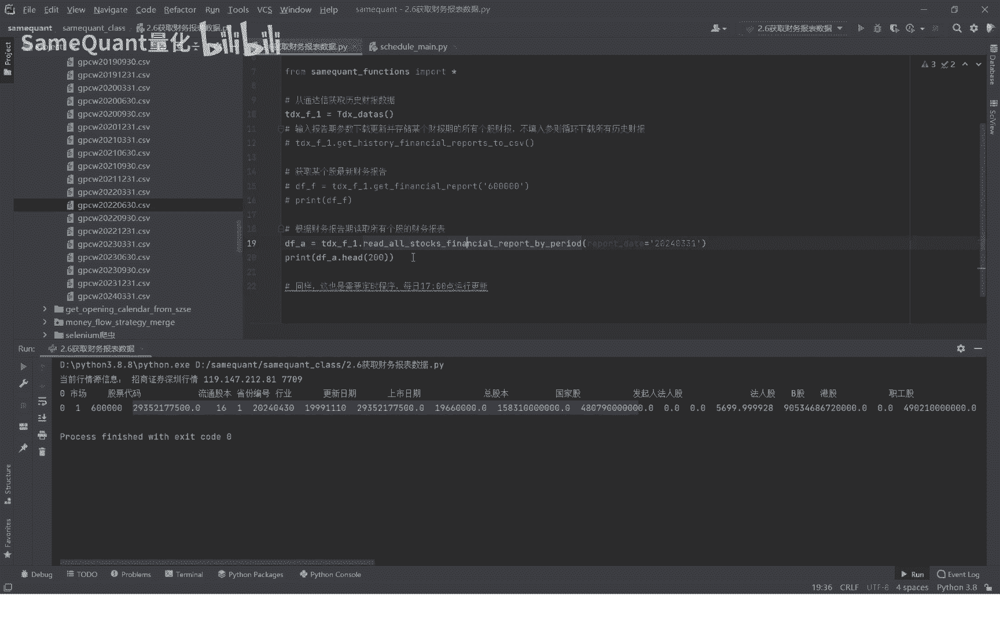

通过调用特定的方法并输入股票代码和报告期，可以查询到该股票在对应季度的详细财务报告。报告包含大量财务字段，例如：

*   **代码**：股票代码
*   **报告期**：财务报告对应的季度
*   **基本每股收益**：公司每股股票的盈利
*   **扣非每股收益**：扣除非经常性损益后的每股收益
*   **每股净资产**：每股股票代表的公司净资产
*   **净资产收益率**：衡量公司盈利能力的核心指标

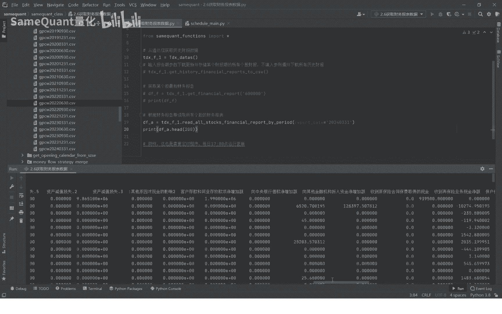

该数据集包含了超过400个财务字段，其完整性和专业性远超许多公开的财经网站或行情软件，为量化分析提供了高质量的数据基础。

## 定时更新数据

为了保证数据的时效性，我们需要建立一个定时更新程序。

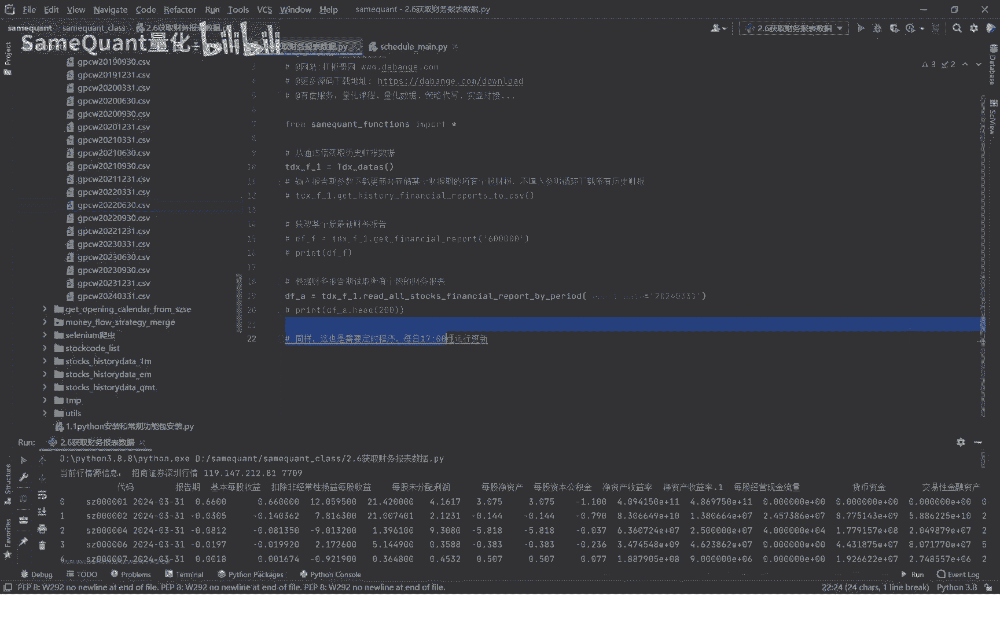

通常，这个程序会在每个交易日下午5点自动运行。实现方法是在系统的定时任务（如crontab）或项目的资源配置文件中，添加一个定时任务来执行我们编写的下载更新函数。

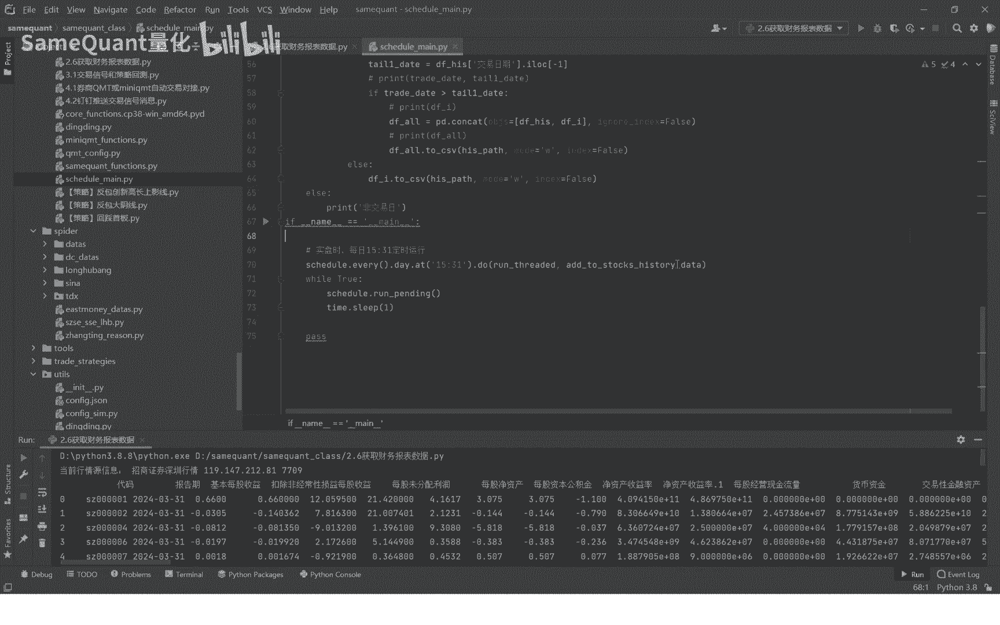

```bash
# 示例：在Linux系统crontab中设置每日17:00运行更新脚本
0 17 * * 1-5 /usr/bin/python3 /path/to/your/update_script.py
```

本节课中我们一起学习了如何从通达信获取全量A股的财务报表数据，涵盖了数据下载、解析、查看以及设置定时更新的完整流程。掌握这些数据获取技能，是进行后续量化策略研究与回测的重要基础。

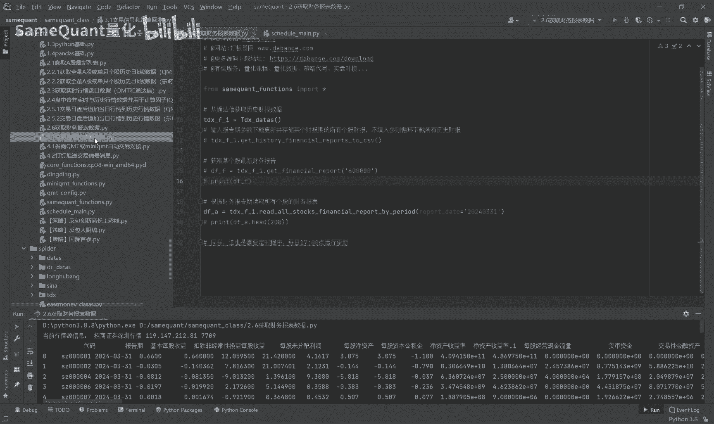

在下一节课中，我们将进入本量化课程的核心部分，讲解交易信号的计算与策略的回测环节。