# 加密小白书：2：使用CCXT获取币安历史K线数据

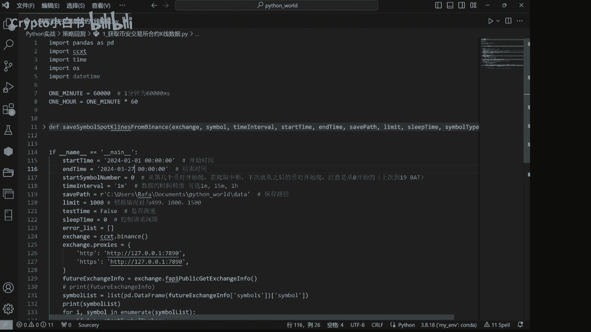

在本节课中，我们将学习如何使用CCXT库获取币安交易所的合约历史K线数据。这是进行策略回测的第一步，为后续生成交易信号、计算持仓和净值曲线打下数据基础。

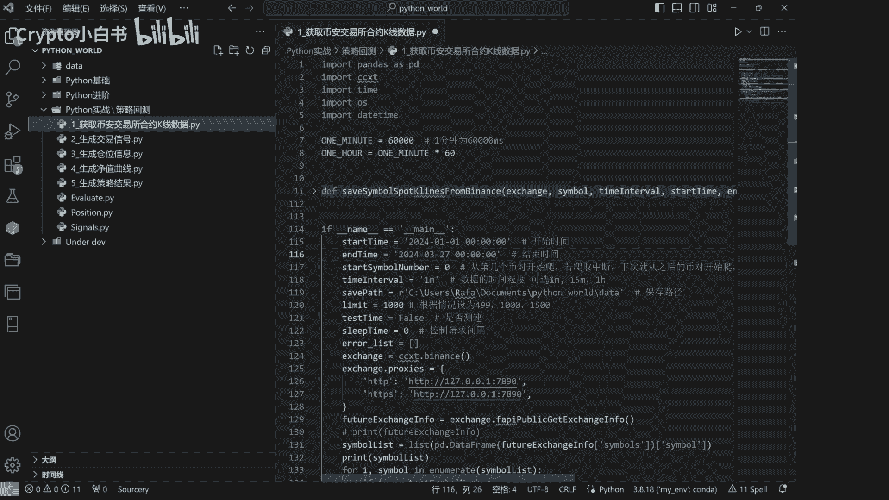

上一节我们介绍了课程的整体框架，本节中我们来看看如何具体获取数据。

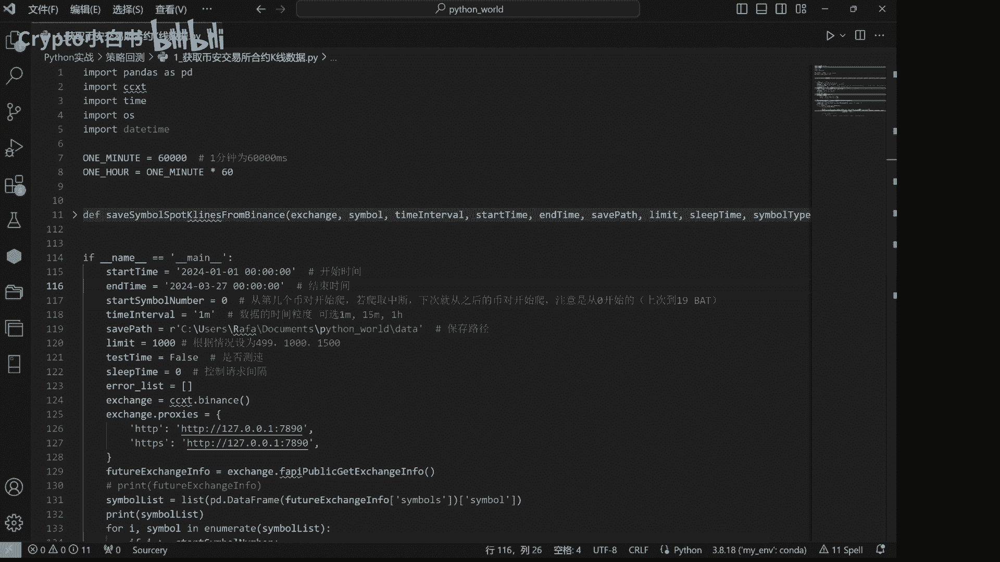

## 基本概念与准备工作

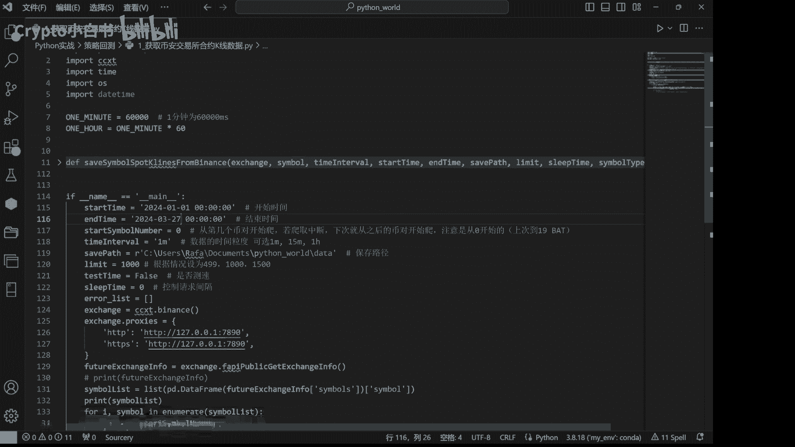

币安交易所是一个提供丰富历史K线数据的加密货币交易平台。这些数据可以免费用于分析与研究。请注意，本教程仅涉及数据获取，不涉及交易推荐。

开始之前，需要确保已安装必要的Python库。以下是需要安装的库：

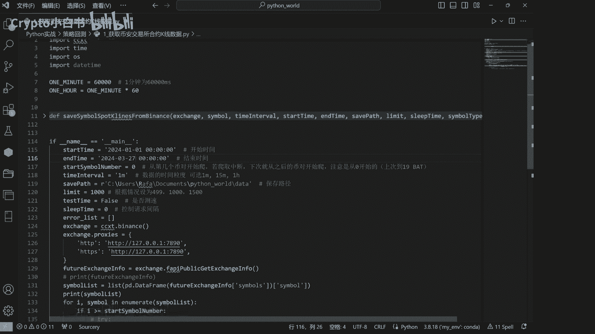

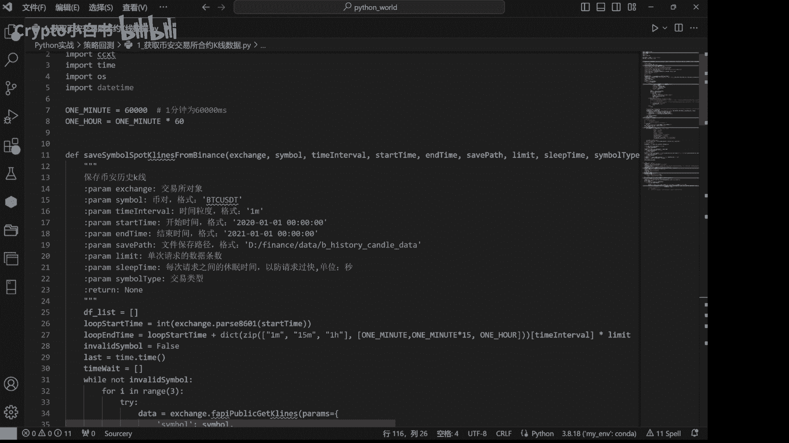

```
pip install pandas ccxt
```

如果尚未安装，请在命令行中执行上述命令。

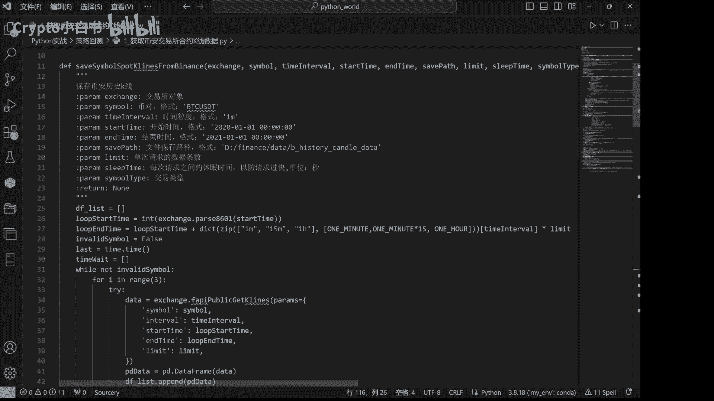

## 核心函数解析

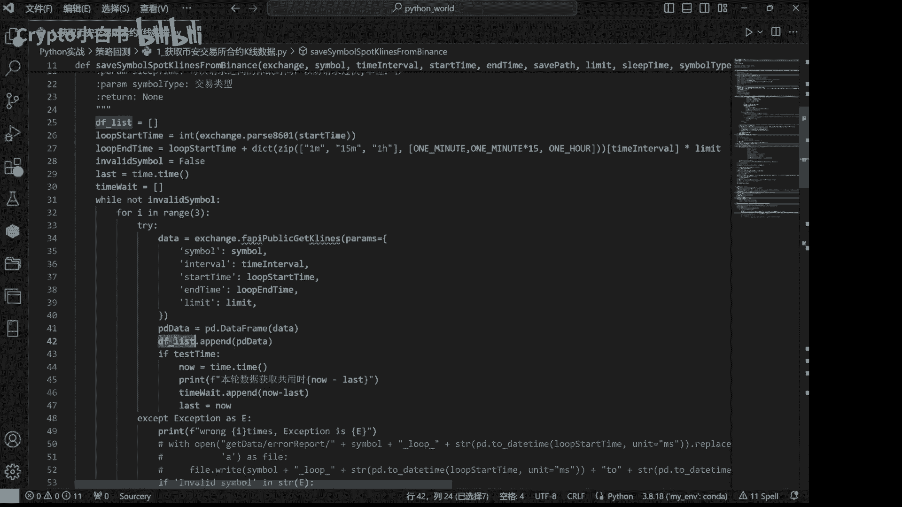

我们将定义一个名为 `save_symbol_spot_klines_from_binance` 的函数来获取并保存K线数据。该函数的核心参数包括：
*   `exchange`: CCXT交易所对象
*   `symbol`: 交易对符号（如 `BTC/USDT`）
*   `time_interval`: K线时间粒度（如 `1m`）
*   `start_time`: 数据开始时间

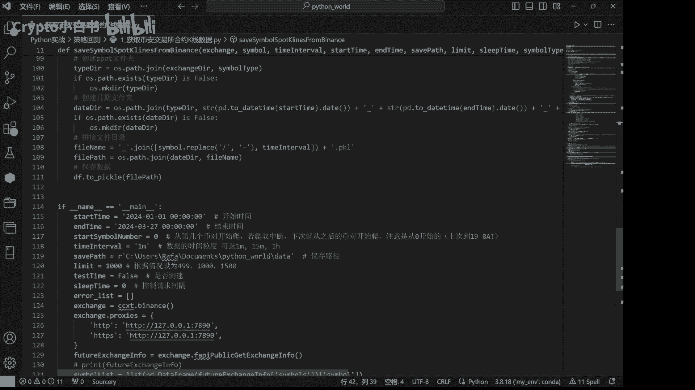

函数内部逻辑如下：
1.  创建一个空列表 `df_list` 用于存储分批获取的数据。
2.  通过循环控制，分批次从交易所API请求历史K线数据，以避免单次请求数据量过大。
3.  将每次获取到的数据（`pd_data`）添加到 `df_list` 中。
4.  循环结束后，合并列表中的所有数据为一个完整的Pandas DataFrame。
5.  对DataFrame的列进行重命名和处理，使其更易读。
6.  最后，将处理好的数据保存到指定的本地文件路径。

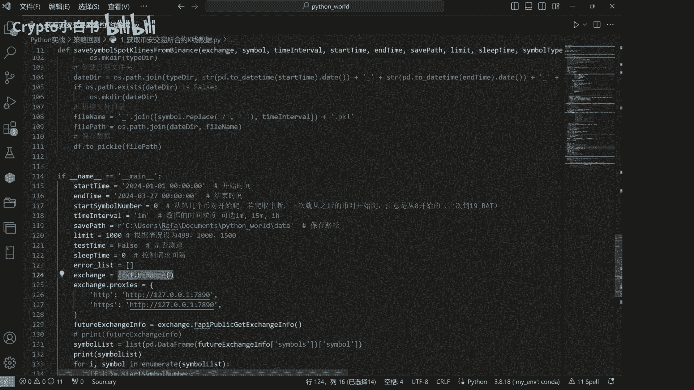

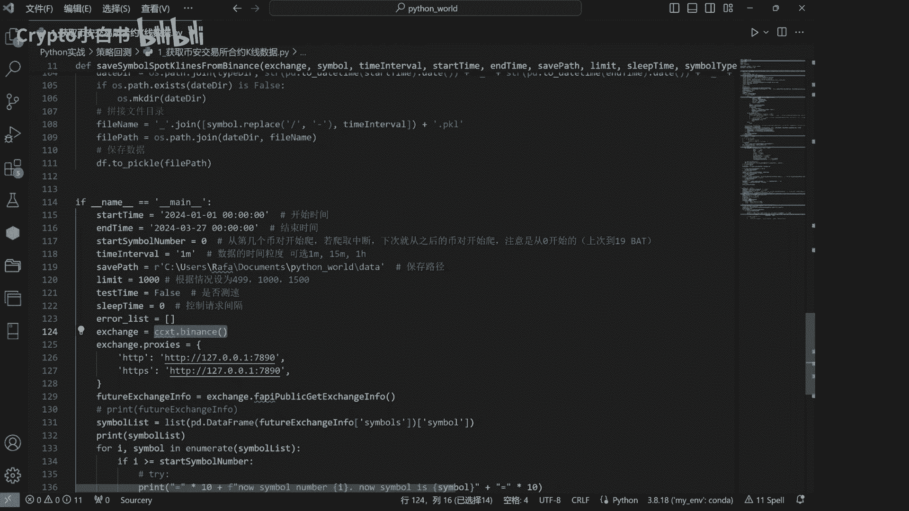

## 主程序流程

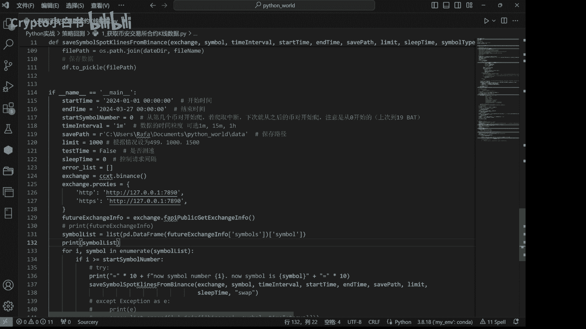

在主函数部分，我们需要设置参数并组织整个数据下载流程。以下是主要步骤：

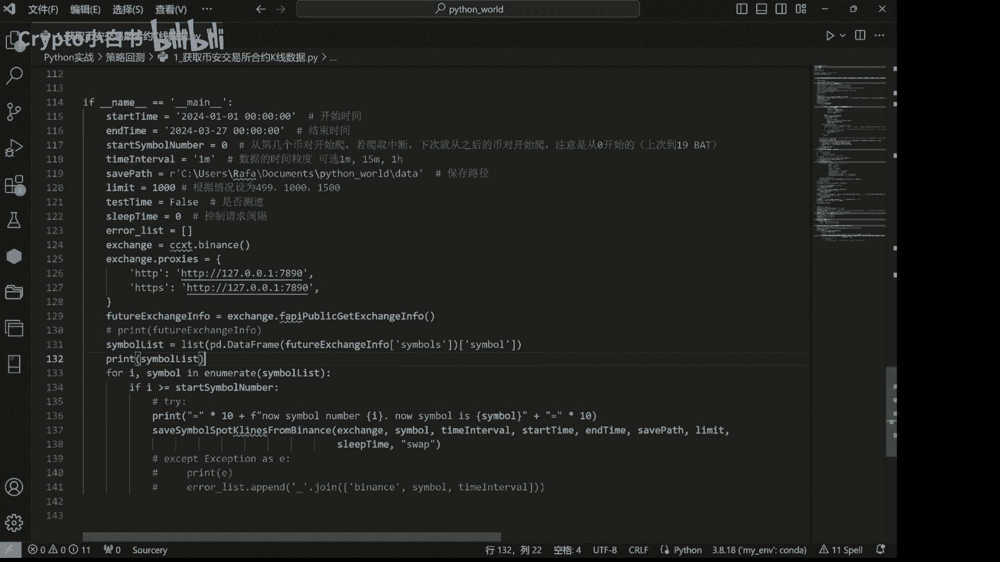

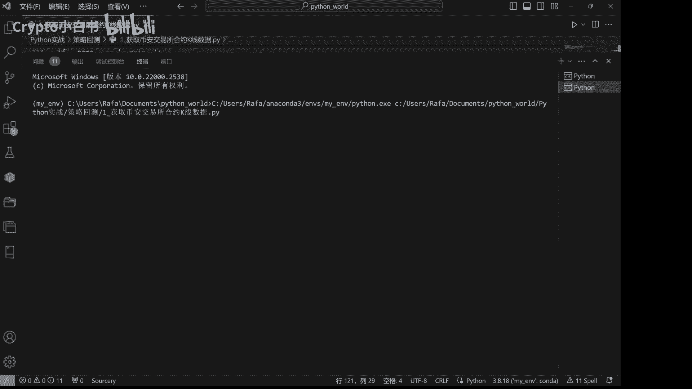

1.  **设置参数**：定义数据下载的开始时间、结束时间、K线粒度等。
2.  **创建交易所对象**：使用CCXT创建币安交易所的实例。
    ```python
    exchange = ccxt.binance()
    ```
3.  **配置网络代理**：为方便国内用户访问，可为交易所对象设置代理。
4.  **获取交易对列表**：从交易所获取所有USDT交易对的列表，并存储在 `symbol_list` 中。
5.  **循环下载数据**：遍历 `symbol_list` 中的每一个交易对，调用前面定义的 `save_symbol_spot_klines_from_binance` 函数，逐一下载并保存其历史K线数据。

程序运行后，控制台会打印出正在下载的交易对信息。所有数据将按交易对名称和日期，保存在本地的 `data` 文件夹下。

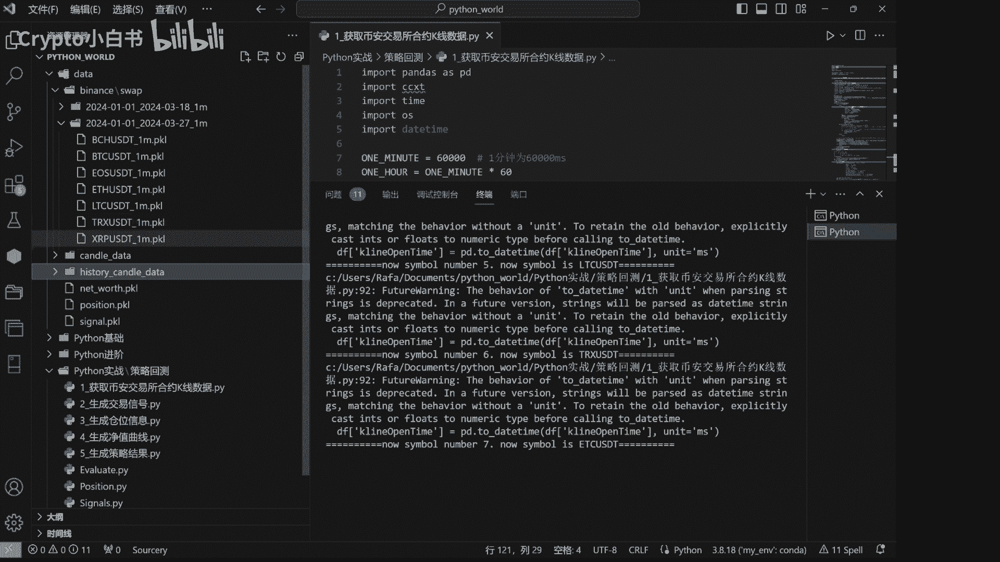

## 总结

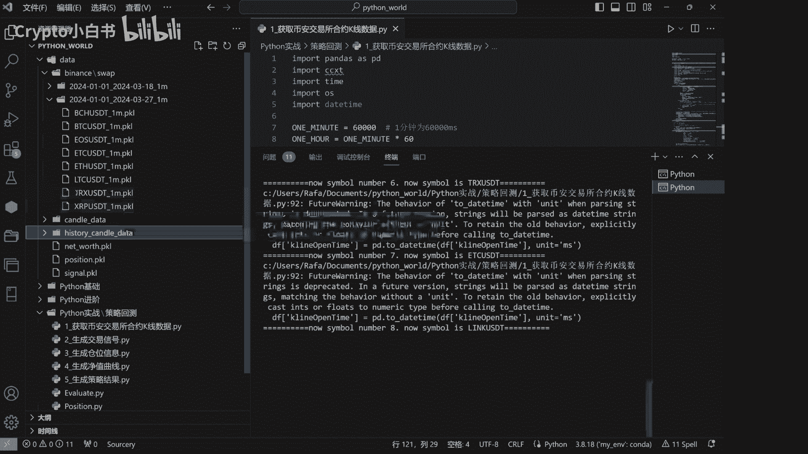

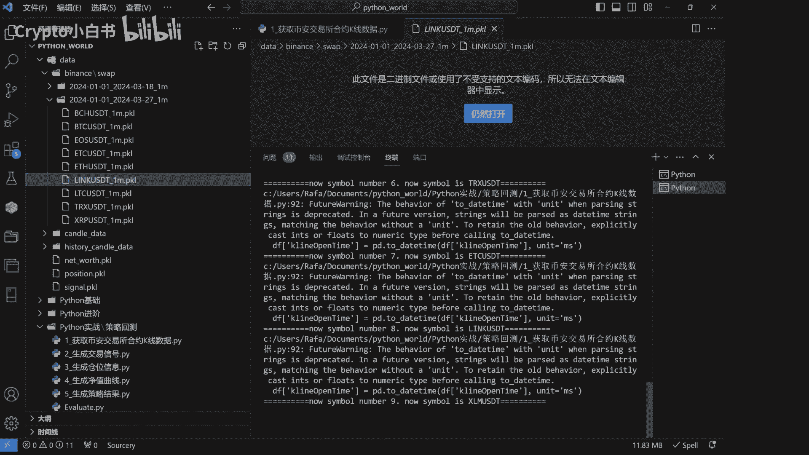

本节课我们一起学习了使用CCXT库从币安交易所获取历史K线数据的完整流程。我们定义了一个核心函数来处理数据请求与保存，并通过主程序循环下载了多个交易对的数据。这些数据文件是后续进行策略回测和分析的基石。如果对代码任何部分有疑问，建议将代码复制到AI辅助工具中进行分析，以加深理解。下一节，我们将基于这些K线数据，开始构建交易策略。