# Python量化开发：20：类型声明与代码检查

在本节课中，我们将学习如何为Python函数添加类型声明，以及如何利用工具进行代码检查，以提升代码的可读性和健壮性。

上一节我们介绍了如何测量函数的性能，本节中我们来看看如何通过类型声明和静态检查工具来优化代码的编写过程。

## 类型声明的作用

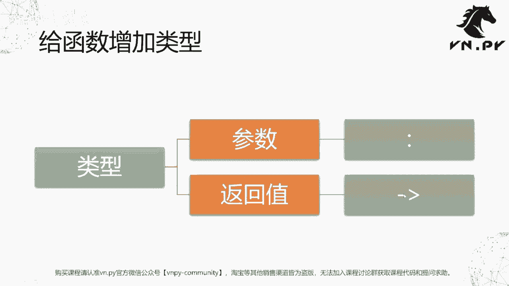

Python作为一门动态语言，在编写代码时并不强制要求为变量或函数声明类型。这与C++、C#、Java等静态编译型语言不同。虽然Python的这种灵活性带来了便利，但在编写复杂项目时，为函数参数和返回值添加类型声明有两个主要好处：
1.  对于开发者而言，能更清晰地了解函数需要什么类型的参数，以及会返回什么类型的结果。
2.  对于代码编辑器（IDE）而言，能提供更准确的智能提示，并帮助在运行前发现潜在的类型错误或拼写错误。

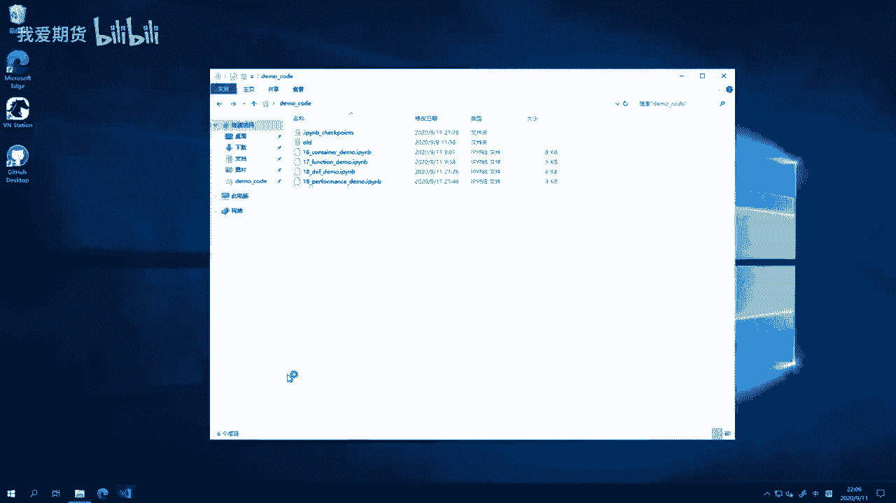

因此，从Python 3.5开始，引入了 **Type Hinting（类型提示）** 的概念。本节我们先学习如何为函数添加类型，后续在面向对象章节中会再介绍为类添加类型。

## 为函数添加类型声明

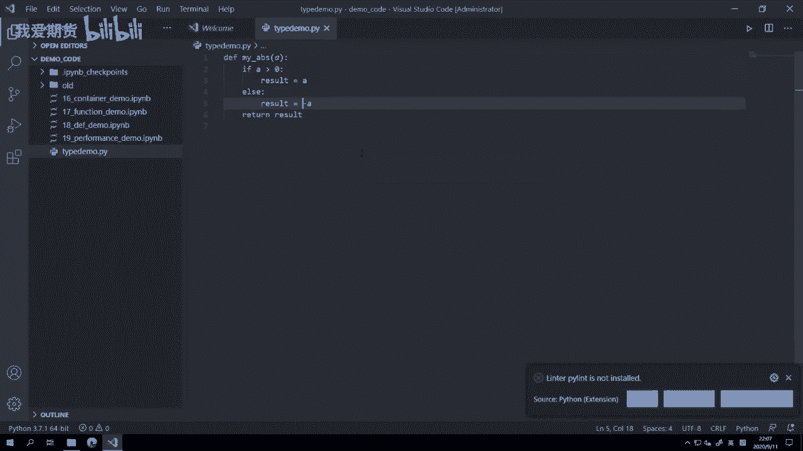

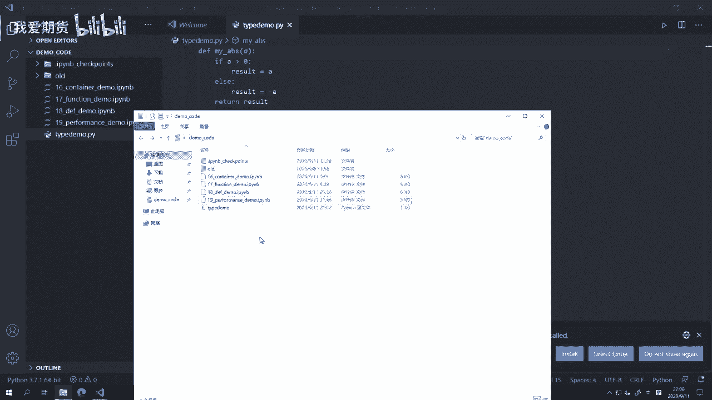

为函数添加类型主要涉及两部分：**参数**和**返回值**。

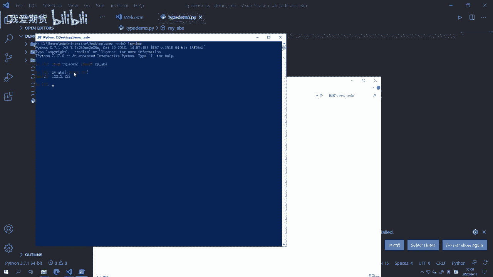

*   **参数类型**：在参数名后加冒号 `:`，然后跟上类型。
*   **返回值类型**：在函数声明的 `def` 行末尾，参数括号后，使用箭头 `->` 指明返回类型。

下面我们通过代码示例来具体说明。

首先，我们创建一个示例文件 `type_demo.py`，并定义一个计算绝对值的函数 `my_abs`。

```python
def my_abs(a: float) -> float:
    if a >= 0:
        result = a
    else:
        result = -a
    return result
```

在这个函数中，我们声明参数 `a` 应为 `float` 类型，返回值也是 `float` 类型。

接下来，我们定义一个计算列表求和的函数 `my_sum`，并为其添加类型。

```python
def my_sum(value_list: list) -> int:
    result: int = 0
    for value in value_list:
        result += value
    return result
```

这里，参数 `value_list` 被声明为 `list` 类型，函数内部的变量 `result` 被声明为 `int` 类型，返回值也是 `int` 类型。

**重要提示**：Python的类型提示（Type Hinting）在运行时**不会**强制进行类型检查。即使传入错误类型的参数（例如向 `my_abs` 传入字符串），代码在运行时依然会尝试执行并可能抛出异常。类型提示的主要作用是为开发工具提供信息。

## 使用Flake8进行代码检查

为了在编写代码时就能发现一些常见错误（如未定义的变量、拼写错误、不符合编码规范等），我们可以使用代码检查工具。以下是配置和使用 `flake8` 的步骤。

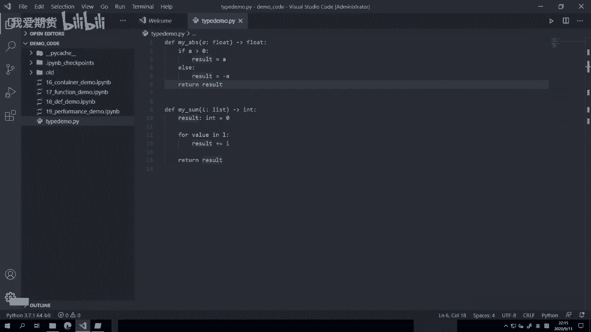

### 安装与配置Flake8

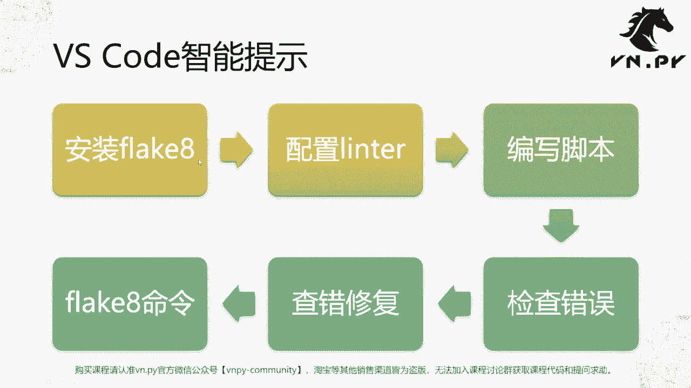

首先，需要在命令行中安装 `flake8` 模块。

```bash
pip install flake8
```

安装完成后，在VS Code中配置 `flake8` 作为代码检查工具。
1.  按下 `Ctrl+Shift+P` 打开命令面板。
2.  输入并选择 `Python: Select Linter`。
3.  在列表中选择 `flake8`。

配置成功后，VS Code会在代码文件中用波浪线标出它发现的问题。

### 检查与修复错误

配置好 `flake8` 后，打开之前的 `type_demo.py` 文件。工具可能会提示以下问题：
*   **红色波浪线**：通常表示严重错误，如使用了未定义的变量名（`undefined name ‘i’`），如果不修复，运行时会出错。
*   **黄色波浪线**：通常表示风格问题，如变量名不明确（`ambiguous variable name ‘l’`）或空行包含空格，不影响运行但不符合编码规范（PEP 8）。

我们可以根据提示逐一修复。例如，将错误的变量名 `i` 改为正确的 `value`，将含义模糊的变量名 `l` 改为 `value_list`。修复后保存文件，波浪线提示会消失。

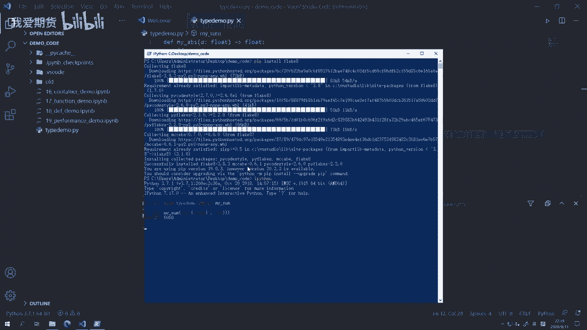

我们也可以在VS Code的“问题”（Problems）面板中集中查看所有待解决的问题。

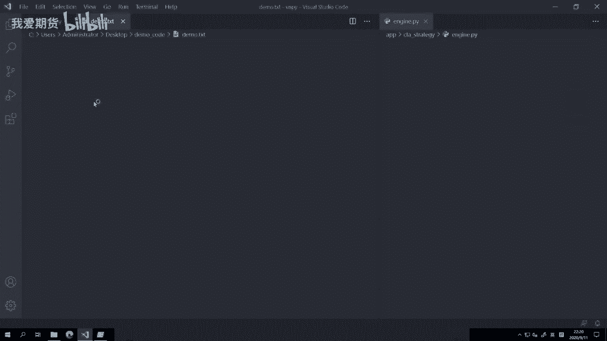

### 批量检查项目代码

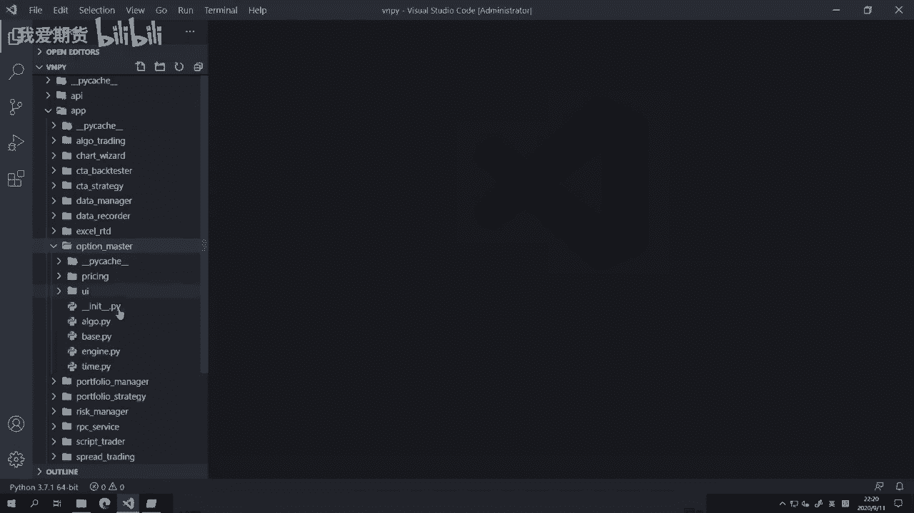

如果项目中有多个文件，可以使用 `flake8` 的命令行工具进行批量检查。

```bash
# 检查当前目录下所有Python文件
flake8 .

# 检查指定目录下的所有Python文件
flake8 /path/to/your/project
```

执行命令后，`flake8` 会列出所有文件中不符合规范或存在潜在问题的代码行及其原因，方便我们统一检查和修复。

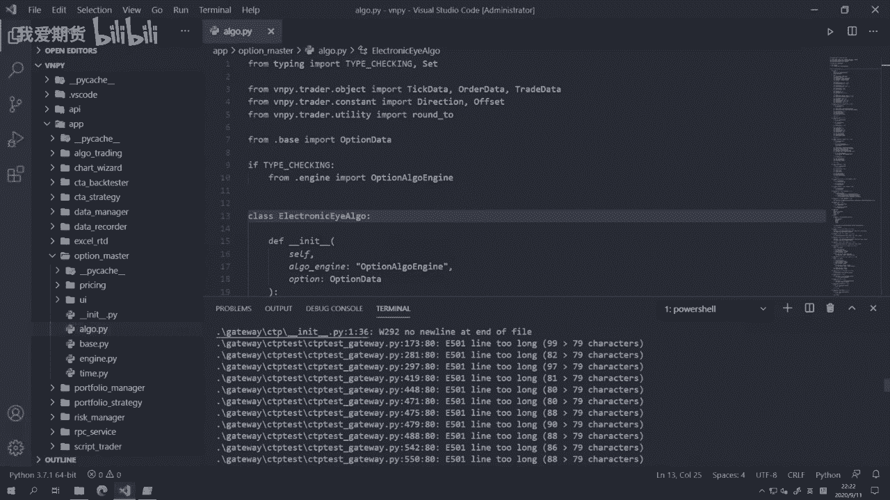

## Python类型系统与静态语言的对比

最后，我们来总结一下Python的类型提示系统与C++等静态语言类型系统的核心区别。

| 特性 | Python (Type Hinting) | C++ (Static Typing) |
| :--- | :--- | :--- |
| **核心机制** | **类型提示**，为IDE和检查工具提供信息。 | **强制类型声明**，是语言语法的一部分。 |
| **检查时机** | **编写时/检查时**，由`flake8`、`mypy`或IDE进行检查。 | **编译时**，编译器会进行严格类型检查。 |
| **执行影响** | **不影响**运行时。即使类型不匹配，代码仍可能运行（可能抛出异常）。 | **决定性影响**。类型不匹配会导致编译失败，程序无法生成。 |
| **主要目的** | 提高代码可读性、维护性，并借助工具提前发现常见错误。 | 保证内存安全、执行效率，并在编译阶段消除类型错误。 |

简而言之，Python的**类型提示**旨在辅助开发和维护，而C++的**类型系统**是保障程序正确性的基础约束，两者设计目标不同。

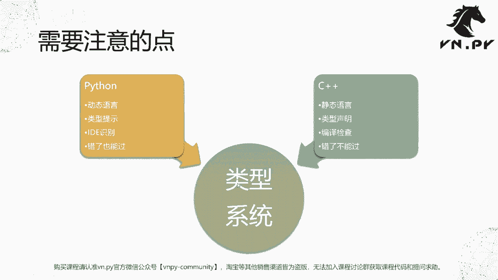

本节课中我们一起学习了如何为Python函数添加类型声明，以及如何配置和使用`flake8`工具来检查代码质量。掌握这些技能能有效提升代码的清晰度和健壮性，是迈向专业开发的重要一步。