# 量化投资入门：第26课：貔貅量化理论核心与实践

在本节课中，我们将系统性地学习“貔貅量化理论”的核心思想与基础实践。我们将探讨投资市场的本质、风险与收益的关系，并理解如何通过量化思维实现“大赚小亏”的稳健投资目标。

## 课程概述

本次课程是本次系列学习的最后一堂课。课程将首先阐述为何不能轻信市场上所谓的“股神”，并揭示投资市场的真实游戏规则。随后，我们将深入讲解“貔貅量化理论”的基本原则，包括风险控制、复利效应以及不同市场的游戏属性。最后，我们会介绍两个实用的量化分析工具，帮助初学者建立初步的分析框架。

## 为何要警惕“股神”与盲目跟风

在投资市场中，不存在只赚不亏的“神”。貔貅是中国古代神兽，传说只进不出，但在现实投资中，追求百分之百盈利是不可能的。投资理论追求的是“大赚小亏”，即总体盈利。

许多所谓的“老师”鼓吹自己战绩辉煌，却不再亲自投资，这往往是一种包装。真正的盈利者忙于投资，而非授课。历史上一些知名的“涨停敢死队”，其盈利方式后来被证实涉及违法操纵股价。合法的投资道路上，持续稳定盈利需要知识和策略，而非捷径或神话。

投资者的普遍心理是贪婪与恐惧。成功的投资需要克服这些情绪，像下围棋一样全局考量，权衡收益与风险，追求收益最大化。例如，盲目“打板”（追涨停板）在牛市或有机会，但在熊市极易被机构“做局”收割。机构可以利用融资融券机制，在拉涨停时借券卖出锁定利润，次日砸盘获利，而跟风的散户则蒙受损失。

“打板”本身是一个小概率事件。统计全年所有涨停股票，其数量占市场总体的比例很低。因此，我们的策略不依赖这种小概率事件，而是追求哪怕3%的稳健收益，通过多次交易累积成总体盈利。

## 貔貅量化理论的核心原则

上一节我们探讨了市场中的常见陷阱，本节中我们来看看貔貅量化理论赖以建立的几个核心数学与逻辑原则。

### 1. 亏损与盈利的不对称性

资产亏损后，需要更高的收益率才能回本。这是风险控制的第一课。

*   **公式**：若股价从10元跌至5元，亏损比例为：
    `(10 - 5) / 10 = 50%`
*   **公式**：若想从5元涨回10元，所需盈利比例为：
    `(10 - 5) / 5 = 100%`

计算连续涨跌停的影响：
*   **从10元开始，连续跌停至低于5元所需天数**：`10 * (0.9)^n < 5`，计算可得 `n ≈ 7`。即大约7个跌停，资产腰斩。
*   **从5元开始，连续涨停至超过10元所需天数**：`5 * (1.1)^n > 10`，计算可得 `n ≈ 8`。即需要8个涨停才能翻倍。

**结论**：亏钱快，赚钱慢。必须严格避免本金出现大幅亏损。

### 2. 鳄鱼法则与止损纪律

在投资中，一旦发现方向错误，必须立即止损，保留本金。

> 这如同壁虎断尾求生。舍弃部分尾巴（本金），保全生命（大部分资本），尾巴尚有再生（盈利）可能。若不舍得止损，则可能面临全军覆没的风险。

**核心原则**：止损等于再生。允许小亏，杜绝大亏。

### 3. 通货膨胀与复利效应

货币会随时间贬值，投资是抵御通胀、保值增值的必要手段。

*   **单利**：利息不加入本金计息。30年后本息和为：`本金 * (1 + 年利率 * 年数)`
*   **复利**：利息加入本金再计息。30年后本息和为：`本金 * (1 + 年利率)^年数`

**示例**：假设本金100万，年化收益率3%，投资30年。
*   单利结果：`100 * (1 + 0.03*30) = 190万`
*   复利结果：`100 * (1 + 0.03)^30 ≈ 242.73万`

**结论**：复利是财富增长的“变压器”。长期来看，复利效应远胜单利。

### 4. 市场的游戏属性：正和、零和与负和

理解你所在的市场属性，是制定策略的前提。

*   **零和游戏**：所有赢家的总盈利等于所有输家的总亏损，总和为零。财富只在参与者之间转移，不新增。例如，朋友间不抽水的麻将、**震荡横盘的股市**、期货、外汇、赌场（不考虑抽水）。
*   **负和游戏**：所有赢家的总盈利小于所有输家的总亏损，总和为负。资金从参与者流向平台或组织者。例如，需要支付台费的麻将馆、**熊市下跌的股市**、彩票。
*   **正和游戏**：所有赢家的总盈利大于所有输家的总亏损，总和为正。市场整体创造了新价值。例如，**有分红的上市公司构成的股市**、**牛市上涨的股市**。

**策略启示**：
*   在**正和游戏**（牛市）中，多数参与者可能盈利，可依靠趋势。
*   在**零和游戏**（震荡市）中，盈利依靠技术和策略优势。
*   在**负和游戏**（熊市）中，多数参与者亏损，应尽量避免参与，或仅用小资金依托运气。

## A股市场的资金流动真相

上一节我们从理论层面区分了市场类型，本节我们具体分析A股市场的资金流向，看清谁在赚钱，谁在买单。

整个市场的资金供养链如下：
1.  **资金流出方（抽水）**：包括IPO融资、增发、限售股减持、交易佣金、印花税等。
2.  **资金流入方（注水）**：包括新投资者入场、上市公司分红、公司回购股票等。

**关键结论**：
*   二级市场投资者（包括散户和机构）是市场主要的“供养者”。
*   服务商（券商、交易所）、融资方（上市公司、大股东）及国家税收等，持续从市场抽取资金。

以2022年、2023年数据为例，即使指数跌幅不大甚至微涨，但由于巨额的融资、减持和税费抽水，导致大部分投资者依然亏损。这解释了为何市场常呈现“七亏二平一赚”的格局。

**启示**：在参与市场前，必须清醒认识到这是一个高度竞争、资金净流出的环境。自己的钱必须自己负责，谨慎选择投资标的，避免成为单纯的“奉献者”。

## 主力运作模式与散户应对

了解了市场结构，我们还需洞悉股价波动的直接推动者——主力的常见手法。

以下是主力运作一只股票的典型步骤：
1.  在低位寻找有潜在题材的股票，悄悄收集筹码。
2.  发现技术跟风盘后，用手中筹码砸盘，迫使跟风者止损，从而以更低价格收集更多筹码。
3.  利用资金优势快速拉升股价，甚至以“涨停”方式脱离成本区，不让散户有低价跟进的机会。
4.  通过网络、媒体、分析师发布看好报告，吸引“价值投资者”在高位接盘。
5.  通过关联账户对倒制造成交量活跃假象，吸引技术派投资者，并趁机出货。
6.  主力出货完毕后，股价进入阴跌模式，由散户行情主导，持续下跌。

许多历史上的大牛股在见顶前后，往往伴随大量券商“买入”评级报告，这便是步骤4的体现。散户在股价高位买入这些“明星股”，随后便面临长期套牢。

**应对之道**：不要盲目相信消息和推荐报告。应建立自己的分析体系，在主力吸筹、洗盘阶段寻找机会，避免在高位接盘。下面介绍的工具旨在帮助大家识别趋势。

## 实用工具介绍：操盘线与貔貅角度线

理论需要工具来落地。以下是本节课赠送的两个核心指标，用于辅助趋势判断。

### 1. 操盘线指标

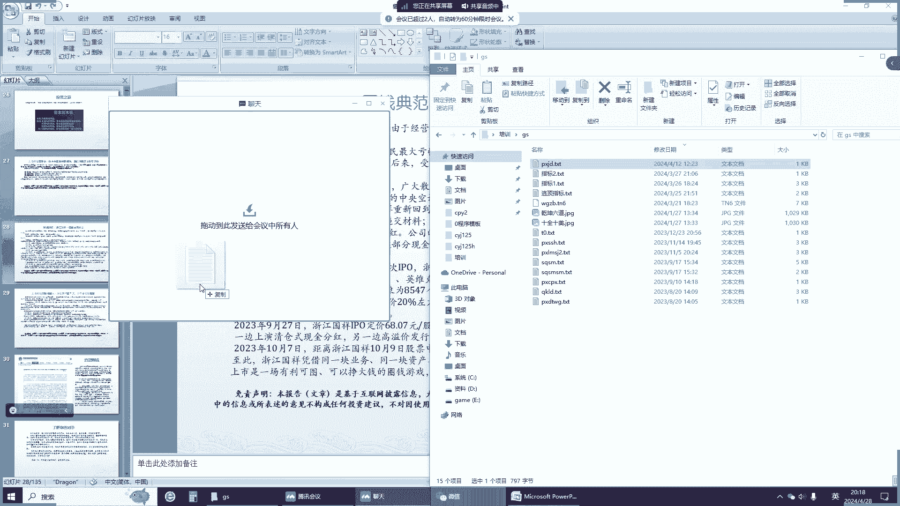

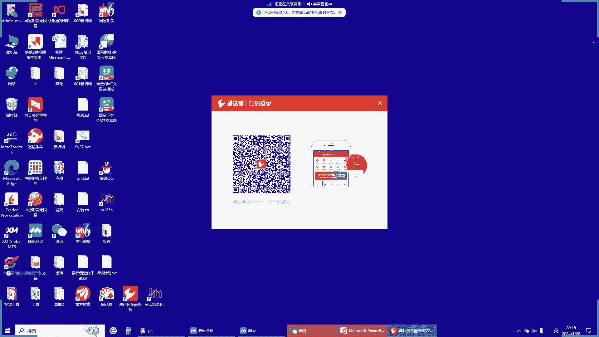

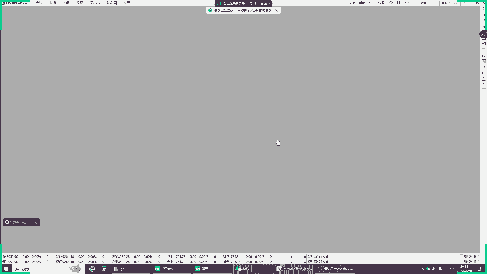

这是一个用于判断中长期波段趋势的指标。

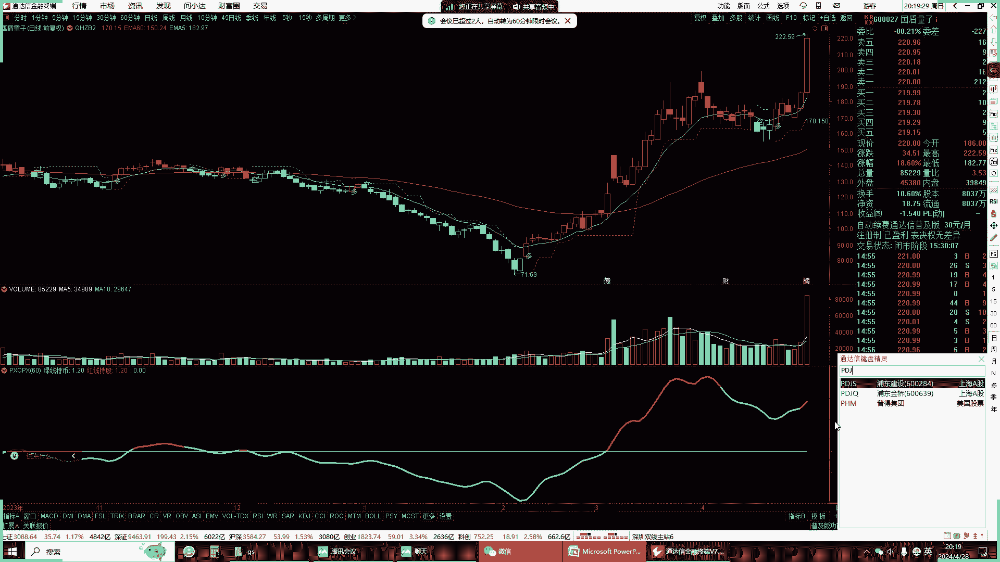

**核心逻辑**：通过算法识别股价的主要运行方向，过滤日常波动干扰。
*   **操作建议**：当指标显示为上升趋势（如红色线段）时，考虑寻找买点参与；当指标显示为下降趋势（如绿色线段）时，即使有短期反弹也应保持谨慎，避免持股。

### 2. 貔貅角度线指标

这是一个反应价格变动速率的领先指标。

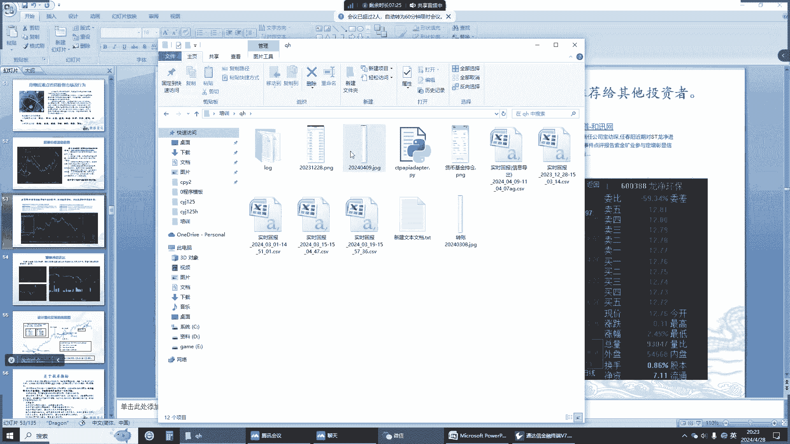

**核心逻辑**：基于物理学原理，计算价格走势与水平线的夹角（角度）。上涨角度为正，下跌角度为负。角度变化比均线更快，能更敏锐地捕捉趋势的加速或减速。

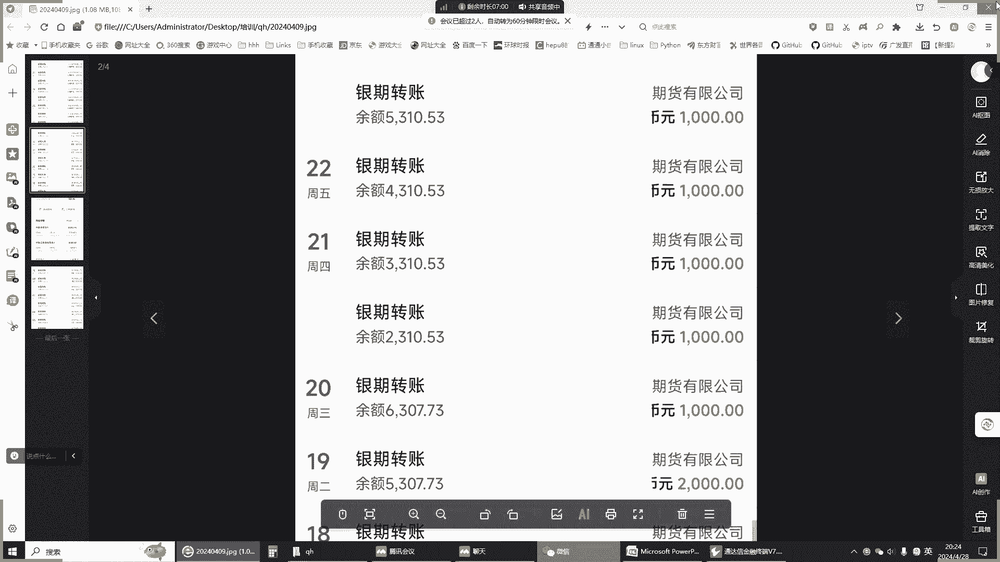

*   **数学原理**：已知K线上两点的价格差（对边）和时间差（邻边），利用三角函数 `arctan(对边/邻边)` 计算角度。
*   **操作建议**：角度线由负转正并向上发散时，可视为做多信号；由正转负并向下发散时，可视为做空或卖出信号。结合不同周期（如1分钟、5分钟、日线）的角度线进行共振分析，可以提高决策准确性。

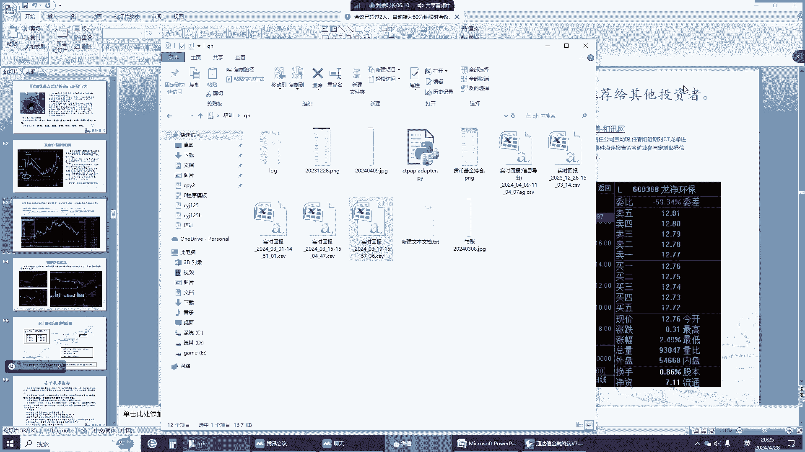

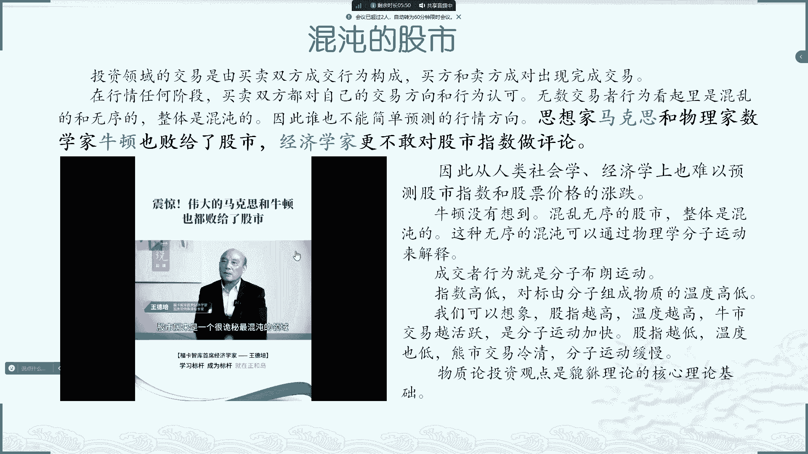

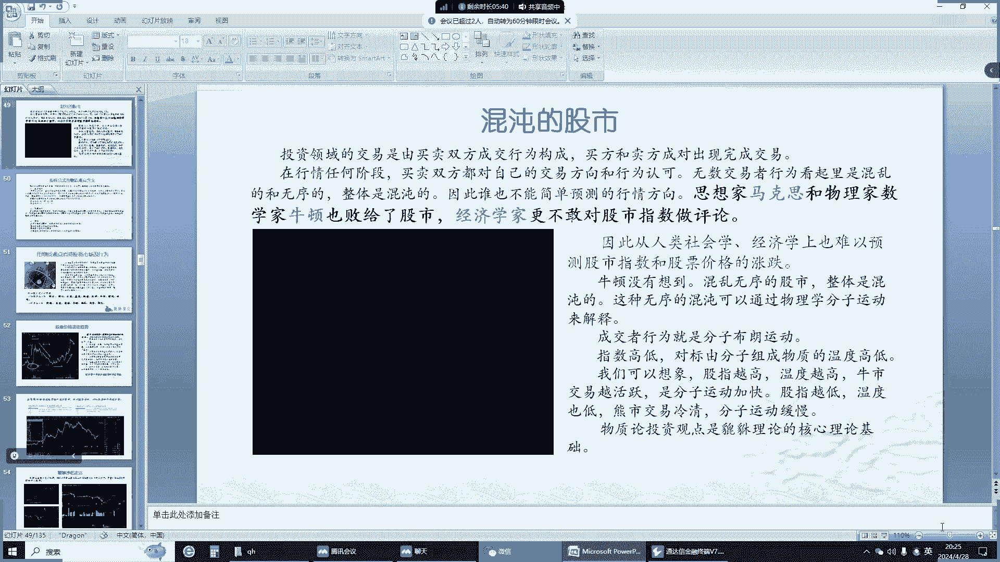

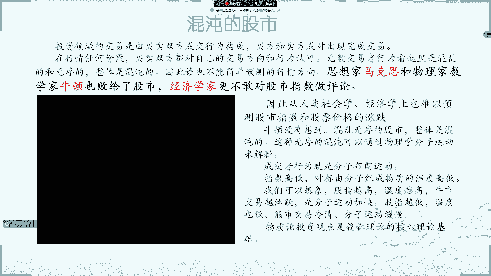

**工具使用示例**：在期货短线交易中，可以同时观察1分钟、5分钟和日线的角度线。当小周期角度线发出信号，且与大周期趋势不悖时，便是较好的入场点。关键在于根据角度线的变化，灵活进行多空操作，并严格设置止损。

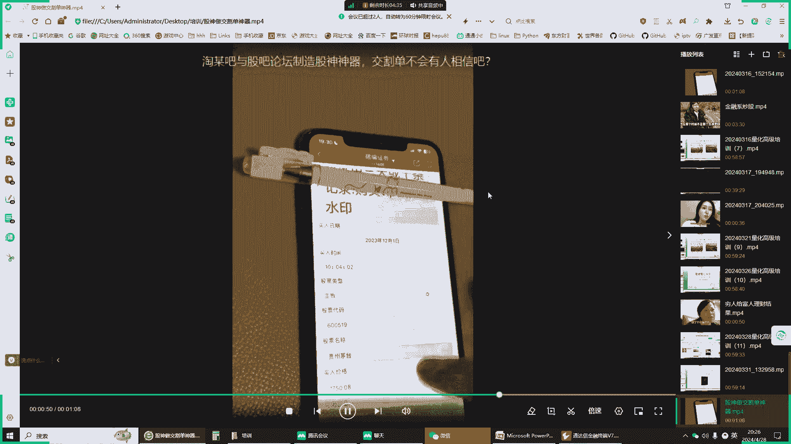

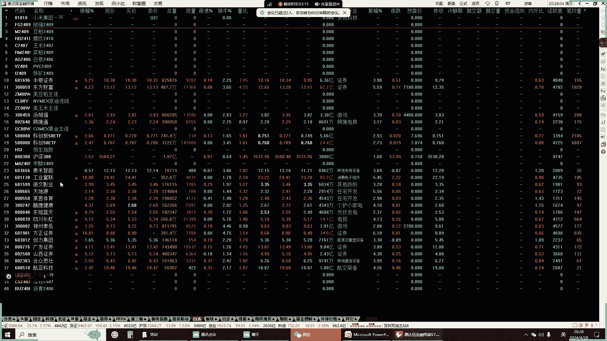

## 课程总结

本节课我们一起学习了貔貅量化理论的基础框架：

1.  **树立正确心态**：摒弃对“股神”和暴富神话的幻想，接受“大赚小亏”的稳健盈利目标。
2.  **掌握核心原理**：理解了亏损的放大效应、止损的重要性、复利的威力以及不同市场的游戏属性。
3.  **认清市场本质**：分析了A股市场资金流出大于流入的结构性问题，明白自己作为二级市场投资者的真实处境。
4.  **洞察主力行为**：了解了主力从吸筹、洗盘、拉升到出货的完整链条，学会规避常见陷阱。
5.  **初识量化工具**：获得了“操盘线”和“貔貅角度线”两个实用指标，用于辅助判断趋势和寻找买卖点。

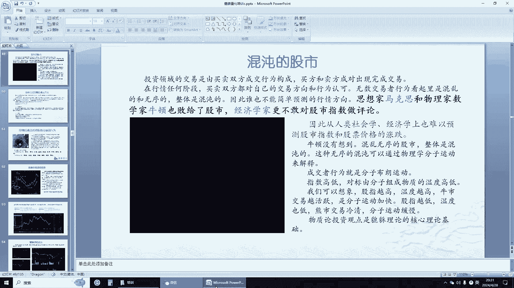

投资是一场基于概率和规则的游戏。通过量化思维，将投资决策系统化、纪律化，是长期存活于市场并实现稳健增值的关键。记住，保住本金永远是第一要务。