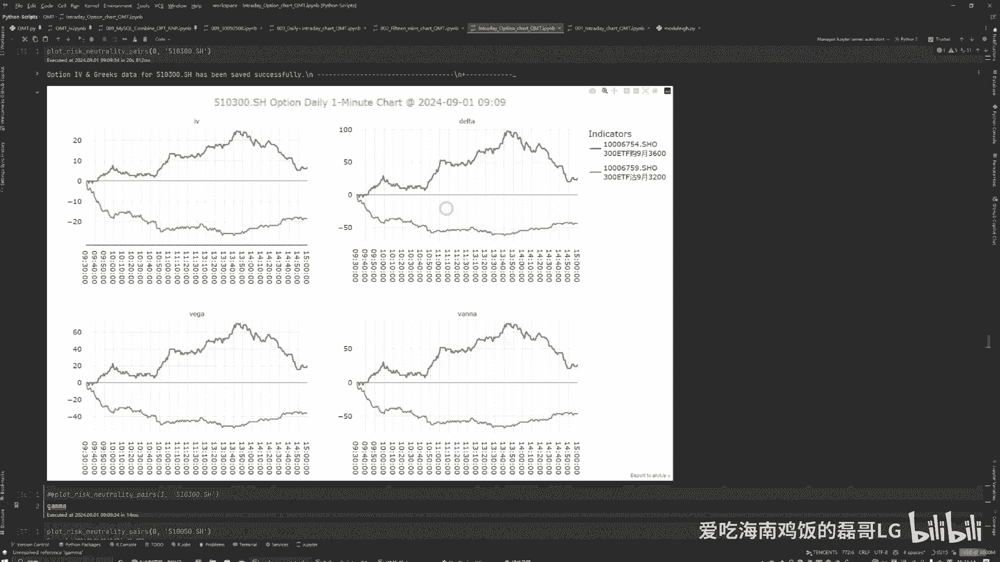
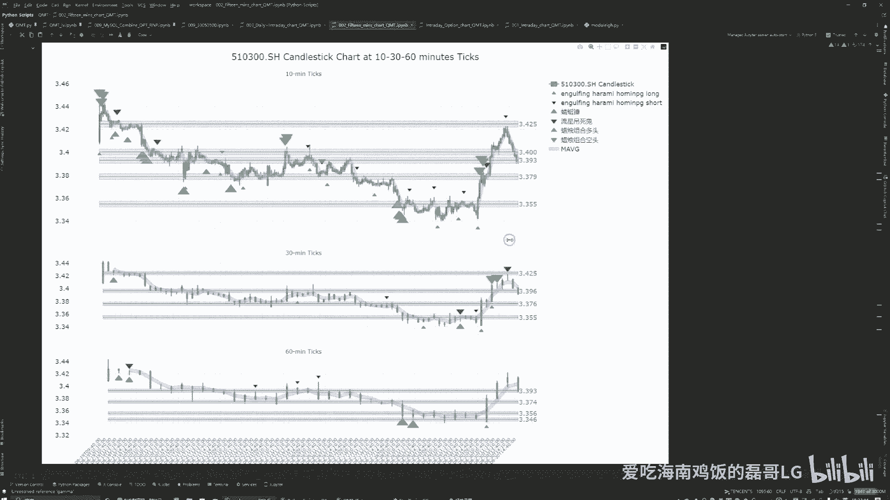
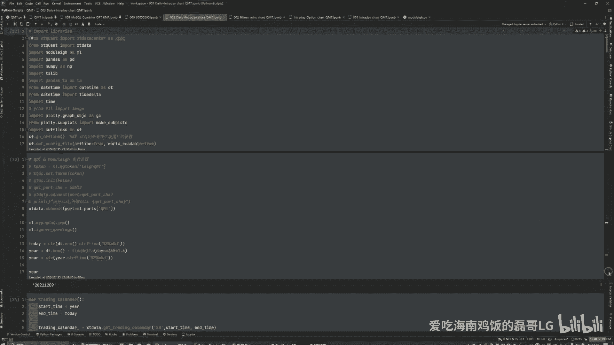
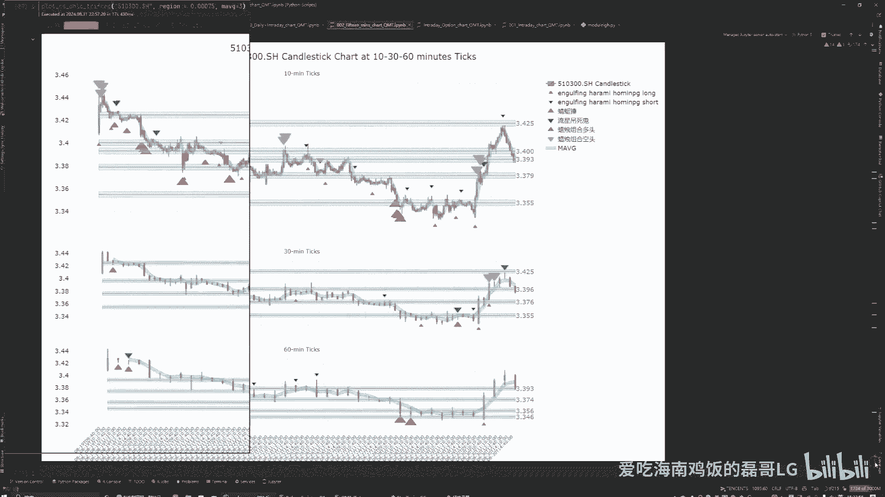
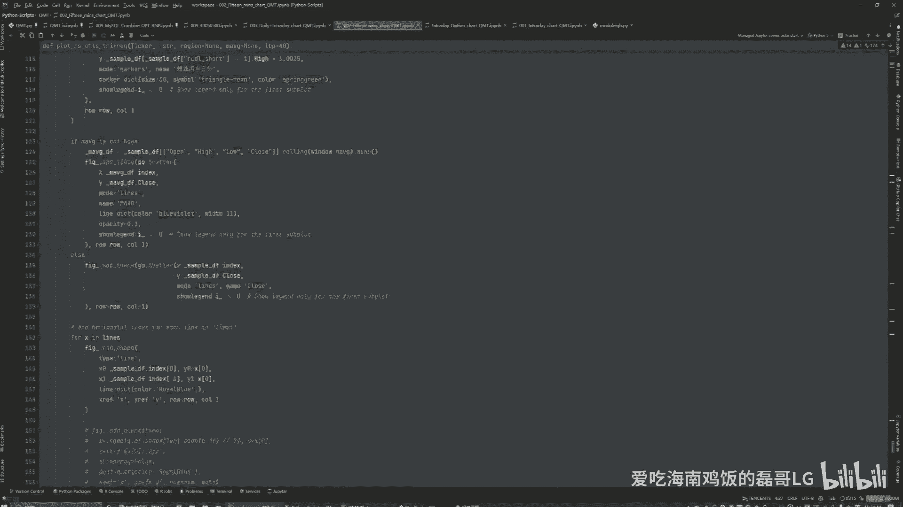
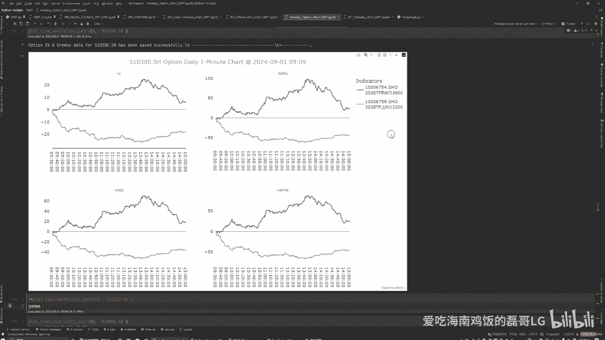

# 期权量化入门：P1：2024年8月30日实盘复盘与核心概念解析 📈

在本节课中，我们将通过一个真实的期权交易案例，学习期权交易的基本概念、核心希腊字母的含义，以及如何在市场剧烈波动时进行分析和决策。课程内容基于一次沪深300 ETF期权的实盘操作复盘，旨在帮助初学者理解期权量化分析的入门知识。

## 概述

本节课将回顾2024年8月30日的期权交易实盘。当天A股市场出现强势单边上涨行情，这对于采用对冲策略的期权交易者构成了挑战。我们将分析交易过程中的得失，并重点解释几个关键的期权希腊字母：Delta、Gamma和Vega。通过本次复盘，您将初步了解如何解读市场数据并应用于交易决策。

## 市场背景与当日行情

上一节我们介绍了课程概述，本节中我们来看看当天的市场具体情况。

2024年8月30日，A股市场在最后一个交易日出现强势反击。大盘交易量突破9000亿元，显示出市场强大的韧性。这种单向市场的巨大波动，对于采用对冲策略的期权交易者而言，需要及时进行调整。

我主要交易沪深300 ETF期权。在当天开盘后，大盘直线拉升，并在11点后再次上扬。下午两点左右经历一波强势上涨后，行情进入平台整理，随后继续缓慢上行。

## 核心希腊字母解析

了解了市场背景后，我们需要掌握分析期权的工具。期权价格受多个因素影响，这些因素通过“希腊字母”来量化。以下是几个核心指标：

*   **隐含波动率**：期权市场对未来标的资产波动率的预期，是期权定价的关键输入。
*   **Delta（Δ）**：衡量期权价格相对于标的资产价格变动的敏感度。公式为：`Δ = ∂期权价格 / ∂标的资产价格`。例如，看涨期权的Delta为正，看跌期权的Delta为负。
*   **Vega（ν）**：衡量期权价格相对于隐含波动率变动的敏感度。公式为：`ν = ∂期权价格 / ∂σ`，其中σ代表波动率。
*   **Vanna**：可以简单理解为Delta对波动率的一阶导数，或Vega对标的资产价格的一阶导数，反映了Delta和Vega之间的交叉关系。

## 分时段交易复盘与Delta分析

掌握了核心概念后，我们进入实战部分，看看这些指标在当天是如何变化的。

我当天的持仓是“双卖策略”，即同时卖出看涨期权和看跌期权。以下是分时段的操作与Delta变化分析：

**第一阶段：上午11点前**
在此期间，虽然大盘上涨，但看涨期权的Delta并未快速上升，而看跌期权的Delta却下跌很快。这传递出一个信息：做空看跌期权的收益可能高于买入看涨期权。我的操作是卖出3手看跌期权，买入2手看涨期权，共计5个合约，覆盖了约500元利润。

**第二阶段：上午11点至尾盘**
大盘继续上扬突破阻力位。此时，看涨期权的Delta持续增加，但看跌期权的Delta变化平缓。对于我的双卖策略，这成为一个不利信号：做空看跌期权的收益停滞，而做空看涨期权则处于亏损状态。这段期间我处于严重亏损，利润从近3000元回撤至约1000元。由于经验不足，我未能找到有效的补救措施。

**第三阶段：尾盘一小时**
我认为市场不可能无限上涨，因此尝试卖出看涨期权以对冲损失。尾盘操作弥补了约500元亏损。全天最终损失约1000元。

## Gamma的重要性与风险管理

上一节我们分析了Delta在交易中的实际应用，本节中我们来看看一个决定Delta变化速度的关键指标——Gamma。

**Gamma（Γ）** 衡量的是Delta相对于标的资产价格的变化速度，即Delta的一阶导数。公式为：`Γ = ∂Δ / ∂标的资产价格`。高Gamma意味着Delta对标的资产价格变动非常敏感。

在8月30日的行情中，我亲身体验了看涨期权Gamma值的飙升。这对于期权卖方（尤其是裸卖期权者）风险巨大，因为标的资产的小幅变动可能导致期权头寸Delta值（即风险敞口）发生剧烈变化，从而造成快速亏损。因此，监控Gamma是风险管理的重要一环。

## 辅助分析工具：阻力与支撑位

除了希腊字母，技术分析工具也能提供决策参考。我日内主要参考一张由算法生成的、包含10分钟、30分钟和60分钟周期的阻力支撑位图表。

在8月30日，大盘强势突破了多个算法识别的阻力位。从沪深300 ETF的价格看，从3.35元飙升至3.41元，这对日内期权交易而言是巨大波动。

以下是利用该图表辅助交易的心得：
1.  我主要寻找不同时间周期图表中发出的一致性看多或看空信号。
2.  不能完全依赖量化信号，需结合其他市场信息综合判断。
3.  该机器学习算法代码来源于一位量化分享者，我个人实践认为其准确率较高。如有需要，后续可分享探讨。

## 量化实践平台与数据源

工欲善其事，必先利其器。可靠的实时数据是日内量化交易的基础。

我目前使用**迅投**量化平台的服务。之前也用过TuShare，但其期权数据并非实时，仅支持盘后分析，对于日内交易不够用。迅投提供了期权的实时数据流，我能通过其接口和**Dash**前端框架，在浏览器中实时监控行情图表（K线、希腊字母等）并执行交易。

目前，我尚未实现全自动化交易。期权自动化交易比股票更复杂，因为它涉及标的资产和期权合约两套代码的协同，难度显著增加。

## 个人学习路径与入门建议

最后，我想分享自己进入期权量化领域的历程，并对初学者提出一些建议。

我本身从事金融行业，有编程（Python）和数学基础。2023年，我通过**高顿**报名了**CQF**（国际量化金融分析师）课程。该课程系统涵盖了期权定价、风险管理等大量量化金融知识，为我打下了理论基础。国内期权交易门槛较高（如50万资金门槛），此前我主要交易A股。但因偏好双向、T+0的交易机制，最终在知识储备达标后开始了期权量化实践。

对于想进入量化领域的朋友，我想给出以下几点诚恳建议：
*   **数学是基础**：如果数学水平（特别是概率统计、微积分）不足，需要谨慎并加强学习。
*   **编程能力**：至少需要3-5年的扎实编程经验（如Python），才能较好地实现策略。
*   **金融知识**：对金融市场和产品（如期权）有深刻理解。
*   **保持理性**：量化交易有门槛，切勿轻信“速成”、“暴利”等不实宣传。这是一个需要长期学习和实践的过程。

## 总结

本节课中我们一起学习了如何通过一个实盘案例复盘期权交易。我们重点解析了Delta、Gamma等核心希腊字母在市场波动中的表现和意义，介绍了阻力支撑位等辅助分析工具，并探讨了量化交易的数据源与平台选择。最后，分享了个人的学习路径，强调了数学、编程和金融知识结合的重要性。期权量化是一条充满挑战但值得探索的道路，希望本次分享能为您提供有益的启发。