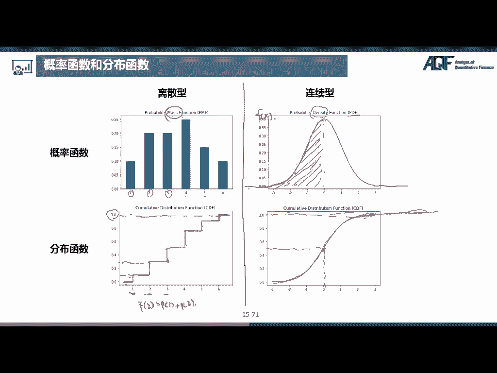

# 量化金融分析师.AQF：1.1：概率论基本概念 📊

在本节课中，我们将学习概率论的基本概念。概率论是量化金融的基石，它帮助我们理解和量化金融市场中的不确定性。我们将从最基础的定义开始，逐步建立起对随机现象、概率计算以及随机变量的理解。

## 概述

金融活动充满了不确定性，而概率论正是研究这种不确定性的数学工具。本节课我们将系统性地学习概率论的核心概念，包括随机事件、概率的定义与性质、几种重要的概率模型（古典概型与几何概型）、条件概率、全概率公式、贝叶斯公式以及随机变量的引入。掌握这些知识是后续学习更复杂数量分析方法的基础。

## 概率论的起源与研究对象

概率论最早起源于17世纪帕斯卡和费马关于赌博问题的探讨。它最初研究的问题，如抛硬币、掷骰子，都具有一个共同特点：**随机性**。在抛硬币之前，我们无法预知结果是正面还是反面；掷骰子之前，也无法知道会出现哪个点数。

与**随机现象**相对的是**决定性现象**，例如太阳从东方升起，或在标准大气压下，水加热到100℃会沸腾。这些现象的结果是必然的，不属于概率论的研究范畴。概率论专门研究那些在试验前无法预知确切结果的随机现象。

## 随机试验及其相关概念

对随机现象的研究称为**随机试验**。一个随机试验必须满足三个条件：
1.  试验可以在相同条件下重复进行。
2.  试验的所有可能结果是明确的，并且不止一个。
3.  每次试验前无法预知会出现哪一个结果。

例如，掷一枚均匀的骰子就是一个随机试验。我们可以重复掷很多次，所有可能结果是{1, 2, 3, 4, 5, 6}，但在每次掷出前，我们不知道具体是哪个数字。

以下是随机试验相关的核心概念：
*   **样本空间 (Ω)**：随机试验所有可能结果组成的集合。例如，掷一次骰子的样本空间是 Ω = {1, 2, 3, 4, 5, 6}。
*   **样本点**：样本空间中的每一个元素，即每一个可能的结果。
*   **随机事件**：样本空间的子集，是某一次随机试验可能出现的结果。通常用大写字母A, B, C表示。例如，事件A = “点数为奇数” = {1, 3, 5}。当试验结果属于事件A时，我们就说事件A发生了。
*   **必然事件**：每次试验都必然发生的事件，即样本空间Ω本身。
*   **不可能事件**：每次试验都不可能发生的事件，即空集∅。
*   **基本事件**：只包含一个样本点的事件，如{1}。
*   **复合事件**：包含多个样本点的事件，如{1, 3, 5}。

## 事件间的关系

既然事件是集合，那么事件之间的关系也可以用集合的语言（如维恩图）来描述。

以下是几种常见的事件关系：
*   **包含关系 (A ⊂ B)**：如果事件A发生，则事件B必然发生。在维恩图中，A的集合完全在B的集合内部。
*   **相等事件 (A = B)**：事件A与事件B包含的样本点完全相同。
*   **和事件/并事件 (A ∪ B)**：表示事件A与事件B至少有一个发生。
*   **积事件/交事件 (A ∩ B 或 AB)**：表示事件A与事件B同时发生。
*   **互斥事件/互不相容事件 (A ∩ B = ∅)**：表示事件A与事件B不可能同时发生。
*   **对立事件/逆事件 (A 与 A̅)**：满足 A ∪ A̅ = Ω 且 A ∩ A̅ = ∅。表示在一次试验中，A和A̅有且仅有一个发生。
*   **差事件 (A - B)**：表示事件A发生而事件B不发生，即 A - B = A ∩ B̅。

**补充概念：完备事件组**
如果一组事件 A₁, A₂, ..., Aₙ 满足：
1.  A₁ ∪ A₂ ∪ ... ∪ Aₙ = Ω （覆盖整个样本空间）
2.  对于任意 i ≠ j，有 Aᵢ ∩ Aⱼ = ∅ （两两互斥）
那么这组事件称为一个**完备事件组**。这相当于把样本空间分割成了n个互不重叠的部分。这个概念在全概率公式和贝叶斯公式中非常重要。

## 概率的定义与性质

**概率**描述了一个事件发生的可能性大小。例如，抛一枚均匀硬币，正面朝上的概率是1/2。

概率具有以下基本性质：
1.  **非负性**：对于任何事件A，有 **P(A) ≥ 0**。
2.  **规范性**：必然事件的概率为1，即 **P(Ω) = 1**。
3.  **可列可加性**：如果一系列事件 A₁, A₂, ... 两两互斥，那么它们并集的概率等于各自概率之和，即 **P(∪ᵢ Aᵢ) = Σᵢ P(Aᵢ)**。

由这些基本性质可以推导出其他常用性质：
*   **P(∅) = 0**
*   **0 ≤ P(A) ≤ 1**
*   **P(A̅) = 1 - P(A)**
*   **加法公式**：**P(A ∪ B) = P(A) + P(B) - P(A ∩ B)**
    *   特别地，若A与B互斥，则 **P(A ∪ B) = P(A) + P(B)**。
*   若A ⊂ B，则 **P(A) ≤ P(B)**，且 **P(B - A) = P(B) - P(A)**。

**重要提示**：概率为0的事件不一定是不可能事件（如连续型随机变量取某个特定值的概率为0），概率为1的事件也不一定是必然事件。

## 古典概型与几何概型

上一节我们介绍了概率的一般性质，本节我们来看两种在实际中非常直观的概率计算模型。

**古典概型**适用于满足以下两个条件的试验：
1.  样本空间包含有限个样本点。
2.  每个基本事件发生的可能性相等。

在古典概型中，事件A的概率计算公式为：
**P(A) = A包含的样本点数 / 样本空间的总样本点数**

例如，掷一枚均匀骰子，事件A=“点数为偶数”的概率为 P(A) = 3/6 = 1/2。

**几何概型**则将概率与几何度量（长度、面积、体积）联系起来。它适用于：
1.  样本空间包含无限个样本点。
2.  每个基本事件发生的可能性相等。

在几何概型中，事件A的概率计算公式为：
**P(A) = 构成事件A的区域的测度 / 样本空间的测度**

例如，在边长为2R的正方形内随机投点，求点落入其内切圆中的概率。答案是圆的面积除以正方形的面积：**P = (πR²) / (4R²) = π/4**。

## 边际概率、联合概率与条件概率

理解了基础概率模型后，我们需要研究多个事件之间的概率关系。

以下是三种核心的概率类型：
*   **边际概率 P(A)**：不考虑其他任何事件，事件A自身发生的概率。
*   **联合概率 P(A ∩ B)**：事件A与事件B**同时发生**的概率。
*   **条件概率 P(A|B)**：在已知事件B**已经发生**的条件下，事件A发生的概率。其计算公式为：
    **P(A|B) = P(A ∩ B) / P(B)**，要求 **P(B) > 0**。

由条件概率公式可以推导出**乘法公式**：
**P(A ∩ B) = P(B) * P(A|B) = P(A) * P(B|A)**

**独立性**：如果事件A的发生与否不影响事件B发生的概率，反之亦然，则称A与B相互独立。此时有：
**P(A|B) = P(A)** 且 **P(B|A) = P(B)**，进而得到 **P(A ∩ B) = P(A) * P(B)**。
对于三个事件A, B, C相互独立，则需同时满足两两独立以及 **P(A ∩ B ∩ C) = P(A)P(B)P(C)**。

## 全概率公式与贝叶斯公式

当事件之间的关系比较复杂时，全概率公式和贝叶斯公式是强大的分析工具。

**全概率公式**用于计算一个复杂事件B的概率。如果完备事件组 {A₁, A₂, ..., Aₙ} 构成了样本空间的一个划分，那么事件B的概率可以通过以下方式“全部分解”来计算：
**P(B) = Σᵢ P(Aᵢ) * P(B|Aᵢ)**

**贝叶斯公式**（逆概率公式）则用于“由果推因”。在事件B已经发生的条件下，求它是由某个原因Aᵢ导致的概率：
**P(Aᵢ|B) = [P(Aᵢ) * P(B|Aᵢ)] / P(B) = [P(Aᵢ) * P(B|Aᵢ)] / Σⱼ [P(Aⱼ) * P(B|Aⱼ)]**

其中，**P(Aᵢ)** 称为**先验概率**（基于历史经验的初始判断），**P(Aᵢ|B)** 称为**后验概率**（在获得新信息B后对原因Aᵢ概率的修正）。贝叶斯公式在医疗诊断、垃圾邮件过滤、金融风险管理等领域有广泛应用。

## 随机变量

为了更数学化、更便捷地研究随机现象，我们引入**随机变量**的概念。随机变量是将随机试验的每一个结果（样本点）映射到一个实数的函数。

随机变量主要分为两类：
*   **离散型随机变量**：其可能取到的值是有限个或可列无限多个（如掷骰子的点数、某段时间内接到的电话次数）。
*   **连续型随机变量**：其可能取值充满某个区间，不可列（如人的身高、股票收益率）。

描述随机变量统计规律的工具是概率函数：
*   对于离散型随机变量X，使用**概率质量函数 (PMF)**：**p(xᵢ) = P(X = xᵢ)**，表示取某个特定值的概率。
*   对于连续型随机变量X，使用**概率密度函数 (PDF)**：**f(x)**。X落在区间[a, b]内的概率为 **P(a ≤ X ≤ b) = ∫ₐᵇ f(x) dx**。

两者共有的一个核心工具是**累积分布函数 (CDF)**，定义为 **F(x) = P(X ≤ x)**。对于离散型，它是阶梯函数；对于连续型，它是连续曲线，并且是其PDF的积分。

## 总结

本节课我们一起学习了概率论的基础知识。我们从概率论的起源和随机现象入手，定义了随机试验、样本空间、随机事件等基本概念。接着，我们探讨了事件间的各种关系以及概率的公理化定义与性质。我们学习了两种简单的概率计算模型——古典概型和几何概型。然后，我们深入研究了边际概率、联合概率和条件概率，并引出了重要的乘法公式、事件的独立性。在此基础上，我们掌握了两个强大的公式：用于“由因推果”的全概率公式和用于“由果推因”的贝叶斯公式。最后，我们引入了随机变量的概念，区分了离散型与连续型，并介绍了描述它们的概率质量函数(PMF)、概率密度函数(PDF)和累积分布函数(CDF)。这些概念是构建整个量化金融分析大厦的基石，务必牢固掌握。