# 量化金融分析师.AQF：P11：财务分析原理3 - 资产的分析

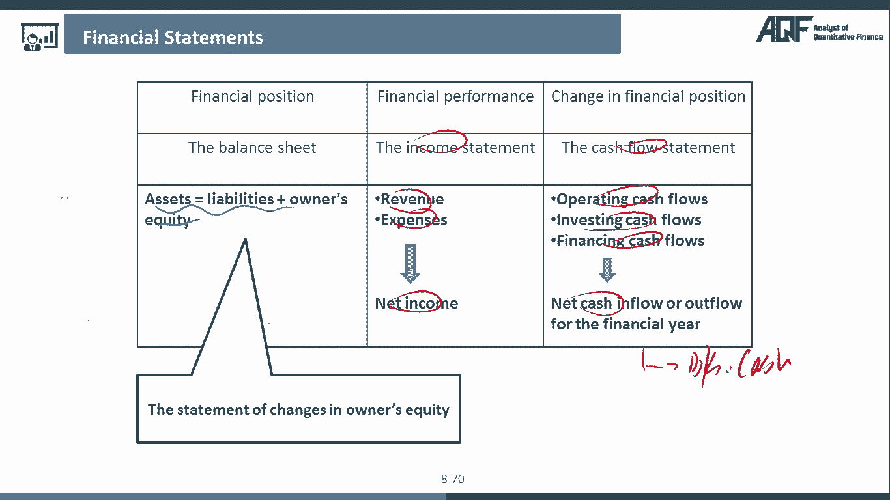

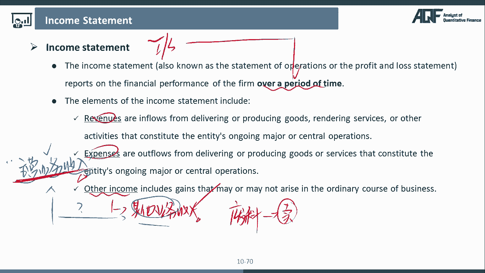

在本节课中，我们将深入学习财务报表分析的核心原理，重点聚焦于资产负债表中的资产部分。我们将逐一拆解各类资产科目，理解其含义，并掌握在量化投资中如何分析这些科目以识别公司的财务质量与潜在风险。

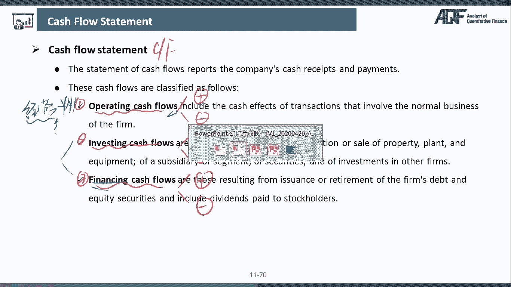

上一节我们介绍了三大财务报表的基本框架与勾稽关系，本节中我们来看看资产负债表中最核心的部分——资产。理解资产的构成与分析方法是评估企业资源状况和盈利质量的基础。

## 资产的定义与分类

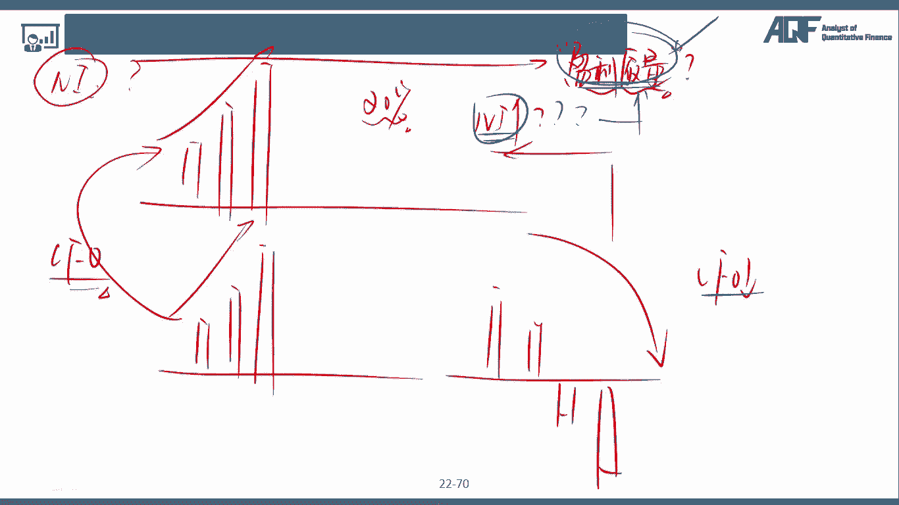

资产负债表反映企业在**某一特定时点**（a point of time）的整体资源状况。资产（Assets）代表企业可以控制的资源。根据流动性，资产可分为**流动资产**（Current Assets）和**非流动资产**（Non-current Assets）。流动性自上而下递减。

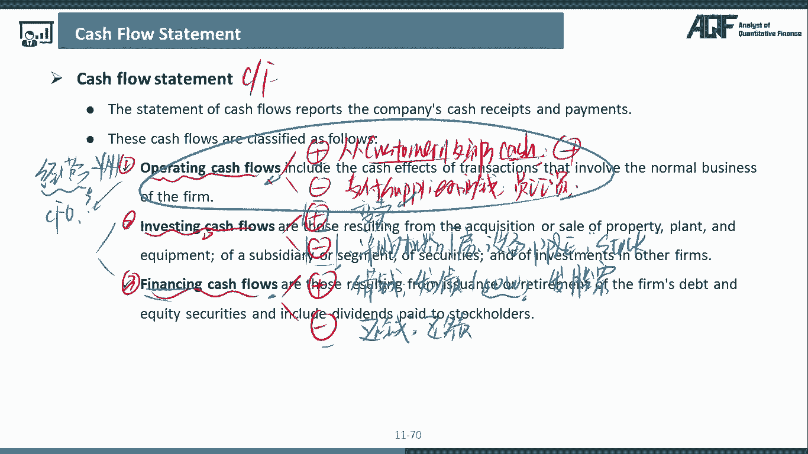

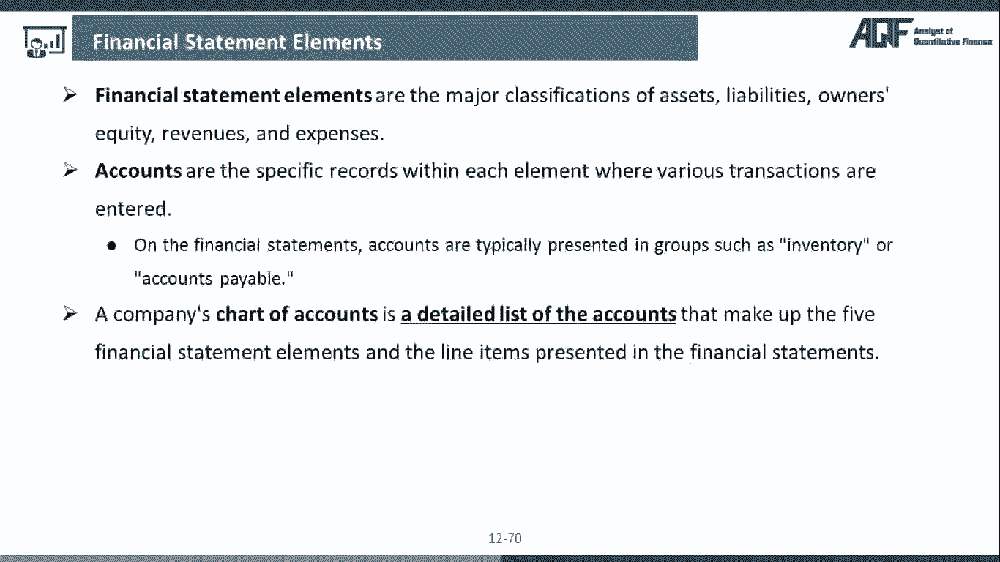

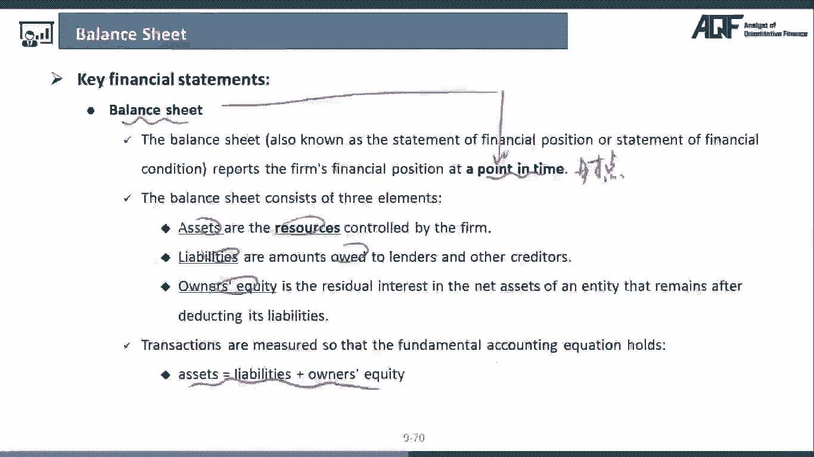

会计恒等式始终成立：`资产 = 负债 + 所有者权益`。

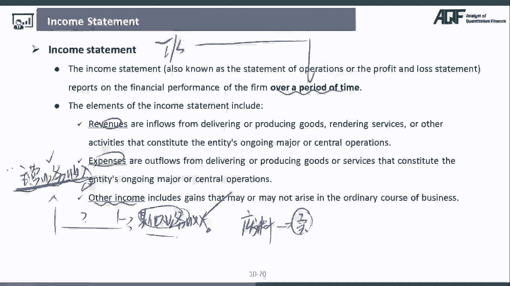

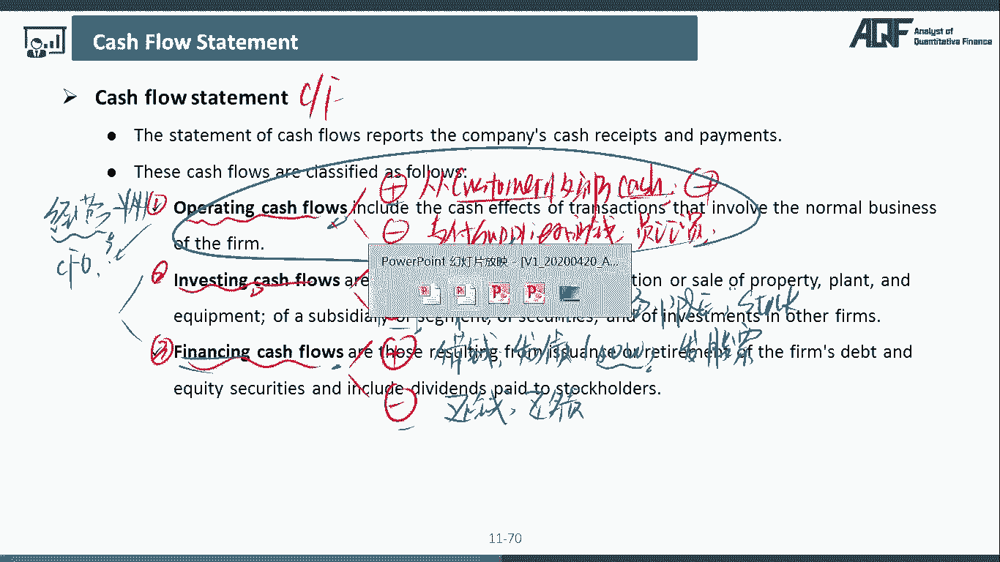

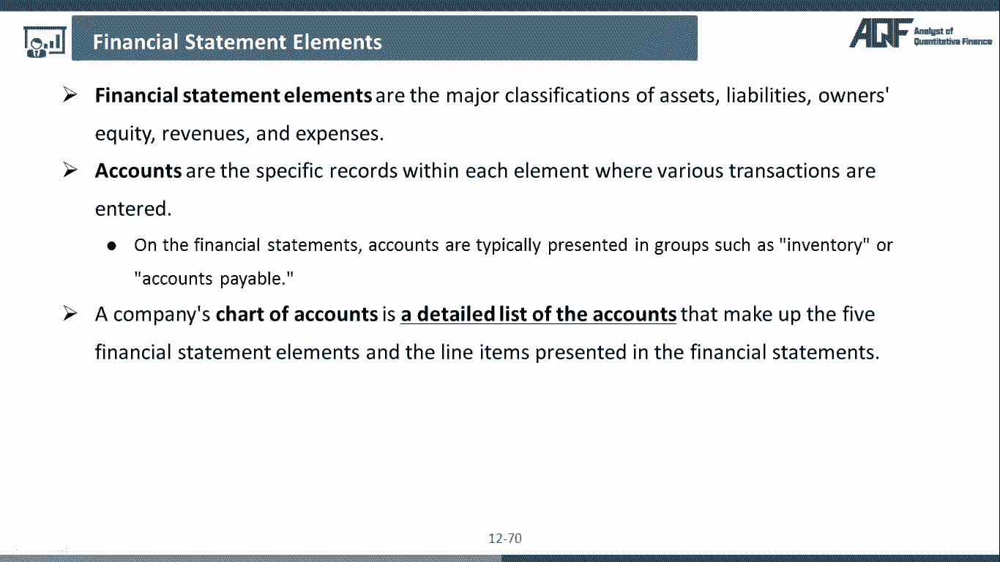

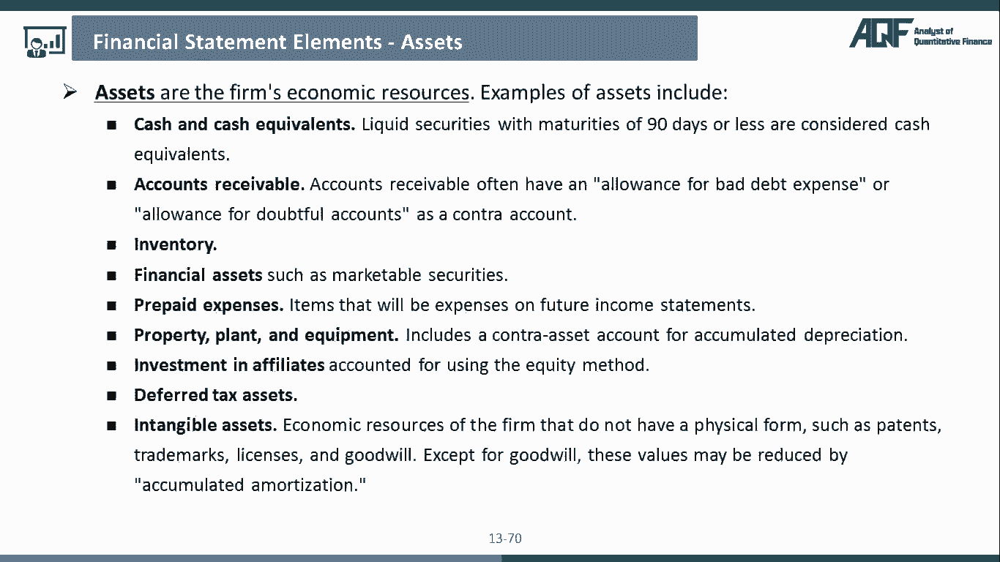

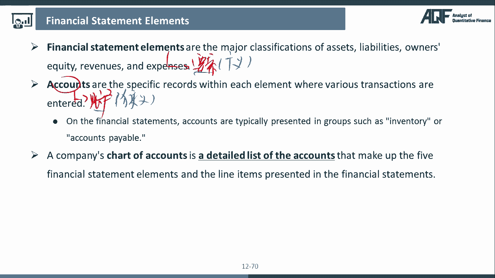

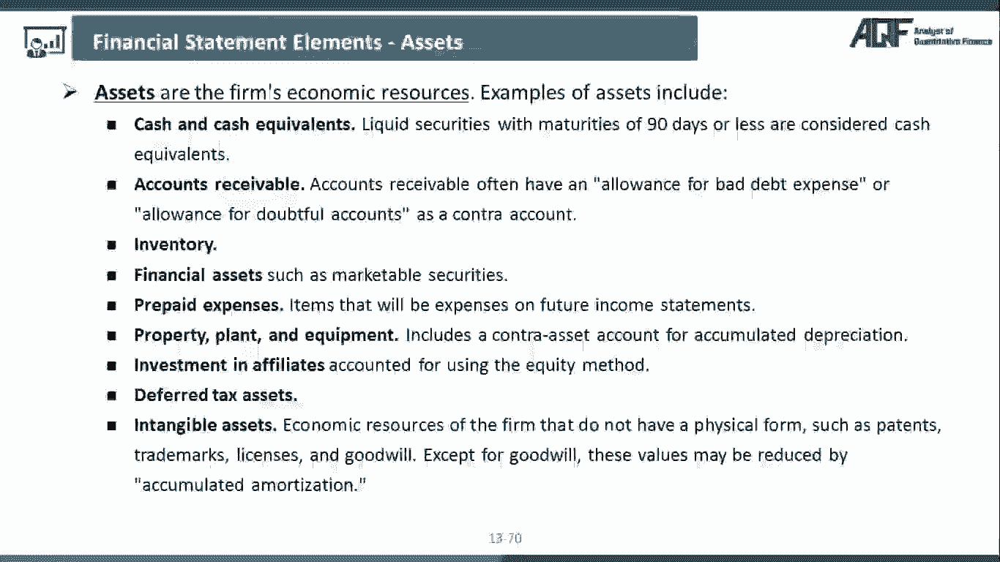

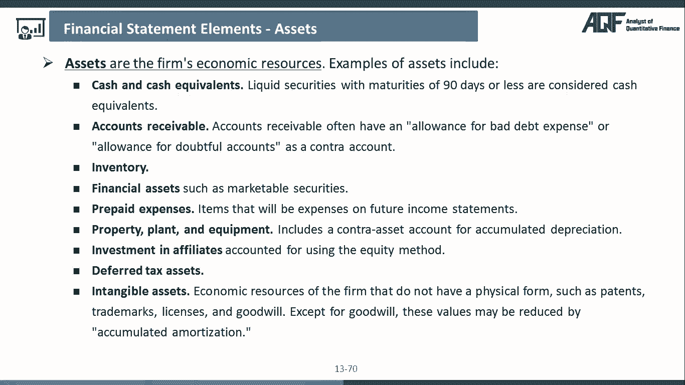

## 关键资产科目分析

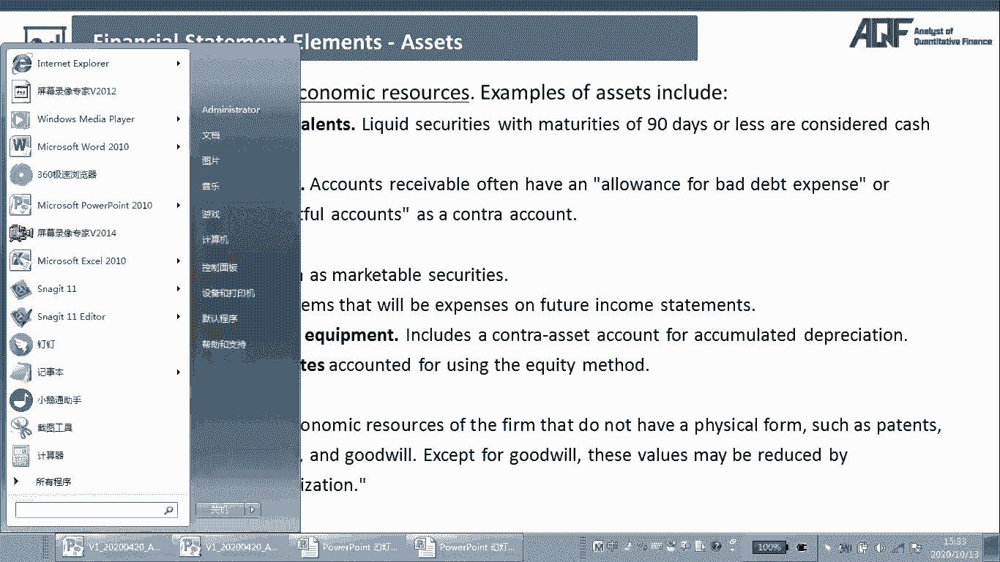

以下是资产负债表中的主要资产科目及其分析要点。

### 1. 现金及现金等价物 (Cash and Cash Equivalents)

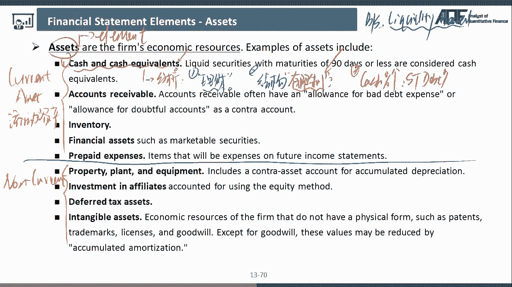

现金是流动性最好的资产。分析现金科目时，需关注以下几点：
*   **闲置资金与理财**：公司使用闲置资金购买理财产品，通常说明其财务状况不差，但未必是最具成长性的公司。
*   **现金结构**：需区分可自由使用的现金和受限现金（如抵押、保证金）。受限现金不能等同于可动用的营运资金。
*   **现金与短期负债的关系**：如果公司账上现金很多，同时短期负债也很高，这可能是一个矛盾信号（“存贷双高”）。因为短期负债利率通常较高，公司为何不先用现金偿还债务？这可能引发对现金真实性的质疑。在量化筛选中，可将此类公司作为风险警示对象。

### 2. 应收账款 (Accounts Receivable)

应收账款是已确认收入但尚未收到的货款。分析重点在于其增长质量和回收风险。
*   **与营收增长的对比**：健康的状况是应收账款增速不高于营业收入增速。如果应收账款增速大幅高于营收增速，可能意味着：
    *   公司销售回款能力变差，资金被客户占用。
    *   公司为刺激销售而放松信用政策，这可能削弱其上下游议价能力。
*   **坏账准备 (Bad Debt Allowance)**：公司需对可能无法收回的应收账款计提坏账损失。分析时需关注：
    *   **计提政策**：公司自行制定不同账龄（如1年内、1-2年）的坏账计提比例。若某公司计提比例显著低于行业平均水平，可能意在虚增利润。
    *   **同行业比较 (Cross-sectional Analysis)**：将目标公司的坏账计提政策与同行业其他公司对比，是发现财务粉饰的有效方法。

### 3. 存货 (Inventory)

存货包括原材料、在产品、产成品。存货的大幅变动需要谨慎分析。
*   **增长原因分析**：存货大幅上升不一定都是坏事。需区分是“产品滞销积压”（不利信号）还是“主动囤货以应对预期需求增长或价格上涨”（可能为积极信号）。可以通过管理层讨论（MD&A）或分析存货构成来判断。
*   **存货构成**：重点关注**产成品**的占比变化。产成品大幅增加最可能的原因是销售不畅。
*   **存货跌价准备**：当存货可变现净值低于账面成本时，需计提跌价损失。分析逻辑与应收账款坏账准备类似：
    *   比较公司计提比例与行业惯例。若比例偏低，可能存在虚增利润的嫌疑。

### 4. 固定资产 (Property, Plant and Equipment, PP&E)

PP&E主要指机器、厂房、设备等长期资产。其核心分析点在于**折旧（Depreciation）**。
*   **折旧方法的影响**：公司选择不同的折旧方法，会显著影响当期利润。
    *   **直线折旧法 (Straight-line)**：每年折旧额相等。这种方法下，前期折旧费用较少，利润较高，较为**激进**。
    *   **加速折旧法 (如双倍余额递减法, Double-declining Balance)**：前期折旧额大，后期折旧额小。这种方法更**保守**，使前期利润较低。
*   **分析要点**：在量化分析中，需警惕那些在行业内普遍采用加速折旧法时，却采用直线折旧法的公司。这可能是管理层美化利润的手段。

### 5. 金融资产与无形资产

*   **金融资产**：包括交易性金融资产、债权投资等。在量化分析中应用相对较少，了解其分类即可。
*   **无形资产 (Intangible Assets)**：如专利、商标、商誉等。这部分资产在财报上可能无法完全体现公司的全部价值（如优秀的管理团队、品牌口碑），更多用于深度价值投资分析。

## 现金流量表的核心：经营活动现金流

在量化分析中，**经营活动现金流（CFO）** 是最重要的现金流类别。它反映了企业主营业务的“造血”能力。
*   **与净利润对比分析盈利质量**：比较净利润与CFO的变动趋势。
    *   理想情况：净利润与CFO同步稳定增长，说明利润有真实的现金流入支持，盈利质量高。
    *   警示信号：净利润持续增长，但CFO持续下降甚至为负。这可能意味着利润增长并非来自主营业务，或存在大量未收回的应收账款，盈利质量存疑。在量化筛选中，可设置相关因子排除这类公司。

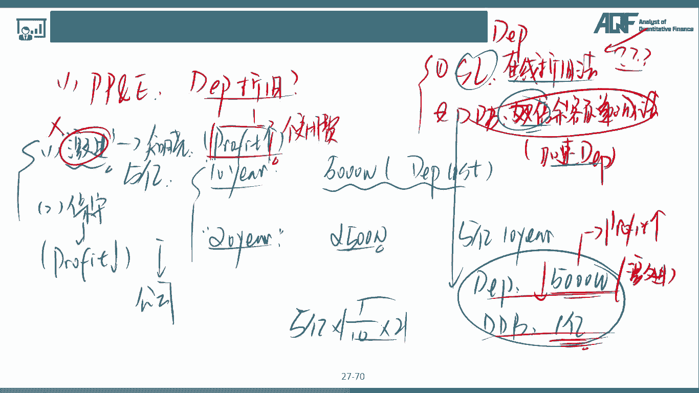

本节课中我们一起学习了资产负债表上主要资产科目的含义与分析技巧。我们了解到，分析资产不能只看数字大小，更要关注其结构、变动原因以及与行业惯例的对比。特别是对于现金、应收账款、存货和固定资产折旧的分析，能帮助我们识别财务报表可能存在的粉饰行为，评估企业真实的经营状况和盈利质量。掌握这些原理，将为后续构建量化因子模型、进行有效的股票初筛打下坚实的财务基础。下一节，我们将继续深入负债与所有者权益科目的分析。