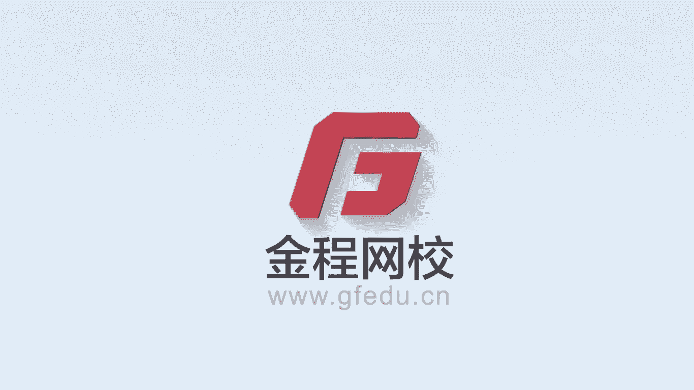
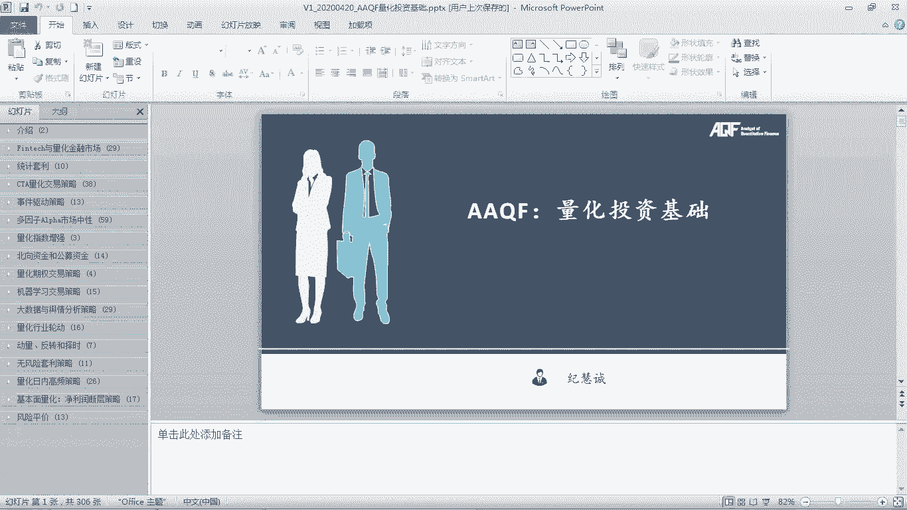
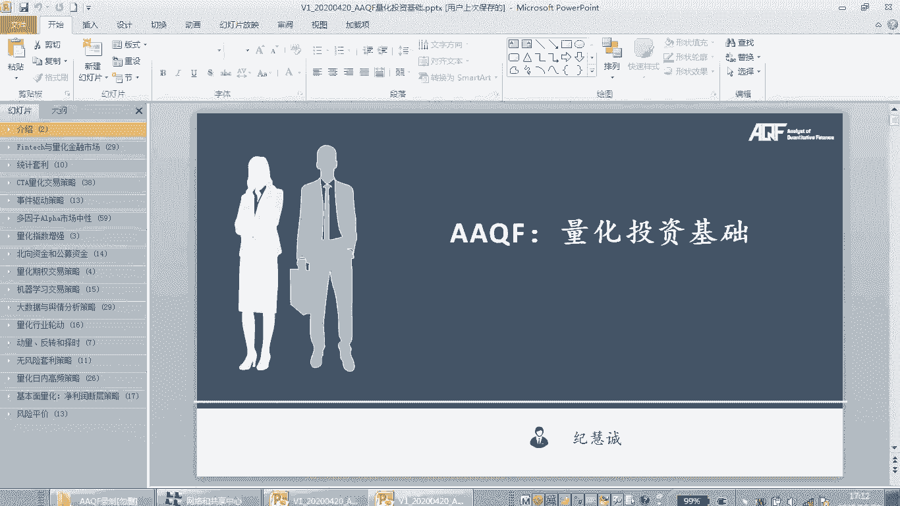
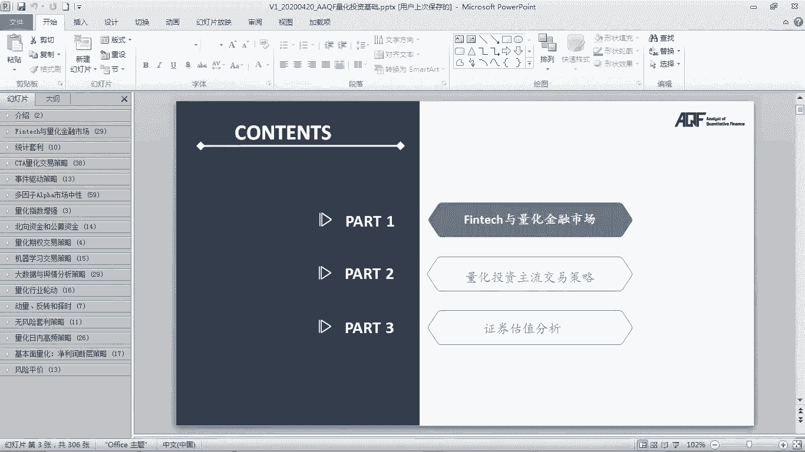
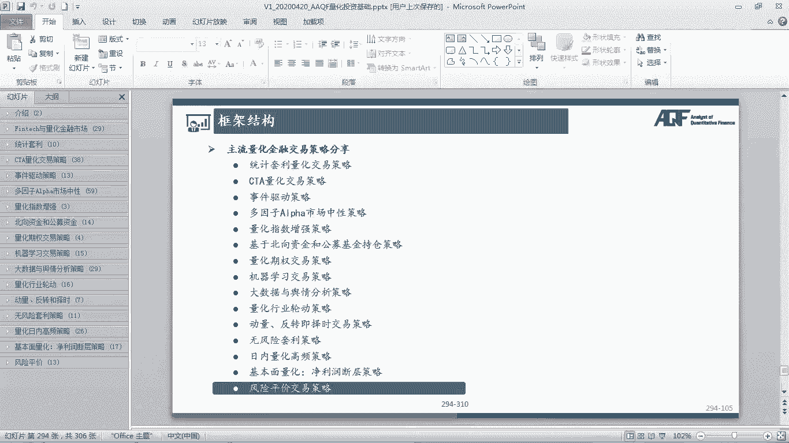
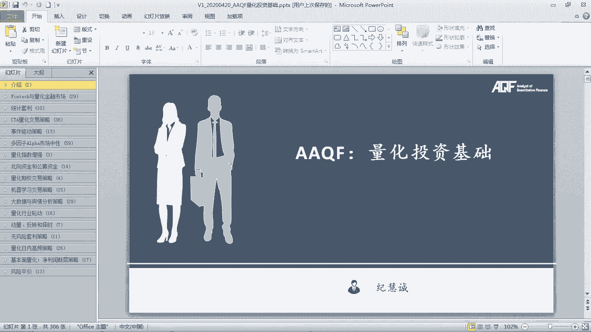

# 量化金融分析师.AQF：P12：量化投资基础课程介绍 📚





在本节课中，我们将要学习《量化投资基础》这门核心课程的总体框架与内容规划。课程将系统性地介绍金融科技（FinTech）如何重塑金融市场，并深入讲解多种主流的量化交易策略及其实现思路。



## 课程逻辑结构

整个《量化投资基础》课程将分为几个主要部分进行讲解。

### 第一部分：金融科技与量化金融市场介绍



上一节我们介绍了课程的整体目标，本节中我们来看看课程的第一部分内容。这部分将介绍金融科技的应用场景，包括人工智能在金融领域的应用，并对量化金融市场进行整体概述。

讲解这些背景知识的原因在于，科技正在不断塑造金融市场。未来，无论是投资组合构建、交易策略执行还是期权定价，都可能更多地依赖于算法和前沿的人工智能技术。因此，本课程旨在融合金融知识与技术，展示科技如何影响并推动金融行业的发展。

### 第二部分：主流量化交易策略详解

在了解了宏观背景后，我们将进入核心部分，系统学习各类主流的量化交易策略。课程将涵盖多种策略类型，并阐述其原理与实现思路。

以下是本课程将详细讲解的主要策略类型：

1.  **统计套利策略**
    *   这是量化入门的必学策略，Python实现相对简单且实用，在市场中常被证明有效。课程将用Python完整实现此策略。

2.  **CTA量化交易策略**
    *   该策略主要应用于商品、黄金等衍生品领域。通过设定一系列交易规则（如趋势跟踪）来获取超额收益。课程将介绍市场主流的CTA模型与算法，并挑选代表性策略进行Python实现。

3.  **事件驱动型策略**
    *   该策略的盈利与否取决于特定事件是否发生，例如券商分析师评级上调、兼并收购等。更深入的事件驱动策略（如基于分析师评级的策略）将在课程的长期更新内容中涉及。

4.  **多因子市场中性策略**
    *   这是目前市场上非常主流且占据量化半壁江山的策略。核心在于寻找更有效、解释力度更强、能产生阿尔法收益的因子，并结合市场中性方法以获得显著绩效。课程将详细讲解单因子检验、多因子模型（如Fama-French三因子模型）的实现，并对比平台（如优矿）调用与本地部署两种方式的优劣。

5.  **指数增强思路**
    *   本部分将介绍如何通过量化方法（如加入多因子、运用期权等）来战胜基准指数（如沪深300）。这部分主要讲解市场主流方法，但不进行代码实现。

6.  **基于资金流向的策略**
    *   此部分将研究北向资金（外资）和公募基金的选股逻辑与交易策略。通过分析这些重要市场参与者的持仓变化，可以衍生出有效的交易思路。

7.  **量化期权策略**
    *   将介绍如何利用期权工具获取超额收益。更深入的期权策略实现将在课程的长期更新内容中提供。

8.  **机器学习策略**
    *   涵盖传统的监督学习、无监督学习及更前沿的深度学习、神经网络在量化交易中的应用。这是课程重点突出的前沿部分，将呈现新颖且实用的策略案例。

9.  **大数据与舆情分析策略**
    *   讲解如何利用非结构化数据（如新闻、社交媒体舆情）进行量化交易。策略原理通用，但实际应用高度依赖于数据源的质量。

10. **行业轮动策略**
    *   介绍如何通过把握经济周期，量化地在不同行业间进行轮动配置以获取收益。

11. **动量/反转与择时策略**
    *   这些是相对基础但重要的交易策略，课程将对其原理进行讲解。

12. **无风险套利策略**
    *   如ETF套利、期现套利等，这些策略与衍生品知识紧密相关。

13. **日内高频交易策略**
    *   这是本次课程的重大更新，将覆盖基于股票或期货的日内高频交易思路，例如研究集合竞价、主动买卖盘对全天收益的影响等。

14. **基本面量化策略**
    *   以“净利润断层”策略为例，讲解如何结合基本面（公司财报）与技术面进行共振交易。课程将介绍两种来自不同券商研究所的有效思路。

15. **风险平价策略**
    *   尽管近年表现有所波动，但风险平价（Risk Parity）仍是一个主流的资产配置型量化策略，课程会对其原理进行介绍。

## 课程总结与展望

本节课中我们一起学习了《量化投资基础》课程的整体框架。新版课程内容更为丰富和深入，新增了许多行业前沿的交易思路与策略。

需要说明的是，受限于数据、篇幅等因素，课程不会实现所有讲解的策略。但掌握策略背后的交易思想与原理至关重要。学习者可以结合这些原理与自身对市场的理解，开发出属于自己的量化交易系统，最终实现从策略思想到实战的完整闭环。

**核心公式示例（多因子模型）**:
一个经典的多因子模型可以表示为：
`预期收益率 = 无风险利率 + β1 * 因子1收益率 + β2 * 因子2收益率 + ... + α`
其中，`α` 即为策略寻求的超额收益。






**代码示例（策略思路）**:
```python
# 这是一个简单的均值回复策略思路伪代码示例
if current_price < historical_mean_price * 0.95: # 价格低于历史均值5%
    signal = "BUY" # 生成买入信号
elif current_price > historical_mean_price * 1.05: # 价格高于历史均值5%
    signal = "SELL" # 生成卖出信号
else:
    signal = "HOLD" # 持有
```