# 量化金融分析师.AQF：P14：Fintech与量化金融市场介绍 🚀

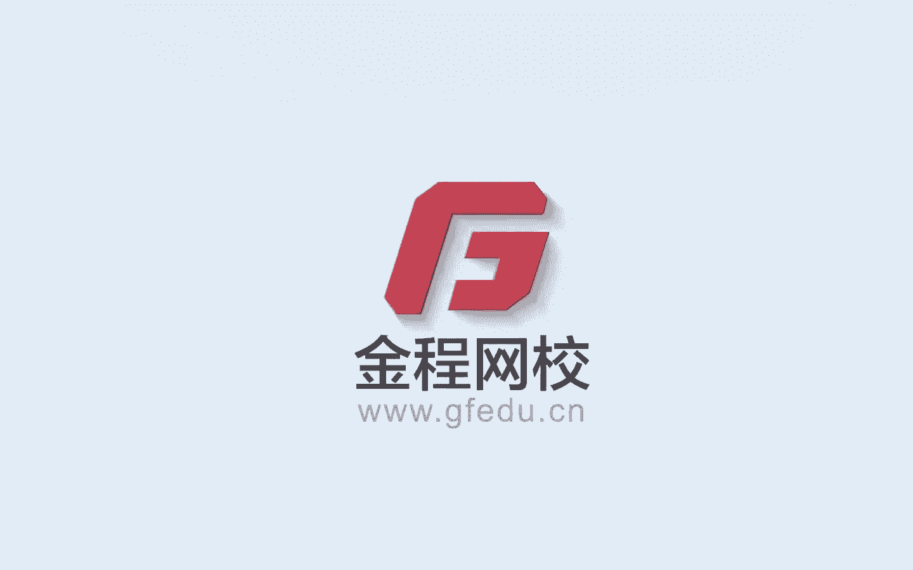

在本节课中，我们将学习金融科技（Fintech）与量化金融市场的基础知识。我们将探讨人工智能和机器学习在金融领域的应用场景，分析其对传统金融行业的冲击，并了解国内外量化市场的发展现状与趋势。

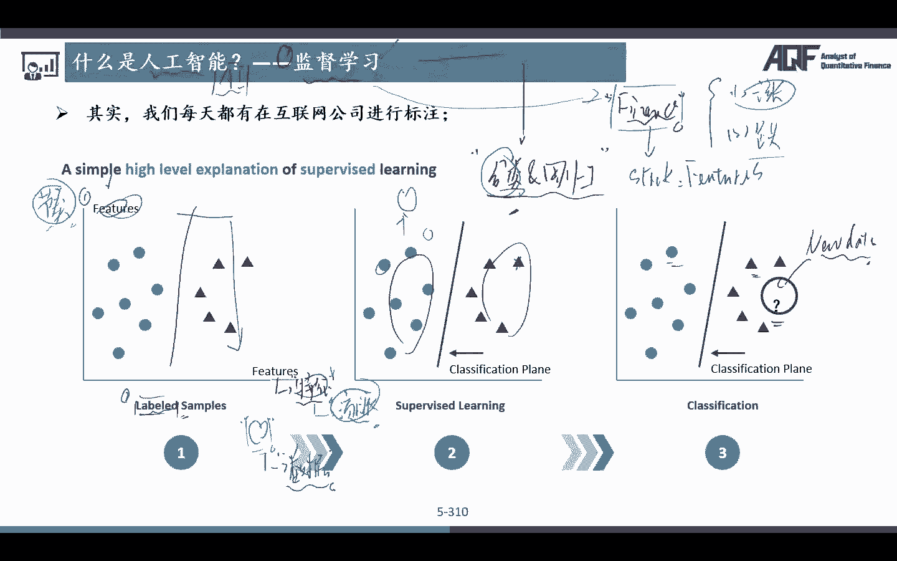

---

## 深度学习在期权定价中的应用

上一节我们介绍了机器学习的基本概念，本节中我们来看看深度学习在金融领域的一个具体应用——期权定价。

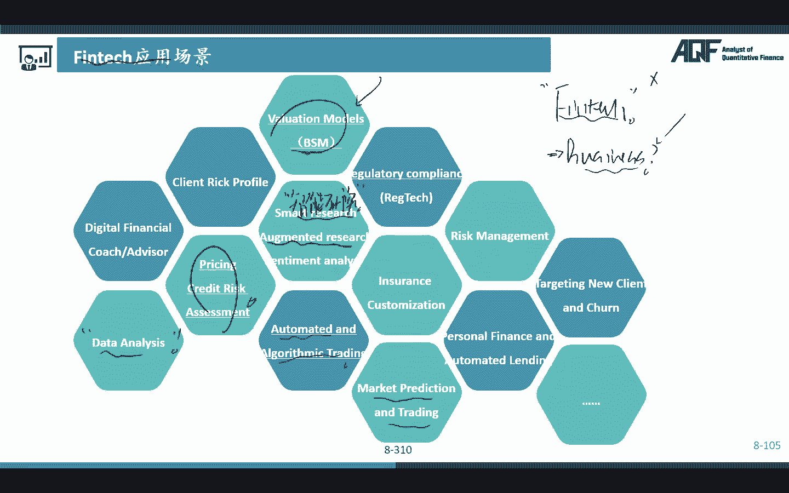

传统的期权定价高度依赖于布莱克-斯科尔斯-默顿（BSM）模型。该模型需要五个输入变量来计算出看涨或看跌期权的价格。

**公式：BSM模型**
`C = S * N(d1) - K * e^(-rT) * N(d2)`
其中，`C`是看涨期权价格，`S`是标的资产现价，`K`是行权价，`r`是无风险利率，`T`是到期时间，`N()`是标准正态分布函数。

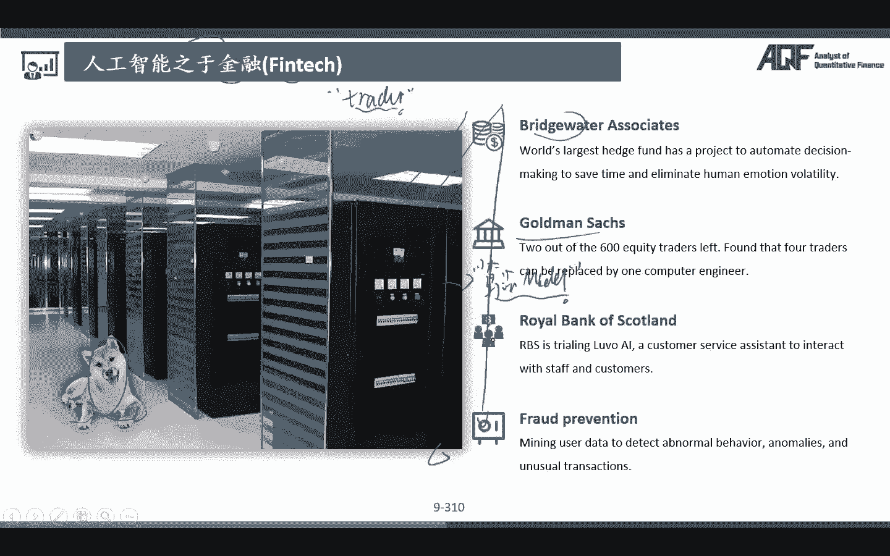

然而，深度学习的出现可能改变这一状况。其思路是：将期权的历史数据（五个输入变量）作为模型的输入层（input），将对应的历史期权价格作为输出层（output）。通过训练数据，让模型自动学习输入与输出之间的关系，从而拟合出一个定价模型。

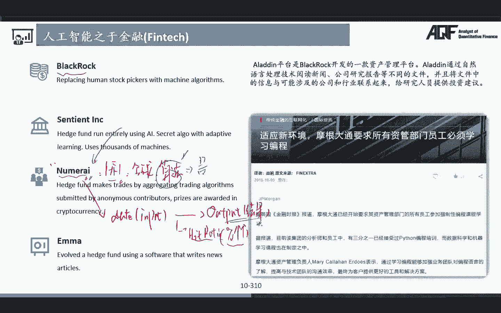

**代码示例：模型训练思路**
```python
# 伪代码示意
input_data = [S, K, r, T, sigma]  # 五个输入变量
output_data = historical_option_price  # 历史期权价格
model.train(input_data, output_data)  # 训练模型
new_price = model.predict(new_input_data)  # 预测新价格
```

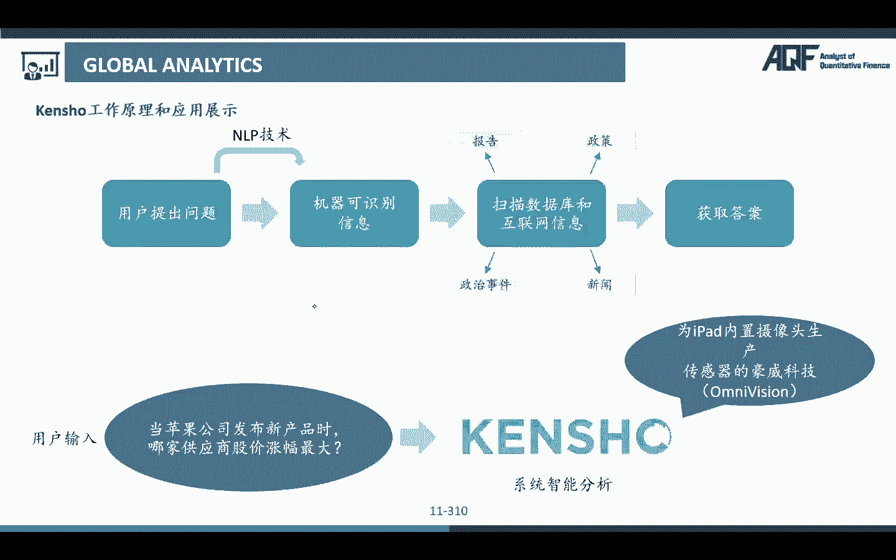

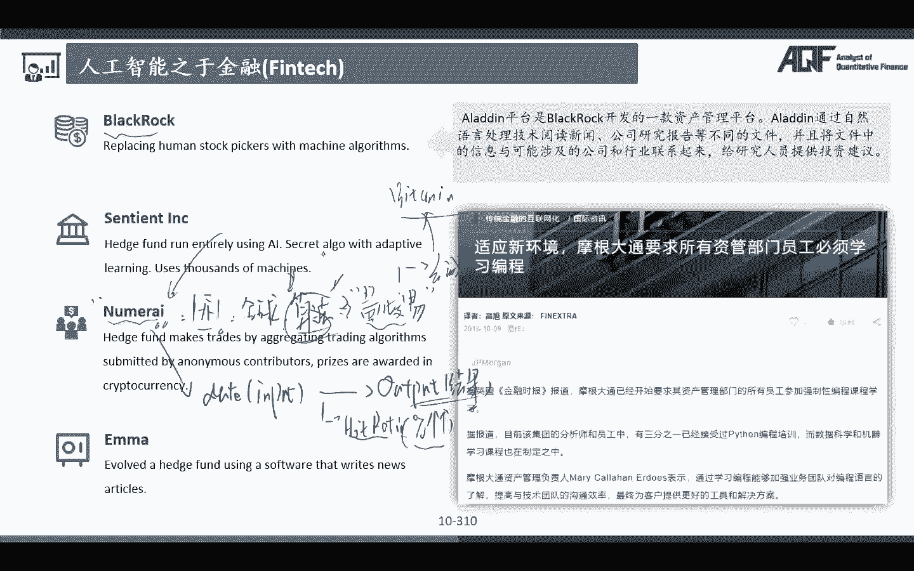

有测试表明，这种基于深度学习的定价模型得出的结果，有时比BSM模型更接近市场的真实情况。这预示着未来的金融分析可能更侧重于数据和算法，而非传统的金融公式。

---

## Fintech的主要应用场景

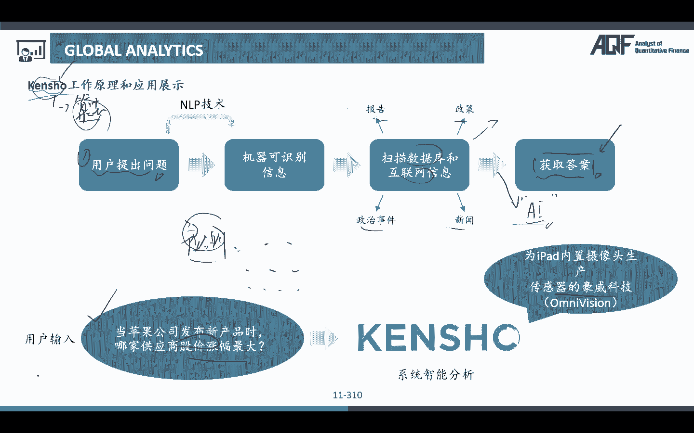

理解了深度学习的基础应用后，我们进一步探索金融科技更广泛的应用领域。以下是金融科技的一些核心应用场景：

**算法交易**
通过预设的数学模型和算法自动执行交易订单，旨在捕捉市场微小的价差机会或执行大额订单以减少市场冲击。

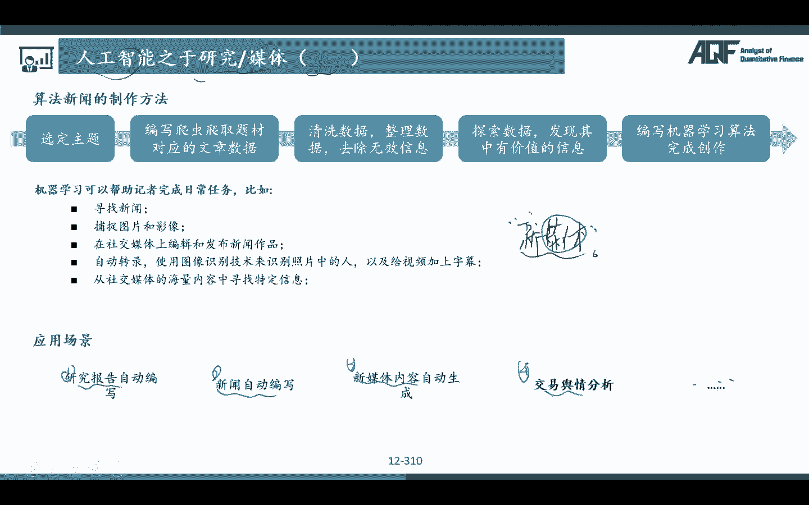

**智能研究与报告生成**
利用自然语言处理等技术，自动分析市场数据、撰写研究报告或新闻快讯。许多盘后点评和即时新闻已由算法自动生成。

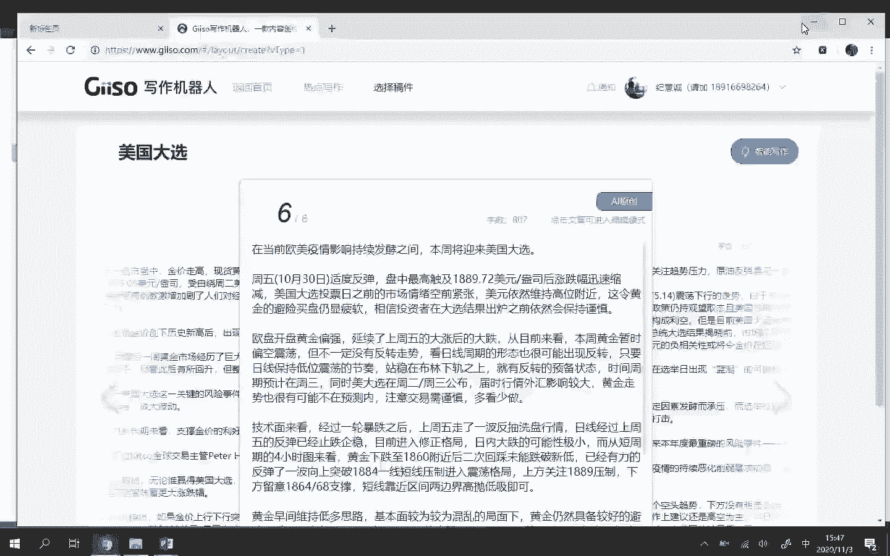

**信用与风险分析**
通过机器学习模型分析客户数据，预测其违约概率，广泛应用于快速贷款、信用卡审批等场景。

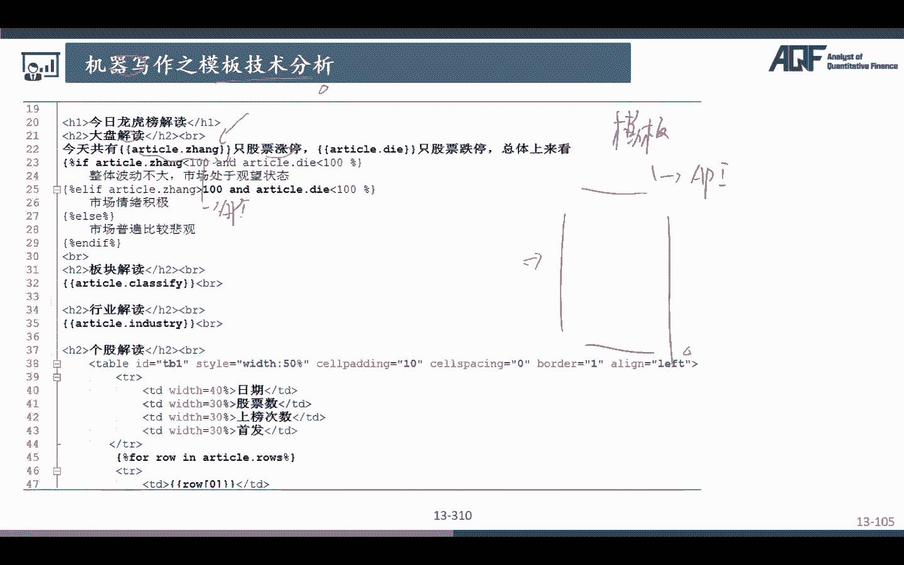

**市场预测与交易分析**
运用复杂的算法模型分析海量数据，对资产价格走势、市场情绪等进行预测。

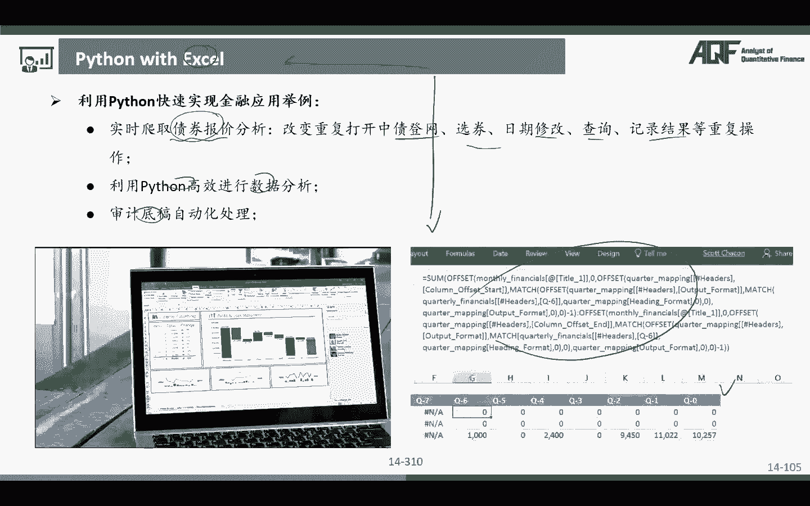

**自动化数据处理**
使用Python等工具自动化处理金融数据，如财务报表分析、审计底稿处理等，大幅提升效率。

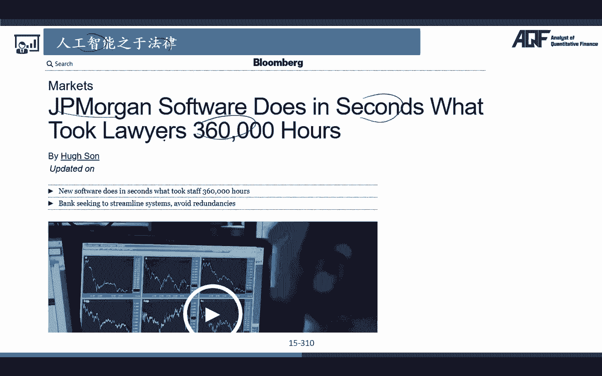

这些应用不仅限于金融领域，其方法论同样适用于商业数据分析等其他场景。

---

## 人工智能对金融行业的冲击与案例

金融科技的蓬勃发展正在重塑金融行业的面貌，许多传统岗位和业务模式受到冲击。

一个著名的例子是高盛的交易大厅。过去这里满是交易员，如今则被服务器集群所取代，大部分交易由算法自动完成。

另一家有趣的公司是Numerai。它是一个对冲基金，向全球工程师征集交易算法。参与者提交算法模型，如果该模型在市场预测中表现出高胜率，Numerai会使用该模型进行真实交易，并与算法提供者分享利润（通常以比特币支付）。

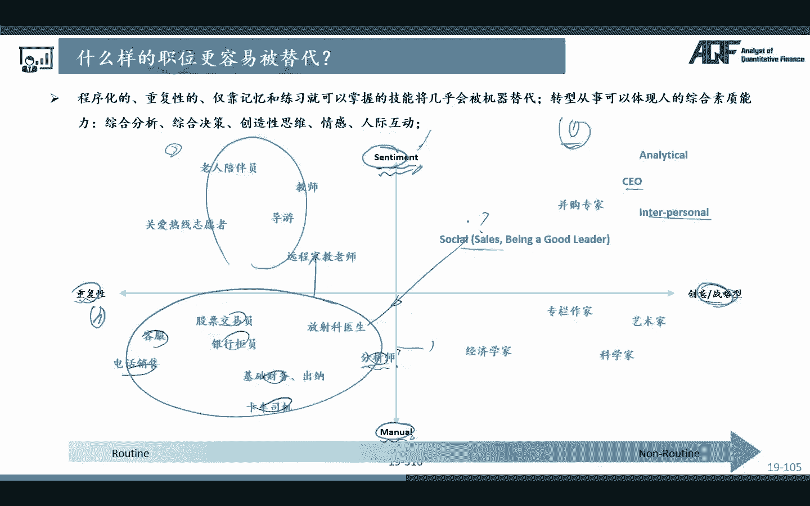

此外，像Kensho这样的智能分析系统，能够扫描全网信息，快速回答复杂的市场问题。例如，在英国脱欧公投后，Kensho对市场走势的预测大部分被事后验证是准确的。

在内容生成领域，已有“写作机器人”能够根据给定主题，在极短时间内生成大量分析文章或报告，许多日常的市场点评工作正在被自动化。

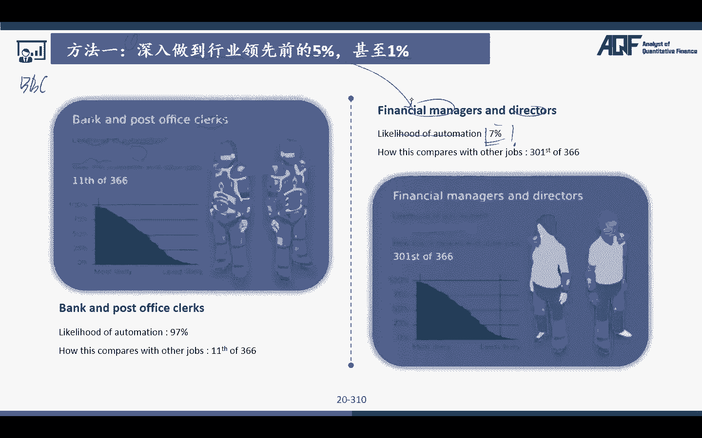

---

## 如何应对人工智能时代的挑战

面对人工智能带来的行业变革，个人应如何提升竞争力以避免被替代？以下是三种策略：

**1. 成为行业顶尖专家**
在某一专业领域做到前5%甚至1%。例如，在银行领域，普通柜员被自动化替代的概率高达97%，而财务总监被替代的概率则低于7%。考取CFA、CPA等顶尖专业证书是深化专业能力的途径之一。

**2. 打造复合型技能**
在两个或以上领域都达到前20%的水平，成为“π型人才”。例如：
*   **金融 + 信息技术**：如AQF所倡导的量化金融。
*   **金融 + 法律/风控**：在一级市场或风控领域更具优势。
*   **金融 + 演讲/管理**：增强影响力和领导力。

**3. 主动拥抱并利用AI工具**
善于发现并利用AI平台赋能自己的工作，提升效率，创造新的价值，而非被动等待被替代。

根据一项研究，**重复性高且无需情感投入的工作**最容易被自动化替代。因此，应致力于向**需要创造性、战略思考和情感交流**的工作方向发展。

---

## 国内外量化金融市场现状

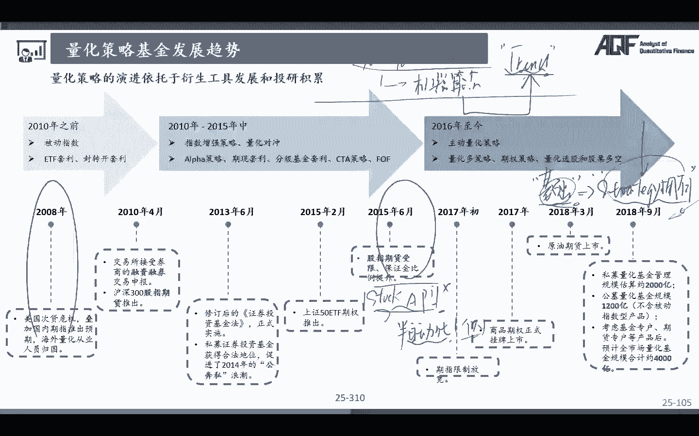

最后，我们来了解一下量化金融在国内外市场的发展情况。

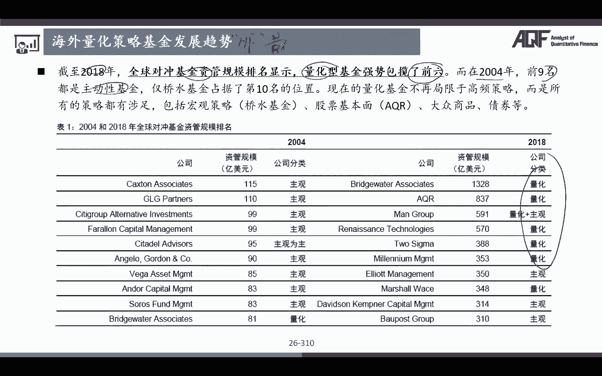

**海外市场**
在欧美成熟市场，量化交易已成为主流。据统计，美国市场约70%-80%的交易量由算法交易贡献。全球顶级对冲基金中，量化基金已占据主导地位，这标志着量化投资是不可逆转的趋势。

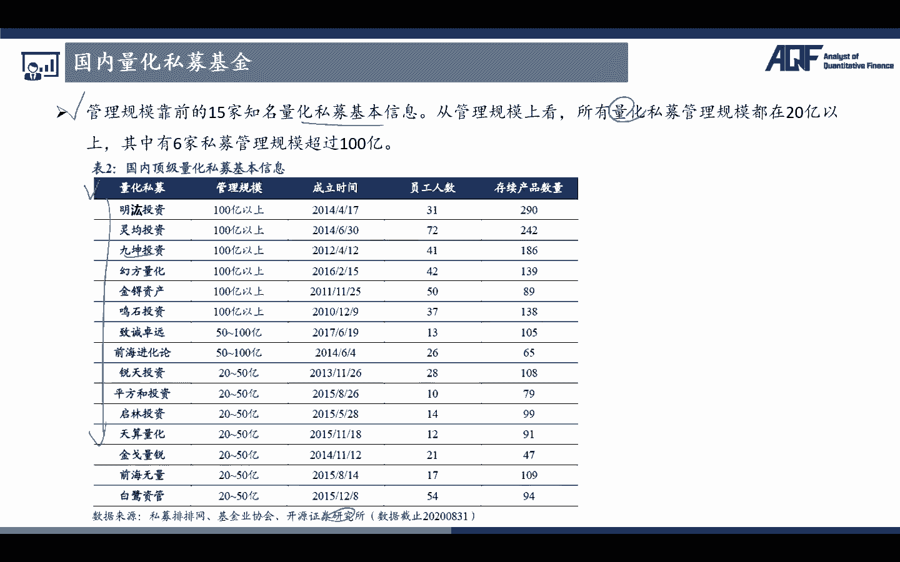

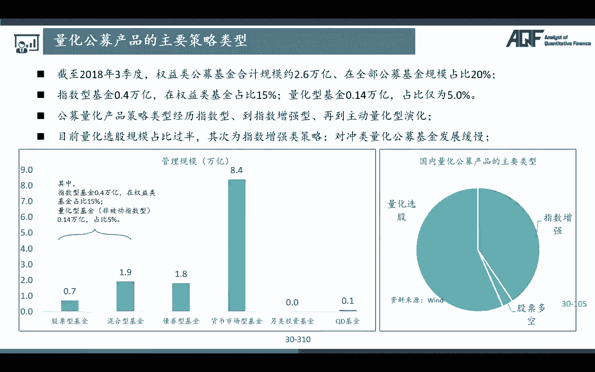

**中国市场**
中国量化市场发展相对曲折，但潜力巨大。2015年股市异常波动后，监管层对程序化交易接口进行了规范，目前个人投资者多以“半自动化”为主。同时，由于参与者增多，部分简单策略存在“策略拥挤”导致失效的问题。

然而，国内量化私募行业仍在快速增长，头部机构管理规模不断扩大。主流量化策略包括：
*   **市场中性策略**：通过做空股指期货对冲市场风险，追求绝对收益。
*   **指数增强策略**：在跟踪指数的基础上，运用量化模型获取超额收益。
*   **CTA策略**：商品期货交易策略。
*   **多因子选股策略**：利用多个因子模型筛选股票。

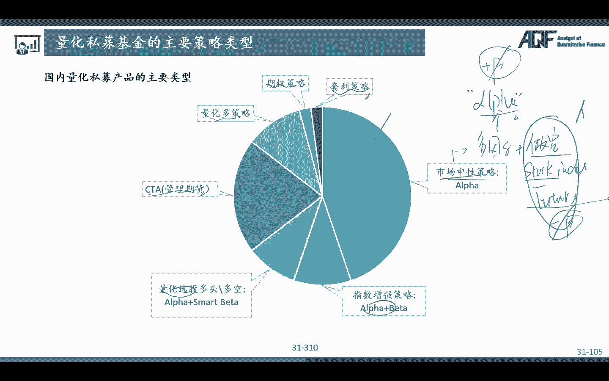

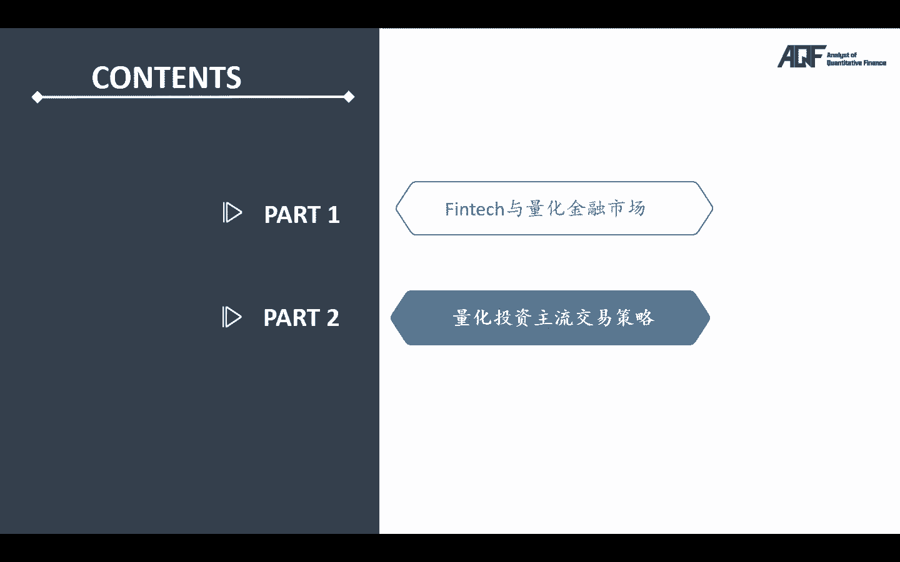

公募基金在量化领域则更多侧重于指数增强等产品。


---

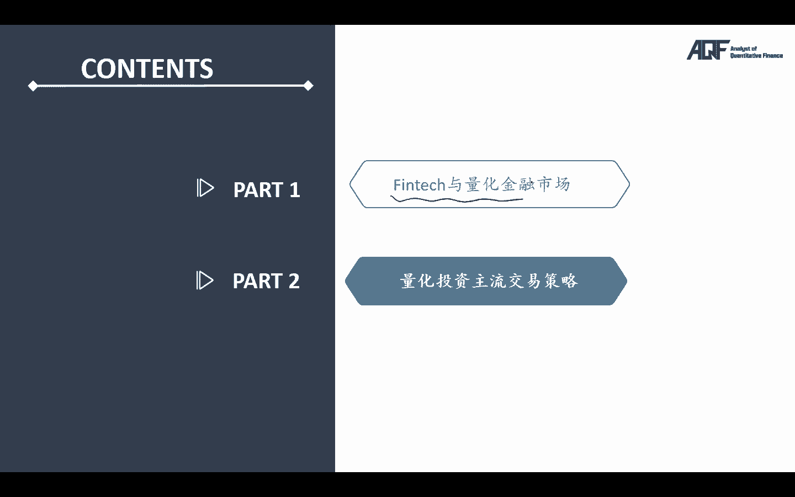


本节课中我们一起学习了Fintech的核心应用及其对金融行业的深刻影响，探讨了在人工智能时代下的个人发展策略，并纵览了全球量化金融市场的发展图景。整体而言，尽管发展道路各有不同，但金融与科技的结合，尤其是量化投资，无疑是未来金融业发展的重要方向。掌握相关知识和技能，将为你在金融领域的职业发展提供强大助力。