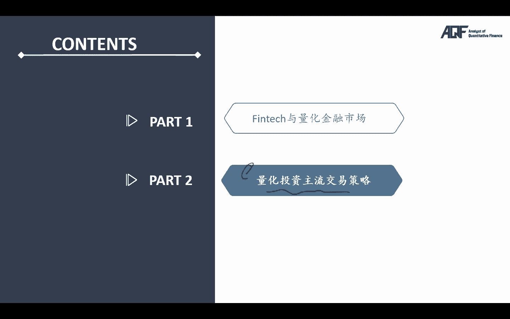
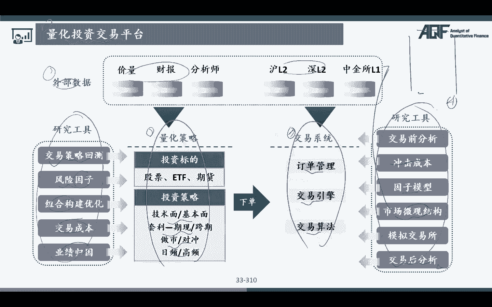

# 量化金融分析师.AQF：P15：量化交易回测和实盘的一般框架结构 📊

在本节课中，我们将学习量化投资策略开发的核心流程，即量化交易的回测与实盘框架。理解这个框架是构建和评估任何交易策略的基础。

上一节我们介绍了量化投资的基本概念，本节中我们来看看一个完整的量化交易系统是如何从数据到最终业绩评估的。

## 数据处理模块 📥

量化交易的起点是数据。数据处理模块负责获取、清洗和存储所有用于策略开发和分析的原始数据。

以下是数据处理模块的核心任务：

1.  **数据获取**：从各种来源收集原始数据。
    *   **免费开源平台**：例如 `Tushare`、`akshare` 等库。
    *   **财经网站爬虫**：例如从新浪财经等网站爬取数据。
    *   **商业数据库**：例如万得（Wind）、彭博（Bloomberg）等收费数据库。
    *   **课程提供**：对于收费数据，课程会打包提供，方便学习使用。

2.  **数据清洗**：对获取的原始数据进行处理，使其可用于分析。
    *   处理缺失值、异常值。
    *   进行数据格式标准化。

3.  **数据存储**：将清洗后的数据存入数据库，便于后续高效调用。
    *   使用如 `SQL` 等数据库技术进行管理。
    *   输出结果为结构化的、干净的数据集，作为下一模块的输入。

## 策略开发模块 ⚙️

策略开发是量化模型的核心。本模块利用处理好的数据，通过算法生成具体的交易信号。

以下是策略开发模块的主要功能：

1.  **策略编写**：根据投资逻辑（如技术指标、基本面因子）编写策略代码。
2.  **信号生成**：策略代码运行后，输出具体的买卖指令。
    *   例如，生成一个信号列表：`signals = [('买入', '股票A', 100股), ('卖出', '股票B', 50股)]`
3.  **参数优化**：对策略中的参数进行测试和寻优，以找到最佳表现组合。

## 交易执行与风控模块 🚦

此模块负责执行策略产生的信号，并在执行前后进行风险管理。它是连接策略逻辑与真实市场（或模拟环境）的桥梁。

以下是该模块的关键职责：

1.  **订单处理**：接收策略模块产生的信号，并将其转化为具体的订单。
2.  **风险控制**：在订单执行前，检查是否满足预设的风控规则。
    *   例如：检查单只股票持仓是否超过上限 `max_position_per_stock`。
3.  **异常处理**：处理交易过程中可能出现的各种异常情况。
4.  **执行差异**：
    *   **回测**：在历史数据中模拟订单成交，计算模拟收益。
    *   **实盘**：通过券商或交易所的 `API` 接口，发送真实交易订单。这要求系统具备实时数据处理和通信能力。

## 业绩评估模块 📈

最后一个模块是对策略表现的全面评估。它通过一系列指标和图表，直观地展示策略的盈利能力和风险水平。

以下是业绩评估模块的输出内容：

1.  **净值曲线**：绘制策略资产净值随时间变化的曲线图。
2.  **绩效指标**：计算关键量化指标。
    *   **年化收益率**：`Annual Return`
    *   **夏普比率**：`Sharpe Ratio = (策略收益率 - 无风险利率) / 策略收益波动率`
    *   **最大回撤**：`Max Drawdown`
3.  **交易分析**：统计交易次数、胜率、盈亏比等。

## 框架总结与工具概览

综上所述，一个完整的量化交易框架是一个闭环流程：**数据处理 -> 策略开发 -> 交易执行 -> 业绩评估**。每个模块的输出（Output）是下一个模块的输入（Input）。

无论是回测还是实盘，核心框架一致，主要区别在于：
*   **数据**：回测用历史数据，实盘需处理实时数据。
*   **执行**：回测是模拟成交，实盘需通过 `API` 真实下单。

此外，在开发不同策略时，我们会用到多样的研究工具：
*   **策略层面**：因子分析、投资组合构建、业绩归因。
*   **系统层面**：分析冲击成本、市场微观结构（如订单簿 `Order Book` 分析）。

本节课中我们一起学习了量化交易回测与实盘的核心框架。理解这个从数据到决策再到评估的完整流程，是您开始构建自己量化策略的第一步。在接下来的课程中，我们将深入各个模块，学习具体的实现方法。