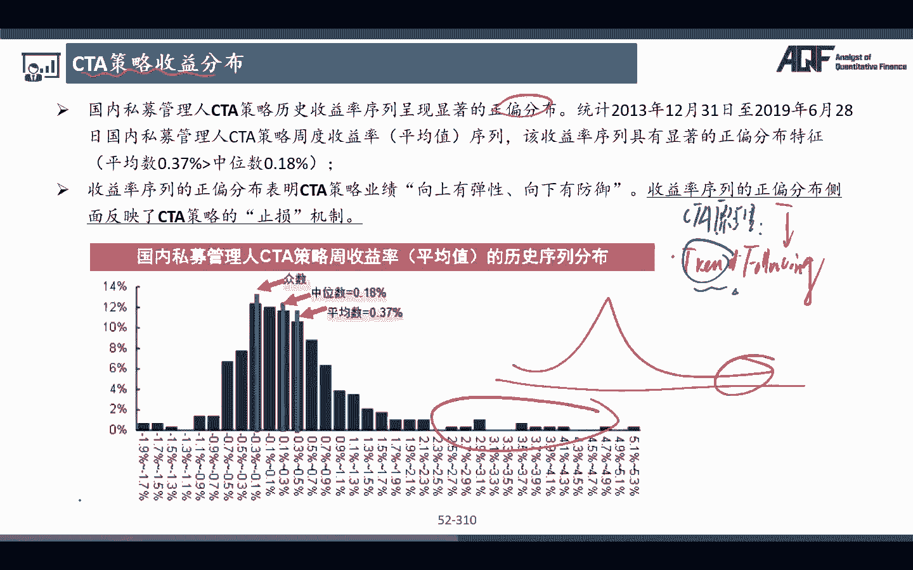
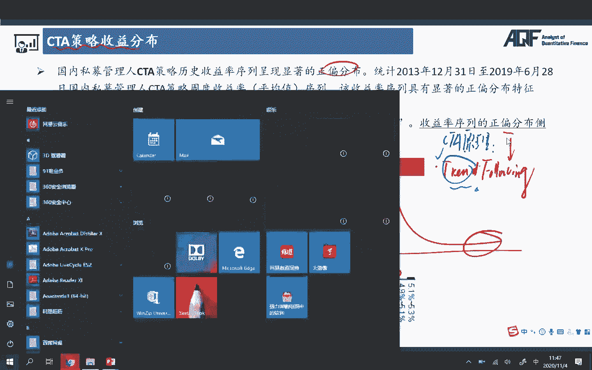

# 量化金融分析师.AQF：P17：CTA量化交易策略1

在本节课中，我们将要学习量化投资理论中的一个重要组成部分——CTA量化交易策略。我们将从CTA策略的基本概念、市场概况、策略分类入手，并深入探讨两种经典策略的核心原理与实现思路。

## CTA策略概述与市场背景

上一节我们介绍了量化投资的基本框架，本节中我们来看看CTA策略。CTA的全称是Commodity Trading Advisor，即商品交易顾问。该策略最初活跃于商品期货市场，因此许多CTA策略也被称为管理期货策略。本质上，CTA策略主要使用期货合约进行交易。

全球CTA市场规模，根据巴克莱对冲基金的统计，一直保持着快速增长。CTA策略的投资方向不仅限于股票和债券，并且交易方向可多可空。因此，即使在2008年金融危机期间，CTA策略也保持了稳定的增长。这解释了为什么要在投资组合中加入CTA策略。

CTA策略能在市场大幅下跌时产生“危机阿尔法”。因为即使股票价格下跌，也可以通过做空来获得收益。所以在历次危机中，许多CTA策略的表现都名列前茅。此外，CTA策略与传统投资策略的相关性较低。在投资组合中配置一些CTA策略或基金，能够提升整个组合的夏普比率。

## 国内CTA市场与策略分类

了解了全球市场后，我们再来看看国内CTA市场的概况。国内CTA策略一般分为两大类型：主观交易和程序化交易。复合策略则两者兼有。

以下是两种策略类型的简要介绍：
*   **主观交易**：依赖基金经理的人为判断。可进一步分为趋势追踪、套利和日内交易等子类。
    *   **趋势追踪示例**：交易员观察到黑色系大宗商品出现趋势性行情，且多个技术指标发出看涨信号，于是决定买入。
    *   **事件驱动示例**：在英国脱欧事件发生后，基金经理分析其对各类资产的影响，并通过同时做多和做空相关合约来获利。
*   **程序化交易**：这是我们课程的重点。它同样包含趋势追踪、套利和日内高频交易等策略，但所有决策均由预设的算法和信号自动执行，不依赖人为判断。

从策略角度细分，CTA策略主要可分为趋势追踪型和套利型策略。不同机构可能有不同的分类方法。

以下是趋势追踪策略的进一步划分：
*   **趋势追踪策略**：旨在捕捉市场趋势。
    *   **日间趋势追踪**：交易频率较低，例如Aberration长线系统、均线策略（金叉买入，死叉卖出）。
    *   **日内趋势追踪**：交易频率较高，例如Dual Thrust、ATR（与海龟交易法则相关）等策略。

套利策略则可分为期现套利、跨期套利、跨市场套利和跨品种套利。这些概念在统计套利部分已有所涉及。

国内CTA市场以程序化交易为主。在股指期货交易恢复常态后，CTA策略的收益有了稳定提升。自2018年以来，管理期货策略提供了显著的超额回报，且表现稳健，具备危机阿尔法的特性，因此值得深入研究。

由于CTA主要交易商品期货，我们需要了解国内流动性较好的品种，例如铁矿石、螺纹钢、原油、黄金、白银、PTA、豆粕等。在构建高频CTA策略时，必须选择流动性好的合约，否则市场冲击成本会侵蚀策略利润。

国内CTA策略的收益分布呈现显著的正偏态分布，即获得极端正收益的概率较高。这与CTA策略的原理密切相关。

## CTA策略的核心原理与特点

CTA策略中最大的一类是趋势追踪。其核心在于如何定义趋势。一旦发现趋势并进场，如果判断正确，就持有头寸让利润奔跑，从而获得高额收益；如果判断错误，则及时止损，将损失控制在较小范围。这种“小亏大赚”的模式导致了收益的正偏态分布。

因此，CTA策略在趋势明显的市场（如2016年商品牛市）中非常有效。但在震荡市中，频繁的假信号会导致策略表现不佳。这启示我们，在构建策略时，可以通过指标判断市场状态，并优化参数来适应不同市况，从而提升策略绩效。

数据表明，CTA策略与其他策略的相关性较低。在传统的股债组合中加入30%的CTA策略，每年再平衡后，组合的收益、夏普比率会提升，而波动率和最大回撤会降低。这就是在投资组合中配置CTA策略的主要原因。

## 经典CTA策略解析：Aberration长线系统

接下来，我们将深入讲解几个经典的CTA策略。首先介绍的是Aberration长线系统。这是一个低频策略，旨在捕捉长期信号。

该策略的逻辑很简单：
1.  计算过去N日（如20、30、60日）某个期货合约价格的均值。
2.  计算该价格相对于均值的上下轨道，例如均值上下1.5倍标准差。
3.  制定交易规则：
    *   **开仓**：当价格向上突破上轨，认为上涨趋势确立，开多仓；当价格向下跌破下轨，认为下跌趋势确立，开空仓。
    *   **平仓**：可采用移动止盈/止损。例如，价格创新高后，从最高点回撤一定比例（如10%）则平仓离场，以保住利润。如果开仓后价格反向运动触及止损位，则立即止损。

这种动态止盈方法的好处是，只要趋势延续，就不会过早离场，能够充分捕捉利润。Aberration策略将在后续课程中手把手实现代码并进行回测。

## 经典CTA策略解析：Dual Thrust日内系统

第二大经典策略是Dual Thrust，这是一种日内高频交易策略。其核心原理是通过定义一个价格通道（Range）的上下轨，在价格突破时进行交易。

首先，需要计算Range。Range取以下两个值中的最大值：
*   `Range1 = HH - LC`
*   `Range2 = HC - LL`
其中：
*   `HH`：过去N日最高价中的最大值
*   `LC`：过去N日收盘价中的最小值
*   `HC`：过去N日收盘价中的最大值
*   `LL`：过去N日最低价中的最小值

然后，计算上下轨：
*   上轨（买入线） = `当日开盘价 + K1 * Range`
*   下轨（卖出线） = `当日开盘价 - K2 * Range`
`K1`和`K2`是系数，通常可设为0.7。

交易规则如下：
*   若价格突破上轨，则平掉空仓（若有）并开多仓。
*   若价格突破下轨，则平掉多仓（若有）并开空仓。
*   因为是日内策略，通常在收盘前平掉所有头寸。

原始的Dual Thrust策略缺乏明确的退出策略，主要在日内收盘或反向信号出现时平仓。这在震荡市中可能导致较大的回撤。

## 策略优化思路

获得一个策略后，我们并非照搬，而是可以对其进行优化。以Dual Thrust为例，可以从以下几个角度改进：

**1. 优化进场参数：**
*   使用市场常见参数（如K1=K2=0.7）。
*   使用历史数据进行参数寻优，遍历不同的K1、K2组合，选择历史表现最优的一组。
*   引入过滤器动态调整参数。例如，结合KDJ指标，当K值大于50（视为牛市）时，将K1调低（如0.6），使多头信号更容易触发；当K值小于50（视为熊市）时，将K2调低，使空头信号更容易触发。

**2. 增加明确的退出/止损策略：**
*   **固定止损**：当亏损达到预定金额或百分比时，立即平仓。
*   **技术指标止损**：结合短期均线（如30分钟均线），当价格反向突破均线时平仓。
*   **时间止损**：开仓后一段时间内未达到预期盈利目标则平仓。

在将策略用于实盘交易前，必须经过充分的历史回测。在回测过程中，可以不断尝试上述优化方法，以期提升策略的夏普比率、降低最大回撤，最终获得更稳健的实盘表现。

## 总结

本节课中我们一起学习了CTA量化交易策略的基础知识。我们了解了CTA策略的概念、市场特点及其在组合中起到分散风险、提升收益的作用。我们详细分析了CTA策略“小亏大赚”的原理，并深入探讨了两种经典策略：捕捉长期趋势的Aberration长线系统和进行日内交易的Dual Thrust系统。最后，我们还讨论了如何对现有策略进行参数优化和规则改进，这是量化策略开发中至关重要的一环。掌握这些核心思想，将为后续具体策略的代码实现和实战应用打下坚实基础。