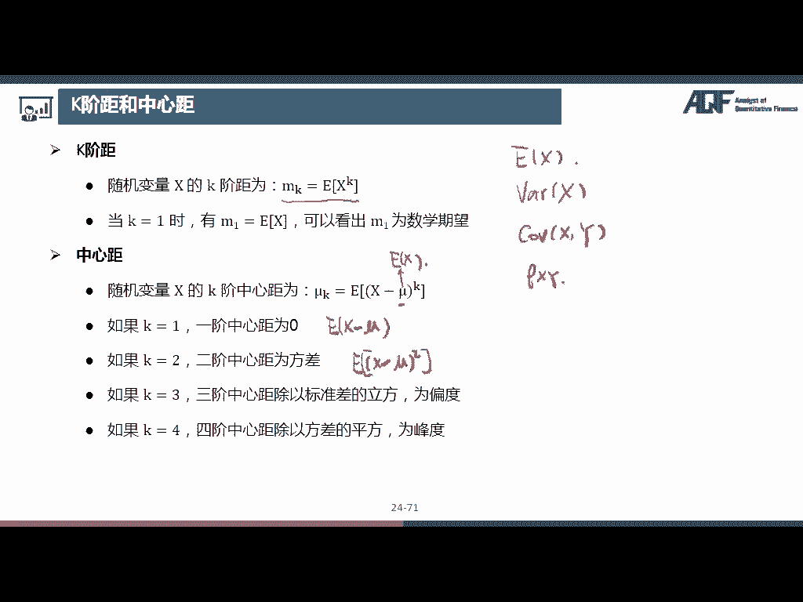

# 量化金融分析师.AQF：P2：随机变量的数字特征 📊

在本节课中，我们将学习随机变量的几个核心数字特征。这些特征能帮助我们直观地理解随机变量的性质，包括其集中趋势、离散程度、变量间的关系以及分布形态。掌握这些概念是理解后续概率分布和量化分析的基础。

## 概述

在介绍常见的概率分布之前，首先需要了解几个常用的随机变量数字特征。这些特征能帮助我们非常容易地对随机变量有一个非常直观的认识。本节课主要介绍以下几个数字特征：

*   **数学期望**：描述随机变量的集中趋势。
*   **方差**：衡量随机变量的离散程度。
*   **协方差与相关系数**：描述两个随机变量之间的关系。
*   **偏度与峰度**：描述随机变量分布的形态。

在这些数字特征中，需要重点掌握前四个及其公式。偏度和峰度稍作了解即可，不要求掌握公式。

## 1. 数学期望 (Expectation) 🎯

第一个数字特征是数学期望，简称期望，英文是 Expectation。期望是对随机变量集中趋势的度量。

以下是期望的计算公式：

*   **离散型随机变量**：
    `E(X) = Σ [x_i * P(x_i)]`，其中 `x_i` 是随机变量 `X` 可能取的值，`P(x_i)` 是取该值的概率。这个公式本质上是概率加权平均。
*   **连续型随机变量**：
    `E(X) = ∫ x * f(x) dx`，其中 `f(x)` 是概率密度函数。这里需要用到积分知识。

接下来，我们看看期望的几个重要性质。假设 `a`, `b`, `c` 为常数：
1.  `E(c) = c`
2.  `E(aX) = a * E(X)`
3.  `E(X + b) = E(X) + b`
4.  `E(aX + b) = a * E(X) + b`
5.  `E(X ± Y) = E(X) ± E(Y)`
6.  注意：`E(XY)` 通常不等于 `E(X) * E(Y)`，但如果随机变量 `X` 与 `Y` 相互独立，则等式成立。
7.  `E(X²)` 不等于 `[E(X)]²`，仅当 `X` 为常数时等号成立。

## 2. 方差 (Variance) 📏

上一节我们介绍了描述数据“中心”的期望，本节我们来看看描述数据“波动”的方差。方差是对随机变量离散程度的度量，即数据点距离期望值的偏离程度。方差常用 `Var(X)` 或 `D(X)` 表示。

方差的定义公式为：
`Var(X) = σ² = E[(X - E(X))²]`
其中，`σ`（标准差）是方差的算术平方根。

以下是方差的重要性质：
1.  `Var(c) = 0`
2.  `Var(aX) = a² * Var(X)`
3.  `Var(X + b) = Var(X)`
4.  `Var(aX + b) = a² * Var(X)`
5.  如果随机变量 `X` 与 `Y` 相互独立，则 `Var(X ± Y) = Var(X) + Var(Y)`。

一个非常重要且实用的方差计算公式是：
`Var(X) = E(X²) - [E(X)]²`
这个公式可以大大简化计算量。其推导过程如下：
`Var(X) = E[(X - E(X))²] = E[X² - 2X*E(X) + (E(X))²] = E(X²) - 2E(X)*E(X) + (E(X))² = E(X²) - [E(X)]²`

## 3. 协方差 (Covariance) ↔️

前面我们学习了描述单个变量特征的期望和方差，现在我们来学习描述两个变量之间关系的特征。协方差可以衡量多维随机变量之间的关系，例如 `Cov(X, Y)` 衡量 `X` 和 `Y` 之间的关系。

协方差的计算公式为：
`Cov(X, Y) = E[(X - E(X)) * (Y - E(Y))]`
经过推导，可得到另一个常用公式：
`Cov(X, Y) = E(XY) - E(X) * E(Y)`

协方差衡量两个变量的总体误差，取值范围为负无穷到正无穷。
*   若协方差为负，说明两个变量呈反向变动关系（一个增加，另一个减少）。
*   若协方差为正，说明两个变量呈同向变动关系。

以下是协方差的性质：
1.  `Cov(X, X) = Var(X)`
2.  `Cov(a + bX, c + dY) = b * d * Cov(X, Y)`
3.  `Var(X ± Y) = Var(X) + Var(Y) ± 2 * Cov(X, Y)`
4.  如果随机变量 `X` 与 `Y` 相互独立，则 `Cov(X, Y) = 0`。

## 4. 相关系数 (Correlation Coefficient) 🔗

协方差带有单位，且其数值大小受变量本身量纲影响，不便于直接比较变量间关系的强弱。因此我们引入相关系数。

相关系数的公式为：
`ρ_XY = Cov(X, Y) / (σ_X * σ_Y)`
即 `X` 和 `Y` 的相关系数等于它们的协方差除以各自标准差的乘积。

相关系数消除了单位的影响，其取值范围在 `-1` 到 `1` 之间。
*   `ρ = 1`：完全线性正相关。
*   `ρ = -1`：完全线性负相关。
*   `ρ = 0`：不存在线性相关关系。

以下是相关系数的关键点：
1.  相关系数仅衡量两个变量之间的**线性**关系强度。对于非线性关系，即使存在强关联，相关系数也可能接近0。
2.  相关系数不表明因果关系。
3.  如果两个变量相互独立，则相关系数为0；但相关系数为0，不一定意味着独立（可能存在非线性关系）。

以下是不同线性相关程度的图形示意：
*   **完全线性正/负相关**：数据点严格落在一条直线上。
*   **线性正/负相关**：数据点大致呈直线趋势分布。
*   **线性不相关**：数据点随机散布，无任何线性趋势。
*   **非线性相关**：数据点呈现明显规律（如弧形），但线性相关系数可能为0。

## 5. 偏度与峰度 📐

最后，我们介绍两个描述分布形态的特征：偏度和峰度。它们帮助我们理解数据分布的形状是否对称、是否尖锐。

**偏度 (Skewness)**：衡量概率分布的不对称性。
*   **左偏（负偏）**：分布左侧有长尾。此时，均值 ≤ 中位数 ≤ 众数。
*   **对称**：均值 = 中位数 = 众数。
*   **右偏（正偏）**：分布右侧有长尾。此时，众数 ≤ 中位数 ≤ 均值。
记忆口诀：看尾巴方向，尾巴在左即左偏（负偏），尾巴在右即右偏（正偏）。

**峰度 (Kurtosis)**：衡量概率分布的尖峭程度。常以正态分布（峰度为3）为基准。
*   **超额峰度 = 峰度 - 3**。
*   **尖峰（厚尾）**：峰度 > 3。数据出现在均值附近和极端值的概率都比正态分布大。金融资产的收益率常呈现这种特征。
*   **低峰（薄尾）**：峰度 < 3。

## *附：矩的概念

此外，还有“矩”的概念，它是上述特征的一般化形式：
*   **k阶原点矩**：`M_k = E(X^k)`。当 `k=1` 时，即为数学期望 `E(X)`。
*   **k阶中心矩**：`μ_k = E[(X - E(X))^k]`。
    *   当 `k=2` 时，即为方差 `Var(X)`。
    *   当 `k=3` 时，`μ_3 / σ^3` 即为偏度。
    *   当 `k=4` 时，`μ_4 / σ^4` 即为峰度。

## 总结

本节课我们一起学习了随机变量的几个核心数字特征：
1.  **数学期望 `E(X)`**：描述数据的集中趋势。
2.  **方差 `Var(X)` 和标准差 `σ`**：描述数据的离散程度。
3.  **协方差 `Cov(X, Y)`** 和 **相关系数 `ρ_XY`**：描述两个变量间的线性关系方向和强度。
4.  **偏度与峰度**：描述数据分布的形态特征（对称性、尖峭度）。

其中，前四个特征的公式需要重点掌握。理解这些概念是进行量化分析和理解金融数据的基础。