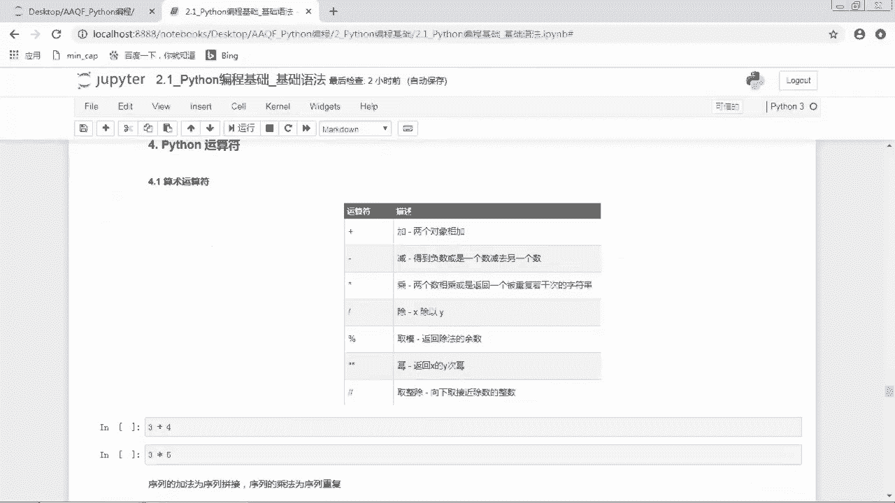

# Python编程：03：Python基础语法

在本节课中，我们将学习Python编程语言的基础语法，包括如何编写第一个程序、命名规则、注释、代码格式以及如何导入外部模块。掌握这些基础知识是后续学习更复杂概念的前提。

## 概述：迈出Python第一步 🚀

我们将从最经典的“Hello, World!”程序开始，逐步介绍构成Python代码的基本元素。理解这些语法规则是编写正确、高效Python代码的关键。

---

## 第一个Python程序

我们通过`print`函数向世界问好。`print`是Python的内置函数，用于将内容输出到控制台。

```python
print('Hello, World!')
```

运行这行代码，将在屏幕上显示“Hello, World!”。

---

## 标识符：为事物命名

标识符是变量、函数、类等对象的名称，相当于它们的“名字”。使用标识符时，需要遵循特定的命名规范。

以下是标识符的命名规则：
1.  标识符由字母、下划线和数字组成，但第一个字符不能是数字。
2.  标识符不能与Python的保留字（关键字）相同。
3.  标识符对大小写敏感，例如`Name`和`name`是两个不同的标识符。
4.  以下划线开头的标识符有特殊含义，除非特定场景需要，应避免使用。
5.  在Python 3中，允许使用中文作为标识符，但通常不建议这样做，以避免潜在的兼容性和可读性问题。

我们通过几个例子来检验哪些标识符是合法的：
*   `python3`：合法。
*   `python_3`：合法。
*   `python3.7`：不合法，因为包含了点号`.`。
*   `3python`：不合法，因为以数字开头。
*   `lambda`：不合法，因为`lambda`是Python的保留字。
*   `_python`：合法，但应谨慎使用。
*   `你好`：合法，但不推荐。

---

## 保留字：Python的关键字

保留字，也称为关键字，是Python语言中具有特殊含义的单词，我们不能将它们用作任何标识符的名称。Python提供了一个`keyword`模块来查看所有关键字。

```python
import keyword
print(keyword.kwlist)
```

运行以上代码，会输出当前Python版本的所有关键字，例如`False`, `None`, `True`, `and`, `as`, `def`, `if`, `else`, `for`等。这些关键字在后续的编程中会经常用到。

---

## 注释：让代码更易懂

注释是对代码的解释说明，它不会被Python解释器执行。编写注释是一个好习惯，能极大提高代码的可读性。

Python中的单行注释以井号`#`开头。

```python
# 这是一个单行注释，解释下面代码的作用
print('Hello, World!')  # 这行代码用于打印问候语
```

可以使用快捷键 `Ctrl + /` 来快速注释或取消注释选中的行。

对于多行注释，有两种常见方式：
1.  在每一行前都添加`#`。
2.  使用三个单引号 `'''` 或三个双引号 `"""` 将注释内容括起来（这实际上是创建了一个多行字符串，但因其未被赋值给任何变量，所以起到了注释的作用）。

```python
'''
这是多行注释的第一行。
这是多行注释的第二行。
使用三个单引号。
'''
print('Hello, World!')
```

---

## 缩进：Python的独特风格

Python使用缩进来表示代码块，而不是像C或Java那样使用大括号`{}`。这是Python语法的一大特色。

缩进的空格数是可变的，但同一个代码块内的语句必须保持相同的缩进量。

```python
if True:
    print('条件为真')  # 这行代码属于if代码块，前面有4个空格的缩进
    print('执行这里')  # 同样属于if代码块，缩进量必须与上一行一致
print('无论条件如何都执行')  # 这行代码不属于if代码块，没有缩进
```

在编写代码时，可以使用`Tab`键或`Ctrl + ]`来增加缩进，使用`Shift + Tab`或`Ctrl + [`来减少缩进。

---

## 多行语句：拆分长代码

Python通常一行写完一条语句。但如果语句很长，我们可以使用反斜杠`\`来实现多行书写。

```python
total = first_variable + \
        second_variable + \
        third_variable
```

**注意**：在括号（圆括号`()`、方括号`[]`、花括号`{}`）中的多行语句，不需要使用反斜杠`\`，直接换行即可。

```python
# 在列表（方括号）中直接换行
my_list = ['item1',
           'item2',
           'item3']
```

---

## 导入模块：扩展Python功能

Python拥有强大的标准库和第三方库。在使用这些库提供的功能前，需要先导入相应的模块。

导入模块主要有以下几种形式：
1.  **导入整个模块**：`import module_name`
2.  **从模块中导入特定函数**：`from module_name import function_name`
3.  **从模块中导入多个函数**：`from module_name import func1, func2, func3`
4.  **导入模块并起别名**：`import module_name as alias`（常用，便于书写）
5.  **导入模块中的所有函数**：`from module_name import *`（不推荐，容易引起命名冲突）

以下是几个例子：
```python
import math  # 导入整个math模块
print(math.sqrt(16))  # 使用math模块中的sqrt函数

from math import log  # 仅导入log函数
print(log(100, 10))  # 直接使用log函数

import numpy as np  # 导入numpy模块并简写为np
import pandas as pd  # 导入pandas模块并简写为pd
import matplotlib.pyplot as plt  # 导入matplotlib的pyplot模块并简写为plt
```

---

## 变量：数据的容器

变量可以理解为一个存放数据的“容器”或“房子”。变量名就是这个容器的“标签”。在Python中，变量不需要预先声明类型，直接赋值即可创建。

我们使用等号`=`给变量赋值。

```python
price = 10  # 将整数10赋值给变量price
name = "AQF"  # 将字符串"AQF"赋值给变量name
```

变量本身没有类型，我们所说的“变量类型”指的是变量所引用的那个**对象**的类型。同一个变量可以被重新赋值，指向新的对象。

```python
x = 5
print(type(x))  # 输出：<class 'int'>
x = "hello"
print(type(x))  # 输出：<class 'str'>
```

可以使用`del`语句删除一个变量。

```python
x = 10
del x
# 此时再打印x会报错，因为变量x已被删除
```

---

## 基本数据类型初探

Python 3中有六个标准的基本数据类型，我们将初步认识它们。

1.  **数字 (Number)**
    *   包括整数(`int`)、浮点数(`float`)、布尔值(`bool`)、复数(`complex`)。
    *   使用`type()`函数可以查看对象的类型。
    ```python
    a = 1       # int
    b = 1.0     # float
    c = True    # bool
    d = 3+4j    # complex
    print(type(a), type(b), type(c), type(d))
    ```

2.  **字符串 (String)**
    *   使用单引号`'`或双引号`"`括起来的文本。
    *   使用反斜杠`\`可以转义特殊字符（如引号本身）。
    ```python
    s1 = 'Hello'
    s2 = "World"
    s3 = 'It\'s a nice day.'  # 使用\转义单引号
    s4 = "He said, \"Hi!\""   # 使用\转义双引号
    ```

3.  **列表 (List)**
    *   使用方括号`[]`创建，元素之间用逗号分隔。
    *   列表内的元素类型可以不同，也支持嵌套（列表中包含列表）。
    *   列表是**有序的、可变的**。
    ```python
    list1 = [1, 2, 3]
    list2 = ['apple', 123, [5, 6]]
    ```

4.  **元组 (Tuple)**
    *   使用圆括号`()`创建，元素之间用逗号分隔。
    *   与列表类似，但元组是**不可变的**（创建后不能修改）。
    ```python
    tuple1 = (1, 2, 3)
    tuple2 = ('a', 'b', 'c')
    ```

5.  **集合 (Set)**
    *   使用花括号`{}`或`set()`函数创建。
    *   集合中的元素是**唯一且无序的**，常用于去重和成员测试。
    *   **注意**：创建空集合必须用`set()`，因为`{}`创建的是空字典。
    ```python
    set1 = {1, 2, 2, 3}  # 结果为{1, 2, 3}
    set2 = set([1, 1, 2]) # 将列表转为集合，结果为{1, 2}
    empty_set = set()    # 空集合
    ```

6.  **字典 (Dictionary)**
    *   使用花括号`{}`创建，元素为**键值对**，格式为`key: value`。
    *   字典是**无序的**，通过键(`key`)来存取对应的值(`value`)。
    *   键必须是不可变类型（如字符串、数字、元组），且在同一字典中必须唯一。
    ```python
    dict1 = {'name': 'AQF', 'score': 99}
    print(dict1['name'])  # 通过键'name'获取值，输出：AQF
    ```

**可变与不可变数据类型**：列表(`list`)、字典(`dict`)、集合(`set`)是可变类型，可以在原对象上修改。数字(`Number`)、字符串(`String`)、元组(`Tuple`)是不可变类型，修改操作会创建新对象。

---

## 总结




本节课我们一起学习了Python的基础语法。我们从打印“Hello, World!”开始，了解了标识符的命名规则和Python的保留字。我们学会了如何使用注释来提高代码可读性，并理解了Python独特的缩进规则。此外，我们还掌握了如何编写多行语句以及导入外部模块。最后，我们初步认识了变量以及Python的六种基本数据类型（数字、字符串、列表、元组、集合、字典），为后续深入学习每种数据类型打下了坚实的基础。记住这些基础规则，是写出规范、高效Python代码的第一步。