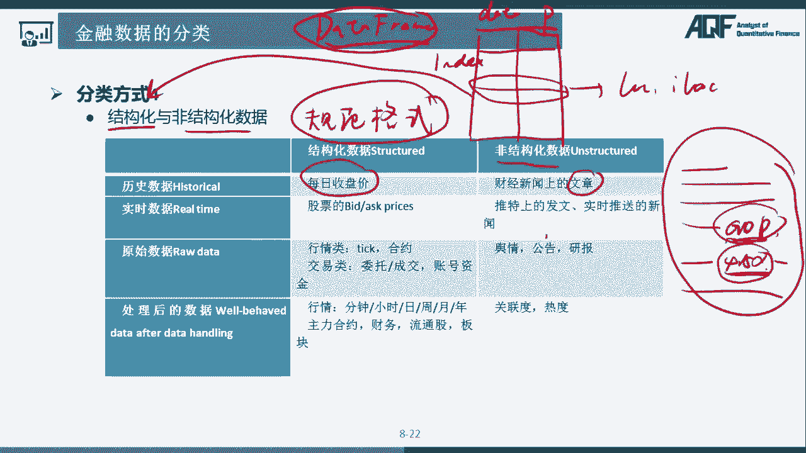
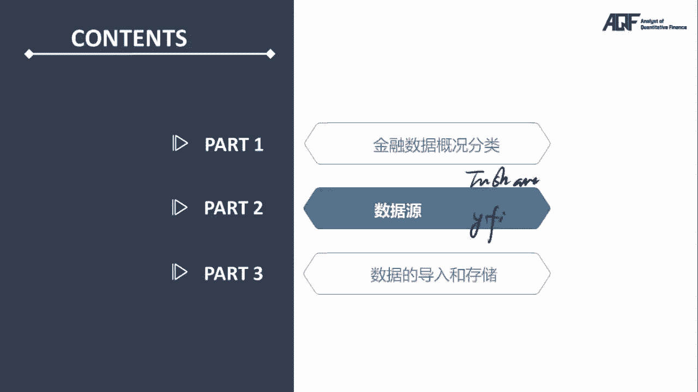

# 量化金融分析师.AQF：P27：金融数据分类 📊

在本节课中，我们将学习金融数据的四种核心分类方式。理解这些分类对于后续的数据获取、处理和分析至关重要。我们将逐一探讨每种分类的定义、区别和实际应用。

## 概述

金融数据是量化分析的基石。为了高效地处理和分析这些数据，我们首先需要对其进行科学的分类。本节课程将介绍四种主要的分类方式：行情数据与非行情数据、实时数据与历史数据、原始数据与经处理数据、结构化数据与非结构化数据。掌握这些概念能帮助我们更好地选择工具和构建策略。

---

## 1. 行情数据与非行情数据 📈

上一节我们介绍了金融数据的重要性，本节中我们来看看第一种分类方式：根据数据是否与市场成交直接相关，我们可以将其分为行情数据和非行情数据。

**行情数据**指的是与市场交易活动直接相关的数据。它们直接反映了资产的买卖情况和价格变动。

以下是行情数据的主要例子：
*   **价格数据**：如股票的最新成交价、买入价（买一）、卖出价（卖一）。
*   **成交量数据**：指在特定时间段内成交的股票数量或交易金额。
*   **委托数据**：即买卖盘口数据，展示不同价格档位的买入和卖出委托量。

**非行情数据**则是指那些不直接来自即时交易，但同样对分析有重要影响的信息。

以下是非行情数据的主要例子：
*   **公司财务数据**：如营业收入、净利润、每股收益（EPS）。
*   **宏观经济数据**：如国内生产总值（GDP）增长率、消费者物价指数（CPI）。
*   **公司公告与新闻**：包括财报发布、重大合同签订、管理层变动等文本信息。

**核心区别**：判断标准在于数据**是否直接由市场交易行为产生**。行情数据是市场的“体温计”，而非行情数据则提供了市场的“体检报告”。

---

## 2. 实时数据与历史数据 ⏳

在了解了数据与交易的关系后，我们接下来从时间维度对数据进行分类：实时数据和历史数据。

**实时数据**指的是在当前时刻正在产生或刚刚产生的、反映最新市场状态的数据。

以下是实时数据的特征：
*   **时效性极强**，通常有毫秒级甚至微秒级的延迟要求。
*   用于**监控市场**、执行**高频交易**或进行**实时风险控制**。
*   例如：股票Level-2的逐笔成交与委托数据流。

**历史数据**指的是过去已经发生并记录下来的数据。

以下是历史数据的特征：
*   用于**策略回测**、**模型训练**和**长期趋势分析**。
*   数据已经固定，不会改变，便于进行反复研究和验证。
*   例如：某只股票过去十年的每日收盘价序列。

**核心区别**：关键在于数据所属的**时间点是“现在”还是“过去”**。实时数据是流动的河水，历史数据是冻结的冰块。

---

## 3. 原始数据与经处理数据 🔄

现在，我们将从数据加工的深度来探讨第三种分类：原始数据与经处理数据。这是理解数据价值如何被“提炼”的关键。

**原始数据**是指没有经过额外数学运算或特殊处理的、直接从数据源获取的数据。其核心在于**没有经过人为定义的转换计算**。

例如，股票的分时图曲线，是由每分钟的**最后一个成交价**直接连接而成。这些每分钟的成交价就是原始数据。它们只是按照固定频率被选取出来，本身没有经过计算。

**经处理数据**则是在原始数据的基础上，通过特定的数学运算或逻辑处理得到的数据。这个过程体现了分析者的**特定意图或倾向**。

例如，日K线中的**最高价**，是通过比较当天所有成交价并取**最大值**得到的。这个“取最大值”的过程就是一种处理。同样，**移动平均线（MA）** 是利用收盘价计算均值（`MA = (C1 + C2 + ... + Cn) / n`）得到的，也属于经处理数据。

### 原始数据：频率决定信息量

原始数据的一个重要属性是**频率**。采样频率越高，数据包含的原始信息量就越大。

假设我们用不同数量的点来近似表示一只股票一天的价格走势：
*   只取**开盘价**和**收盘价**两个点，我们得到的信息近似于一条直线。
*   取**四个点**，我们能看出一些波动，但会错过细节。
*   取**八个点**，则能更准确地还原当天价格波动的轮廓。

因此，`信息量 ∝ 数据频率`。在量化研究中，使用更高频率的数据（如1分钟线代替日线）进行回测，往往能挖掘出更多细节，可能提升策略表现。

### 经处理数据：倾向性信息提取

经处理数据是从原始数据中提取特定信息的过程。它反映了分析者的关注点。

例如，计算日**振幅**（`振幅 = 最高价 - 最低价`）。对于趋势交易者，末期振幅突然放大可能意味着趋势见顶。这个“振幅”数据就是基于“关注价格波动范围”的倾向，通过“减法”计算提取出的特定信息。

**核心关系**：
*   **原始数据**是基础，其**频率**决定了信息总量的上限。
*   **经处理数据**是对原始数据信息的**有倾向性的提取和浓缩**，它包含的信息是原始数据信息的一个子集，但更直接地服务于特定分析目标。

---

## 4. 结构化数据与非结构化数据 🗂️

最后，我们根据数据的组织形式进行分类：结构化数据与非结构化数据。这直接影响我们处理数据的难度和方法。

**结构化数据**是指具有预定义、规范格式的数据，通常可以整齐地存储在二维表格中。

例如，股票的历史每日收盘价可以存储在`DataFrame`中：
```python
import pandas as pd
# 示例：结构化数据
data = {
    ‘日期‘: [‘2024-01-01‘, ‘2024-01-02‘, ‘2024-01-03‘],
    ‘收盘价‘: [100.0, 102.5, 101.8]
}
df = pd.DataFrame(data)
print(df)
```
这类数据规整，便于用`df.loc[‘2024-01-02‘]`这样的方式快速查询和处理。

**非结构化数据**则没有固定的格式，不能直接用二维逻辑来表示。

例如，一份上市公司年报、一篇财经新闻报道或一份分析师电话会议记录。要从一段文字“...本季度GDP增速约为4.5%...”中提取“GDP”和“4.5”这两个信息，就需要使用自然语言处理（NLP）或正则表达式等复杂技术。

**核心区别**：在于**是否有规整的、机器可直接理解的格式**。结构化数据易于处理，非结构化数据信息密度高但处理复杂。

---

## 总结

本节课中，我们一起学习了金融数据的四种核心分类方式：
1.  **行情数据 vs 非行情数据**：按是否与成交直接相关划分，是选择分析切入点的第一步。
2.  **实时数据 vs 历史数据**：按时间属性划分，决定了数据用于监控预警还是研究回测。
3.  **原始数据 vs 经处理数据**：按加工深度划分。理解`原始数据频率决定信息量，经处理数据体现分析倾向`这一关系至关重要。
4.  **结构化数据 vs 非结构化数据**：按组织形式划分，直接影响数据处理的工具选择（如Pandas或NLP工具）。





面对任何金融数据时，先进行这四重判断，能帮助我们快速明确：
*   数据的**性质**是什么？
*   应该用什么**工具**（如`pandas`、`numpy`、`sklearn`、`NLP`库）来处理？
*   适合采用什么**分析模型**？


掌握这些分类是构建有效量化分析框架的基础。下一部分，我们将介绍两个处理金融数据的重要Python工具包。